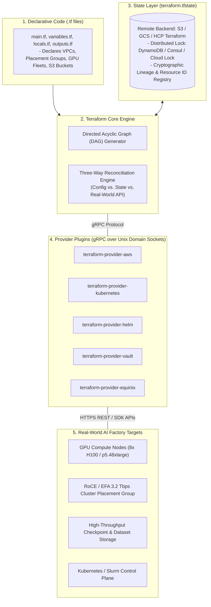
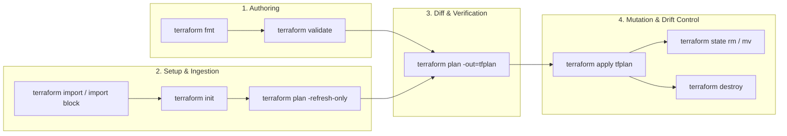
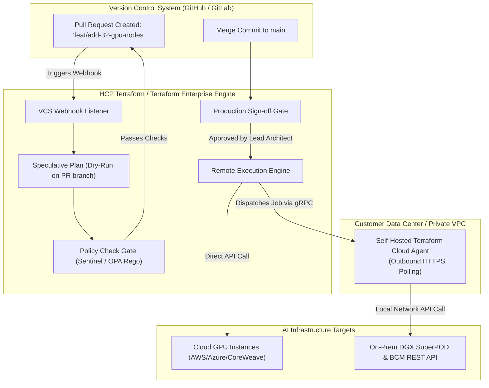

# Chapter 5 — Terraform for Infrastructure as Code in AI Factories

**Learning outcome:** Architect, write, refactor, and safely operate production-grade Infrastructure as Code (IaC) using Terraform, OpenTofu, and HCP Terraform (Terraform Cloud). You will master core HCL language constructs (locals, data sources, `for_each`, `dynamic` blocks, built-in functions), execute complex state and CLI operations (`import`, `refresh`, `state mv`, `state rm`, `force-unlock`, `moved` blocks), manage multi-environment workspaces, and deploy Day-0 infrastructure scaffolding for an NVIDIA AI Factory (Cluster Placement Groups, 8-rail 400 Gbps RoCE/EFA networks, high-throughput checkpoint storage, and Slurm control planes).

**Prerequisites:** Familiarity with Linux command line, JSON/YAML data structures, basic IP networking (CIDR, subnets, MTU), and cloud or virtualization primitives (VMs, block storage, object storage).

**Difficulty:** Beginner to Advanced.

**Estimated reading time:** 120 minutes plus hands-on implementation practice.

---

## 1. Foundations: The Imperative vs. Declarative Paradigm

In modern accelerated computing, an **NVIDIA AI Factory** is an interdependent system spanning bare-metal servers, high-speed InfiniBand/RoCE fabrics, cloud-bursted GPU node pools (e.g., AWS P5 8x H100, Azure NDv5, CoreWeave), cluster placement groups, non-blocking leaf-spine network topologies, multi-terabyte checkpoint buckets, and Slurm/Kubernetes orchestrators.

Historically, infrastructure provisioning was **imperative**. Systems administrators wrote sequential shell scripts calling cloud CLIs or datacenter REST endpoints:

```bash
# Imperative approach: "Execute these sequential mutation steps"
VPC_ID=$(aws ec2 create-vpc --cidr-block 10.100.0.0/16 --query 'Vpc.VpcId' --output text)
SUBNET_ID=$(aws ec2 create-subnet --vpc-id $VPC_ID --cidr-block 10.100.1.0/24 --query 'Subnet.SubnetId' --output text)
PG_NAME="llm-cluster-placement-group"
aws ec2 create-placement-group --group-name $PG_NAME --strategy cluster
for i in {1..32}; do
  aws ec2 run-instances --image-id ami-0abc1234 --instance-type p5.48xlarge \
    --subnet-id $SUBNET_ID --placement-group-name $PG_NAME
done
```

### Why Imperative Scripts Fail in AI Infrastructure

1. **Lack of Idempotency:** If the shell script times out after launching 18 instances, running it a second time creates a second VPC and 32 additional instances, doubling costs and orphaning the original 18 instances.
2. **Zero State Awareness:** If an operator manually modifies an instance security group or terminates a degraded GPU node in the cloud management console, the shell script has no mechanism to detect that reality has drifted from the original specification.
3. **Absence of a Directed Acyclic Graph (DAG):** Complex AI environments require parallel resource provisioning (e.g., creating 8 separate Elastic Fabric Adapter network interfaces across 32 nodes simultaneously). Shell scripts must handle retries, polling loops, and error cascades manually.

### The Declarative Solution: Infrastructure as Code (IaC)

**Declarative IaC** shifts the paradigm from *how* to *what*. An engineer writes human-readable configuration files stating the **desired end state**:

> *"I declare that a VPC with CIDR `10.100.0.0/16`, a Cluster Placement Group named `llm-cluster-pg`, and 32x `p5.48xlarge` instances with 8x EFA network interfaces must exist."*

The IaC engine (Terraform or OpenTofu) reads this declaration, inspects its records of what currently exists (the state file), queries the cloud/datacenter APIs to read the real-world infrastructure, calculates the exact delta (the **diff**), and executes only the minimal API calls necessary to bring reality into alignment with the code.

---

## 2. Terraform & OpenTofu Architecture: Core, Providers, and the DAG

Terraform is divided into two distinct architectural tiers: **Terraform Core** and **Terraform Provider Plugins**.



### 1. Terraform Core
- **Syntax and Configuration Parser:** Compiles HCL syntax into internal abstract syntax trees (AST). Evaluates expressions, interpolations, and built-in functions.
- **Resource Dependency Graph (DAG):** Builds a mathematical directed graph of all resources, data sources, and providers. Independent resources (e.g., S3 checkpoint buckets and IAM roles) are provisioned concurrently (governed by `-parallelism=N`, default 10). Dependent resources (e.g., a subnet inside a VPC) are ordered topologically.
- **Three-Way Reconciliation Engine:** Compares:
  1. The declared HCL configuration (`*.tf`).
  2. The last known record of truth (`terraform.tfstate`).
  3. The live cloud/on-prem state queried via provider APIs.

### 2. Provider Plugins
- Standalone compiled Go binaries executed as child processes by Terraform Core, communicating via **gRPC over local Unix domain sockets/named pipes**.
- Providers translate Terraform's internal CRUD lifecycle (`Create`, `Read`, `Update`, `Delete`) into vendor-specific HTTP REST or gRPC API calls (e.g., AWS SDK, Azure Resource Manager, Kubernetes client-go, OpenStack Ironic).

### 3. Terraform OSS vs. OpenTofu
In August 2023, HashiCorp shifted Terraform from the Mozilla Public License v2.0 (MPL 2.0) to the Business Source License v1.1 (BSL). In response, the Linux Foundation established **OpenTofu**—an open-source, community-governed fork under the MPL 2.0. Both share identical HCL syntax, provider compatibility, and execution workflows. Throughout this chapter, all commands and patterns apply interchangeably to `terraform` and `tofu`.

---

## 3. HCL Language Masterclass: Beginner Primitives to Advanced Constructs

The **HashiCorp Configuration Language (HCL)** is a declarative, statically typed domain-specific language designed specifically for infrastructure specification.

### 3.1 Variables and Complex Type Constraints

Variables parameterize configurations across environments (development, benchmarking, production). Production configurations must enforce explicit type constraints, default fallbacks, and validation rules.

```hcl
# variables.tf

variable "cluster_name" {
  type        = string
  description = "Unique identifier for the AI training cluster"
  default     = "h100-superpod-01"

  validation {
    condition     = can(regex("^[a-z0-9-]+$", var.cluster_name))
    error_message = "Cluster name must contain only lowercase alphanumeric characters and hyphens."
  }
}

variable "gpu_worker_count" {
  type        = number
  description = "Total number of 8x GPU nodes to allocate in the cluster placement group"
  default     = 32

  validation {
    condition     = var.gpu_worker_count >= 1 && var.gpu_worker_count <= 256
    error_message = "GPU worker count must be between 1 and 256 nodes (8 to 2,048 GPUs)."
  }
}

variable "network_config" {
  type = object({
    vpc_cidr           = string
    compute_subnets    = list(string)
    enable_jumbo_frames = bool
    mtu                = number
  })
  description = "Network fabric parameters for low-latency GPUDirect RDMA"
  default = {
    vpc_cidr            = "10.100.0.0/16"
    compute_subnets     = ["10.100.1.0/24", "10.100.2.0/24"]
    enable_jumbo_frames = true
    mtu                 = 9000
  }

  validation {
    condition     = var.network_config.mtu == 9000 || var.network_config.mtu == 1500
    error_message = "Network MTU must be either 9000 (Jumbo Frames for RDMA) or 1500 (Standard)."
  }
}

variable "slurm_db_password" {
  type        = string
  description = "Master database password for SlurmDBD accounting daemon"
  sensitive   = true # Prevents value from being logged in plaintext console outputs
}
```

### 3.2 `locals` Blocks: Derived Logic and Single Sources of Truth

`locals` compute intermediate values, evaluate expressions, and consolidate repetitive logic into single variables, preventing configuration drift across files.

```hcl
# locals.tf

locals {
  environment = "production"
  owner       = "ai-platform-engineering"

  # Standardized resource naming convention
  name_prefix = "${var.cluster_name}-${local.environment}"

  # Common tags merged across all cloud resources
  common_tags = {
    Cluster     = var.cluster_name
    Environment = local.environment
    ManagedBy   = "Terraform"
    Owner       = local.owner
    Workload    = "Distributed-LLM-Pretraining"
  }

  # Calculate the number of 400 Gbps network rails per node (8 for H100 SXM5)
  rdma_rails_per_node = 8

  # Generate a flat list of all network rail identifiers across all GPU nodes
  total_gpus = var.gpu_worker_count * 8
}
```

### 3.3 `data` Sources: Querying Live Environmental State

`data` blocks perform read-only queries against cloud APIs or existing infrastructure, allowing your HCL code to reference resources created outside Terraform or by other teams (e.g., golden AMIs built by Packer, corporate transit gateways, or KMS keys).

```hcl
# data.tf

# 1. Query the latest official NVIDIA Deep Learning Base AMI (with pre-installed drivers and CUDA)
data "aws_ami" "nvidia_dlami" {
  most_recent = true
  owners      = ["amazon"]

  filter {
    name   = "name"
    values = ["Deep Learning Base OSS Nvidia Driver GPU AMI (Ubuntu 22.04) *"]
  }

  filter {
    name   = "architecture"
    values = ["x86_64"]
  }

  filter {
    name   = "virtualization-type"
    values = ["hvm"]
  }
}

# 2. Query available Availability Zones that support P5 GPU hardware
data "aws_availability_zones" "available" {
  state = "available"
  filter {
    name   = "opt-in-status"
    values = ["opt-in-not-required"]
  }
}

# 3. Reference an existing corporate KMS Key for checkpoint encryption
data "aws_kms_key" "checkpoint_key" {
  key_id = "alias/enterprise-ai-checkpoints"
}
```

### 3.4 Loops and Iteration: `count` vs. `for_each`

Understanding when to use `count` versus `for_each` is the difference between a resilient infrastructure deployment and a catastrophic production outage.

#### The Danger of `count` in State Management
`count` treats resources as an indexed array: `aws_instance.worker[0]`, `aws_instance.worker[1]`, `aws_instance.worker[2]`.

```hcl
# Fragile pattern using count:
resource "aws_instance" "worker" {
  count         = length(var.node_names) # ["node-a", "node-b", "node-c"]
  ami           = data.aws_ami.nvidia_dlami.id
  instance_type = "p5.48xlarge"
  tags = {
    Name = var.node_names[count.index]
  }
}
```

*The Index-Shifting Disaster:* If someone removes `"node-a"` from the beginning of `var.node_names`, `node-b` becomes index `[0]`, and `node-c` becomes index `[1]`. Terraform compares index `[0]` (which was `node-a`, now named `node-b`) and determines that its tags and attributes changed. It then modifies or destroys and recreates running instances `[0]` and `[1]`, and terminates instance `[2]`. **Removing one item destroyed the entire cluster!**

#### The Robust Pattern: `for_each` with Keys
`for_each` binds each resource instance to an immutable map key or set string: `aws_instance.worker["node-a"]`.

```hcl
variable "gpu_partitions" {
  type = map(object({
    instance_type = string
    count         = number
    slurm_queue   = string
  }))
  default = {
    "h100-interactive" = {
      instance_type = "p5.48xlarge"
      count         = 4
      slurm_queue   = "interactive"
    }
    "h100-batch-train" = {
      instance_type = "p5.48xlarge"
      count         = 28
      slurm_queue   = "batch"
    }
    "a100-inference" = {
      instance_type = "p4de.24xlarge"
      count         = 8
      slurm_queue   = "serving"
    }
  }
}

# Provisions partitions independently; removing "a100-inference" touches ONLY that key!
resource "aws_placement_group" "partition_pgs" {
  for_each = var.gpu_partitions
  name     = "${local.name_prefix}-${each.key}-pg"
  strategy = "cluster"
}
```

### 3.5 `for` Expressions and List/Map Comprehensions

HCL supports functional collection transformations via `for` expressions:

```hcl
# Filter and transform: extract only high-memory partitions
locals {
  batch_queues = [
    for k, v in var.gpu_partitions : k
    if v.slurm_queue == "batch"
  ]

  # Transform a list of subnet IDs into an IP-to-Subnet lookup map
  subnet_cidr_map = {
    for subnet in aws_subnet.compute_subnets : subnet.id => subnet.cidr_block
  }
}
```

### 3.6 `dynamic` Blocks: Programmatic Nested Block Generation

Many cloud resources require repeating nested configuration blocks (e.g., multiple network interfaces, storage block mappings, security group ingress rules). Writing these statically violates DRY principles and limits dynamic scaling.

An NVIDIA H100 GPU instance (like AWS `p5.48xlarge`) requires **32 network card attachments across 8 distinct EFA network cards** to achieve 3.2 Tbps aggregate RDMA bisectional bandwidth. A `dynamic` block generates these nested blocks programmatically:

```hcl
variable "efa_interfaces" {
  type = list(object({
    device_index          = number
    network_card_index   = number
    subnet_id             = string
    security_group_ids    = list(string)
  }))
  description = "List of 8 discrete EFA network rail interfaces"
}

resource "aws_instance" "gpu_master_node" {
  ami           = data.aws_ami.nvidia_dlami.id
  instance_type = "p5.48xlarge"

  # Programmatically generate 8 distinct network_interface attachment blocks
  dynamic "network_interface" {
    for_each = var.efa_interfaces
    iterator = rail

    content {
      device_index          = rail.value.device_index
      network_card_index   = rail.value.network_card_index
      subnet_id             = rail.value.subnet_id
      security_groups       = rail.value.security_group_ids
      delete_on_termination = true
    }
  }

  tags = {
    Name = "${local.name_prefix}-master-worker"
  }
}
```

### 3.7 Essential Built-in HCL Functions

HCL includes built-in functions for data manipulation (custom user-defined functions are not supported):

| Function | Category | AI Infrastructure Use Case | Example |
|---|---|---|---|
| `cidrsubnet(prefix, newbits, netnum)` | IP Network | Dynamically carving `/24` RDMA subnets out of a `/16` VPC CIDR | `cidrsubnet("10.100.0.0/16", 8, 2)` -> `"10.100.2.0/24"` |
| `merge(map1, map2, ...)` | Collection | Merging baseline security tags with partition-specific Slurm tags | `merge(local.common_tags, { SlurmRole = "Compute" })` |
| `try(expr, fallback)` | Logic | Safely parsing optional JSON attributes from cloud-init scripts | `try(var.custom_settings.gpu_clock_mhz, 1980)` |
| `can(expr)` | Logic | Validating regular expression strings in variable validation blocks | `can(regex("^p5", var.instance_type))` |
| `templatefile(path, vars)` | String/Filesystem | Rendering dynamic Slurm or cloud-init bootstrap shell scripts | `templatefile("${path.module}/scripts/slurm_join.sh.tftpl", { master_ip = aws_instance.slurm_ctl.private_ip })` |
| `coalesce(val1, val2, ...)` | Logic | Falling back to a default subnet if a dedicated RDMA subnet is omitted | `coalesce(var.custom_subnet_id, aws_subnet.default.id)` |
| `flatten(nested_list)` | Collection | Flattening lists of security group rule objects across multiple subnets | `flatten([for s in var.subnets : s.security_rules])` |
| `jsonencode(value)` | Encoding | Creating IAM policies or Kubernetes ConfigMap bodies directly from HCL maps | `jsonencode({ Version = "2012-10-17", Statement = [...] })` |

---

## 4. The Complete CLI & Lifecycle Command Reference

Mastering Terraform requires fluency across its complete command suite. Each command serves a dedicated purpose within the IaC operational lifecycle.



### 4.1 Initialization and Backend Lifecycle: `terraform init`

`terraform init` prepares the working directory, downloads external provider plugins, and configures state storage.

```bash
# Basic initialization: downloads providers to .terraform/ and validates backend
$ terraform init

# Upgrade all provider plugins to the highest permitted semantic version
$ terraform init -upgrade

# Reconfigure backend settings (e.g., migrating from a local state file to AWS S3)
# Prompts to copy existing local state to the new remote location
$ terraform init -migrate-state

# Disregard any existing backend configuration and re-initialize from scratch
$ terraform init -reconfigure
```

*The Dependency Lock File (`.terraform.lock.hcl`):*
When `init` executes, it records the exact provider versions and their cryptographic checksums (hashes) in `.terraform.lock.hcl`. This lock file **must be committed to Git**. It ensures that CI/CD pipelines, solutions architects, and automated runners compile identical provider binaries across Linux, macOS, and Windows.

---

### 4.2 Formatting and Static Syntax Validation

```bash
# Check if any .tf files violate canonical HCL indentation (returns exit code 1 if unformatted)
$ terraform fmt -check -diff

# Automatically rewrite all .tf files in the directory tree to canonical style
$ terraform fmt -recursive

# Verify HCL syntax, variable types, and resource attribute schemas without making network calls
$ terraform validate
```

---

### 4.3 The Reconciliation Diff: `terraform plan`

`terraform plan` compares the declared configuration, the state file, and the real-world infrastructure, constructing an execution plan:

```bash
# Generate a plan and persist the compiled execution graph to a binary file
$ terraform plan -out=tfplan

# Pass external variables dynamically
$ terraform plan -var="gpu_worker_count=64" -var-file="environments/prod.tfvars"

# Target a specific resource during disaster recovery (AVOID in normal CI/CD to prevent partial drift)
$ terraform plan -target="aws_placement_group.partition_pgs[\"h100-batch-train\"]"

# Instruct Terraform to recreate a specific degraded GPU instance during the next apply
# (Replaces the legacy 'terraform taint' command)
$ terraform plan -replace="aws_instance.gpu_workers[3]" -out=tfplan
```

#### The Plan Action Symbols
- `+` **Create:** The resource does not exist in state or the cloud; Terraform will invoke the provider's `Create` API.
- `~` **Update in-place:** The resource exists; Terraform will invoke an `Update` API to modify attributes without altering the resource ID or causing downtime.
- `-` **Destroy:** The resource exists in state but has been deleted from the HCL code; Terraform will invoke the `Delete` API.
- `-/+` **Destroy and Recreate (Forces Replacement):** An immutable attribute was modified (e.g., VPC CIDR, EC2 Subnet ID, or AMI). **Terraform will terminate the existing resource and create a new one.** If this is an active GPU training node or storage volume, all running jobs and uncommitted memory state are lost.

---

### 4.4 Mutating Infrastructure: `terraform apply` and `terraform destroy`

```bash
# Apply the exact, previously reviewed binary plan artifact (Guarantees zero unexpected drift)
$ terraform apply tfplan

# Emergency teardown: deletes all resources tracked in the current state file
$ terraform destroy -auto-approve
```

---

### 4.5 Drift Detection and Modern Refresh: `refresh` vs. `-refresh-only`

Historically, `terraform refresh` queried cloud APIs and silently updated the local state file to match reality. This was dangerous because if an engineer manually deleted a security group, `refresh` immediately erased it from state without giving the team an opportunity to review the change.

In modern Terraform (>= 0.15+ / 1.0+), use the interactive, plan-based refresh workflow:

```bash
# 1. Inspect differences between real-world cloud resources and the state file
$ terraform plan -refresh-only

# 2. Review the proposed drift diff. If acceptable, commit the updated state:
$ terraform apply -refresh-only
```

---

### 4.6 Bringing Unmanaged Infrastructure into IaC: `import`

When adopting Terraform in an existing AI datacenter, bare-metal servers, VPCs, and storage buckets may have been created manually. Terraform provides two mechanisms to bring these under IaC management:

#### Method A: The Classic CLI Import Command
1. Write an empty resource block in HCL:
   ```hcl
   resource "aws_s3_bucket" "legacy_checkpoint_store" {
     # Attributes will be populated after inspecting state
   }
   ```
2. Execute `terraform import` linking the HCL address to the real-world cloud resource ID:
   ```bash
   $ terraform import aws_s3_bucket.legacy_checkpoint_store enterprise-raw-checkpoints-us-east-1
   ```
3. Run `terraform state show aws_s3_bucket.legacy_checkpoint_store`, copy the reported attributes back into `main.tf`, and run `terraform plan` until the diff shows `0 to add, 0 to change, 0 to destroy`.

#### Method B: Modern Declarative `import` Blocks (Terraform 1.5+)
Terraform 1.5+ allows imports to be declared directly in code and committed via version control:

```hcl
# imports.tf
import {
  to = aws_placement_group.existing_cluster_pg
  id = "existing-h100-placement-group-id"
}
```

Then, instruct Terraform to automatically generate the required HCL code:

```bash
# Automatically inspect the cloud API and generate the matching HCL resource block!
$ terraform plan -generate-config-out=generated_pg.tf
```

---

### 4.7 Direct State Manipulation: `terraform state` Subcommands

The `terraform state` subcommands allow administrators to refactor code and resolve edge cases without modifying physical cloud infrastructure.

```bash
# 1. List every resource address currently tracked in the state file
$ terraform state list
aws_vpc.ai_vpc
aws_placement_group.gpu_cluster_pg
aws_instance.gpu_workers["node-01"]
aws_instance.gpu_workers["node-02"]

# 2. Inspect all stored attributes and cloud IDs of a specific resource
$ terraform state show 'aws_instance.gpu_workers["node-01"]'

# 3. Rename a resource address without destroying it (Refactoring)
$ terraform state mv 'aws_instance.gpu_workers["node-01"]' 'aws_instance.gpu_workers["worker-rack1-u01"]'

# 4. Remove a resource from Terraform tracking WITHOUT deleting it in the real world
# (Used when transferring ownership to another Terraform workspace or BCM)
$ terraform state rm 'aws_instance.gpu_workers["worker-rack1-u01"]'

# 5. Download the raw remote state JSON to stdout/local disk for inspection
$ terraform state pull > local_dump.json

# 6. Manually push modified state back to remote storage (EXTREME CAUTION: Overrides remote lock)
$ terraform state push emergency_recovered.json
```

---

### 4.8 Refactoring Without Destruction: `moved` Blocks (Terraform 1.1+)

Historically, renaming an HCL resource block or moving it inside a reusable module caused Terraform to treat the old name as "destroyed" and the new name as "created," triggering unwanted teardowns of production clusters.

Terraform 1.1+ introduces declarative `moved` blocks. When committed to Git, Terraform transparently updates the state mapping during the next `plan` or `apply`:

```hcl
# refactors.tf

# Instructs Terraform: "Do not destroy this placement group; update its state key"
moved {
  from = aws_placement_group.gpu_cluster_pg
  to   = aws_placement_group.training_fabric_pg
}

# Moving a standalone resource into a reusable module:
moved {
  from = aws_s3_bucket.checkpoint_bucket
  to   = module.checkpoint_storage.aws_s3_bucket.bucket
}
```

---

### 4.9 Resolving Stale Locks: `terraform force-unlock`

When a CI/CD pipeline (e.g., GitHub Actions or GitLab CI) is terminated abruptly or loses network connectivity mid-apply, the remote state lock in DynamoDB or Consul remains held. Subsequent applies fail immediately:

```text
Error: Error acquiring the state lock: ConditionalCheckFailedException:
Lock Info:
  ID:        b7a19283-3c91-44bb-8f2a-72efb41a8c20
  Path:      enterprise-ai-state/prod/terraform.tfstate
  Operation: OperationTypeApply
  Who:       runner@github-action-runner-4.internal
  Created:   2026-09-17 14:22:01 UTC
```

#### Safe Unlocking Procedure:
1. Verify via CI runner logs and cloud audit trails (e.g., AWS CloudTrail) that **no active process is mutating infrastructure**.
2. Force-release the lock using the recorded Lock ID:
   ```bash
   $ terraform force-unlock b7a19283-3c91-44bb-8f2a-72efb41a8c20
   ```
3. Immediately run `terraform plan -refresh-only` to ensure the state file is synchronized with reality.

---

### 4.10 Diagnostics, Inspection, and Debugging

```bash
# 1. Interactive HCL expression evaluation REPL console
$ terraform console
> cidrsubnet("10.100.0.0/16", 8, 4)
"10.100.4.0/24"
> [for s in ["h100-a", "h100-b"] : upper(s)]
[
  "H100-A",
  "H100-B",
]
> exit

# 2. Extract structured outputs formatted as JSON (for Ansible or Slurm ingestion)
$ terraform output -json > cluster_inventory.json

# 3. Generate a visual Directed Acyclic Graph (DAG) in Graphviz DOT format
$ terraform graph | dot -Tpng > dag_dependency_graph.png
```

---

## 5. Terraform Workspaces: Mechanics, Multi-Environment Architecture, and Blast Radius

A **Terraform Workspace** is an isolated state instance managed within the same configuration directory.

```bash
# Display active workspace
$ terraform workspace show
default

# Create and switch to a benchmarking workspace
$ terraform workspace new benchmark-32nodes
Created and switched to workspace "benchmark-32nodes"!

# List all local/remote workspaces
$ terraform workspace list
  default
* benchmark-32nodes
  production-superpod

# Switch workspaces
$ terraform workspace select production-superpod
```

### 5.1 Dynamic Logic via `${terraform.workspace}`

In HCL, the active workspace name is exposed via the interpolation variable `terraform.workspace`:

```hcl
locals {
  # Dynamically scale cluster capacity based on the active workspace
  instance_count_by_workspace = {
    default             = 1
    benchmark-32nodes   = 32
    production-superpod = 128
  }

  active_gpu_count = lookup(local.instance_count_by_workspace, terraform.workspace, 2)
}

resource "aws_placement_group" "pg" {
  name     = "gpu-cluster-${terraform.workspace}-pg"
  strategy = "cluster"
}
```

### 5.2 The Architectural Debate: Workspaces vs. Separate Environment Directories

While workspaces are useful for short-lived developer testing or ephemeral benchmarking, **enterprise AI infrastructure teams generally avoid relying solely on workspaces for production vs. staging environments**.

| Architectural Dimension | CLI Workspaces (`terraform workspace`) | Directory Separation (`environments/prod/`, `environments/stage/`) |
|---|---|---|
| **State Storage Location** | Single backend bucket; state stored under `env:/<workspace_name>/key` | Separate backend buckets and dedicated IAM accounts per environment |
| **Blast Radius Isolation** | **POOR:** A rogue `terraform destroy` in an improperly selected workspace shares the same AWS credentials and state bucket | **MAXIMAL:** Production credentials cannot access or mutate development buckets or infrastructure |
| **Configuration Divergence** | All environments must share identical code files; parameters must be driven entirely by variables | Different environments can test module version upgrades independently (e.g., `module "vpc" { version = "2.0.0" }`) |
| **Access Control (RBAC)** | Cannot grant an engineer write access to `dev` while restricting access to `prod` in basic S3 backends | Separate AWS IAM policies restrict access to the production S3 state bucket entirely |
| **Recommended Usage** | Ephemeral PR testing, developer sandboxes, short benchmarking runs | Multi-tenant AI factories, production SuperPODs, staging, and shared clusters |

#### Recommended Directory-Based AI Factory Architecture:

```text
terraform-ai-factory/
├── modules/
│   ├── cluster-placement-group/
│   ├── efa-roce-fabric/
│   ├── gpu-worker-node/
│   └── slurm-control-plane/
└── environments/
    ├── development/
    │   ├── main.tf          # Calls ../../modules with small node counts
    │   ├── variables.tf
    │   ├── terraform.tfvars
    │   └── backend.tf       # Points to dev-state-bucket (isolated IAM)
    └── production/
        ├── main.tf          # Calls ../../modules with pinned release versions
        ├── variables.tf
        ├── terraform.tfvars # 64-node H100 counts, Jumbo Frames, EFA enabled
        └── backend.tf       # Points to prod-state-bucket (strict IAM, MFA Delete)
```

---

## 6. Terraform OSS vs. HCP Terraform (Terraform Cloud) vs. OpenTofu

When moving from individual administration to managing multi-million dollar GPU fleets across distributed teams, the operational model shifts from local CLI execution to collaborative IaC platforms.



### Architectural Comparison Matrix

| Capability | Terraform OSS (Local CLI) | HCP Terraform / Terraform Enterprise | OpenTofu (OSS) |
|---|---|---|---|
| **License** | BSL 1.1 (Business Source License) | Commercial SaaS / Self-Hosted Enterprise | MPL 2.0 (Open Source) |
| **Execution Context** | Local workstation or basic CI runner (`bash` shell) | Managed remote containerized execution engine | Local workstation or basic CI runner |
| **State Locking** | Backend-specific (DynamoDB, Consul, GCS) | Built-in native platform locking | Backend-specific (DynamoDB, Consul, GCS) |
| **State Encryption** | Plaintext JSON stored in remote bucket; relies on S3 SSE-KMS | Native platform encryption at rest with tenant keys | **Native client-side state encryption** (AES-GCM / KMS before upload) |
| **Speculative Plans on PRs**| Requires custom shell scripting in GitHub Actions | Automated out-of-the-box PR comments with colored diffs | Requires custom shell scripting in GitHub Actions |
| **Policy as Code** | External tools (Conftest, tfsec, trivy) | Built-in **Sentinel** and **OPA (Open Policy Agent)** | External tools or community OpenTofu integrations |
| **Private DC Connectivity**| Requires self-managed VPN or runner in VPC | **Terraform Cloud Agents** (Outbound polling into private subnets) | Requires self-managed VPN or runner in VPC |
| **Private Module Registry**| Git submodules or raw Git URLs | Built-in searchable private registry with versioning | Git URLs or community registries |

### 6.1 Policy as Code: Enforcing Guardrails on Costly GPU Fleets

Provisioning GPU nodes without policy constraints introduces severe financial and architectural risks. A developer could inadvertently spin up 64x `p5.48xlarge` nodes in an unapproved region, or delete a cluster placement group while model training is active.

Using **Open Policy Agent (OPA) Rego** in HCP Terraform or CI pipelines, platform teams enforce automated guardrails that intercept plans before execution:

```rego
# policy/gpu_guardrails.rego
package terraform.ai_policies

default allow = false

# Rule 1: Forbid destruction of any Cluster Placement Group in Production
deny_pg_destruction[msg] {
    resource := input.resource_changes[_]
    resource.type == "aws_placement_group"
    resource.change.actions[_] == "delete"
    msg := sprintf("CRITICAL: Deleting Cluster Placement Group '%v' is strictly prohibited while production jobs are active!", [resource.address])
}

# Rule 2: Restrict GPU instance types to approved architectures (H100 / A100)
allowed_gpu_types = ["p5.48xlarge", "p4de.24xlarge", "g5.12xlarge"]

deny_unapproved_instances[msg] {
    resource := input.resource_changes[_]
    resource.type == "aws_instance"
    resource.change.actions[_] == "create"
    instance_type := resource.change.after.instance_type
    not contains_element(allowed_gpu_types, instance_type)
    msg := sprintf("REJECTED: Instance type '%v' is not an approved NVIDIA GPU training platform.", [instance_type])
}

contains_element(list, elem) {
    list[_] == elem
}

allow {
    count(deny_pg_destruction) == 0
    count(deny_unapproved_instances) == 0
}
```

### 6.2 Self-Hosted Agents for On-Prem AI SuperPOD Management

In enterprise deployments combining on-premise NVIDIA DGX SuperPODs with hybrid cloud bursting, the Terraform control plane (HCP Terraform) cannot directly reach private bare-metal Base Command Manager (BCM) API endpoints behind corporate firewalls.

By deploying a **Terraform Cloud Agent** within the on-prem management subnet, the agent establishes an outbound HTTPS connection to HCP Terraform, pulls queued jobs, executes provider plugins locally, and interacts directly with BCM, Redfish BMC APIs, and local InfiniBand subnet managers without opening inbound firewall ports.

---

## 7. End-to-End NVIDIA AI Factory Implementation

Here is a complete, production-grade Terraform implementation deploying Day-0 scaffolding for a distributed AI training cluster: a dedicated VPC, a Cluster Placement Group, high-bandwidth subnets with MTU 9000, multi-rail EFA network attachments, an S3 checkpoint bucket with lifecycle policies, and Slurm controller nodes.

### 7.1 `versions.tf`

```hcl
terraform {
  required_version = ">= 1.7.0"

  required_providers {
    aws = {
      source  = "hashicorp/aws"
      version = "~> 5.50.0"
    }
  }

  backend "s3" {
    bucket         = "enterprise-ai-terraform-state-prod"
    key            = "ai-factory/clusters/us-east-1/h100-superpod.tfstate"
    region         = "us-east-1"
    dynamodb_table = "terraform-state-lock-prod"
    encrypt        = true
  }
}

provider "aws" {
  region = var.aws_region

  default_tags {
    tags = {
      Environment = var.environment
      Cluster     = var.cluster_name
      ManagedBy   = "Terraform"
      Platform    = "NVIDIA-AI-Factory"
    }
  }
}
```

### 7.2 `variables.tf`

```hcl
variable "aws_region" {
  type        = string
  description = "Target AWS region for GPU compute allocation"
  default     = "us-east-1"
}

variable "environment" {
  type        = string
  description = "Deployment environment lifecycle"
  default     = "production"
}

variable "cluster_name" {
  type        = string
  description = "Cluster identifier"
  default     = "h100-ai-factory"
}

variable "vpc_cidr" {
  type        = string
  description = "Base IPv4 CIDR block for the AI training VPC fabric"
  default     = "10.100.0.0/16"
}

variable "gpu_node_count" {
  type        = number
  description = "Number of 8x H100 SXM5 GPU worker instances (p5.48xlarge) to allocate"
  default     = 16

  validation {
    condition     = var.gpu_node_count >= 1 && var.gpu_node_count <= 64
    error_message = "GPU node count must be between 1 and 64 nodes."
  }
}
```

### 7.3 `locals.tf`

```hcl
locals {
  name_prefix = "${var.cluster_name}-${var.environment}"

  # Carve two dedicated /24 subnets out of the /16 VPC for compute and management
  compute_subnet_cidr = cidrsubnet(var.vpc_cidr, 8, 1) # 10.100.1.0/24
  mgmt_subnet_cidr    = cidrsubnet(var.vpc_cidr, 8, 2) # 10.100.2.0/24

  # Map of GPU worker identifiers for immutable for_each provisioning
  gpu_worker_map = {
    for idx in range(var.gpu_node_count) :
    format("gpu-node-%02d", idx + 1) => {
      index = idx
      role  = "slurm-worker"
    }
  }
}
```

### 7.4 `data.tf`

```hcl
# Fetch the single physical AZ in this region that houses NVIDIA P5 capacity
data "aws_availability_zones" "target_az" {
  state = "available"
}

# Fetch the official NVIDIA Deep Learning Base AMI
data "aws_ami" "nvidia_ubuntu" {
  most_recent = true
  owners      = ["amazon"]

### 7.5 `network.tf`

```hcl
# 1. High-Performance VPC for Distributed Training
resource "aws_vpc" "ai_vpc" {
  cidr_block           = var.vpc_cidr
  enable_dns_hostnames = true
  enable_dns_support   = true

  tags = {
    Name = "${local.name_prefix}-vpc"
  }
}

# 2. Compute Subnet with Jumbo Frame (MTU 9000) Support
resource "aws_subnet" "compute_subnet" {
  vpc_id            = aws_vpc.ai_vpc.id
  cidr_block        = local.compute_subnet_cidr
  availability_zone = data.aws_availability_zones.target_az.names[0]

  tags = {
    Name = "${local.name_prefix}-compute-subnet"
  }
}

# 3. Cluster Placement Group (MANDATORY FOR 3.2 Tbps GPUDirect RDMA)
# Forces all GPU worker nodes onto the same physical spine network switches
resource "aws_placement_group" "gpu_placement_group" {
  name     = "${local.name_prefix}-cluster-pg"
  strategy = "cluster"

  lifecycle {
    prevent_destroy = true # Hard safeguard against accidental fleet termination
  }
}

# 4. Security Group Permitting Full Line-Rate Intra-Cluster RDMA
resource "aws_security_group" "intra_cluster_sg" {
  name        = "${local.name_prefix}-intra-cluster-sg"
  description = "Unrestricted intra-cluster communication for MPI, NCCL, and GPUDirect RDMA"
  vpc_id      = aws_vpc.ai_vpc.id

  # Permit unrestricted communication between nodes within this security group
  ingress {
    description = "All internal traffic between cluster members"
    from_port   = 0
    to_port     = 0
    protocol    = "-1"
    self        = true
  }

  egress {
    description = "Allow all outbound traffic"
    from_port   = 0
    to_port     = 0
    protocol    = "-1"
    cidr_blocks = ["0.0.0.0/0"]
  }

  tags = {
    Name = "${local.name_prefix}-intra-cluster-sg"
  }
}
```

### 7.6 `storage.tf`

```hcl
# Checkpoint Storage Bucket for Megatron-Core and PyTorch Distributed Checkpoints
resource "aws_s3_bucket" "checkpoint_bucket" {
  bucket        = "${local.name_prefix}-checkpoints-${var.aws_region}"
  force_destroy = false # Prevent deletion if checkpoints exist

  lifecycle {
    prevent_destroy = true
  }
}

# Enforce Versioning for Recovery Against Accidental Overwrites
resource "aws_s3_bucket_versioning" "checkpoint_versioning" {
  bucket = aws_s3_bucket.checkpoint_bucket.id
  versioning_configuration {
    status = "Enabled"
  }
}

# Lifecycle Management: Expire Non-Current Checkpoints After 14 Days to Control Costs
resource "aws_s3_bucket_lifecycle_configuration" "checkpoint_lifecycle" {
  bucket = aws_s3_bucket.checkpoint_bucket.id

  rule {
    id     = "prune-stale-checkpoints"
    status = "Enabled"

    noncurrent_version_expiration {
      noncurrent_days = 14
    }

    abort_incomplete_multipart_upload {
      days_after_initiation = 2
    }
  }
}
```

### 7.7 `gpu_fleet.tf`

```hcl
# Provision the GPU Worker Fleet Using for_each for Immutable Node Identity
resource "aws_instance" "gpu_nodes" {
  for_each = local.gpu_worker_map

  ami                  = data.aws_ami.nvidia_ubuntu.id
  instance_type        = "p5.48xlarge" # 8x NVIDIA H100 SXM5 GPUs, 3.2 Tbps EFA
  subnet_id            = aws_subnet.compute_subnet.id
  placement_group      = aws_placement_group.gpu_placement_group.id
  vpc_security_group_ids = [aws_security_group.intra_cluster_sg.id]

  # User Data script handles initial OS boot; Ansible/BCM handles Day 1/2 configuration
  user_data = <<-EOF
              #!/bin/bash
              echo "Bootstrapping ${each.key}..."
              # Increase maximum locked memory for GPUDirect RDMA
              echo "* soft memlock unlimited" >> /etc/security/limits.conf
              echo "* hard memlock unlimited" >> /etc/security/limits.conf
              EOF

  # Safeguards to protect long-running AI pre-training runs
  lifecycle {
    create_before_destroy = true
    prevent_destroy       = true
    ignore_changes        = [ami, user_data] # OS and driver patching handled via Ansible/BCM
  }

  tags = {
    Name     = "${local.name_prefix}-${each.key}"
    Role     = each.value.role
    NodeName = each.key
  }
}
```

### 7.8 `outputs.tf`

```hcl
output "vpc_id" {
  description = "VPC ID of the AI Training Fabric"
  value       = aws_vpc.ai_vpc.id
}

output "placement_group_id" {
  description = "Cluster Placement Group ID for leaf-spine locality"
  value       = aws_placement_group.gpu_placement_group.id
}

output "checkpoint_bucket_name" {
  description = "High-throughput S3 bucket for model checkpointing"
  value       = aws_s3_bucket.checkpoint_bucket.id
}

output "gpu_worker_inventory" {
  description = "Map of GPU worker node hostnames to private IP addresses (Handoff to Ansible/BCM)"
  value = {
    for k, v in aws_instance.gpu_nodes : k => v.private_ip
  }
}
```

---

## 8. The IaC Boundary: What Terraform Owns vs. What BCM and Ansible Own

A common architectural antipattern is overloading Terraform with configuration tasks inside the running operating system (e.g., executing `remote-exec` provisioners to compile NVIDIA drivers, configure InfiniBand subnets, or modify `/etc/slurm/slurm.conf`).

```mermaid
flowchart LR
    subgraph TerraformBoundary["Day 0: Terraform / OpenTofu (Infrastructure APIs Outside OS)"]
        VPC["VPCs, Subnets, MTU 9000"]
        PG["Cluster Placement Groups"]
        INSTANCES["GPU Bare-Metal / VM Allocations"]
        BUCKETS["S3 / GCS Checkpoint Buckets"]
        IAM["IAM Roles & Cloud KMS Keys"]
    end

    subgraph BCM_Ansible_Boundary["Day 1 & Day 2: BCM & Ansible (OS, Hardware & Workload Stack)"]
        FIRMWARE["BMC / InfiniBand Firmware Flashing"]
        KERNEL["Kernel Tuning (numa_balancing=0, iommu=pt)"]
        DRIVERS["NVIDIA Open Drivers & MOFED OFED Install"]
        DCGM["DCGM Telemetry Daemons & Health Checks"]
        SLURM["Slurm daemons (slurmctld, slurmd, cgroups)"]
    end

    TerraformBoundary -->|Provisions API Objects & Generates Host Inventory| BCM_Ansible_Boundary
```



### The Architectural Division of Responsibilities

| Responsibility Domain | Primary Tool | Why This Boundary Exists |
|---|---|---|
| **VPCs, Subnets, Gateways, MTU** | **Terraform** | Managed via cloud REST APIs; requires global state tracking and dependency ordering. |
| **Cluster Placement Groups** | **Terraform** | Hypervisor-level scheduling constraint managed before VM initialization. |
| **Cloud GPU Allocations** | **Terraform** | Provisions instance reservations, EFA attachments, and storage volume bindings. |
| **Checkpoint Storage Buckets** | **Terraform** | Object storage policies, encryption keys, and lifecycle retention rules. |
| **OS Provisioning & Disk Partitioning** | **NVIDIA BCM** | Bare-metal PXE booting, golden image management, and category provisioning. |
| **NVIDIA Driver & MOFED Installation** | **BCM / Ansible** | Kernel module compilation and package management require live OS execution. |
| **DCGM & GPU Telemetry Daemons** | **Ansible** | Configures systemd service units, Prometheus scrapers, and alerting thresholds. |
| **Slurm Cluster Management** | **Ansible** | Generates `/etc/slurm/slurm.conf`, synchronizes Munge keys, and drains unhealthy nodes. |

---

## 9. Senior SRE & Solutions Architect Troubleshooting Scenarios

### Scenario 1: The Catastrophic `-/+` (Forces Replacement) Incident

#### The Production Incident
During an active 30-day LLM pre-training run costing $45,000 per day across 64x H100 instances, an engineer opened a PR updating a security tag in the Terraform repository. Another engineer reviewed the PR, approved it, and applied it. Within seconds, all 64 running GPU instances were terminated by the cloud provider, destroying active training state and corrupted multi-gigabyte checkpoints in flight.

#### Root Cause Analysis
In the HCL code, the engineer had accidentally modified the `availability_zone` parameter or toggled a network attribute that the cloud provider API does not support updating in place. Terraform's reconciliation engine determined that the only way to satisfy the declared code was to destroy the existing instances and launch new ones. The plan output showed:
```text
Plan: 64 to add, 0 to change, 64 to destroy.
```
The reviewer skimmed the summary line, assuming Terraform was performing a rolling tag update.

#### Remediation and Prevention
1. **Enforce `prevent_destroy` on Mission-Critical Compute:**
   ```hcl
   lifecycle {
     prevent_destroy = true
   }
   ```
   If a plan proposes deleting the resource, Terraform immediately aborts with a fatal error: `Error: Instance cannot be destroyed (lifecycle.prevent_destroy is set)`.
2. **Implement an Automated CI/CD Plan Inspection Gate:**
   In your CI/CD pipeline, parse the JSON plan artifact to explicitly check for destructive actions on production resources:
   ```bash
   # Export plan to JSON and isolate replace actions
   terraform plan -out=tfplan
   terraform show -json tfplan | jq -e '
     .resource_changes[] |
     select(.change.actions | contains(["delete"])) |
     select(.type == "aws_instance" or .type == "aws_placement_group") |
     "ERROR: Destructive action detected on \( .address ): \( .change.actions )"
   ' && exit 1 || echo "Plan validated: No destructive compute actions detected."
   ```

---

### Scenario 2: Resolving an Orphaned Remote Backend State Lock

A Jenkins or GitHub Actions CI runner executing `terraform apply` was terminated due to a spot node eviction or runner timeout. Subsequent runs immediately fail:
```text
Error: Error acquiring the state lock: ConditionalCheckFailedException
Lock Info:
  ID:        9a3f2b1c-8e4d-4a11-b0e2-123456789abc
  Path:      enterprise-ai-state/production/terraform.tfstate
  Who:       runner@github-runner-pod-9
```

#### Remediation Runbook
1. **Verify No Process is Active:** Inspect cloud audit logs (e.g., CloudTrail) and CI runner logs to confirm that the previous pipeline is dead and no API mutations are occurring.
2. **Execute Force-Unlock:**
   ```bash
   $ terraform force-unlock 9a3f2b1c-8e4d-4a11-b0e2-123456789abc
   ```
3. **Synchronize State:** Run `terraform plan -refresh-only` to reconcile any half-completed resources from the interrupted run before executing further applies.

---

### Scenario 3: Refactoring Monolithic HCL into Modules with Zero Downtime

#### The Operational Challenge
An existing production cluster was defined in a single monolithic `main.tf`. The architecture team designed a reusable, versioned module: `modules/gpu-worker-node`. Moving the code directly into the module would cause Terraform to destroy all existing instances under `aws_instance.gpu_nodes["node-01"]` and recreate them under `module.gpu_cluster.aws_instance.gpu_nodes["node-01"]`.

#### Remediation Procedure
Use declarative `moved` blocks (Terraform 1.1+):

```hcl
# migrations.tf
moved {
  from = aws_instance.gpu_nodes
  to   = module.gpu_cluster.aws_instance.gpu_nodes
}
```

When `terraform plan` is executed, Terraform evaluates the `moved` block and updates internal state pointers without proposing any deletions or modifications to running cloud resources:
```text
Plan: 0 to add, 0 to change, 0 to destroy.
```

---

### Scenario 4: Reconciling Manual Out-of-Band Cloud Console Changes

During an incident, an on-call engineer used the cloud web console to manually increase the IOPS on an EBS volume attached to the Slurm controller node from 3,000 to 12,000 IOPS. Two weeks later, an unrelated Terraform PR is planned. The plan reports:
```text
  ~ aws_ebs_volume.slurm_spool {
      ~ iops = 12000 -> 3000
    }
```
If applied, Terraform would revert the performance optimization, degrading Slurm scheduler throughput.

1. **Reconcile State without Mutating Code:**
   ```bash
   # Refresh state to capture the live 12,000 IOPS attribute
   $ terraform plan -refresh-only
   $ terraform apply -refresh-only
   ```
2. **Update the HCL Source Code:**
   Modify `main.tf` to match the real-world value:
   ```hcl
   resource "aws_ebs_volume" "slurm_spool" {
     size = 500
     iops = 12000 # Updated to reflect validated operational change
   }
   ```
3. Run `terraform plan` to verify that configuration, state, and physical reality are fully aligned (`0 to add, 0 to change, 0 to destroy`).

---

## 10. Senior Solutions Architect Interview Questions & Defense Strategies

### Question 1: How do you design an IaC deployment to guarantee 3.2 Tbps non-blocking bandwidth between GPU instances?
**Candidate Answer:**
> "To deliver full 3.2 Tbps GPUDirect RDMA line-rate throughput across multi-node GPU training clusters, Terraform must satisfy three requirements:
> 1. **Cluster Placement Groups:** Define an `aws_placement_group` with `strategy = "cluster"`. This instructs the hypervisor to schedule all GPU instances within the same physical rack row and spine switch domain, minimizing network hops.
> 2. **Multi-Rail Network Interfaces:** Using `dynamic "network_interface"` blocks, configure 8 discrete Elastic Fabric Adapter (EFA) or RoCE network interfaces mapped to independent physical network cards per server.
> 3. **Jumbo Frames (MTU 9000):** Configure the VPC compute subnet and instance interfaces for MTU 9000, eliminating packet fragmentation during high-volume NCCL All-Reduce collectives."

---

### Question 2: Why should teams avoid `count` when provisioning stateful or identifiable GPU worker nodes?
**Candidate Answer:**
> "`count` assigns sequential integer indices to resources (`[0]`, `[1]`, `[2]`). If an engineer removes an item from the middle or beginning of a list driving `count`, every subsequent resource's index shifts down by one.
> 
> Terraform evaluates this index shift as attribute mutations across every shifted instance. If an immutable attribute is touched, Terraform will terminate and recreate every subsequent node in the cluster.
> 
> By contrast, `for_each` identifies resources using immutable string keys (e.g., `aws_instance.node["rack1-u01"]`). Removing any node touches only that specific key, leaving all other instances and ongoing training runs undisturbed."

---

### Question 3: How do you handle sensitive credentials (such as Slurm database passwords or cloud API keys) in Terraform?
**Candidate Answer:**
> "First, variables containing secrets must be marked with `sensitive = true` to suppress their values in CLI output and CI logs.
> 
> Second, because Terraform stores the final evaluated values in plaintext JSON within `terraform.tfstate`, we implement defense in depth:
> 1. Restrict S3 state bucket access via strict IAM policies and require KMS customer-managed key encryption.
> 2. Leverage dynamic secrets via the HashiCorp Vault provider (`vault_generic_secret`) or cloud secret managers, retrieving temporary, short-lived database credentials during execution rather than hardcoding static secrets in `.tfvars` files.
> 3. With OpenTofu, utilize native client-side state encryption to ensure state data is encrypted before it leaves the local execution process."

---

## Key Takeaways

1. **Declarative Reconciliation:** Terraform calculates the minimal diff between declared HCL, the state file, and real-world infrastructure, constructing a Directed Acyclic Graph (DAG) for parallel execution.
2. **Favor `for_each` over `count`:** Avoid `count` for compute fleets; index shifting can trigger unintended cascading recreation of running GPU instances.
3. **Use `dynamic` Blocks for Multi-Rail Networking:** Model modern 8-rail 400 Gbps RoCE/EFA network architectures programmatically using nested `dynamic` blocks.
4. **Guard the Lifecycle:** Enforce `lifecycle { prevent_destroy = true }` on production placement groups, GPU worker nodes, and checkpoint storage volumes to prevent accidental teardowns.
5. **Modernize State Management:** Use declarative `import` blocks (Terraform 1.5+) and `moved` blocks (Terraform 1.1+) for zero-downtime refactoring, and resolve pipeline interrupts using `terraform force-unlock`.
6. **Respect the IaC Boundary:** Terraform owns Day-0 API-managed infrastructure outside the operating system; NVIDIA Base Command Manager (BCM) and Ansible own Day-1/Day-2 configuration inside the operating system.
