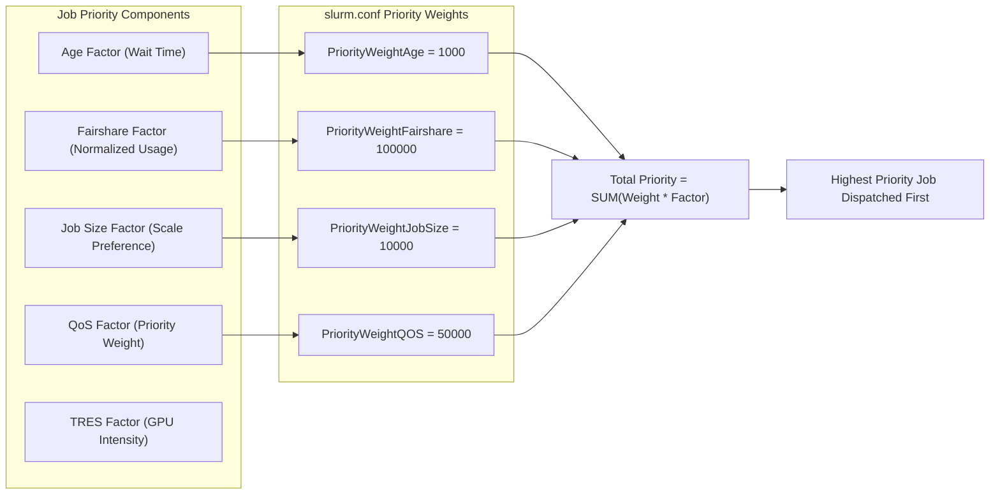

# Chapter 6 — Slurm Administration: HA, Topology-Aware Scheduling, Accounting, and Upgrades

In high-performance accelerated computing, **Slurm Workload Manager** is the premier orchestration engine for large-scale distributed training. Unlike general-purpose cloud orchestrators that bin-pack single containers based on loose CPU and memory estimates, Slurm operates as a **deterministic, gang-scheduled batch fabric**. It allocates thousands of tightly coupled GPUs, guarantees hardware NUMA and PCIe locality, and coordinates synchronized multi-node launches over InfiniBand and RoCE fabrics.

As an **NVIDIA Senior Solutions Architect**, you are expected to architect resilient Slurm control planes, configure Generic Resources (GRES) with hardware topology awareness, design multi-tenant fairshare and QoS hierarchies that balance departmental budgets, and perform zero-downtime cluster software upgrades.

---

## 1. Slurm Control Plane Architecture and High Availability

The Slurm control plane separates scheduling logic (`slurmctld`), node supervision (`slurmd`), job execution steps (`slurmstepd`), and accounting telemetry (`slurmdbd`).

```mermaid
flowchart TD
    subgraph SlurmHA["High-Availability Controller Fabric"]
        CTL1["Primary Controller (slurmctl-01)
        - slurmctld (ACTIVE)
        - In-memory Queue & Partition State
        - Heartbeat to slurmd nodes"]
        
        CTL2["Backup Controller (slurmctl-02)
        - slurmctld (STANDBY)
        - Cold State until election"]
        
        SHARED_FS[("StateSaveLocation
        Shared Enterprise NFS / NVMe-oF
        - job_state, node_state, resv_state")]
    end

    CTL1 <-->|Active Heartbeat via RPC| CTL2
    CTL1 -->|Periodic State Snapshot (2-5s)| SHARED_FS
    CTL2 -.->|Reads state on failover| SHARED_FS

    subgraph Accounting["Accounting Plane"]
        DBD1["Primary slurmdbd"]
        DBD2["Backup slurmdbd"]
        MARIADB[("MariaDB Enterprise Galera Cluster
        - Associations, TRES, Usage, Fairshare")]
    end

    CTL1 <-->|RPC Port 6819| DBD1
    CTL2 -.->|RPC Port 6819| DBD1
    DBD1 <--> MARIADB
    DBD2 <--> MARIADB

    subgraph ComputeNodes["Managed Compute Fleet"]
        N1["dgx-01 (slurmd)"]
        N2["dgx-02 (slurmd)"]
        N3["dgx-64 (slurmd)"]
    end

    CTL1 <-->|RPC Port 6818| ComputeNodes
    CTL2 -.->|Failover RPC Port 6818| ComputeNodes
```

### 1. Active/Passive Controller Failover Mechanics

1. **Dual Controller Configuration (`slurm.conf`)**:
   ```ini
   SlurmctldHost=slurmctl-01(10.0.1.10)
   SlurmctldHost=slurmctl-02(10.0.1.11)
   StateSaveLocation=/var/spool/slurm/state
   SlurmctldTimeout=120
   ```
2. **State Synchronization via `StateSaveLocation`**:
   - `slurmctld` maintains all active job steps, pending reservations, and node allocations in high-speed host RAM.
   - Periodically (and upon every transactional change), it serializes state to `StateSaveLocation` on redundant shared storage.
3. **Failover Execution**:
   - If `slurmctl-01` fails (hardware crash, network partition), `slurmctl-02` misses heartbeats across `SlurmctldTimeout`.
   - `slurmctl-02` assumes control, reads the serialized state files from `StateSaveLocation`, verifies running jobs, and begins responding to client RPCs.
   - **Zero Compute Interruption**: Running jobs on compute nodes do **not** abort. The compute node `slurmd` daemons and local `slurmstepd` processes continue managing running containers and MPI/NCCL ranks independently, reconnecting to the backup controller once it takes over.

---

## 2. Generic Resources (GRES), cgroups, and Hardware Topology Pinning

When a distributed training job requests 8 GPUs on an NVIDIA DGX H100 node, improper task binding will destroy performance. If Slurm places rank 0 on CPU socket 1 while allocating GPU 0 (which is physically wired to CPU socket 0), all CUDA commands and RDMA transfers must cross the slow inter-socket processor interconnect (UPI or Infinity Fabric).

### 1. Hardware-Aware GRES Configuration (`gres.conf`)

`gres.conf` tells Slurm exactly which GPU devices, PCIe addresses, CPU cores, and NVLink links correspond to each accelerator:

```ini
# /etc/slurm/gres.conf on DGX H100 (Dual 64-core CPUs, 8x H100 SXM5 GPUs)
# Node has 2 NUMA nodes (Sockets 0 and 1)

# GPUs 0-3 connected to CPU Socket 0 (Cores 0-63)
NodeName=dgx-h100-[01-64] Name=gpu Type=h100 File=/dev/nvidia0 Cores=0-15 Links=-,1,1,1,1,1,1,1
NodeName=dgx-h100-[01-64] Name=gpu Type=h100 File=/dev/nvidia1 Cores=16-31 Links=1,-,1,1,1,1,1,1
NodeName=dgx-h100-[01-64] Name=gpu Type=h100 File=/dev/nvidia2 Cores=32-47 Links=1,1,-,1,1,1,1,1
NodeName=dgx-h100-[01-64] Name=gpu Type=h100 File=/dev/nvidia3 Cores=48-63 Links=1,1,1,-,1,1,1,1

# GPUs 4-7 connected to CPU Socket 1 (Cores 64-127)
NodeName=dgx-h100-[01-64] Name=gpu Type=h100 File=/dev/nvidia4 Cores=64-79 Links=1,1,1,1,-,1,1,1
NodeName=dgx-h100-[01-64] Name=gpu Type=h100 File=/dev/nvidia5 Cores=80-95 Links=1,1,1,1,1,-,1,1
NodeName=dgx-h100-[01-64] Name=gpu Type=h100 File=/dev/nvidia6 Cores=96-111 Links=1,1,1,1,1,1,-,1
NodeName=dgx-h100-[01-64] Name=gpu Type=h100 File=/dev/nvidia7 Cores=112-127 Links=1,1,1,1,1,1,1,-
```

### 2. Linux cgroups Enforcement (`cgroup.conf`)

Without strict cgroup containment, an unauthorized or rogue job process can access `/dev/nvidia*` nodes allocated to other users, corrupting neighboring memory or hijacking GPU cycles.

```ini
# /etc/slurm/cgroup.conf
CgroupPlugin=cgroup/v2
ConstrainCores=yes
ConstrainRAMSpace=yes
ConstrainDevices=yes
AllowedDevicesFile=/etc/slurm/cgroup_allowed_devices_file.conf
```

- `ConstrainDevices=yes`: Slurm automatically generates an isolated device cgroup whitelist for each job step. If a user requests `--gres=gpu:2`, Slurm only maps the two assigned `/dev/nvidiaX` minor nodes into the container’s cgroup. Any attempt to access other GPUs throws `Operation not permitted` at the kernel level.
- `ConstrainCores=yes`: Pins tasks strictly to allocated CPU cores, eliminating noisy-neighbor core thrashing.

---

## 3. Multi-Tenant Accounting, Associations, and Fairshare Mathematics

In an enterprise AI Factory shared across Foundation Model Research, Product Engineering, and Autonomous Driving teams, allocation cannot be first-come, first-served. Slurm uses **Trackable Resources (TRES)** and the **Multifactor Priority Plugin** to enforce mathematically fair scheduling.



### The Fairshare Mathematical Formula

Slurm calculates an account's fairshare factor `F` (between 0.0 and 1.0) using an exponential decayed usage algorithm:

```text
F = 2 ^ (- U_E / S_N)
```

Where:
- `S_N` is the **Normalized Shares** assigned to the account (allocated budget ratio relative to the cluster total).
- `U_E` is the **Effective Usage** (decayed historical GPU-seconds consumed by the account, decayed via `PriorityDecayHalfLife=7-0`—a 7-day half-life).

**Interpreting the Metric:**
- If an account has used **less** than its allocated share (`U_E < S_N`), `F > 0.5`, boosting the priority of its pending jobs.
- If an account has **over-consumed** its budget (`U_E > S_N`), `F -> 0`, reducing queue priority and allowing starved departments to run their workloads.

### Production `sacctmgr` Account & QoS Setup

```bash
# 1. Define Accounts with Fairshare Weights and Max GPU Allocations
sacctmgr add account name=llm_research Organization=ai Description="Foundation LLM Team" \
  Fairshare=100 GrpTRES=gres/gpu=256

sacctmgr add account name=cv_product Organization=ai Description="Computer Vision Team" \
  Fairshare=50 GrpTRES=gres/gpu=64

# 2. Define High-Priority vs. Preemptible QoS
sacctmgr add qos name=prod_training Priority=10000 Flags=DenyOnLimit PreemptMode=off
sacctmgr add qos name=interactive_dev Priority=1000 MaxWall=04:00:00 MaxTRESPerUser=gres/gpu=8
sacctmgr add qos name=scavenger Priority=0 PreemptMode=requeue

# 3. Associate Users with Accounts and QoS
sacctmgr add user name=jdoe Account=llm_research DefaultQOS=prod_training QOS=prod_training,scavenger
```

---

## 4. Zero-Downtime Slurm Version Upgrade Workflow

Upgrading Slurm across an enterprise cluster (e.g., from version 23.02 to 24.05) cannot require terminating multi-day training jobs. Slurm natively supports **rolling version upgrades** because its RPC protocol is backward-compatible across adjacent major versions ($N$ and $N+1$).

### The 4-Stage Production Upgrade Sequence

```text
[Stage 1: Upgrade Accounting Database (slurmdbd)]
  - slurmdbd must ALWAYS be upgraded first.
  - It handles automatic database schema migrations in MariaDB.
  - Backup MariaDB: mysqldump -u slurm -p slurm_acct_db > /backup/slurm_acct_$(date +%F).sql
  - Stop slurmdbd -> Update RPM/DEB packages -> Start slurmdbd -> Verify logs.

[Stage 2: Upgrade Backup Controller (slurmctl-02)]
  - Stop slurmctld on slurmctl-02 -> Update packages -> Restart slurmctld.
  - Controller remains in standby, validating compatibility with primary.

[Stage 3: Failover and Upgrade Primary Controller (slurmctl-01)]
  - Stop slurmctld on slurmctl-01.
  - slurmctl-02 (now running new version) takes over primary scheduling authority.
  - Update packages on slurmctl-01 -> Start slurmctld (joins as backup).
  - Optionally fail back authority to slurmctl-01.

[Stage 4: Progressive Rolling Upgrade of Compute Nodes (slurmd)]
  - Compute nodes can run version N while controller runs version N+1.
  - On each compute node:
      1. Upgrade slurmd package.
      2. systemctl restart slurmd
  - NOTE: Restarting slurmd does NOT terminate running jobs!
    Running jobs are monitored by independent slurmstepd child processes.
    slurmd re-attaches to existing slurmstepd instances upon restart.
```

---

## 5. Senior Solutions Architect Interview Scenarios

### Scenario 1: GPU-to-CPU NUMA Misalignment Performance Collapse
**Interviewer:** *"A customer is running 8-GPU PyTorch DDP training on DGX H100 nodes via Slurm. Single-node training runs at 4,200 tokens/sec. When they submit jobs requesting 4 GPUs (`#SBATCH --gres=gpu:4`), throughput drops drastically to 1,800 tokens/sec. How do you diagnose and solve this?"*

**Candidate Answer:**
> "A 50%+ throughput collapse on partial-node allocations indicates **NUMA crossing and lack of core-to-GPU affinity**:
> 1. **The Root Cause:** On a dual-socket system, GPUs 0–3 attach to CPU Socket 0, and GPUs 4–7 attach to CPU Socket 1. If Slurm is configured without explicit core bindings in `gres.conf`, it may allocate GPUs 0, 1, 4, 5 (straddling two sockets) while placing all CPU worker threads on Socket 0. Every tensor copy from CPU RAM to GPUs 4 and 5 must traverse the inter-socket UPI bus, saturating socket interconnect bandwidth and destroying training throughput.
> 2. **Verification:** I inspect `scontrol show job <jobid>` and run `numactl -H` and `nvidia-smi topo -m` on the allocated node.
> 3. **The Architectural Fix:**
>    - In `gres.conf`, map each GPU explicitly to its local NUMA socket CPU cores (e.g., `Cores=0-63` for Socket 0 GPUs, `Cores=64-127` for Socket 1 GPUs).
>    - In `slurm.conf`, enforce `TaskPlugin=task/affinity,task/cgroup` and `TaskPluginParam=cores`.
>    - Require users to submit jobs with `--cpus-per-gpu=16 --gpu-bind=closest`, ensuring Slurm schedules CPU threads strictly on the NUMA domain directly connected to the allocated accelerators."

---

### Scenario 2: Controller HA Split-Brain and Queue Corruption
**Interviewer:** *"During a network glitch between the primary and backup Slurm controllers, both `slurmctld` instances believe they are active and attempt to write to `StateSaveLocation`. What safeguards prevent queue state corruption?"*

**Candidate Answer:**
> "Slurm controllers prevent split-brain through two primary mechanisms:
> 1. **POSIX File Locking on State Files:** `slurmctld` acquires an exclusive lock (`fcntl`/`flock`) on the state directory files (`job_state`, `node_state`) within `StateSaveLocation`. Even if the backup controller attempts to start scheduling, it cannot acquire write locks on active state files while the primary holds them.
> 2. **Slurmd Authoritative Verification:** When compute node `slurmd` processes receive scheduling RPCs, they verify the origin against the primary IP. If the backup attempts to issue an allocation command while the primary is still alive, `slurmd` drops the RPC or checks if the primary has definitively timed out.
> 3. **Architectural Hardening:** To guarantee zero split-brain in mission-critical AI supercomputers, we layer an enterprise cluster resource manager such as **Pacemaker with Redfish STONITH fencing**. Pacemaker manages the virtual IP and actively powers off a rogue controller before promoting the standby node."

---

## Key Takeaways

1. **Deterministic Locality Over Bin-Packing:** High-performance AI scheduling requires strict alignment between GPUs, CPU cores, and NUMA domains via `gres.conf` and `cgroup.conf`.
2. **Device cgroups Protect Multi-Tenancy:** Always enforce `ConstrainDevices=yes` to ensure containers cannot access unallocated GPU devices.
3. **Fairshare Governs Multi-Tenant Equity:** Multi-factor priority uses decayed historical usage ($U_E$) and normalized shares ($S_N$) to balance departmental queues without manual ticketing.
4. **Independent slurmstepd Enables Zero-Downtime Upgrades:** Compute node `slurmd` daemons can be restarted or upgraded without killing running GPU jobs because workloads run under detached `slurmstepd` processes.
5. **Always Upgrade `slurmdbd` First:** Schema migrations are handled by the database daemon; controllers and nodes must follow in strict sequence.
