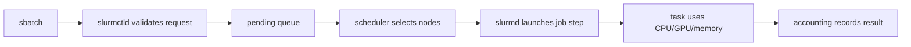
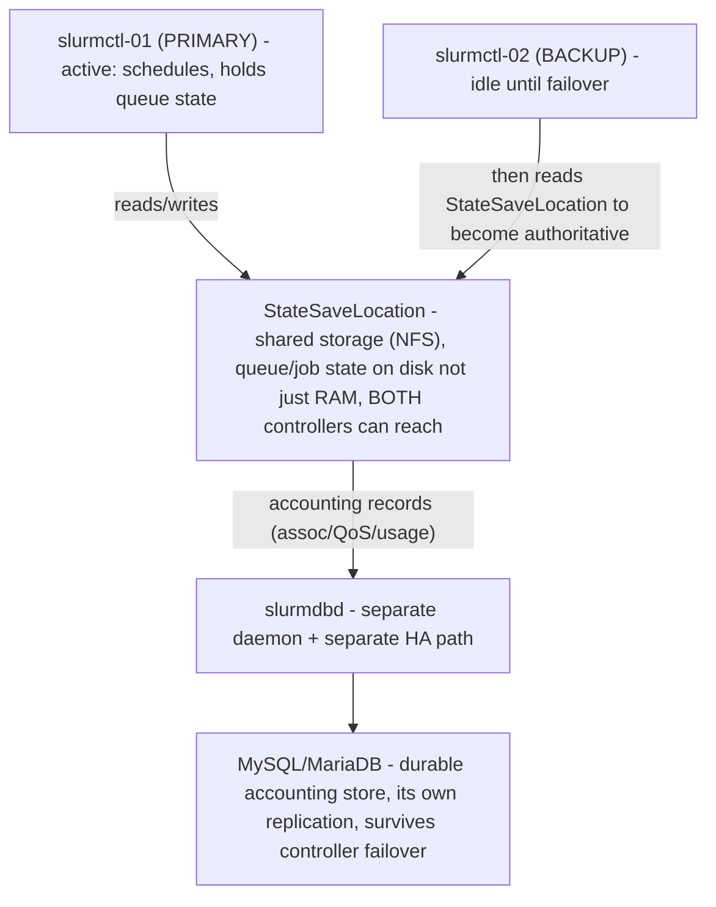
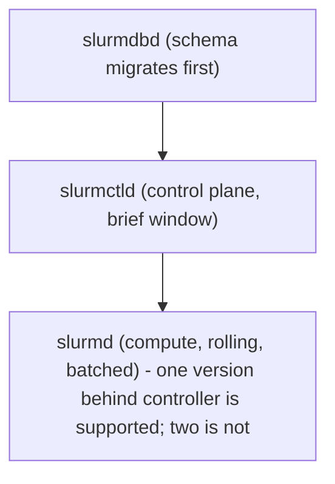
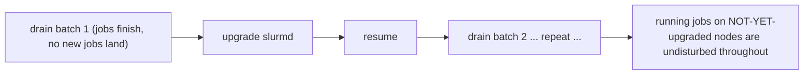

**Learning outcome:** Operate Slurm as a production service — controller/accounting-database high availability, multi-tenant fairshare via associations and QoS, node-state administration, safe version upgrades, and the cgroup/GRES configuration that binds jobs to specific GPUs.

## Start here — follow one job through Slurm

You do not need to master scheduler mathematics before operating the basics. Follow one submitted script:



- A **job** is the user's resource request and work description.
- A **partition** is a scheduling pool with rules and eligible nodes; it is not a disk partition.
- `slurmctld` is the controller that owns scheduling decisions and cluster state.
- `slurmd` is the daemon on each compute node that launches and supervises work.
- `slurmdbd` connects Slurm to the accounting database for historical usage and policy.
- **GRES** describes generic resources such as particular GPUs on a node.
- **TRES** is Slurm's countable accounting/scheduling model for CPU, memory, node, GPU, and other resources.
- An **association** connects cluster, account, user, and optionally partition policy. A **QoS** adds limits and priority behavior.

When a job is pending, begin with `squeue -j JOBID -o '%.18i %.9T %.30R'`: the reason field is evidence, not decoration. `Resources` means an eligible allocation is not currently free; `Priority` means other jobs rank higher; an association/QoS reason points toward policy; a node/configuration reason points toward eligibility. Do not "fix" every pending job by raising priority.

When a node is `DRAIN`, preserve the recorded reason and inspect the node, daemon, hardware, GPU, network, and recent prolog/health output. Return it to service only after the fault is corrected and a validation job passes. `scontrol update NodeName=... State=RESUME` changes scheduler state; it does not repair hardware.

This chapter builds on the deeper scheduling model in Volume 6, but the mental model above is enough to begin the administrative sections safely.

## slurmctld/slurmdbd high availability

`slurmctld` is a single logical decision-maker, but it does not have to be a single point of failure. Slurm supports a backup controller declared in `slurm.conf`:

```
# slurm.conf
SlurmctldHost=slurmctl-01
SlurmctldHost=slurmctl-02
```

The first `SlurmctldHost` entry is primary; the second is backup. Compute node `slurmd` processes and client commands (`sbatch`, `squeue`) try the primary first and fail over to the backup if the primary is unreachable. Critically, the backup controller does not maintain its own independent copy of live queue state in memory the way an active-active service would — it becomes authoritative by reading the **state save location** (`StateSaveLocation` in `slurm.conf`, typically on shared/NFS storage reachable by both controllers) when it takes over, which is why that directory must be on shared storage both controllers can reach, not local disk on the primary alone.

`slurmdbd` (the accounting daemon) is a separate process from `slurmctld` and has its own HA story — it is the front end to the accounting database (MySQL/MariaDB), and it can itself run with a backup instance declared via `DbdBackupHost`. The database beneath it should be on its own HA path (replication, managed DB service) independent of Slurm's own failover config; `slurmdbd` losing its database connection does not crash running jobs, but it does mean new job accounting records queue up in `slurmdbd`'s local cache until the database is reachable again, and association/QoS lookups (needed for new job submission decisions) may stall.



The point worth having precise in an interview: controller failover is about *who makes scheduling decisions right now*; `slurmdbd`/the database is about *durable historical record and policy data* (associations, QoS, fairshare usage) that outlives any individual controller's uptime — a controller failover does not lose accounting history because that was never the controller's data to begin with.

## Accounting: associations and QoS for multi-tenant fairshare

`sacctmgr` manages the accounting hierarchy — clusters, accounts (organizational units, often mapped to research groups/projects), users, and the **association** between them (which user can charge which account on which partition, with what fairshare weight):

```
$ sacctmgr show account format=Account,Description,Organization
   Account            Descr        Org
---------- -------------------- ----------
   physics    Physics Dept HPC    research
   genomics    Genomics Group      research
   platform    Platform Team       infra

$ sacctmgr show assoc format=Account,User,Fairshare,GrpTRES,MaxJobs tree
   Account       User  Fairshare       GrpTRES  MaxJobs
---------- ---------- ---------- ------------- --------
  physics                    100  gres/gpu=64
  physics       jdoe          50
  physics      asmith          50
  genomics                    20  gres/gpu=64
  genomics      bchen        100
```

Fairshare is a relative weight, not an absolute quota — a `physics` account fairshare of `100` against a `genomics` account fairshare of `20` means Slurm's multifactor priority plugin will favor `physics` jobs over `genomics` jobs, proportionally, when both have pending work and shared partition capacity, adjusted continuously by each account's recent usage (accounts that have been consuming more than their share get a priority penalty; accounts that have been under-consuming get a boost). `GrpTRES=gres/gpu=64` is a hard ceiling — the account cannot have more than 64 GPUs allocated across all its running jobs simultaneously, regardless of fairshare or queue priority.

QoS (`sacctmgr show qos`) layers on top of accounts/associations to express policy independent of the org chart — a `high-priority` QoS with `Priority=1000` and `MaxWall=1-00:00:00` versus a `preemptible` QoS with `Priority=0` and a preempt relationship, applied per-job at submission (`sbatch --qos=high-priority`) rather than fixed to an account. QoS is how you express "this specific job class jumps the queue" or "this job class can be preempted by anything" without restructuring the account tree.

## Worked scenario — a fairshare misconfiguration that starved the fleet for weeks

**Situation:** A new research group (`genomics`) is onboarded and given an association with `Fairshare=100` — copy-pasted from the `platform` team's infrastructure-testing account, which legitimately needs high priority for short validation jobs. Nobody adjusts it down. Three other established research accounts (`physics`, `climate`, `astro`) each sit at `Fairshare=20`, reflecting their actual proportional GPU budget allocation agreed months earlier.

**What happens:** `genomics` submits a steady, moderate stream of jobs — not an unusual volume, nothing that looks like abuse. But Slurm's multifactor priority calculation weighs `genomics` jobs far above the three established accounts on every scheduling pass, because fairshare priority is computed from the *ratio* of allocated share to consumed share, and `genomics`'s allocated share (100 out of a 160 total across four accounts) is wildly out of proportion to what was actually agreed. `physics`, `climate`, and `astro` jobs still run — they are not blocked — but they queue measurably longer every single day, a creeping effect nobody notices because no single day looks anomalous and no job outright fails; `squeue` reason codes show `(Priority)`, which reads as "normal queue contention," not "policy misconfiguration."

**How it surfaces:** Three weeks in, the `physics` PI escalates because a paper deadline is at risk and their jobs are consistently waiting 10+ hours despite the partition rarely showing as fully allocated. The on-call engineer runs:

```
$ sshare -l -A physics,genomics,climate,astro
             Account       User  RawShares  NormShares    RawUsage  EffectvUsage  FairShare
-------------------- ---------- ---------- ----------- ----------- ------------- ----------
             genomics                  100    0.625000   812345600      0.701234   0.891200
                physics                20    0.125000   201223400      0.173456   0.216700
                climate                20    0.125000   198877200      0.171432   0.219900
                  astro                20    0.125000   198221100      0.170812   0.220400
```

`FairShare` near 1.0 for `genomics` versus near 0.2 for the others is the diagnostic: `genomics` has been consuming roughly proportional to its allocated (mis-set) share, but that allocated share itself was four to five times larger than intended relative to the other three accounts — the account wasn't gaming the system, the system was configured to favor it.

**Fix:** `sacctmgr modify account genomics set fairshare=20` (matching the other three), followed by watching `sshare` normalize over the following days as decayed usage history catches up to the corrected weight. The lasting fix is process, not a number: any new association's fairshare value gets reviewed against the existing account tree before activation, not copy-pasted from an unrelated account, and `sshare -l` gets checked on a recurring cadence rather than only when someone escalates.

**Interview-ready line:** "A fairshare misconfiguration doesn't look like an outage — no job fails, nothing pages — it looks like a slow, distributed tax on every other account's queue time, which is exactly why it survives for weeks: `squeue`'s `(Priority)` reason code is truthful but uninformative, and only `sshare -l` shows whether that priority gap is fair contention or a policy bug."

## Node state management

```
$ scontrol update nodename=gpu-node-14 state=drain reason="ECC errors - pending diagnostics"
$ scontrol show node gpu-node-14 | grep -E 'State|Reason'
   State=DRAIN Reason=ECC errors - pending diagnostics [admin@2026-07-30T09:12:00]

$ scontrol update nodename=gpu-node-14 state=resume
```

`DRAIN` (set deliberately, by an admin or by an auto-drain from a failed prolog per Deep Dive 5) means the node keeps its currently running job(s) to completion but accepts no new work — the humane way to pull a node for scheduled maintenance without killing a researcher's in-flight job. `DOWN` means Slurm considers the node unusable right now, typically because `slurmd` stopped responding (`SlurmdTimeout` exceeded) — existing jobs on it are generally lost, not gracefully drained, because `slurmctld` can no longer confirm what's happening on that node at all. `FAIL` is a specific, escalated variant of drain used to mark a node as failed hardware rather than merely maintenance-pending, distinguishing "we're doing planned work" from "this node is broken and its next allocation should not happen until someone fixes it" for reporting/tracking purposes — some sites treat FAIL and DRAIN identically in scheduling behavior but keep them semantically distinct in the reason field and in dashboards, precisely so an on-call engineer scanning `sinfo` output can tell planned maintenance from an open incident at a glance.

```
$ sinfo -R
REASON               USER      TIMESTAMP           NODELIST
ECC errors - pendi+  admin     2026-07-30T09:12:00  gpu-node-14
Prolog error         slurm     2026-07-28T03:14:02  gpu-node-09
Not responding       (null)    2026-07-30T11:40:11  gpu-node-22
```

`sinfo -R` is the fastest single command for "what's wrong across the fleet right now, and since when" — reading the `USER` column tells you whether a state change was deliberate (an admin account) or system-generated (`slurm`, or `(null)` for a node the controller itself marked unresponsive).

## Version upgrades: why order and skew rules matter

Slurm's documented upgrade order is strict: **`slurmdbd` first, then `slurmctld`, then `slurmd` on compute nodes**, never the reverse. `slurmdbd` owns and migrates the accounting database schema; a newer `slurmctld` talking to an older `slurmdbd`/schema can encounter accounting calls the older schema doesn't support, but a `slurmdbd` upgraded first (and its schema migration completed) can continue serving an older `slurmctld` without issue, because `slurmdbd`'s RPC compatibility window is generally wider going backward than a not-yet-upgraded piece going forward.

Version skew is explicitly bounded: RPC compatibility is officially guaranteed only between adjacent major versions (Slurm's own documented policy — for example a 23.02 `slurmctld` is compatible with 22.05 `slurmd` compute nodes, but skipping two major versions of skew, e.g. running 21.08 compute nodes against a 23.02 controller, is unsupported and can silently misbehave rather than fail cleanly). This is what makes rolling upgrades possible at all: compute nodes can lag the controller by one major version while jobs continue running on them, which is the mechanism for **not killing running jobs during an upgrade** — you drain and upgrade `slurmd` on a batch of nodes at a time (the same `serial:`-style batching concept as Chapter 4's Ansible rollout, operationally), while the controller itself is upgraded once, during a short maintenance window, without needing every compute node upgraded simultaneously.





The practical admin move: `scontrol update nodename=<batch> state=drain` on a batch, wait for `sinfo`/`squeue` to confirm no running jobs remain on that batch (or accept that draining lets current jobs finish before removing the node from scheduling), upgrade `slurmd` and restart it on that batch, `resume` it, move to the next batch — a batch of nodes is unavailable for *new* scheduling during its own upgrade window, but the cluster as a whole, and every job that was running before the upgrade started, is never killed by the process.

## cgroup and GRES configuration for GPU binding

`gres.conf` declares what GPU devices a node has and which specific device files map to which GRES index — this is the node-side capability declaration Deep Dive 5 referenced:

```
# /etc/slurm/gres.conf  (on gpu-node-14, an 8-GPU node)
AutoDetect=nvml
Name=gpu Type=h100 File=/dev/nvidia0 Cores=0-15
Name=gpu Type=h100 File=/dev/nvidia1 Cores=16-31
```

`AutoDetect=nvml` lets Slurm query NVML directly for GPU topology instead of hand-listing every device, which is the standard on modern DGX/H100 nodes; the `Cores=` binding is what ties a specific GPU to specific CPU cores for NUMA-aware placement — a job requesting `--gres=gpu:1` on this node gets steered toward the CPU cores physically closest to the GPU it's allocated, which matters for PCIe/NVLink-adjacent memory traffic on multi-socket nodes.

`cgroup.conf` controls whether Slurm actually enforces the isolation implied by an allocation, rather than merely bookkeeping it:

```
# /etc/slurm/cgroup.conf
ConstrainCores=yes
ConstrainDevices=yes
ConstrainRAMSpace=yes
```

`ConstrainDevices=yes` is the line that makes GPU allocation a hard boundary instead of an honor system: without it, a job allocated 1 of 8 GPUs on a node can still see and potentially touch all 8 GPU device files, because nothing at the OS/cgroup layer is stopping it — Slurm's scheduler-side bookkeeping says "you have GPU 0," but the process's actual device visibility is unrestricted. With it, the cgroup device controller physically restricts the job's container/process tree to only the device files GRES assigned it, which is the difference between "trusted convention" and "kernel-enforced isolation" on a shared multi-tenant GPU node — a distinction that matters a great deal on a fleet where mutually distrusting research groups share the same physical hardware.

## Mnemonic

**D.O.G.F.A.C.E.** — **D**bd first (schema migrates), then controller, then compute (upgrade order); **O**ne major version of skew, no more; **G**RES declares capability per node; **F**airshare is relative, not absolute — review it, don't copy-paste it; **A**ssociations + QoS express org-chart policy and job-class policy separately; **C**onstrainDevices=yes turns GPU isolation from convention into enforcement; **E**xamine `sinfo -R` / `sshare -l` before escalating, not after.

## Practice

1. Explain why `slurmdbd` must be upgraded before `slurmctld`, and what specifically would go wrong if the order were reversed.
2. Distinguish `DRAIN`, `DOWN`, and `FAIL` node states in terms of what happens to a job already running on that node when the state is set.
3. A research account's jobs are consistently deprioritized despite the partition rarely being fully allocated. Name the two `sacctmgr`/`sshare` commands you'd run first, and what specific field distinguishes "genuine capacity contention" from "fairshare misconfiguration."
4. Why does controller (`slurmctld`) failover not lose accounting history, even though the failover mechanism itself has nothing to do with `slurmdbd`?
5. A job allocated 1 of 8 GPUs on a node can still see all 8 GPU device files. Which config file and which specific setting is missing, and what is the operational risk of leaving it unset on a shared multi-tenant cluster?
