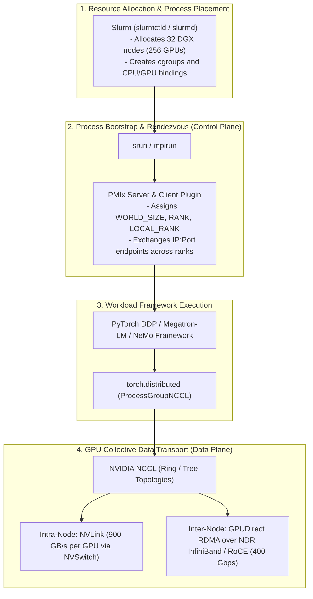
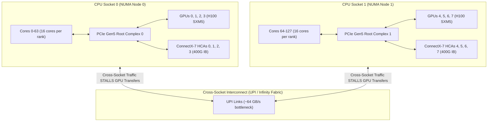
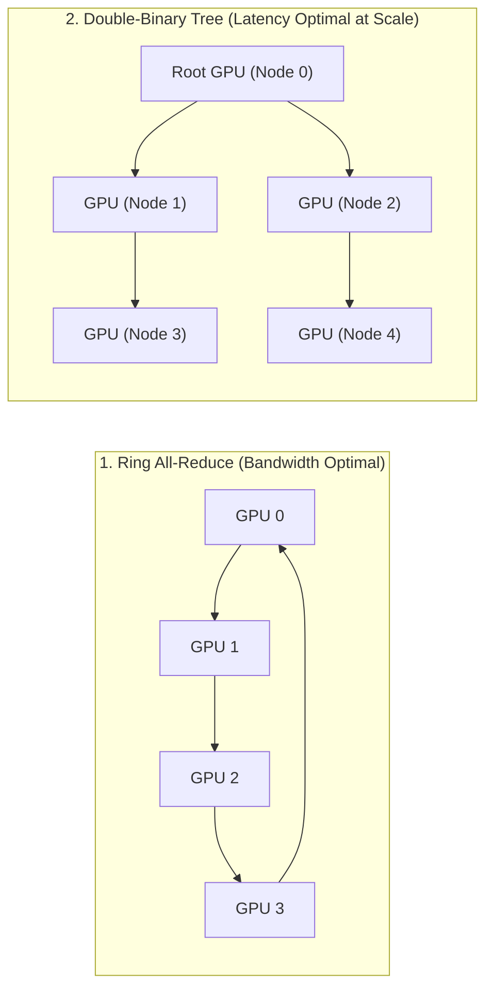

# Chapter 7 — MPI, PMIx, and Distributed Collective Communication

In large-scale AI distributed training, orchestrating thousands of independent processes across hundreds of compute nodes requires two fundamentally distinct communication layers:
1. **Control-Plane Process Orchestration**: Bootstrapping processes, distributing rank identities, and exchanging network endpoint metadata across nodes.
2. **Data-Plane Collective Acceleration**: High-bandwidth, low-latency GPU-to-GPU tensor synchronization (All-Reduce, All-Gather, Reduce-Scatter) over NVLink and InfiniBand/RoCE fabrics.

Historically, the High-Performance Computing (HPC) community used the **Message Passing Interface (MPI)** for both tasks. In modern NVIDIA AI Factories, this architecture has evolved: **PMIx / Slurm** handles process bootstrap and rank rendezvous, while the **NVIDIA Collective Communications Library (NCCL)** completely owns the GPU data fabric.

As an **NVIDIA Senior Solutions Architect**, you must understand the interplay between MPI, PMIx, PyTorch `c10d`, and NCCL, configure hardware-pinned NUMA process bindings, and debug multi-node collective hangs under strict SLA pressure.

---

## 1. Architectural Taxonomy: Slurm vs. PMIx vs. MPI vs. NCCL

A common misconception among cloud engineers is that MPI and NCCL are competing libraries. In a production AI cluster, they occupy completely different layers of the execution stack.



### Responsibility Breakdown

| Component | Layer | Primary Responsibility | Wire Transport | What It Does NOT Do |
|---|---|---|---|---|
| **Slurm** | Cluster Orchestrator | Resource reservation, queue priority, node allocation, and cgroup enforcement. | UNIX domain sockets, Slurm RPC (TCP 6817/6818) | Does not launch individual user-space threads or move tensors. |
| **PMIx (Process Management Interface Exascale)** | Process Wire Protocol | Bootstraps processes, assigns rank IDs, exchanges wire addresses, and coordinates barriers. | UNIX domain sockets, TCP out-of-band | Does not transfer GPU memory buffers. |
| **MPI (OpenMPI, HPC-X)** | HPC Messaging Standard | General-purpose distributed message passing across CPU cores and nodes. | TCP, InfiniBand Verbs (uGNI, UCX) | Not topology-optimized for multi-GPU NVLink meshes. |
| **NVIDIA NCCL** | GPU Collective Engine | Topology-aware GPU collective communication (`AllReduce`, `AllGather`, `ReduceScatter`). | Hardware NVLink, InfiniBand GPUDirect RDMA, RoCE | Does not spawn processes or allocate nodes. |

---

## 2. Process Management Interface (PMIx) and Launch Mechanics

When launching a distributed PyTorch job across 64 nodes (512 ranks), every rank must know the IP address and communication port of all other 511 ranks before any collective communication can begin.

### `srun` vs. `torchrun` vs. `mpirun`

1. **`srun --mpi=pmix` (HPC Native Standard)**:
   - Slurm’s `slurmd` daemon forks `slurmstepd`, which starts the local ranks directly on each compute node.
   - Each rank links against the PMIx client library, which communicates with the local `slurmstepd` via a UNIX domain socket.
   - Slurm coordinates the key-value exchange across all nodes via internal tree-based RPCs.
   - **Advantage:** Blazing fast startup (< 5 seconds for 1,000 ranks); no SSH keys required across compute nodes.
2. **`torchrun` (Cloud-Native Standard)**:
   - Starts a local rendezvous agent on each node.
   - Node 0 runs a centralized rendezvous backend (c10d TCP store or etcd).
   - Ranks register over standard TCP (`MASTER_ADDR:MASTER_PORT`).
   - **Advantage:** Native to standard container workflows and Kubernetes; familiar to AI researchers.
   - **Disadvantage at Scale:** TCP store becomes a serial bottleneck at 2,000+ ranks; susceptible to connection timeouts during cluster boot-storms.

---

## 3. CPU Core and GPU NUMA Pinning

On modern accelerated servers (e.g., dual-socket Intel Emerald Rapids or AMD Genoa paired with 8x NVIDIA H100 GPUs), CPU-to-GPU NUMA locality dictates whether gradient transfers achieve line-rate or stall on the CPU interconnect.



### Production Slurm Launch Script with Strict NUMA Binding

Below is an enterprise-grade `sbatch` launch script demonstrating exact hardware binding:

```bash
#!/usr/bin/env bash
#SBATCH --job-name=megatron_gpt3
#SBATCH --nodes=16
#SBATCH --ntasks-per-node=8
#SBATCH --gpus-per-node=8
#SBATCH --cpus-per-task=16
#SBATCH --exclusive
#SBATCH --partition=dgx_h100

export OMP_NUM_THREADS=1
export NCCL_DEBUG=INFO
export NCCL_DEBUG_SUBSYS=INIT,GRAPH,ENV
export NCCL_IB_HCA=mlx5_0,mlx5_1,mlx5_2,mlx5_3,mlx5_4,mlx5_5,mlx5_6,mlx5_7
export NCCL_IB_GID_INDEX=3
export NCCL_NET_GDR_LEVEL=5

# srun pins each task strictly to 16 CPU cores local to its allocated GPU
srun --mpi=pmix \
     --cpu-bind=cores \
     --accel-bind=g \
     python3 /workspace/megatron-lm/pretrain_gpt.py \
       --tensor-model-parallel-size 8 \
       --pipeline-model-parallel-size 2 \
       --sequence-parallel
```

- `--cpu-bind=cores`: Binds the 16 worker threads of each MPI rank strictly to physical CPU cores.
- `--accel-bind=g`: Automatically assigns each rank the local GPU directly attached to its allocated CPU NUMA socket.
- `NCCL_NET_GDR_LEVEL=5`: Forces GPUDirect RDMA over NVLink bridges, allowing GPUs to route network transfers through adjacent GPUs when direct PCIe paths are unavailable.

---

## 4. NCCL Internals: Ring vs. Tree Collective Topologies

When PyTorch executes `dist.all_reduce(tensor)`, NCCL does not send naive peer-to-peer copies. It dynamically synthesizes a communication graph based on detected hardware topology.



### Ring vs. Tree Selection Mechanics

1. **Ring All-Reduce**:
   - **Mechanics:** Each rank splits its tensor into `S` chunks and sends chunk `i` to its immediate logical successor in the ring, receiving from its predecessor. Requires `2 * (N - 1)` communication steps.
   - **Bandwidth:** `Effective Bus Bandwidth = (2 * (N - 1) / N) * Link Speed`, which approaches `2 * Link Speed` at scale.
   - **Best For:** Large tensor messages (e.g., > 64 MB gradient buffers in FP8/FP16 training) where bandwidth saturation dominates.
2. **Double-Binary Tree All-Reduce**:
   - **Mechanics:** Tensors are reduced up a binary tree to the root and broadcast back down. Execution time scales logarithmically: `O(log2(N))`.
   - **Latency:** Dramatically reduces latency on very large clusters (thousands of GPUs).
   - **Best For:** Small tensor messages, MoE (Mixture of Experts) all-to-all metadata, and extreme-scale synchronization barriers.

NCCL automatically switches between Ring and Tree algorithms based on message size and GPU count. You can force an algorithm for debugging via `NCCL_ALGO=Ring` or `NCCL_ALGO=Tree`.

---

## 5. Senior Solutions Architect Interview Scenarios

### Scenario 1: The "Hanging at Startup" Multi-Node Incident
**Interviewer:** *"A customer submits a 32-node training job. The job logs print: `[Rank 0] Process initialized`, and then completely freezes forever. No CPU usage is observed, and GPUs remain at 0% utilization. How do you systematically isolate this failure?"*

**Candidate Answer:**
> "A freeze immediately following rank initialization indicates a failure during **control-plane rendezvous or initial collective ring construction**, not a compute issue:
> 1. **Step 1: Check Process Bootstrap (PMIx/Launcher Layer):** I verify if all 256 ranks actually spawned. I run `squeue -j <jobid>` and inspect node process trees via `srun ps -ef | grep python3`. If only 250 ranks launched because two nodes had exhausted process limits (`pids_max`), the remaining ranks will block in `MPI_Init()` or `torch.distributed.init_process_group` indefinitely.
> 2. **Step 2: Inspect Network Interface Selection (`NCCL_SOCKET_IFNAME`):** By default, NCCL inspects system network interfaces to create its out-of-band bootstrap socket. If nodes have heterogeneous interfaces (e.g., `eth0` on older nodes, `ens5f0` on newer nodes), NCCL may bind to a Docker bridge (`docker0`) or host loopback on some nodes, making cross-node TCP communication impossible. Setting `NCCL_SOCKET_IFNAME=bond0` or `eth0` ensures all ranks rendezvous on the valid cluster management VLAN.
> 3. **Step 3: Enable NCCL Trace Logging:** I re-run with `NCCL_DEBUG=INFO NCCL_DEBUG_SUBSYS=INIT,GRAPH`. I inspect the logs for:
>    `NCCL INFO comm 0x... rank 0 nranks 256 ... - Connection timed out`
>    The log will identify the exact pair of IP addresses and ranks that failed to establish a handshake, pointing directly to a firewalled port or bad routing table on a specific host."

---

### Scenario 2: Severe Bandwidth Regression on GPUDirect RDMA
**Interviewer:** *"On a 4-node DGX H100 cluster with 400 Gbps InfiniBand, `all_reduce_perf` reports only 45 GB/s bus bandwidth, whereas expected performance is ~380 GB/s. What are the common root causes?"*

**Candidate Answer:**
> "A drop from 380 GB/s to 45 GB/s indicates that **GPUDirect RDMA has completely failed and fallen back to host CPU memory copies or standard TCP sockets**:
> 1. **`nv_peer_mem` / NVIDIA PEER Direct Driver Absent:** GPUDirect RDMA requires the NVIDIA Peer Memory client driver (`nvidia-peermem`) to allow the ConnectX-7 HCA to directly map GPU HBM3 physical addresses. If the kernel module failed to load (`lsmod | grep nvidia_peermem`), NCCL cannot perform peer-to-peer DMA over InfiniBand and falls back to staging buffers in host system RAM.
> 2. **Access Control Services (ACS) Enabled in PCIe Bridges:** If PCIe ACS is enabled in BIOS, PCIe switches force all peer-to-peer memory transactions to route up to the CPU root complex for security isolation. This disables direct GPU-to-NIC DMA across PCIe switches, throttling bandwidth to inter-socket UPI limits.
> 3. **Wrong Subnet / GID Selection:** On RoCE networks, if `NCCL_IB_GID_INDEX` is set to 0 (RoCE v1) instead of 3 (RoCE v2 UDP encapsulated), the network switches drop packets due to lack of PFC/ECN prioritization, forcing massive packet loss and throughput collapse."

---

## Key Takeaways

1. **MPI is Control; NCCL is Data:** In modern AI supercomputers, MPI/PMIx bootstraps processes and coordinates rank identities, while NCCL exclusively manages high-speed GPU collective tensor transport.
2. **NUMA Alignment Dictates Throughput:** Always enforce CPU core pinning local to the assigned GPU and HCA (`--cpu-bind=cores --accel-bind=g`) to eliminate UPI/cross-socket bandwidth bottlenecks.
3. **Ring vs. Tree Topologies:** Ring algorithms maximize bandwidth utilization for large gradient buffers; Tree algorithms minimize latency for small messages and massive rank counts.
4. **GPUDirect RDMA Relies on `nvidia-peermem`:** If collective performance collapses to CPU memory speeds, immediately verify `nvidia-peermem` module health and ensure PCIe ACS is disabled.
5. **Debug Layer-by-Layer:** Follow the strict triage ladder: Process Launch $\rightarrow$ PMIx Bootstrap $\rightarrow$ NCCL Graph Construction $\rightarrow$ Physical Fabric Verbs.
