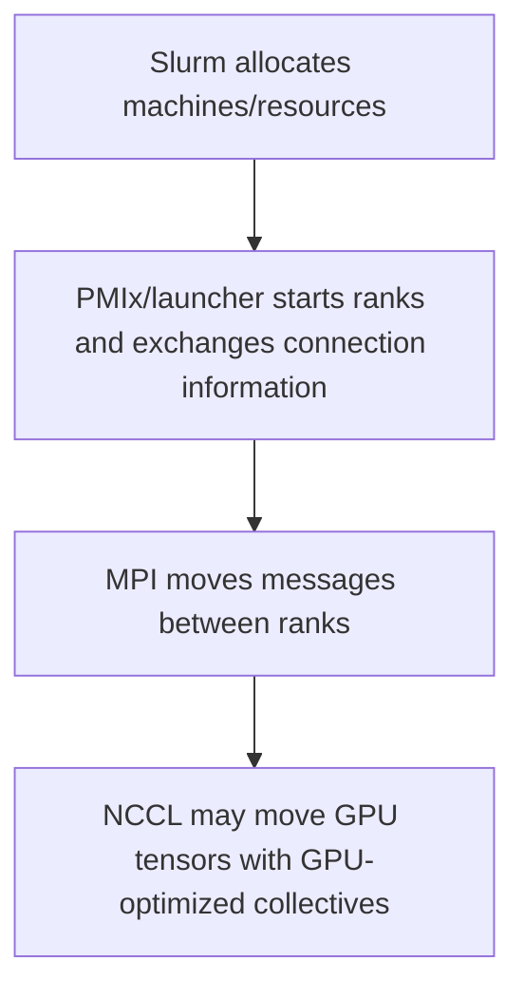
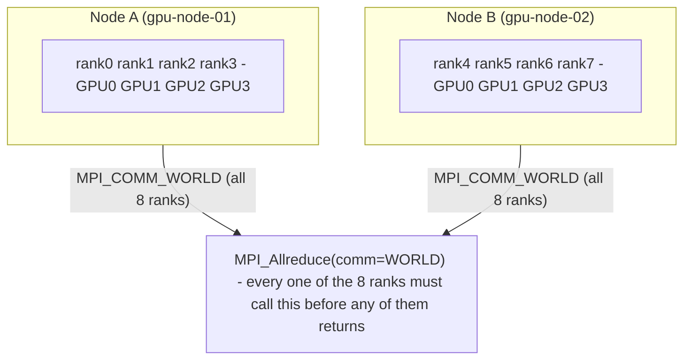
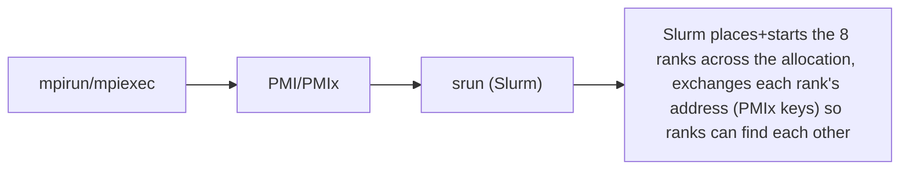

**Learning outcome:** Explain what MPI actually is, how it bootstraps multi-node jobs under Slurm, how it differs from NCCL, and how to tell an MPI-level hang apart from an NCCL-level hang under time pressure.

## Start here — one program, many cooperating processes

A normal Python or C program starts as one operating-system process. Distributed HPC programs start many copies of a program and give each process an identity called a **rank**. MPI provides the communication rules and library calls that let those ranks exchange data.

Use this three-layer distinction:



Slurm is not MPI: it decides where work may run. MPI is not NCCL: MPI is a broad process-communication standard, while NCCL specializes in GPU collectives. A training job may use all three.

Start with a tiny experiment before a framework-sized workload:

```python
# hello_mpi.py — requires mpi4py and an MPI implementation
from mpi4py import MPI

comm = MPI.COMM_WORLD
rank = comm.Get_rank()
size = comm.Get_size()
host = MPI.Get_processor_name()
print(f"rank={rank}/{size} host={host}", flush=True)
comm.Barrier()
if rank == 0:
    print("all ranks reached the barrier", flush=True)
```

Run locally with `mpirun -n 4 python hello_mpi.py`, then under a small Slurm allocation using the launcher approved for that cluster. Predict four unique ranks before running it. If fewer lines appear, debug process launch before CUDA or NCCL. If every rank prints but the barrier never completes, investigate rendezvous, network reachability, library consistency, and whether a rank exited. Only after MPI initialization and a CPU collective work should you move to GPU visibility and NCCL tests.

This reduction method—one process, then many ranks on one node, then two nodes, then GPUs, then the real framework—is more valuable than memorizing dozens of debug variables.

MPI (Message Passing Interface) is a **standard**, not a scheduler and not a single piece of software. It defines an API for process-to-process communication — point-to-point sends/receives and collective operations (broadcast, reduce, allreduce, gather, scatter, barrier) — that multiple vendors implement as libraries: OpenMPI, MVAPICH2, Intel MPI, Cray MPICH, NVIDIA's HPC-X (an OpenMPI-based distribution tuned for InfiniBand/NVLink). Code written against the MPI API (`MPI_Init`, `MPI_Send`, `MPI_Allreduce`, `MPI_Finalize`) can be linked against any of these implementations largely unmodified, but the implementations are not wire-compatible with each other — a process built against OpenMPI cannot join a communicator with a process built against MVAPICH2. That single fact explains most "it works on node A, hangs on node B" MPI incidents: a mismatched library version or vendor between nodes.

## Ranks, communicators, point-to-point vs. collective

Every MPI process is a **rank** — an integer ID within a **communicator**, the group of processes that can talk to each other. `MPI_COMM_WORLD` is the default communicator containing every rank in the job; applications can carve subsets out of it (e.g., one communicator per node, one per pipeline stage) for scoped collectives. Point-to-point operations (`MPI_Send`/`MPI_Recv`) move data between two specific ranks; collective operations (`MPI_Bcast`, `MPI_Reduce`, `MPI_Allreduce`, `MPI_Barrier`) involve every rank in a communicator and are implicitly synchronizing — no rank leaves an `MPI_Allreduce` call until every rank in that communicator has entered it. That synchronizing property is exactly why a single stuck rank freezes the entire collective, not just its own progress.

MPI rank layout across 2 nodes, communicator = MPI_COMM_WORLD (8 ranks):



Process bootstrap / launch path:



## mpirun/mpiexec, PMI/PMIx, and Slurm

`mpirun`/`mpiexec` are the MPI implementation's own launchers — historically they did node discovery, SSH-based process spawn, and rank bootstrap entirely themselves. In a Slurm cluster, that job is normally delegated to Slurm in one of two common patterns:

- **`srun` as the launcher directly**: `srun --mpi=pmix ./a.out` — Slurm places and starts the ranks, and the MPI library's PMIx client inside each rank talks to Slurm's PMIx server plugin to learn the other ranks' addresses. No `mpirun` process exists at all in this pattern.
- **`mpirun` inside an `salloc`/`sbatch` allocation**: `mpirun -np 8 ./a.out` — `mpirun` itself does the process spawn (often falling back to its own PMIx or PMI2 bootstrap, or using Slurm's `srun` under the hood depending on how OpenMPI was built), but it runs *inside* resources Slurm already granted.

Either way, **PMI (Process Management Interface)** and its successor **PMIx** are the glue: a lightweight protocol for exchanging rank-to-address mappings ("rank 4 is reachable at 10.0.1.12:41003") and coordinating startup barriers, independent of the actual MPI data-transport layer. PMIx is what lets Slurm (the resource manager) hand off cleanly to the MPI library (the communication layer) without either one needing to know the other's internals beyond that protocol. Check which mode a build uses with:

```
$ ompi_info | grep -i pmix
                 MCA pmix: pmix3x (MCA v2.1.0, API v2.0.0, Component v4.1.5)
$ srun --mpi=list
srun: MPI types are...
        pmix
        pmi2
        none
```

## MPI collectives vs. NCCL collectives

MPI's collectives (`MPI_Allreduce`, `MPI_Bcast`, etc.) and NCCL's collectives (`ncclAllReduce`, `ncclBroadcast`) look similar on paper — same mathematical operations, similar naming — but they solve different problems and usually coexist rather than compete in a GPU training stack. As covered in Volume 6's NCCL and topology chapter, NCCL is purpose-built for GPU-to-GPU collective data movement, choosing ring or tree topologies over NVLink/PCIe/RDMA specifically to move gradients and activations at hundreds of GB/s. MPI, by contrast, is general-purpose message passing that predates GPU compute entirely; its collectives run over regular CPU-side transports (TCP, InfiniBand verbs, shared memory) and are not topology-optimized for NVLink.

The common pattern in large-scale AI training: **MPI is used to bootstrap and coordinate ranks — launch, environment setup, occasionally CPU-side reductions or barrier synchronization — while NCCL is used for the actual gradient/activation collective traffic on the GPU data path.** A PyTorch job launched via `mpirun`/`srun` typically initializes its process group with NCCL as the backend (`torch.distributed.init_process_group(backend="nccl")`) — MPI (or PMIx directly) got the ranks started and told each rank its `RANK`/`WORLD_SIZE`/`MASTER_ADDR` environment variables, but every `all_reduce()` call in the training loop from then on goes through NCCL, not MPI. Some frameworks skip MPI/PMIx-based launch entirely in favor of `torchrun`'s own rendezvous, but on Slurm-native HPC clusters, MPI-style launch is still the common path.

```
$ mpirun --report-bindings -np 8 --map-by ppr:4:node:pe=4 --bind-to core \
    -x NCCL_DEBUG=INFO -x NCCL_IB_HCA=mlx5_0,mlx5_1 \
    python train.py --backend=nccl
[gpu-node-01:12345] MCW rank 0 bound to socket 0[core 0-3]:  [B B B B][. . . .]
[gpu-node-01:12345] MCW rank 1 bound to socket 0[core 4-7]:  [. . . .][B B B B]
[gpu-node-01:12345] MCW rank 2 bound to socket 1[core 8-11]: [B B B B][. . . .]
[gpu-node-01:12345] MCW rank 3 bound to socket 1[core 12-15]:[. . . .][B B B B]
[gpu-node-02:23456] MCW rank 4 bound to socket 0[core 0-3]:  [B B B B][. . . .]
... (ranks 5-7 on gpu-node-02)
gpu-node-01:12345:12345 [0] NCCL INFO Bootstrap : Using eth0:10.0.4.7<0>
gpu-node-01:12345:12345 [0] NCCL INFO NET/IB : Using [0]mlx5_0:1/RoCE [RO]
Epoch 1: loss=4.213 step_time=0.812s
```

Reading this: `--report-bindings` shows MPI's CPU-core pinning decision *per rank*, before any GPU/NCCL activity — rank 0's cores 0-3 on socket 0 should correspond to the NUMA node that owns the GPU that rank drives (cross-check against `nvidia-smi topo -m` from Volume 6). The `NCCL INFO` lines that follow are NCCL's own initialization, entirely separate from and downstream of the MPI rank launch — MPI got the 8 processes running and bound to sane cores; NCCL then does its own topology detection and picks its own transport.

## Common failure modes

- **Rank hang at a collective, one straggler rank.** `MPI_Allreduce`/`MPI_Barrier` are synchronizing — if rank 5 crashed silently, threw an unhandled exception on one node only, or is stuck in an infinite loop before reaching the collective, every *other* rank blocks forever waiting at that call. Symptom: 7 of 8 ranks show near-zero CPU/GPU utilization sitting in a wait state; the 8th rank is the one to investigate first, not the other seven.
- **Hostfile/rankfile misconfiguration.** A stale or hand-edited hostfile listing the wrong node count, wrong slots-per-node, or an unreachable/decommissioned hostname causes launch-time failures or, worse, silently under-subscribes a node (e.g., `slots=2` on an 8-GPU node) so half the GPUs never get a rank.
- **Mismatched MPI library versions/vendors across nodes.** Different OpenMPI point releases, or OpenMPI on one node against MVAPICH2 on another (easy to introduce via inconsistent container images or a partially-updated Base Command Manager software image), produce cryptic wire-protocol or symbol-mismatch errors at `MPI_Init`, or — more dangerously — a job that starts but silently corrupts collective results.

## Debugging tools

```
mpirun --report-bindings ...             # confirms MPI's CPU/core pinning per rank, before GPU work starts
export PMIX_MCA_ptl_base_verbose=5       # verbose PMIx wire-level bootstrap logging
export OMPI_MCA_plm_base_verbose=10      # OpenMPI process-launch-module verbose logging
srun --mpi=pmix -v ...                   # Slurm-side verbose PMIx handoff logging
```

These sit strictly *before* the NCCL layer covered in Volume 6: if `--report-bindings` and PMIx verbose logs show all ranks launched, bound, and connected cleanly, and the hang still happens once training starts, the problem has moved into NCCL's domain — reach for `NCCL_DEBUG=INFO NCCL_DEBUG_SUBSYS=INIT,NET,GRAPH` and the topology/GDRDMA checks from Volume 6 Chapter 4 rather than continuing to suspect MPI.

## Worked scenario

**Situation:** A multi-node MPI+NCCL training job hangs immediately after launch, before any training step completes. Is this an MPI/PMIx bootstrap problem or an NCCL-level network problem?

1. Check whether all expected ranks even started: `squeue`/`scontrol show job` confirms the allocation is `RUNNING`, then check each node for a live process (`srun --overlap --jobid=&lt;id&gt; ps aux | grep python` or similar) — if a rank's process never launched at all (not even hung, just absent), this is an MPI/hostfile/launch problem, not NCCL.
2. If all N processes exist and are running, check whether they reached `MPI_Init`/rank bootstrap: `mpirun --report-bindings` output (or its absence) tells you whether MPI itself completed rank placement. No bindings output for one node's ranks means PMIx never heard back from that node — check for a firewalled port, a hostname resolution mismatch, or a version-mismatched MPI library on that node specifically.
3. If MPI bootstrap completed (bindings printed for every rank, training script's own early log lines like "rank 4 initialized" appear for all ranks) and the hang starts only once `init_process_group(backend="nccl")` or the first `all_reduce()` is reached, the problem has moved past MPI. Switch tools: `NCCL_DEBUG=INFO NCCL_DEBUG_SUBSYS=INIT,NET` and look for the last channel each rank logged before going silent — a rank stuck before printing any `NCCL INFO Channel` line points at NCCL's own network/topology detection stalling (bad NIC, RDMA link down, firewalled port range for out-of-band bootstrap), not MPI.
4. The fast discriminator: **MPI-level hangs show missing or incomplete `--report-bindings`/rank-bootstrap output; NCCL-level hangs show complete MPI bootstrap for every rank, followed by silence or a partial set of `NCCL INFO` lines.** If you see all N ranks' bindings and startup log lines, stop looking at MPI/PMIx — you're now debugging the NCCL/fabric path from Volume 6.

**Conclusion:** treat MPI and NCCL as two independent layers with a clean handoff point (`MPI_Init`/rank bootstrap complete, training script logs "rank N initialized") — a hang before that point is MPI's problem, a hang after it is NCCL's/the fabric's problem, and conflating the two wastes the first 20 minutes of any incident.

**Mnemonic:** "**MPI ships the ranks, NCCL ships the gradients.**" MPI/PMIx answers "who are the other processes and how do I reach them" once, at startup; NCCL answers "how do I move this tensor to that GPU" continuously, every training step.

**Interview-ready line:** "MPI is a message-passing standard with many interchangeable implementations, not a scheduler — on a Slurm cluster it typically layers on top of `srun` via PMIx for rank bootstrap, then hands off to NCCL for the actual GPU collective traffic; when a job hangs at startup, whether MPI rank bootstrap completed for every process is the fastest way to tell an MPI/launch problem from an NCCL/fabric problem."

## Practice

1. Explain why `MPI_Allreduce` being "synchronizing" means a single crashed rank can hang seven healthy ranks, using the communicator concept.
2. A job launched with `srun --mpi=pmix` fails at startup with a PMIx-related error on only one of four nodes. Name two node-level causes you'd check first, and the commands you'd use.
3. Why can't a process built against MVAPICH2 join an `MPI_COMM_WORLD` with processes built against OpenMPI, even though both implement the same MPI standard?
4. In the annotated `mpirun --report-bindings` output above, what would it mean if rank 2's binding line never appeared at all, versus appearing but showing `[. . . .][. . . .]` (no cores bound)?
5. Describe, in one or two sentences, the division of labor between MPI/PMIx and NCCL in a typical multi-node PyTorch training job launched via `mpirun` on a Slurm cluster.
