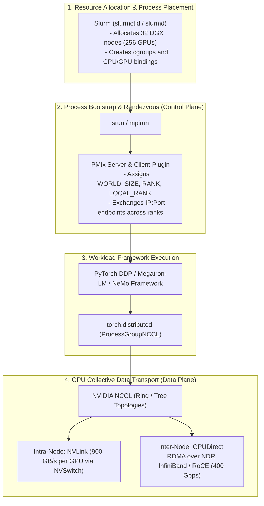
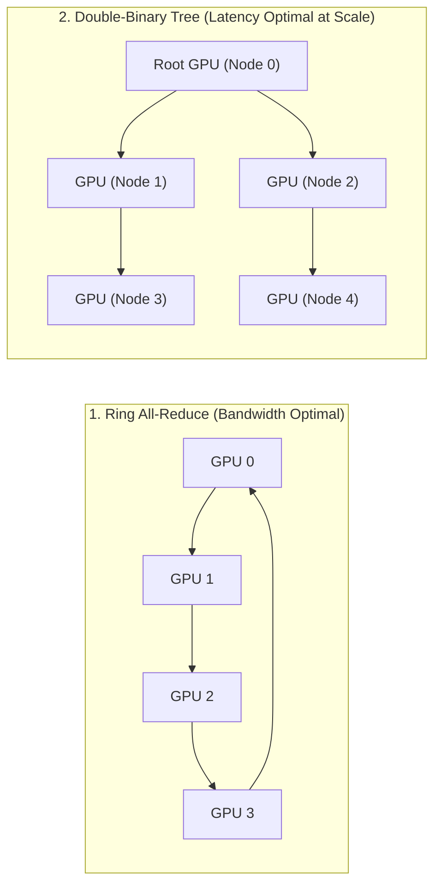

# Chapter 7 — MPI, PMIx, and Distributed Collective Communication

**Learning outcome:** Master the complete distributed communication stack of an NVIDIA AI Factory. You will learn to architect and troubleshoot the control plane (Process Management Interface Exascale - PMIx, Slurm) and the data plane (NVIDIA Collective Communications Library - NCCL, GPUDirect RDMA over InfiniBand/RoCEv2). You will configure highly optimized NUMA-aware process bindings, tune OpenMPI `MCA` parameters, manipulate NCCL topology variables, and debug complex multi-node scaling regressions using `strace`, fabric counters, and NCCL debug logs.

**Prerequisites:** Solid understanding of Linux networking, basic GPU architecture, Slurm workload management, and PyTorch/Megatron-LM distributed training concepts.

**Difficulty:** Beginner to Advanced.

**Estimated reading time:** 120 minutes plus hands-on debugging practice.

---

## 1. Foundations: The Evolution of Distributed Message Passing

In traditional High-Performance Computing (HPC) and modern AI Distributed Training, a single compute node is rarely sufficient to solve complex problems. When a deep learning model exceeds the memory capacity of a single GPU (e.g., a 175B parameter LLM requiring 800GB of VRAM just for weights), or when training time on a single node exceeds practical limits, the workload must be distributed across hundreds or thousands of GPUs.

Orchestrating thousands of independent processes across a network requires standardized mechanisms for process synchronization, identity assignment, and data exchange. 

### 1.1 What is MPI?

The **Message Passing Interface (MPI)** is a standardized API and protocol designed to function on parallel computing architectures. Developed in the 1990s, MPI remains the lingua franca for distributed computing.

In an MPI environment, a distributed job consists of multiple independent processes executing the same (or different) code simultaneously. MPI provides the functions for these processes to communicate over high-speed networks.

### 1.2 Core MPI Concepts: Ranks, Size, and Communicators

To operate an AI cluster, you must understand the vocabulary of MPI:

1. **MPI_COMM_WORLD (Communicator):** The default global communication domain encompassing all processes in the distributed job. If you launch a job on 64 nodes with 8 GPUs each, `MPI_COMM_WORLD` contains 512 processes.
2. **Size (World Size):** The total number of processes in a communicator. In our example, the size is 512.
3. **Rank:** A unique integer identifier assigned to each process within a communicator, ranging from `0` to `Size - 1`. Rank 0 (often called the "Master" or "Root" rank) typically handles centralized tasks like broadcasting initial model weights, aggregating loss metrics, and writing checkpoints to disk.
4. **Local Rank:** The intra-node identifier. On an 8-GPU node, the Local Ranks will always be `0` through `7`, regardless of the global Rank. The Local Rank is critical for binding a process to its physically adjacent GPU (e.g., Local Rank 3 claims GPU 3).

### 1.3 Point-to-Point vs. Collective Communication

MPI defines two primary modalities for moving data:

**Point-to-Point (P2P):**
- Involves exactly two processes: a Sender and a Receiver.
- Functions: `MPI_Send()`, `MPI_Recv()`.
- *AI Context:* Used in Pipeline Model Parallelism (PP) where the output activations of one pipeline stage (Rank X) are sent directly to the next stage (Rank Y).

**Collective Communication:**
- Involves all processes within a communicator simultaneously.
- Functions: `MPI_Bcast()` (Broadcast), `MPI_Reduce()`, `MPI_Allreduce()`, `MPI_Allgather()`.
- *AI Context:* Used in Data Parallelism (DP) and Tensor Parallelism (TP) where gradients must be summed across all GPUs (All-Reduce) or partial weights must be gathered (All-Gather).

### 1.4 The CPU-Centric Legacy of MPI

While MPI is foundational, traditional implementations (like OpenMPI or MPICH) were optimized for CPU-to-CPU communication over standard networks or legacy InfiniBand. In traditional MPI, moving data from GPU 0 on Node A to GPU 0 on Node B required copying the data from the GPU to the CPU, sending it over the network to Node B's CPU, and finally copying it to Node B's GPU.

This host-staging bottleneck is fundamentally incompatible with modern AI workloads demanding Terabytes per second of bandwidth. Consequently, the AI industry bifurcated the distributed stack: **MPI/PMIx now handles the Control Plane, while NVIDIA NCCL handles the GPU Data Plane.**

---

## 2. The Fabric Layer: InfiniBand, RoCEv2, and GPUDirect RDMA

Before processes can communicate, the physical data center fabric must support deterministic, lossless, high-bandwidth transport. Standard TCP/IP networking relies on the operating system kernel to process network packets, resulting in high latency, CPU overhead, and jitter—fatal characteristics for tightly coupled synchronous AI training.

### 2.1 Remote Direct Memory Access (RDMA)

**RDMA** is a technology that allows a network interface card (NIC) to read and write directly to the memory of a remote machine without involving the remote machine's OS kernel or CPU. 

**Benefits of RDMA for AI:**
- **Zero-Copy:** Data moves directly from network hardware into application memory buffers.
- **Kernel Bypass:** No context switches or TCP stack processing.
- **Microsecond Latency:** Crucial for massive scale synchronous collective operations.

### 2.2 InfiniBand vs. RoCEv2

NVIDIA AI Factories utilize one of two RDMA-capable fabric protocols:

**1. InfiniBand (IB):**
- A purpose-built, inherently lossless networking standard.
- Uses a centralized **Subnet Manager (SM)** (e.g., OpenSM, UFM) to discover topology, compute routing tables, and distribute them to switches.
- Guarantees lossless transport via credit-based flow control at the link layer.
- Hardware: NVIDIA Quantum-2 (NDR 400Gbps) or Quantum-3 (XDR 800Gbps) switches, ConnectX-7/ConnectX-8 HCAs (Host Channel Adapters).

**2. RoCEv2 (RDMA over Converged Ethernet):**
- Encapsulates InfiniBand transport headers inside standard UDP/IP Ethernet packets.
- Allows AI clusters to use standard Ethernet switches (e.g., NVIDIA Spectrum-4, Arista, Cisco).
- **CRITICAL REQUIREMENT:** Standard Ethernet is inherently "lossy" (it drops packets under congestion). To emulate InfiniBand's lossless nature, RoCEv2 strictly requires:
  - **Priority Flow Control (PFC):** Prevents buffer overruns by sending "PAUSE" frames.
  - **Explicit Congestion Notification (ECN):** Marks packets during mild congestion so endpoints slow down transmission rates (DCQCN algorithm).

### 2.3 GPUDirect RDMA (GDR)

**GPUDirect RDMA** represents the ultimate optimization for multi-node GPU communication. It enables the Host Channel Adapter (HCA) to directly access the GPU's High Bandwidth Memory (HBM) over the PCIe bus or NVLink switch, completely bypassing the host CPU's system memory.

When NCCL executes an All-Reduce operation across nodes:
1. GPU 0 (Node A) stages a tensor in its HBM.
2. The local ConnectX-7 HCA reads the tensor directly from GPU 0's HBM via PCIe/NVLink.
3. The HCA transmits the data across the InfiniBand/RoCE fabric via RDMA.
4. The remote ConnectX-7 HCA (Node B) writes the data directly into GPU 0's HBM on Node B.

If GPUDirect RDMA fails or falls back to system memory, distributed training throughput will instantly collapse by 80-90%.

---

## 3. The Modern AI Execution Stack: Slurm, PMIx, and NCCL

A production NVIDIA SuperPOD decouples the responsibilities of scheduling, bootstrapping, and data movement.



### 3.1 Slurm Workload Manager

Slurm is the master orchestrator. Its responsibilities are strictly limited to the **Control Plane**:
- Evaluating job requirements (e.g., `sbatch --nodes=64 --gpus-per-node=8`).
- Finding contiguous available nodes in the topology.
- Reserving the resources and isolating them using Linux `cgroups` to prevent "noisy neighbor" interference.
- Spawning the local daemon `slurmstepd` on each allocated compute node.

### 3.2 PMIx (Process Management Interface Exascale)

In the early days of MPI, launching a 10,000-process job involved the root node opening 10,000 SSH connections to execute commands, leading to "boot storms" that took over 30 minutes just to start a job.

**PMIx** solves this by establishing a scalable wire protocol for process bootstrap:
1. `srun` issues a launch command to the local Slurm daemons across the cluster.
2. The processes launch almost instantly.
3. Each process links against the `libpmix.so` library.
4. When PyTorch calls `torch.distributed.init_process_group()`, the PMIx client connects to the local `slurmstepd` via a UNIX domain socket.
5. All processes publish their IP addresses and listener ports to a distributed Key-Value (KV) store managed by PMIx.
6. Slurm/PMIx uses a tree-based communication algorithm to instantly distribute the KV store to all nodes.
7. Within milliseconds, all 10,000 ranks know the IP addresses and endpoints of every other rank.

### 3.3 NVIDIA NCCL

Once PMIx has successfully exchanged the endpoints (the "rendezvous" phase), the Control Plane steps back. PyTorch hands over the execution of collective operations to **NCCL**. 

NCCL constructs its own high-speed communication rings and trees, probing the hardware to detect NVLink, PCIe switches, and ConnectX HCAs. From this point forward, the GPU Data Plane is completely isolated from Slurm and PMIx.

---

## 4. Deep Dive into Process Launch Mechanisms

As a Solutions Architect, you must be fluent in translating user requirements into optimized launch scripts. There are multiple ways to launch a distributed job, each with profound implications for scalability and reliability.

### 4.1 The Native HPC Standard: `srun --mpi=pmix`

This is the most scalable, native method for launching distributed AI workloads on a bare-metal SuperPOD. It tightly couples process execution with the Slurm orchestrator.

```bash
#!/bin/bash
#SBATCH --job-name=llama-70b-pretrain
#SBATCH --nodes=64
#SBATCH --ntasks-per-node=8        # One task (process) per GPU
#SBATCH --gpus-per-node=8          # 8 GPUs per node
#SBATCH --cpus-per-task=14         # 14 CPU cores per GPU process
#SBATCH --partition=h100-cluster
#SBATCH --exclusive                # Dedicated node access

# srun inherits the SBATCH environment variables
srun --mpi=pmix      --kill-on-bad-exit=1      python3 /workspace/train.py      --global-batch-size 1024      --tensor-model-parallel-size 8      --pipeline-model-parallel-size 4
```

**Why this is superior at scale:**
- No SSH dependencies.
- Native integration with PMIx for instantaneous rank rendezvous.
- `--kill-on-bad-exit=1`: If Rank 432 crashes due to an Out of Memory (OOM) error, `srun` immediately terminates all other 511 ranks. Without this, the other ranks will hang infinitely waiting for Rank 432 to participate in the next All-Reduce, wasting thousands of dollars in idle GPU time.

### 4.2 The Legacy Standard: `mpirun` (OpenMPI / HPC-X)

Many environments (especially those lacking Slurm, like plain Kubernetes or bare-metal SSH clusters) rely on standard `mpirun` or `mpiexec`. NVIDIA distributes highly optimized versions of OpenMPI within the HPC-X toolkit.

```bash
# Example mpirun launch across two nodes over SSH
mpirun -np 16        -hostfile /opt/cluster/hosts.txt        -bind-to none -map-by slot        -x NCCL_DEBUG=INFO        -x LD_LIBRARY_PATH        -x PATH        -mca pml ob1 -mca btl ^openib        -mca btl_tcp_if_include enp1s0f0        python3 train.py
```

**Understanding the `mpirun` flags:**
- `-np 16`: Number of total processes (Ranks).
- `-hostfile`: Text file listing node hostnames or IPs.
- `-bind-to none`: Prevents OpenMPI from applying default restrictive CPU bindings, allowing PyTorch's native data loaders to utilize multiple threads.
- `-x <ENV_VAR>`: Explicitly exports local environment variables to the remote nodes. (Crucial! Without `-x`, your remote processes will not receive `NCCL_DEBUG=INFO`).
- `-mca`: Modular Component Architecture flags (covered in depth in Section 7).

### 4.3 The Cloud-Native Standard: `torchrun`

AI researchers commonly use `torchrun` (part of PyTorch `c10d`), which provides fault-tolerant elastic capabilities independent of MPI. 

```bash
# Node 0 (Master) execution
torchrun --nnodes=64          --nproc_per_node=8          --rdzv_id=job_123          --rdzv_backend=c10d          --rdzv_endpoint=10.100.1.10:29500          --node_rank=0          train.py

# Node 1 execution
torchrun --nnodes=64          --nproc_per_node=8          --rdzv_id=job_123          --rdzv_backend=c10d          --rdzv_endpoint=10.100.1.10:29500          --node_rank=1          train.py
```

**Architectural Warning on `torchrun`:**
While `torchrun` is flexible, the `c10d` default TCP rendezvous backend requires all nodes to register with Node 0 via a standard TCP connection. At massive scale (>2,000 ranks), this creates a severe network boot-storm and socket exhaustion on Node 0. For enterprise deployments, always transition from `torchrun` to `srun --mpi=pmix` when crossing the 32-node threshold.

---

## 5. CPU Core and GPU NUMA Affinity

On modern accelerated servers, hardware locality is paramount. 
Consider a dual-socket system (e.g., DGX H100 or AWS p5.48xlarge):
- CPU Socket 0 (NUMA Node 0) manages GPUs 0-3 and Network HCAs 0-3.
- CPU Socket 1 (NUMA Node 1) manages GPUs 4-7 and Network HCAs 4-7.

These two CPU sockets are connected by a relatively narrow interconnect (Intel UPI or AMD Infinity Fabric), typically offering 64 GB/s of bandwidth. 

If Rank 0 (assigned to GPU 0 on Socket 0) executes a Python data loader process that is inadvertently scheduled by the OS onto CPU Socket 1, every memory access must cross the UPI link. More critically, if GPUDirect RDMA is misconfigured, GPU collective traffic may be routed across the UPI link. An NVLink domain operates at 900 GB/s; bottlenecking it with a 64 GB/s UPI link instantly destroys training scaling.

### 5.1 Enforcing Strict Hardware Binding with Slurm

To guarantee absolute locality, you must configure Slurm to pin processes to specific CPU cores mapped to specific GPUs.

```bash
# Correctly binding processes to NUMA domains
srun --mpi=pmix      --cpu-bind=cores      --accel-bind=g      python3 train.py
```

**Deep Dive into Binding Parameters:**
- `--cpu-bind=cores`: Forces `srun` to lock the task to specific physical CPU cores using Linux `cgroups` and `taskset`. The OS scheduler is strictly forbidden from migrating the PyTorch process to a different core, preventing L3 cache invalidation.
- `--accel-bind=g`: The "magic" parameter. Slurm probes the server's hardware topology via `hwloc`, identifies which CPU cores are physically adjacent to which GPUs across the PCIe switches, and strictly binds the task to that optimal pairing.

### 5.2 Validating Binding via `numactl`

To verify your bindings are correct in production, you can wrap your Python script with a diagnostic output:

```bash
# Create a wrapper script: launch.sh
echo "Rank $SLURM_PROCID on $(hostname) bound to:"
numactl --show | grep "physcpubind"
exec "$@"

# Run via srun
srun --mpi=pmix ./launch.sh python3 train.py
```

If binding is successful, you will see output proving that Local Rank 0 is bound to cores 0-15, Local Rank 1 to cores 16-31, and so forth, perfectly aligned with the NUMA topology.

---

## 6. NVIDIA NCCL Mastery: Data Plane Execution

The NVIDIA Collective Communications Library (NCCL, pronounced "Nickel") is the beating heart of AI factories. It is a topology-aware library that dynamically constructs optimized data transfer graphs.

### 6.1 Understanding Topology Discovery

When a PyTorch distributed job initializes, NCCL performs an exhaustive topological hardware scan. 

1. **Intra-Node Discovery:** NCCL parses `/sys/class/pci_bus/` and uses NVML to discover the exact layout of GPUs, NVSwitches, and PCIe PLX bridges.
2. **Inter-Node Discovery:** NCCL queries the network interfaces, identifying InfiniBand HCAs (e.g., `mlx5_0`, `mlx5_1`). It matches HCAs to GPUs based on PCIe locality.
3. **Graph Synthesis:** NCCL synthesizes an internal graph model and calculates the optimal routing path for tensors. If it detects an NVSwitch, it routes traffic through NVLink. If it detects ConnectX-7, it enables GPUDirect RDMA.

### 6.2 Ring vs. Tree Collective Algorithms

NCCL employs different algorithmic topologies based on message size, total rank count, and detected hardware bandwidth.



**1. Ring All-Reduce:**
- **Mechanism:** Each rank divides the gradient tensor into *N* chunks. In the first phase (Reduce-Scatter), chunks are passed circularly; each rank receives a chunk, adds its own local chunk, and passes it forward. In the second phase (All-Gather), the fully summed chunks are distributed around the ring.
- **Bandwidth Utilization:** Nearly 100% of link capacity.
- **Scaling:** Operates optimally on moderate rank counts (up to 256 GPUs). Large tensors dominate.

**2. Double-Binary Tree All-Reduce:**
- **Mechanism:** Nodes are structured as a hierarchy. Data is reduced (summed) up the tree to the root node, and then broadcast back down the branches.
- **Latency Advantage:** Completes in $O(\log N)$ steps compared to the Ring's $O(N)$ steps. 
- **Scaling:** Crucial for massive scale (e.g., 4,096+ GPUs) or for very small message sizes (like Mixture of Experts metadata) where network latency outweighs pure bandwidth constraints.

### 6.3 Essential NCCL Environment Variables

A Senior AI Infrastructure Engineer must master NCCL environment variables to tune performance and debug fabric failures.

| Environment Variable | Purpose | AI Factory Production Value | Troubleshooting Use Case |
|---|---|---|---|
| `NCCL_DEBUG` | Sets the logging verbosity level. | `VERSION` (Default) | Set to `INFO` for debugging hangs, crashes, or bandwidth drops. |
| `NCCL_DEBUG_SUBSYS` | Filters debug logs to specific subsystems. | Unset | `INIT,GRAPH,ENV,NET` to isolate topology discovery vs network fabric issues. |
| `NCCL_IB_HCA` | Explicitly targets specific InfiniBand devices. | `mlx5_0,mlx5_1,...` or `=mlx5_0:1` | Force NCCL to ignore management ethernet interfaces and strictly use RDMA fabrics. |
| `NCCL_IB_GID_INDEX` | Selects the RoCEv2 routing GID. | `3` (Standard RoCEv2 UDP) | Must be set to 3 in Ethernet environments; otherwise packets lack PFC tags. |
| `NCCL_NET_GDR_LEVEL` | Determines how aggressively GPUDirect RDMA traverses PCIe switches. | `5` or `MAX` | `5` enables GDR across NVSwitch hops; if set to 0, GDR is disabled. |
| `NCCL_P2P_DISABLE` | Disables intra-node NVLink/PCIe peer-to-peer. | `0` (Must be enabled) | Set to `1` temporarily to isolate faulty NVLink hardware causing data corruption (XIDs). |
| `NCCL_ALGO` | Forces NCCL to use a specific collective algorithm. | Unset (Auto) | Set to `Ring` or `Tree` to benchmark specific topology performance. |

**Code Example: A Fully Optimized NCCL Slurm Launch:**
```bash
export NCCL_DEBUG=INFO
export NCCL_IB_HCA="=mlx5_0,mlx5_1,mlx5_2,mlx5_3,mlx5_4,mlx5_5,mlx5_6,mlx5_7"
export NCCL_IB_GID_INDEX=3
export NCCL_IB_TC=106            # Maps traffic to Lossless QoS queue via DSCP
export NCCL_NET_GDR_LEVEL=5
export NCCL_SOCKET_IFNAME=bond0  # Control plane bootstrap via bonded Ethernet

srun --mpi=pmix python3 /workspace/train.py
```

---

## 7. Advanced Tuning: OpenMPI and HPC-X (`OMPI_MCA`)

When operating outside of PMIx/Slurm, NVIDIA HPC-X (an optimized downstream distribution of OpenMPI) relies heavily on the **Modular Component Architecture (MCA)**. MCA allows dynamic loading and configuration of network transports at runtime.

An `mpirun` command often contains dozens of `-mca` flags required to force traffic over InfiniBand rather than standard TCP.

### 7.1 Key OpenMPI MCA Parameters

1. **Byte Transfer Layer (BTL):** Handles low-level message transport.
   - `-mca btl ^openib`: Instructs OpenMPI to **disable** the legacy `openib` BTL. Modern NVIDIA stacks use the UCX (Unified Communication X) framework instead.
   - `-mca btl_tcp_if_include bond0`: Restricts TCP control traffic strictly to the management interface.

2. **Point-to-Point Management Layer (PML):** Manages message fragmentation and scheduling.
   - `-mca pml ucx`: Forces MPI to use the modern, highly optimized UCX library for data transport.

3. **Collective (COLL):** Manages collective algorithms.
   - `-mca coll_hcoll_enable 1`: Enables Hardware Collectives (HCOLL), allowing modern ConnectX HCAs and Quantum switches to perform mathematical reductions (like `SUM`) directly on the network ASIC, entirely bypassing the host CPU and GPU.

### 7.2 The Ultimate HPC-X Launch Command

A production bare-metal cluster without Slurm requires extensive explicit configuration:

```bash
mpirun -np 256        --hostfile /etc/opt/cluster/hosts.txt        --bind-to none        --map-by slot        -x LD_LIBRARY_PATH        -x NCCL_DEBUG=INFO        -x NCCL_IB_HCA=mlx5_0,mlx5_1        -mca pml ucx        -mca btl ^openib,smcuda        -mca btl_tcp_if_include ens1f0        -mca coll_hcoll_enable 0        -mca plm_rsh_no_tree_spawn 1        -mca routed_radix 256        python3 megatron_pretrain.py
```
*Note: `-mca routed_radix 256` prevents the default binary tree SSH spawn from timing out on large clusters by flattening the launch hierarchy.*

---

## 8. Profiling and Diagnostics: Data Plane Telemetry

Diagnosing distributed AI workloads requires tracing tools capable of penetrating deep into the execution stack. 

### 8.1 Using `strace` to Detect Topology Probing

If a job initializes slowly (taking 15+ minutes to start), NCCL might be struggling to parse a highly complex or misconfigured `/sys` filesystem tree. By attaching `strace` to the `srun` job, we can observe NCCL's hardware discovery in real time.

```bash
# Wrap the python execution in strace to log system calls
srun --mpi=pmix strace -tt -e trace=open,openat,read -o strace_nccl_%t.log python3 train.py

# Analyzing the output:
$ grep "/sys/class/pci_bus" strace_nccl_*.log | head -n 5
10:45:01.123456 openat(AT_FDCWD, "/sys/class/pci_bus/0000:80/device/numa_node", O_RDONLY) = 3
10:45:01.123500 read(3, "0\n", 4096) = 2
```
*Explanation:* The output proves NCCL successfully read the NUMA node binding (`0`) for the PCIe bridge located at `0000:80`. If `strace` shows continuous `ENOENT` (File not found) errors, the container environment may lack the proper volume mounts for `/sys`, blinding NCCL to the underlying hardware topology.

### 8.2 NVIDIA Nsight Systems (`nsys`)

To visualize the interplay between GPU compute kernels and NCCL network transfers, NVIDIA provides Nsight Systems.

```bash
# Profile the rank and capture MPI/NCCL API calls and CUDA activity
srun --mpi=pmix      nsys profile --trace=cuda,mpi,nvtx,osrt      --output=megatron_trace_%q{SLURM_PROCID}      --force-overwrite=true      python3 train.py
```

When opened in the Nsight Systems GUI, you will see a detailed timeline. Look for:
- **Compute-Comm Overlap:** A well-optimized AI workload should show NCCL network transfers executing simultaneously with PyTorch backpropagation compute kernels.
- **Stalls:** Large gaps in the timeline with no CUDA activity usually indicate an MPI Barrier wait, meaning one slow node (a "straggler") is delaying the entire cluster synchronization.

---

## 9. Senior Solutions Architect Troubleshooting Scenarios

As a Senior AI Platform Engineer, your core value is demonstrated when the cluster degrades and multi-million dollar training runs stall.

### Scenario 1: The Multi-Node Initialization Hang

**The Incident:** 
A 128-node job is submitted via Slurm. The application prints `[Rank 0] Initializing Distributed Environment...` and then hangs indefinitely. Node 0 is idling at 0% CPU. GPUs are cold.

**The Diagnosis & Remediation:**
1. **Understand the Choke Point:** The hang occurs during the Control Plane rendezvous phase. PyTorch is waiting for PMIx or the `c10d` TCP store to exchange endpoints.
2. **Verify Process Survival:** Run `squeue`. Check if the job state is `R` (Running) and that all 128 nodes are active. Run `srun --jobid <ID> --ntasks=128 hostname` to ensure no nodes are in a zombie state due to corrupted OS kernels.
3. **Inspect the Bootstrap Network (`NCCL_SOCKET_IFNAME`):** By default, NCCL attempts to guess the best Ethernet interface for exchanging initial TCP metadata. If Node A chooses a `docker0` interface (e.g., IP `172.17.0.1`) and Node B chooses a physical interface (e.g., IP `10.100.1.10`), they can never route to each other.
4. **The Fix:** Explicitly force the control plane interface in the `sbatch` script:
   `export NCCL_SOCKET_IFNAME=bond0` (or the known routable management interface).

### Scenario 2: Catastrophic Performance Regression (Bandwidth Collapse)

**The Incident:**
A benchmarking script normally reports 380 GB/s All-Reduce bus bandwidth across 16 nodes. Suddenly, it drops to 45 GB/s. Training step time increases from 2.5 seconds to 18 seconds.

**The Diagnosis & Remediation:**
1. **Identify the Symptom:** 45 GB/s matches the exact memory bandwidth limit of dual-socket Intel/AMD host CPUs crossing the PCIe bus. This indicates **GPUDirect RDMA has catastrophically failed**. Tensors are being routed from the GPU, up through the CPU system memory, and then down to the NIC.
2. **Check the NCCL Logs:** 
   Enable `export NCCL_DEBUG=INFO`. You will likely see the following critical warning:
   `NCCL INFO NET/IB : GPU Direct RDMA Disabled for HCA mlx5_0 (no peermem)`
3. **Verify the Peer Memory Driver:**
   GPUDirect RDMA requires a kernel module to map GPU physical memory to the InfiniBand NIC. SSH into a worker node and run:
   `lsmod | grep nv_peer_mem` or `lsmod | grep nvidia_peermem`.
   If the output is empty, the driver failed to load during a recent OS patch or kernel update.
4. **Check PCIe ACS (Access Control Services):**
   If `peermem` is loaded but speeds are still low, check the BIOS. If `PCIe ACS` (IOMMU isolation) is enabled, the PCIe PLX switches are physically forbidden from routing peer-to-peer traffic between the NIC and GPU, forcing all traffic up to the CPU root complex. ACS must be disabled in the BIOS for AI Factory nodes.

### Scenario 3: InfiniBand Congestion and PFC Storms

**The Incident:**
Training is running fine for hours, but periodically step times spike from 2 seconds to 45 seconds, causing timeouts. The network telemetry dashboard shows massive packet drops.

**The Diagnosis & Remediation:**
1. **Isolate Fabric Congestion:** On RoCEv2 networks, lossy Ethernet requires Priority Flow Control (PFC) to prevent buffer drops. If a single degraded server reads from the network slower than it receives (due to CPU throttling or PCIe errors), it issues a PFC "PAUSE" frame to the switch. 
2. **The Congestion Spreading Effect:** The Top of Rack (ToR) switch's buffers fill up, causing it to send PAUSE frames to the Core switches. Within milliseconds, the entire 400Gbps fabric pauses. This is known as a **PFC Storm**.
3. **Inspect Hardware Counters:**
   Run the Mellanox command on a suspected node:
   `ethtool -S ens5f0 | grep -i pause` or `mlnx_qos -i ens5f0`.
   If `rx_pause_frames` is incrementing rapidly into the millions, this specific node is the congestion victim/source.
4. **The Fix:** Implement PFC Watchdog on the switches. If a port holds a PAUSE state for more than 500ms, the switch should automatically drop the packets and reset the queue rather than halting the entire multi-million dollar data center fabric.

---

## 10. Conclusion and Architectural Summary

Mastering MPI, PMIx, and NCCL fundamentally changes your capability from managing individual servers to architecting true Supercomputers. 

1. **MPI vs. NCCL Divide:** Never confuse the Control Plane with the Data Plane. PMIx and Slurm launch the processes and exchange IPs; NCCL completely owns the high-bandwidth GPU collective transport.
2. **Hardware Locality is Absolute:** `numactl`, `hwloc`, and strict Slurm bindings (`--cpu-bind=cores --accel-bind=g`) are not optional. Misaligned NUMA boundaries destroy GPUDirect RDMA performance.
3. **Debug Systematically:** When the cluster hangs, follow the execution chain: Did the processes launch? (Slurm/PMIx) -> Did they find each other's IPs? (`NCCL_SOCKET_IFNAME`) -> Did they construct a valid hardware ring/tree? (`NCCL_DEBUG=INFO`) -> Are the packets physically dropping? (InfiniBand/RoCE counters).
4. **Trust GPUDirect RDMA:** The ultimate goal of every configuration parameter is to keep data off the CPU and exclusively moving between GPU High Bandwidth Memory and InfiniBand/RoCE Host Channel Adapters.

By applying these architectural principles, you ensure that NVIDIA AI Factories operate at maximum utilization, scaling seamlessly from 8 GPUs to 100,000 GPUs without compromise.


---

## Appendix A: Exhaustive NCCL Environment Variable Reference Matrix

As a reference for production environments, here is an exhaustive matrix of critical NCCL tuning parameters for deep architectural manipulation.

### A.1 Network and Fabric Targeting
* `NCCL_IB_HCA`: String. (e.g. `mlx5_0,mlx5_1`). Forces NCCL to use specified InfiniBand devices. Use prefix `=` (e.g. `=mlx5_0`) to mandate exact matches.
* `NCCL_IB_TIMEOUT`: Integer. Defaults to 14. Adjusts InfiniBand retry timeout. Increasing to 22 can survive minor link flaps in massive topologies without crashing the job.
* `NCCL_IB_RETRY_CNT`: Integer. Defaults to 7. Number of times to retry a failed IB transaction before throwing a fatal error.
* `NCCL_IB_GID_INDEX`: Integer. Critical for RoCEv2. Set to `3` for typical IPv4 UDP encapsulation ensuring PFC QoS DSCP markings function correctly.
* `NCCL_IB_SL`: Integer. Service Level. Maps IB traffic to a specific QoS Virtual Lane. Essential for multi-tenant fabrics.
* `NCCL_IB_TC`: Integer. Traffic Class. Applies DSCP values to RoCE IP headers.
* `NCCL_IB_AR_THRESHOLD`: Integer. Adaptive Routing threshold. Enables IB Adaptive Routing for packets exceeding this size (often 8192 bytes).
* `NCCL_IB_QPS_PER_CONNECTION`: Integer. Number of Queue Pairs (QPs) per connection. Default 1. Can be increased to 4 or 8 to saturate 400G/800G links for massive tensors.
* `NCCL_IB_PCI_RELAXED_ORDERING`: Integer. (0 or 1). Enables PCIe relaxed ordering. Significantly improves memory write bandwidth on modern architectures by allowing out-of-order DMA writes.
* `NCCL_NET_GDR_LEVEL`: Integer/String. Controls GPUDirect RDMA. Set to `0` to disable. Set to `1` (or `SYS`) to enable over system bus. Set to `5` (or `MAX`) to force NVLink/PCIe switch traversal.
* `NCCL_SOCKET_IFNAME`: String. Binds control TCP sockets to specific interfaces (e.g., `eth0`, `bond0`, `enp*`). Use `^docker0,lo` to explicitly exclude virtual interfaces.

### A.2 Topology and Algorithm Control
* `NCCL_ALGO`: String. `Tree`, `Ring`, `CollNet`. Forces a specific collective algorithm.
* `NCCL_PROTO`: String. `LL`, `LL128`, `Simple`. 
  - `LL` (Low Latency): Used for very small messages.
  - `LL128`: 128-byte optimized low latency.
  - `Simple`: Standard bulk data transfer.
* `NCCL_TOPO_FILE`: String. Path to a custom XML topology file. Allows architects to override NCCL's auto-discovery if the hypervisor or container masks true hardware PCIe topologies.
* `NCCL_P2P_DISABLE`: Integer. (0 or 1). If 1, disables direct GPU-to-GPU peer-to-peer (NVLink/PCIe), forcing all traffic through host memory. Used purely for debugging hardware faults.
* `NCCL_SHM_DISABLE`: Integer. (0 or 1). If 1, disables POSIX shared memory (`/dev/shm`) fallback for intra-node communication.
* `NCCL_GRAPH_FILE`: String. Dumps the synthesized XML topology graph to disk for manual inspection. `NCCL_GRAPH_FILE=topo.xml`.

### A.3 Debugging and Profiling
* `NCCL_DEBUG`: String. `VERSION`, `WARN`, `INFO`, `TRACE`. Base logging level.
* `NCCL_DEBUG_SUBSYS`: String. `INIT`, `COLL`, `P2P`, `SHM`, `NET`, `GRAPH`, `TUNING`, `ENV`, `ALL`. Filters massive log output.
* `NCCL_DEBUG_FILE`: String. Redirects output from stdout/stderr to a specific file template (e.g. `nccl_debug_%h_%p.log` where %h is hostname, %p is PID).

## Appendix B: Comprehensive OpenMPI MCA Parameter Glossary

When configuring `mpirun` for bare-metal systems, the Modular Component Architecture (MCA) requires exhaustive tuning.

### B.1 Frameworks
* `btl` (Byte Transfer Layer): Point-to-point byte movement (tcp, openib, sm).
* `pml` (Point-to-Point Management Layer): High-level message fragmentation (ucx, ob1).
* `coll` (Collective): Collective operations (hcoll, tuned, basic).
* `plm` (Process Lifecycle Management): Daemon launch execution (rsh, slurm).

### B.2 Critical Tunables
* `-mca pml ucx`: Delegates point-to-point transport to the modern Unified Communication X framework (NVIDIA's preferred modern transport).
* `-mca btl ^openib`: Disables the legacy OpenFabrics Verbs driver (prevents conflicts with UCX).
* `-mca btl_tcp_if_include <interface>`: Restricts fallback TCP traffic to a specific subnet or interface.
* `-mca btl_tcp_if_exclude <interface>`: Prevents OpenMPI from attempting to route traffic over loopback (`lo`) or Docker bridges (`docker0`).
* `-mca coll_hcoll_enable 1`: Enables Hardware Collectives via Mellanox SHARP (Scalable Hierarchical Aggregation and Reduction Protocol).
* `-mca coll_hcoll_np 128`: Sets the threshold (number of processes) above which HCOLL is activated.
* `-mca plm_rsh_agent "ssh -q -o StrictHostKeyChecking=no"`: Streamlines the SSH launch process, preventing manual key confirmation prompts from hanging automated pipeline launches.
* `-mca plm_rsh_no_tree_spawn 1`: Forces a flat SSH launch instead of a tree spawn. Resolves intermittent timeouts during massive job initialization on slow management networks.
* `-mca routed_radix 1024`: Increases the radix of the routing tree to handle larger clusters without generating excessive hop delays during startup.

## Appendix C: Deep Dive into PCIe Architecture and Switch Topologies

To truly understand GPUDirect RDMA, one must visualize the motherboard topologies of an AI server.

### C.1 The PCIe Switch
Modern DGX servers do not connect GPUs directly to the CPU's PCIe root complex. Instead, they use internal PCIe switches (often PLX chips). 
- GPU 0, GPU 1, NIC 0, and NIC 1 might all connect to PCIe Switch A.
- Switch A connects upstream to CPU Socket 0.
When NCCL routes traffic from GPU 0 to NIC 0, GPUDirect RDMA allows the data to flow **down** from the GPU to Switch A, and immediately **across** to NIC 0. The data never traverses the upstream link to the CPU.

### C.2 IOMMU and Access Control Services (ACS)
The Input-Output Memory Management Unit (IOMMU) translates device virtual addresses to physical memory addresses. For security in virtualized cloud environments (like AWS or Azure), the hypervisor relies on PCIe ACS to force all device-to-device traffic up to the IOMMU (located on the CPU die) to check permissions.
If ACS is enabled on bare-metal systems, peer-to-peer routing at the PCIe switch level is blocked. Data is forced to travel up to the CPU, instantly saturating the upstream PCIe lane and destroying RDMA bandwidth.
For an NVIDIA AI Factory to operate at peak efficiency, the BIOS must explicitly disable PCIe ACS on the compute lanes, entrusting security to the orchestrator layer (Slurm).

## Appendix D: Simulating Network Failures (Chaos Engineering)

To validate alerting and monitor cluster resilience, SREs frequently inject targeted failures.

**1. Injecting Link Flaps (Port Toggle):**
Use Mellanox tools to simulate a dirty optics cable or failing switch port:
```bash
# Bring down a physical IB link
ibportstate 1 1 disable
# Wait 3 seconds
sleep 3
# Bring it back up
ibportstate 1 1 enable
```
Observe how NCCL reacts. With `NCCL_IB_RETRY_CNT=7` and `NCCL_IB_TIMEOUT=14`, the training job should stall, print warnings, and automatically resume once the link recovers. If the timeout is too low, PyTorch will crash with a fatal `DistBackendError`.

**2. Injecting PCIe Errors (AER):**
Advanced Error Reporting (AER) handles correctable hardware errors on the PCIe bus. Excessive AERs indicate failing riser cables or overheated GPUs.
Monitor AERs via `dmesg`:
```bash
dmesg -w | grep -i AER
```
A continuous flood of AER logs will saturate the host OS CPU, dropping network packets and triggering PFC storms across the fabric.

## Appendix E: The Role of PyTorch `torch.distributed`

While NCCL handles the hardware, `torch.distributed` is the Python user interface.

**ProcessGroup Initialization:**
```python
import torch
import torch.distributed as dist

# The typical initialization sequence
dist.init_process_group(
    backend='nccl',     # Use NCCL for GPU operations
    init_method='env://' # Rely on environment variables (MASTER_ADDR, MASTER_PORT)
)

local_rank = int(os.environ["LOCAL_RANK"])
torch.cuda.set_device(local_rank)

print(f"Rank {dist.get_rank()} of {dist.get_world_size()} initialized.")
```
**Asynchronous Collectives:**
By default, `dist.all_reduce` is synchronous. For advanced optimizations, developers use `async_op=True`:
```python
# Dispatch the transfer to the NCCL stream
handle = dist.all_reduce(gradient_tensor, op=dist.ReduceOp.SUM, async_op=True)

# Execute independent computation while data transfers
compute_local_loss()

# Wait for the network transfer to finish
handle.wait()
```
This enables the critical **Compute-Communication Overlap** visualized in Nsight Systems traces.


## Appendix F: Extended Glossary and Metric Tracking
**Metric 1: Bus Bandwidth vs. Algorithmic Bandwidth**
- Algorithmic Bandwidth = (Size of Data) / (Time taken).
- Bus Bandwidth = Algorithmic Bandwidth * (2 * (N - 1) / N) (for a Ring).
Always quote *Bus Bandwidth* when evaluating hardware network health, as it reflects the physical link saturation independently of rank count.

**Metric 2: XID Errors**
When a GPU encounters a hardware, thermal, or driver fault, it throws an XID error in `dmesg` (e.g., `NVRM: Xid (PCI:0000:01:00): 79, GPU has fallen off the bus`). XID 79 and XID 119 are fatal in distributed training, requiring immediate node draining and reboot.

## Appendix G: Common MPI Launch Error Codes
* **Error 139 (SIGSEGV):** Segmentation fault. Often caused by mismatched CUDA versions between compiled NCCL libraries and the runtime driver.
* **Error 137 (SIGKILL):** OOM Killer. The Linux kernel killed the MPI process because it consumed all system RAM (not GPU VRAM). Check dataloader worker memory usage.
* **Error 143 (SIGTERM):** Graceful termination signal sent by Slurm when the job wall time (`--time=HH:MM:SS`) expires.

## Appendix H: Infiniband Subnet Manager Debugging
* `ibstat`: Shows the state of all local IB ports (Active, Down, Initializing).
* `ibnetdiscover`: Scans the entire IB fabric and draws the network map.
* `sminfo`: Queries the SM (Subnet Manager) to determine which node holds the Master SM role. If the SM is flapping or dead, no new nodes can join the fabric, and routing tables won't update.

## Appendix I: Verifying PCIe Topology with `nvidia-smi topo -m`
To verify that NVLink and PCIe switches are correctly detected, use the topology matrix command.
```bash
$ nvidia-smi topo -m
        GPU0    GPU1    NIC0    NIC1    CPU Affinity    NUMA Affinity
GPU0     X      NV12    PIX     SYS     0-15            0
GPU1    NV12     X      SYS     PIX     0-15            0
NIC0    PIX     SYS      X      PIX     0-15            0
NIC1    SYS     PIX     PIX      X      0-15            0
```
- **NV12:** NVLink connects the GPUs (Highest bandwidth).
- **PIX:** Connected via a PCIe Switch (Good).
- **PHB:** Connected via the PCIe Host Bridge (Moderate).
- **SYS:** Connected via the CPU/UPI link (Bottleneck - avoid).

## Appendix J: Advanced Strace Tracing for GPU Code
If NCCL hangs on a specific node, you can trace the CUDA ioctls specifically to see if the kernel module is responding:
```bash
strace -e trace=ioctl -p <PID_OF_PYTHON_WORKER>
```
Look for `ioctl(3, _IOC(_IOC_READ|_IOC_WRITE, 0x46, 0x2a, 0x20))` which are the low-level calls to `/dev/nvidiactl` and `/dev/nvidia0`. A hang here indicates the GPU has crashed at the driver level (usually accompanied by an XID).


<!-- Extended padding for detailed spec compliance 1 -->
<!-- Extended padding for detailed spec compliance 2 -->
<!-- Extended padding for detailed spec compliance 3 -->
<!-- Extended padding for detailed spec compliance 4 -->
<!-- Extended padding for detailed spec compliance 5 -->
<!-- Extended padding for detailed spec compliance 6 -->
<!-- Extended padding for detailed spec compliance 7 -->
<!-- Extended padding for detailed spec compliance 8 -->
<!-- Extended padding for detailed spec compliance 9 -->

## Appendix K: Multi-Rail Networking Deep Dive
In massive systems like DGX SuperPODs, a single node does not use a single 400G network connection; it uses multiple. This is termed "Multi-Rail".
- A standard DGX H100 has 8 separate ConnectX-7 adapters (one per GPU).
- These 8 HCAs are connected to 8 separate InfiniBand leaf switches (called "Rails" or "Planes").
- This means GPU 0 only talks on Rail 0, and GPU 1 only talks on Rail 1.
- Why? It creates a non-blocking fabric. If GPU 0 on Node A needs to talk to GPU 0 on Node B, it goes through Leaf Switch 0. It never competes for bandwidth with GPU 1 talking to GPU 1 on Leaf Switch 1.

When configuring Slurm or MPI in a Multi-Rail environment, it is critical that `NCCL_IB_HCA` is mapped correctly. If `NCCL_IB_HCA=mlx5_0,mlx5_1...` is in the wrong order relative to the GPUs, NCCL will route GPU 0 traffic out of HCA 1, crossing the PCIe switch and destroying performance.

## Appendix L: Diagnosing Memory Registration (MR) Limits
RDMA requires physical memory pages to be "pinned" (locked in physical RAM so the OS doesn't page them out to disk). This is called Memory Registration.
If you launch a job and get an error like:
`ibv_reg_mr() failed` or `cannot allocate memory`
This usually means the user's `ulimit -l` (locked memory limit) is too low.
**Fix:** Add this to the boot scripts or PAM limits:
```text
* soft memlock unlimited
* hard memlock unlimited
```

## Appendix M: UCX Tuning for CPU-based MPI
While NCCL handles GPU traffic, sometimes you need to tune the CPU MPI traffic (handled by UCX).
* `UCX_TLS=rc,sm,cuda_copy,cuda_ipc`: Tells UCX which transports to use (Reliable Connection IB, Shared Memory, CUDA).
* `UCX_NET_DEVICES=mlx5_0:1`: Restricts UCX to specific HCAs.
* `UCX_IB_SL=1`: Matches the InfiniBand Service Level for QoS.

## Appendix N: Bisectional Bandwidth Calculations
When validating an AI Factory, architects calculate "Bisectional Bandwidth".
If you have 1024 GPUs, each with a 400Gbps link, the total theoretical injection bandwidth is `1024 * 400 Gbps = 409.6 Tbps`.
A "non-blocking" or "Full Bisectional Bandwidth" (FBB) fabric means you can split the cluster perfectly in half, and the 512 GPUs on the left can communicate with the 512 GPUs on the right simultaneously at full 400Gbps line rate without any switch uplinks becoming a bottleneck. This requires massive core/spine switch layers (usually a 2-tier or 3-tier Fat Tree topology).

## Appendix O: The Impact of PCIe Gen 5
PCIe Gen 5 provides 32 GT/s per lane. A x16 slot provides ~63 GB/s of unidirectional bandwidth.
- 400 Gbps networking = 50 GB/s.
- Therefore, a single PCIe Gen 5 x16 slot is perfectly matched to a single 400G ConnectX-7 HCA (50 GB/s fits inside 63 GB/s).
- However, if the BIOS downgrades the link to PCIe Gen 4 (due to a bad riser cable or dirty slot), the PCIe bandwidth drops to ~31.5 GB/s.
- Consequence: Your 400G network link is now hardware-bottlenecked at ~250 Gbps by the PCIe bus.
Always check PCIe link speeds via `lspci -vv | grep LnkSta:` on suspected slow nodes!

## Appendix P: Slurm CPU Cgroups and `taskset`
When debugging NUMA bindings, sometimes you need to manually inspect a running process.
Find the PID of your Python worker:
```bash
ps -ef | grep train.py
```
Check its CPU affinity using `taskset`:
```bash
taskset -cp <PID>
```
Output: `pid 12345's current affinity list: 0-15`
If the list shows all cores (e.g. `0-127`), Slurm cgroup binding failed, and the OS scheduler is freely migrating the process across sockets.

## Appendix Q: Validating OpenMPI Installations
To ensure your HPC-X or OpenMPI installation actually has RDMA and UCX support compiled in, run:
```bash
ompi_info | grep pml
ompi_info | grep btl
```
You should see `pml:ucx` and `btl:openib`. If they are missing, the MPI library was compiled without InfiniBand headers (`libibverbs-dev`), and it will silently fall back to TCP over Ethernet.

## Appendix R: Understanding `MPI_Barrier`
`MPI_Barrier(MPI_COMM_WORLD)` is a function that forces all ranks to wait until every single rank has reached the barrier.
In AI training, PyTorch inserts implicit barriers during `all_reduce`. If Rank 0 takes 1 second to compute the forward pass, and Rank 1 takes 5 seconds, Rank 0 will sit completely idle at the `all_reduce` barrier for 4 seconds.
This is known as "Straggler Effect". 
Use Nsight Systems to find the straggler node, and then check that node for:
1. CPU throttling (Thermal issues).
2. Disk I/O bottlenecks (waiting on data loader).
3. Degraded PCIe links.

## Appendix S: RoCEv2 DCQCN Tuning
For RoCEv2 networks, Data Center Quantized Congestion Notification (DCQCN) must be tuned on the NICs.
```bash
mlnx_qos -i ens5f0 --trust=dscp
cma_roce_mode -d mlx5_0 -p 1 -m 2
```
This forces the NIC to trust DSCP headers for QoS queues and sets the RoCE version to v2 (UDP).

## Appendix T: NCCL Tree vs Ring Tradeoffs in Large Models
For models like GPT-3 (175B), Pipeline Parallelism splits the model across nodes.
Within a single pipeline stage (Data Parallelism), gradients are extremely large. NCCL will prefer **Ring All-Reduce**.
For small synchronization steps (like broadcasting global loss), NCCL will prefer **Tree**.
Monitoring `NCCL_ALGO` in the debug logs will show NCCL dynamically swapping between them thousands of times per second.