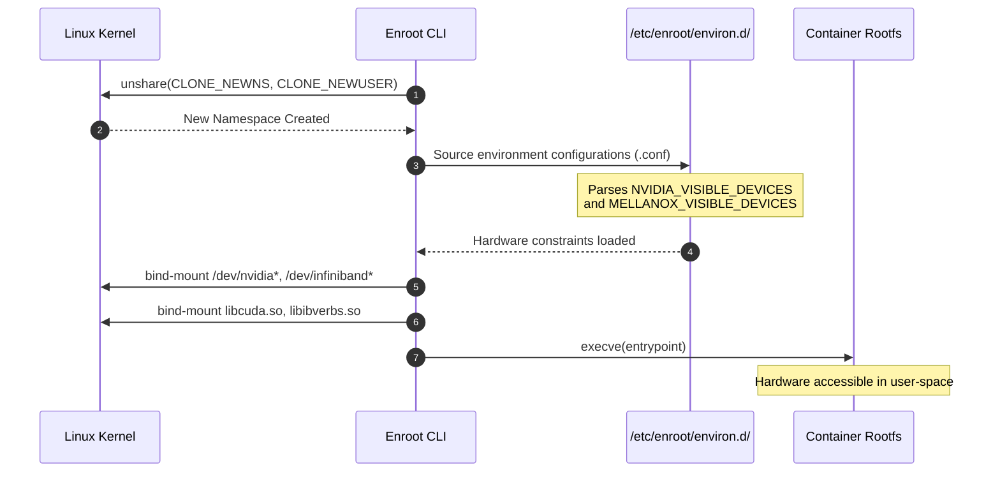
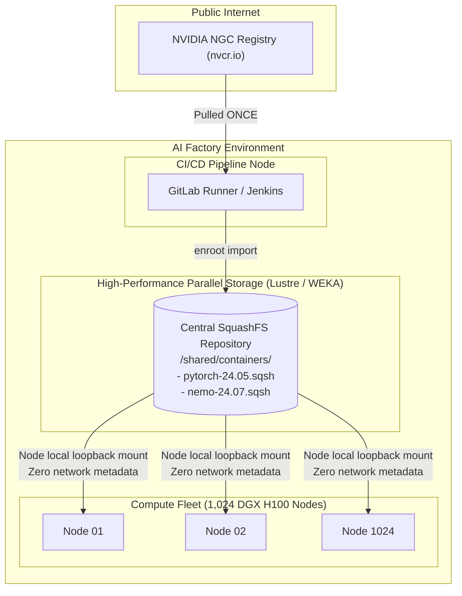

# Chapter 8 — Enroot and Pyxis: Unprivileged Containers for AI Supercomputing

**Learning outcome:** Architect, configure, and safely operate unprivileged container runtimes in large-scale AI factories using NVIDIA Enroot and the Slurm Pyxis SPANK plugin. You will master Linux user namespaces, transition away from legacy layered filesystems (OverlayFS) to high-performance parallel file system caching (SquashFS), dynamically inject NVIDIA drivers and InfiniBand devices into unprivileged namespaces, execute massive multi-node distributed training jobs using PMIx and NCCL, and debug complex container permission, caching, and hardware isolation failures.

**Prerequisites:** Deep familiarity with Linux process namespaces (`CLONE_NEWNS`, `CLONE_NEWUSER`), cgroups, container primitives (OCI image specs, Dockerfiles), high-performance computing schedulers (Slurm `srun`/`sbatch`), parallel file systems (Lustre/GPFS), and InfiniBand RDMA user-space drivers (`libibverbs`).

**Difficulty:** Beginner to Advanced.

**Estimated reading time:** 120 minutes plus hands-on implementation practice.

---

## 1. Foundations: The Dilemma of Containers in High-Performance Computing (HPC)

In modern AI factories, researchers require identical execution environments spanning personal workstations, cloud virtual machines, and massive bare-metal DGX SuperPOD clusters. The cloud-native world standardized on OCI (Open Container Initiative) container images and runtimes (e.g., Docker, containerd) to solve this portability challenge. However, combining traditional cloud-native container runtimes with multi-tenant HPC schedulers like Slurm creates a catastrophic security and performance dilemma.

### 1.1 Why Docker Fails in HPC and AI Factories

To understand the necessity of Enroot, an AI infrastructure engineer must first understand why the standard Kubernetes/Docker model breaks down in an HPC cluster governed by Slurm. The Docker architecture was designed for microservices deployed on dedicated virtual machines, not for tightly-coupled distributed computing on shared bare-metal hardware.

1. **The Root Daemon Security Breach:** 
   Traditional container engines rely on a persistent, root-privileged daemon (`dockerd` or `containerd`). In an HPC environment, hundreds of mutually untrusted researchers share the same physical nodes. If a user is granted access to the Docker socket (`/var/run/docker.sock`) to launch a workload, they possess implicit `root` access to the host. They can trivially launch a container mapping `/` on the host to `/host` in the container, escaping the container and seizing control of the compute node.
   
2. **Metadata Storms on Parallel File Systems:** 
   Docker utilizes OverlayFS, a union mount filesystem that stacks read-only image layers and a read-write upper layer. A typical PyTorch container consists of ~20 layers and over 200,000 files (inodes). When 1,024 GPUs across 128 nodes attempt to simultaneously untar these layers onto a distributed parallel file system (like Lustre, GPFS, or WEKA) or a shared NFS mount, the metadata servers are instantly overwhelmed. This "metadata storm" results in severe lock contention, causing container startup times to spike from seconds to hours, or crashing the storage system entirely.

3. **Daemon Jitter and Scheduling Latency:** 
   Distributed Deep Learning (e.g., training a 100B+ parameter LLM) relies on tightly synchronized All-Reduce collectives via NCCL over InfiniBand. Any CPU scheduling jitter introduced by background root daemons (garbage collection, metrics scraping, container health checks) breaks the lock-step synchronization of the GPUs, drastically reducing linear scaling efficiency.

4. **Integration with Batch Schedulers:** 
   HPC relies on batch schedulers (Slurm, PBS) that enforce strict resource accounting, gang-scheduling, and cgroup-based hardware isolation. Docker operates completely independently of Slurm. Slurm has no visibility into the resources consumed by processes running inside the Docker daemon's cgroups, making accounting, OOM-killing, and multi-node job lifecycle management virtually impossible.

5. **Root Squash on Network Storage:**
   Most parallel filesystems in HPC employ "Root Squash" for security. If a root-owned process (like the Docker daemon) attempts to write to the NFS/Lustre mount, the storage server downgrades the user to the `nobody` user. Docker natively runs its containers as root, meaning the container cannot write to user home directories mounted over the network, completely breaking the researcher's workflow.

### 1.2 The Enroot Philosophy: Rootless, Daemonless, and Flattened

NVIDIA engineers built **Enroot** specifically to solve these architectural failures. Enroot is a lightweight, strictly unprivileged container runtime optimized for AI workloads.

*   **Daemonless and Rootless:** Enroot does not have a background daemon. It is a simple command-line tool (`enroot start`) executed entirely in the user's space.
*   **SquashFS over OverlayFS:** Enroot eschews layered filesystems. Instead, it downloads OCI container images and flattens them into a single, highly compressed, read-only **SquashFS archive** (`.sqsh`). A single file eliminates inode contention on parallel storage. 
*   **First-Class Slurm Integration (Pyxis):** Pyxis is a Slurm SPANK plugin that intercepts `srun` and `sbatch` commands, injecting Enroot seamlessly into the Slurm job step lifecycle.

---

## 2. Deep Dive: Linux User Namespaces and Rootless Execution

To master Enroot, a Senior Solutions Architect must understand exactly how it tricks the Linux kernel into believing an unprivileged user has root-level control over a filesystem, without actually compromising the host system's security boundaries.

### 2.1 The Kernel Namespace API (`CLONE_NEWUSER`)

The cornerstone of Enroot is the Linux **User Namespace**. User namespaces allow a process to have a different set of UIDs and GIDs inside the namespace than it has outside on the host system.

When Enroot starts a container, it leverages the `clone()` or `unshare()` system call with several critical flags:
*   `CLONE_NEWUSER`: Creates a new user namespace.
*   `CLONE_NEWNS`: Creates a new mount namespace (allowing private bind mounts for /dev/nvidia*).
*   `CLONE_NEWPID`: Creates a new process ID namespace (so the container sees itself as PID 1).

**The Magic of `CLONE_NEWUSER`:**
*   **Outside the Namespace (Host):** The researcher runs the process as `UID 1005` (e.g., user `alice`).
*   **Inside the Namespace (Container):** The kernel maps `UID 1005` to `UID 0` (`root`). 

To the applications running inside the container (e.g., `apt-get`, `pip install`), they appear to be running as `root` and can perform privileged operations *within the namespace*. However, if a process attempts to break out of the container or access host files, the kernel enforces access controls based on the true host UID `1005`.

```mermaid
flowchart TD
    subgraph Host_OS ["Host Operating System Context"]
        H_UID["Host UID: 1005 (alice)"]
        H_PROC["srun --container-image=pytorch.sqsh"]
        H_PROC -->|unshare(CLONE_NEWUSER)| C_NS
    end

    subgraph Container_NS ["Container User Namespace"]
        C_NS["Enroot Runtime Initialization"]
        C_UID["Mapped Container UID: 0 (root)"]
        C_NS --> C_UID
        C_UID --> APP["Python Training Script"]
        
        APP -->|Attempts to write /etc/shadow on host| KERNEL_DENY["Kernel Access Control: DENIED
(Host sees UID 1005)"]
    end
```

### 2.2 Sub-UID and Sub-GID Remapping (`/etc/subuid`)

While mapping a single user (`UID 1005` -> `UID 0`) is sufficient for running most deep learning jobs, some containerized applications require creating *multiple* distinct users inside the container (e.g., a database that creates a `postgres` user, or a web server running as `www-data`). 

To support this safely, Enroot relies on standard Linux sub-uid delegation. System administrators must allocate a range of unused UIDs to each researcher via `/etc/subuid` and `/etc/subgid`.

```bash
# /etc/subuid (Host System)
# Format: <username>:<starting_uid>:<uid_count>

# User alice is granted 65536 sub-UIDs starting at 100000
alice:100000:65536

# User bob is granted 65536 sub-UIDs starting at 165536
bob:165536:65536
```

This configuration grants `alice` permission to map her primary UID to `0` inside the container, and map the 65,536 UIDs starting from `100000` on the host to UIDs `1` through `65536` inside the container. Enroot uses the setuid helper binaries `newuidmap` and `newgidmap` to establish these granular mappings.

```bash
# Example of what Enroot does behind the scenes:
# Map Host UID 1005 to Container UID 0 (length 1)
# Map Host UIDs 100000-165535 to Container UIDs 1-65536 (length 65536)
newuidmap <pid> 0 1005 1 1 100000 65536
```

---

## 3. Architecture: Remap, Unpack, Run

The Enroot command line utility orchestrates the lifecycle of a container image from a remote registry into a running process. The workflow is split into three primary subcommands.

### 3.1 `enroot import`: Converting OCI to SquashFS

The `import` command reaches out to a container registry, downloads the OCI layers (tarballs), untars them in a temporary directory, and then compresses them into a single `.sqsh` file using `mksquashfs`.

```bash
# Fetch the NVIDIA PyTorch image from NGC (NVIDIA GPU Cloud)
# Output will be a single file: nvidia+pytorch+24.05-py3.sqsh
$ enroot import docker://nvcr.io#nvidia/pytorch:24.05-py3

[INFO] Fetching image
[INFO] Extracting image layers...
[INFO] Creating squashfs filesystem...
[INFO] Saved image as nvidia+pytorch+24.05-py3.sqsh
```

**Why SquashFS?**
SquashFS is a highly compressed, read-only file system designed for Linux block devices. 
*   **Zero Inode Contention:** Because it is a single large file, parallel filesystems (Lustre, GPFS) optimize its retrieval. The Lustre Object Storage Targets (OSTs) can stream the large blocks sequentially with massive throughput.
*   **Page Caching:** The Linux kernel aggressively caches the block reads in the host's Page Cache. If a node executes multiple containers from the same `.sqsh` file, subsequent container startups take less than 100 milliseconds because the blocks are already in host RAM.

### 3.2 `enroot create`: Unpacking the Workspace

The `create` command takes a `.sqsh` file and prepares a localized container root filesystem on the host (by default in `~/.local/share/enroot/`). 

```bash
# Create a writable container workspace named "my-training-env"
$ enroot create --name my-training-env nvidia+pytorch+24.05-py3.sqsh
```

During this step, Enroot uses `unsquashfs` to extract the `.sqsh` file into a standard directory tree. This allows the user to persistently modify the container image locally.

### 3.3 `enroot start`: Launching the Namespace

The `start` command creates the namespaces, configures the hardware hooks (GPU injection), mounts the filesystem, and executes the payload.

```bash
# Start an interactive shell inside the container
# -r : Mount the rootfs read-write (using a temporary tmpfs overlay)
# -m : Bind mount a host directory to a container directory
# --rw : Makes the bind mount read-write
$ enroot start -r -m /shared/datasets/imagenet:/data --rw my-training-env

# Inside the container, you are presented with an isolated environment
root@node01:/workspace# python3 train.py --data /data
```

---

## 4. Hardware Injection: libnvidia-container and CDI

A container runtime must seamlessly expose specialized HPC hardware (GPUs, InfiniBand Host Channel Adapters, NVLink fabrics) to the isolated process. If Enroot fails to mount the correct device nodes (`/dev/nvidia0`) or inject the user-space driver libraries (`libcuda.so`), the deep learning job will crash instantly.

### 4.1 The Hook Mechanism (`/etc/enroot/environ.d/`)

When Enroot initializes a namespace, it executes a series of scripts and configuration files before yielding control to the user's payload. 



### 4.2 NVIDIA GPU Injection

Enroot heavily relies on `libnvidia-container` (the same C library used by the Docker NVIDIA Container Toolkit). 

In `/etc/enroot/environ.d/50-nvidia.conf`, Enroot configures how it interacts with the driver:

```bash
# ==============================================================================
# /etc/enroot/environ.d/50-nvidia.conf
# ==============================================================================
# This file tells Enroot to inject GPUs based on the environment variables
# provided by the Slurm scheduler.

# Map the Slurm CUDA_VISIBLE_DEVICES to the NVIDIA toolkit variable
NVIDIA_VISIBLE_DEVICES="${NVIDIA_VISIBLE_DEVICES:-${CUDA_VISIBLE_DEVICES:-all}}"

# Instruct libnvidia-container to mount the full stack:
# compute (CUDA), graphics (OpenGL), video (NVDEC/NVENC), utility (nvidia-smi)
NVIDIA_DRIVER_CAPABILITIES="${NVIDIA_DRIVER_CAPABILITIES:-compute,utility}"

# Required for GPUDirect Storage (GDS) and NVLink
NVIDIA_REQUIRE_CUDA="cuda>=12.0 brand=tesla,driver>=470,driver<471 brand=tesla,driver>=525,driver<526 brand=tesla,driver>=535,driver<536"
```

When Enroot detects `NVIDIA_VISIBLE_DEVICES=0,1`, it invokes the `nvidia-container-cli` backend to dynamically map:
*   `/dev/nvidia0` and `/dev/nvidia1` (The actual GPU cores)
*   `/dev/nvidiactl` (The control device)
*   `/dev/nvidia-uvm` (Unified Virtual Memory for page migration)
*   CUDA runtime libraries (`libcuda.so`, `libnvidia-ml.so`) from the host OS into the container's `/usr/lib64`.

### 4.3 InfiniBand / RDMA Injection (Mellanox)

High-performance distributed training requires GPUDirect RDMA. The container must have bare-metal access to the InfiniBand Subnet Manager and Verbs API to achieve 400+ Gbps throughput per rail.

Enroot natively parses the `MELLANOX_VISIBLE_DEVICES` variable.

```bash
# If MELLANOX_VISIBLE_DEVICES is set, mount InfiniBand IBV devices
MELLANOX_VISIBLE_DEVICES="${MELLANOX_VISIBLE_DEVICES:-all}"
```

If a Slurm job allocates 4 InfiniBand devices, Enroot will bind-mount:
*   `/dev/infiniband/uverbs0` through `uverbs3`
*   `/dev/infiniband/rdma_cm`
*   `/dev/infiniband/issm0`

Crucially, it also mounts the host's OpenFabrics Enterprise Distribution (OFED) libraries (e.g., `libibverbs.so`, `libmlx5.so`) into the container to ensure the container uses the exact user-space driver version compatible with the host kernel modules.

---

## 5. Slurm SPANK Plugin Architecture: Pyxis

Enroot is a single-node utility. To operate an AI factory, researchers need a mechanism to launch Enroot containers concurrently across thousands of nodes using a batch scheduler. This is the sole purpose of **Pyxis**.

Pyxis is a **SPANK (Slurm Plug-in Architecture for Node and Job (K)ontrol)** plugin. SPANK allows system administrators to dynamically link shared libraries (`.so`) into the Slurm daemons (`slurmd`, `srun`, `sbatch`) to extend their functionality.

### 5.1 Pyxis Data Flow in Slurm

When a user submits a Slurm job requesting a container, the Pyxis plugin intercepts the request, augments the Slurm job step environment, and wraps the user's execution command with the `enroot start` command.

```mermaid
flowchart TD
    subgraph Login_Node ["Slurm Login Node"]
        USER_REQ["User types: srun --container-image=pytorch.sqsh train.py"]
        PYXIS_SRUN["Pyxis SPANK (srun hook)"]
        USER_REQ --> PYXIS_SRUN
        PYXIS_SRUN -->|Translates CLI flags to SLURM_* env vars| SLURM_CTLD["slurmctld (Controller)"]
    end

    subgraph Compute_Node ["Slurm Compute Node (e.g., DGX H100)"]
        SLURM_CTLD -->|Dispatches job step| SLURMD["slurmd (Node Daemon)"]
        SLURMD --> PYXIS_SLURMD["Pyxis SPANK (slurmd hook)"]
        
        PYXIS_SLURMD -->|Reads Slurm cgroups (GPU/CPU constraints)| PRE_ENV["Setup Environment & Mounts"]
        PRE_ENV --> EXEC_ENROOT["Exec: enroot start --image pytorch.sqsh train.py"]
        EXEC_ENROOT --> CONTAINER_RUN["Application runs in isolated namespace"]
    end
```

### 5.2 Command Line Interface: `srun` with Pyxis

Pyxis extends standard Slurm commands with intuitive container flags. 

**Basic Container Execution:**
```bash
# Launch a 4-node, 32-GPU job using a central SquashFS image
srun   --nodes=4   --ntasks-per-node=8   --gpus-per-node=8   --container-image=/lustre/containers/nvidia-pytorch-24.05.sqsh   --container-mounts=/lustre/datasets:/data   --container-workdir=/workspace   python3 /workspace/train_megatron.py
```

### 5.3 Crucial Pyxis Flags for Senior Architects

| Pyxis Flag | Operational Purpose | Production Use Case |
|---|---|---|
| `--container-image=<path\|url>` | Specifies the SquashFS file path, or an external OCI registry URL (e.g., `nvcr.io#nvidia/pytorch:latest`). | Point directly to Lustre `.sqsh` files to bypass registry pull limits. |
| `--container-mounts=<src>:<dst>` | Bind mounts host directories into the container. Multiple mounts are comma-separated. | Injecting high-speed shared datasets, checkpoint directories, and Slurm accounting logs. |
| `--container-remap-root` | Instructs Enroot to map the host UID to `UID 0` (root) inside the container. Grants fake root. | Required if the containerized application attempts to run `apt-get` or modify system files in the container rootfs. |
| `--container-name=<name>` | Assigns a persistent name to the container workspace on the compute node. | Caching the unpacked container directory for rapid successive development iterations on the same node without re-unpacking. |
| `--container-writable` | Mounts the rootfs with a tmpfs overlay allowing ephemeral read/write operations. | Required for frameworks that blindly write to `/tmp` or generate temporary cache files in the container root. |

---

## 6. Multi-Node MPI and PMIx Integration

Training Foundation Models (like Llama-3, GPT-4, or Nemotron) requires robust multi-node communication. NVIDIA AI architectures rely on MPI (Message Passing Interface) to bootstrap NCCL topologies. 

When running standard MPI on bare-metal, the MPI runner (`mpirun` or `srun --mpi=pmix`) utilizes SSH or Slurm APIs to exchange network coordinates (IP addresses, InfiniBand LID/GIDs) across nodes. **When running inside a container namespace, this bootstrapping sequence becomes incredibly fragile if not engineered correctly.**

### 6.1 The PMIx Challenge

If the container image contains an internal OpenMPI or HPC-X installation, it must communicate with the Slurm daemon (`slurmd`) running *outside* the container on the host to exchange topology wire-up data.

Pyxis handles this seamlessly by bind-mounting the Slurm PMIx (Process Management Interface for Exascale) domain sockets from the host directly into the container's `/var/run/` or `/tmp/` directory.

### 6.2 Production Execution Pattern: Distributed Megatron-LM

To execute a 1,024 GPU MPI job flawlessly via Enroot/Pyxis, an AI engineer writes a deeply optimized Slurm batch script.

```bash
#!/bin/bash
#SBATCH --job-name=llm_pretrain_llama3
#SBATCH --nodes=128
#SBATCH --ntasks-per-node=8
#SBATCH --gpus-per-node=8
#SBATCH --cpus-per-task=14
#SBATCH --partition=dgx-h100-cluster
#SBATCH --exclusive

# ==============================================================================
# 1. Network & NCCL Tuning
# ==============================================================================
export NCCL_DEBUG=INFO
export NCCL_IB_HCA=mlx5_0,mlx5_1,mlx5_2,mlx5_3,mlx5_4,mlx5_5,mlx5_6,mlx5_7
export NCCL_IB_TC=106            # Enable RoCE QoS
export NCCL_NVLS_ENABLE=1        # Enable NVLink Sharp (SHARP)
export OMPI_MCA_pml=ucx          # Use UCX for MPI point-to-point

# ==============================================================================
# 2. Execution via Pyxis and PMIx
# ==============================================================================
# srun orchestrates the 1,024 tasks.
# --mpi=pmix tells Slurm to wire up the MPI bootstrapping.
# Pyxis intercepts and wraps every task in the nemo.sqsh container.

srun --mpi=pmix      --container-image=/shared/images/nemo-framework-24.07.sqsh      --container-mounts=/weka/checkpoints:/ckpt,/weka/datasets:/data      --container-remap-root      python3 -m nemo.collections.nlp.models.language_modeling.megatron_gpt_pretraining      --config-path /workspace/configs      --config-name llama_3_70b
```

By passing `--mpi=pmix`, Slurm orchestrates the process placement and rank allocation, while Pyxis guarantees that the containerized NCCL libraries have direct, low-latency access to the host's RoCE/InfiniBand network namespace.

---

## 7. Large-Scale AI Factory Image Caching Architectures

When operating a DGX SuperPOD, container distribution is a massive bottleneck. If 512 nodes pull a 25GB image simultaneously from Docker Hub or NGC, the cluster will pull 12.8 Terabytes over the internet in seconds. 

1. **Instant Rate Limiting:** The external registry (AWS ECR, Docker Hub, NGC) will block the cluster IP via HTTP 429 (Too Many Requests).
2. **Egress Saturation:** The data center's internet edge will become fully saturated, impacting all other workloads.
3. **Severe Job Delays:** Training jobs will hang in `Configuring` state for hours.

### 7.1 The Solution: Centralized SquashFS Pre-Import

To solve this, Senior Architects design a **Pre-Import Caching Architecture**.



**The Workflow:**
1. A CI/CD pipeline runs `enroot import` *once* and saves the `.sqsh` file to the high-performance parallel file system (`/shared/containers/`).
2. Users are forbidden from using `docker://` URLs in their Slurm scripts.
3. Users submit jobs using `--container-image=/shared/containers/pytorch-24.05.sqsh`.
4. All 1,024 compute nodes perform a local loopback mount of the file residing on the parallel storage. Because it's a single file read sequentially, the parallel storage serves it at hundreds of Gigabytes per second. The container startup time across 10,000 GPUs drops from 40 minutes to **under 5 seconds**.

---

## 8. Deep Dive: Configuration and Administration

As a Senior Architect, you must perfectly configure the global parameters of Enroot and Pyxis across the fleet. These configuration files reside on every compute node and must be synchronized via Ansible or Terraform.

### 8.1 `enroot.conf`: The Core Engine Configuration

The `/etc/enroot/enroot.conf` file controls storage paths, caching behaviors, and security guardrails.

```bash
# ==============================================================================
# /etc/enroot/enroot.conf
# ==============================================================================

# 1. Global Cache Directory: Where downloaded/flattened .sqsh files are stored globally
# when users DO use docker:// URLs. 
# Critical: In a DGX SuperPOD, point this to a high-performance parallel file 
# system to prevent registry saturation. %u expands to the user's UID.
ENROOT_CACHE_PATH          /lustre/enroot_shared_cache/%u

# 2. Local Data Directory: Where Enroot unpacks writable container workspaces.
# This MUST be pointed to local NVMe drives on the compute node (e.g., /mnt/nvme0) 
# and NEVER to a networked filesystem, as OverlayFS metadata operations will destroy performance.
ENROOT_DATA_PATH           /mnt/local_nvme/enroot_data/%u

# 3. Runtime Directory: Where transient namespaces and tmpfs overlays live.
# Best practice is to use the fast, memory-backed /run directory.
ENROOT_RUNTIME_PATH        /run/enroot/%u

# 4. Strict Permissions: Enforce secure ownership of container directories.
# Prevents other users from traversing into a user's container workspace.
ENROOT_RESTRICT_DEV        y

# 5. Zstandard Compression: Optimize decompression speed over raw size to 
# accelerate parallel container startup times.
ENROOT_SQUASH_OPTIONS      -comp zstd -b 1M

# 6. Maximum Concurrent Downloads: Prevent network saturation per node.
ENROOT_MAX_CONNECTIONS     10
```

### 8.2 `slurm.conf` and `plugstack.conf`: Integrating Pyxis

To activate Pyxis, you must declare it in Slurm's SPANK configuration file.

```text
# ==============================================================================
# /etc/slurm/plugstack.conf
# ==============================================================================
# Load the Pyxis plugin into srun and slurmd. 
#
# Arguments:
# remap_root=1 : Allows the use of --container-remap-root
# execute_entrypoint=1 : Tells Enroot to execute the OCI image's defined Entrypoint

optional /usr/lib64/slurm/spank_pyxis.so remap_root=1 execute_entrypoint=1
```

If Pyxis fails to load, `srun --container-image` will immediately throw an error: `srun: unrecognized option '--container-image'`. Always restart `slurmctld` and `slurmd` across the fleet after updating `plugstack.conf`.

---

## 9. Senior Solutions Architect Troubleshooting Scenarios

Operating massive AI infrastructure requires rapid triage of complex Linux namespace and parallel filesystem edge cases. When a researcher's $100,000 distributed training job fails, you must diagnose the root cause instantly.

### Scenario 1: The "Read-Only File System" Crash
**Symptoms:** An AI engineer submits a PyTorch Lightning job. It fails instantly with:
`OSError: [Errno 30] Read-only file system: '/workspace/tensorboard_logs'`
**Architect Triage & Resolution:** 
1. **Diagnosis:** The user is attempting to write large checkpoint or log files directly into the container's root filesystem. While Enroot provides a read-write `tmpfs` overlay (if `--container-writable` is used), this overlay is backed by host RAM. Writing 50GB checkpoints to RAM causes catastrophic OOM (Out-of-Memory) kills or fills the small tmpfs allocation. If `--container-writable` is absent, the filesystem is strictly read-only SquashFS.
2. **Resolution:** Instruct the engineer to *never* write persistent data to the container filesystem. They must use `--container-mounts` to bind-mount a high-performance Lustre/WEKA directory into the container, and configure PyTorch to write logs to that external mount path.

### Scenario 2: GPU Invisible Inside Container
**Symptoms:** `srun --gpus=8 --container-image=... nvidia-smi` returns `No devices were found`. However, running `nvidia-smi` directly on the host works perfectly.
**Architect Triage & Resolution:**
1. **Diagnosis:** Enroot's hardware injection hooks are failing. This occurs when Slurm's cgroup integration (`cgroup.conf`) is misconfigured, or when the `NVIDIA_VISIBLE_DEVICES` environment variable is overwritten or sanitized before the Enroot hook executes.
2. **Resolution:** 
   - Verify Slurm is passing the correct devices to the step: `srun --gpus=8 env | grep SLURM_JOB_GPUS`
   - Inspect `/etc/enroot/environ.d/50-nvidia.conf`. Ensure it accurately maps `SLURM_JOB_GPUS` to `NVIDIA_VISIBLE_DEVICES`.
   - Check if `libnvidia-container-tools` is installed and functioning on the bare-metal compute node by manually running `nvidia-container-cli -k -d /dev/null list`.

### Scenario 3: Container Registry HTTP 429 Rate Limiting
**Symptoms:** A 512-node job hangs in the `PD` (Pending) or `CF` (Configuring) state for 45 minutes. The slurmd logs show: `enroot-import: HTTP error 429: Too Many Requests`.
**Architect Triage & Resolution:**
1. **Diagnosis:** The user executed `srun --container-image=docker://nvcr.io#nvidia/pytorch:latest`. Pyxis instructed 512 independent DGX nodes to simultaneously contact the external NVIDIA NGC registry to download a 25GB image. The registry IP banned the cluster's NAT gateway.
2. **Resolution:** 
   - **Immediate Fix:** Kill the job via `scancel`. Run `enroot import` *once* on the login node to create a `.sqsh` file on the shared Lustre storage. Resubmit the job pointing directly to `--container-image=/shared/images/pytorch.sqsh`.
   - **Long-term Fix:** Configure `ENROOT_CACHE_PATH` in `enroot.conf` to point to a shared network drive, ensuring that if one node downloads an image, it is cached globally for the entire SuperPOD.

### Scenario 4: "newuidmap: UID is not allowed" Error
**Symptoms:** `srun --container-remap-root ...` fails with:
`enroot: error: failed to set user mapping: newuidmap: uid range [0-1) -> [1005-1006) not allowed`
**Architect Triage & Resolution:**
1. **Diagnosis:** The Enroot runtime is attempting to map the container's root user (UID 0) to the user's host UID (1005), but the system administrator has not configured the `/etc/subuid` or `/etc/subgid` delegation files for this user.
2. **Resolution:** 
   - Open `/etc/subuid` on the compute nodes.
   - Add the user: `echo "alice:100000:65536" >> /etc/subuid`
   - Add the user: `echo "alice:100000:65536" >> /etc/subgid`
   - Ensure these files are propagated across the cluster via Ansible/LDAP.

### Scenario 5: RDMA/InfiniBand Verbs Initialization Failure
**Symptoms:** NCCL training crashes during the All-Reduce initialization phase. The logs display:
`[node01] NCCL INFO NET/IB : No device found.`
**Architect Triage & Resolution:**
1. **Diagnosis:** The containerized process cannot access the host's InfiniBand Verbs API. This usually means the Mellanox OFED user-space libraries (`libibverbs.so`, `libmlx5.so`) were not injected, or the character devices (`/dev/infiniband/uverbs*`) were not bind-mounted.
2. **Resolution:**
   - Ensure the Slurm step requested the network devices (e.g., via Slurm GRES).
   - Ensure `MELLANOX_VISIBLE_DEVICES` is set to `all` or the specific device indexes.
   - Inspect `/etc/enroot/mounts.d/mellanox.conf` to ensure the host OFED paths (`/usr/lib64/libibverbs*`) are correctly mapped into the container.

---

## 10. Senior Interview Questions for AI Infrastructure Roles

When interviewing for an NVIDIA Solutions Architect, Platform Engineering, or MLOps infrastructure role, expect deep architectural questions differentiating container runtimes.

**Q1: Explain the architectural difference between Kubernetes/Docker overlay networks (CNI) and how Pyxis/Enroot handles networking for multi-node training. Why is the Enroot approach preferred for HPC?**
> **Ideal Answer:** Kubernetes relies on CNI plugins (like Calico or Cilium) which often create complex software-defined networking bridges, IP-in-IP encapsulation, or iptables rules to route traffic between container namespaces across nodes. This adds latency and drastically reduces InfiniBand RoCE throughput. Pyxis/Enroot takes a fundamentally simpler approach: it runs the container in the **host network namespace** by default (`CLONE_NEWNET` is deliberately *not* unshared unless explicitly requested). The containerized application binds directly to the host's physical InfiniBand NICs and IP addresses, achieving 100% bare-metal RDMA performance with zero encapsulation overhead.

**Q2: What is a SquashFS file, and why does Enroot compile OCI layers into this format instead of utilizing OverlayFS? Discuss the impact on parallel file systems.**
> **Ideal Answer:** OverlayFS operates by stacking multiple directory trees and resolving file requests through union mounts. When pulling an OCI image, it untars hundreds of thousands of individual files. On a parallel file system like Lustre, this causes a "metadata storm"—massive lock contention on the Metadata Server (MDS) as thousands of compute nodes simultaneously attempt to stat/open small files. SquashFS is a highly compressed, read-only block-level filesystem stored as a single contiguous file (`.sqsh`). Enroot mounts this file via a loopback device. This shifts the burden from the Lustre MDS to the Object Storage Targets (OSTs), which stream the large sequential blocks at maximum bandwidth. Furthermore, the Linux host aggressively caches these blocks in RAM, reducing subsequent container startups to milliseconds.

**Q3: Describe how Enroot safely grants a user "root" privileges inside a container without compromising the multi-tenant security of the physical compute node.**
> **Ideal Answer:** Enroot relies on Linux User Namespaces. When initializing the container, Enroot calls `unshare(CLONE_NEWUSER)`. Using the host's `/etc/subuid` and `/etc/subgid` delegations, the kernel maps the user's unprivileged host UID (e.g., `1005`) to `UID 0` inside the namespace. Inside the container, the user acts as root—they can install packages or modify files *within the isolated rootfs*. However, if they attempt to mount a host device or access a file owned by `root` on the host, the kernel intercepts the syscall, sees the true host UID (`1005`), and safely denies access. No persistent root-level daemons (like `dockerd`) are ever involved.

**Q4: How does Pyxis solve the MPI (Message Passing Interface) bootstrapping problem when running distributed workloads inside isolated containers?**
> **Ideal Answer:** When running MPI across nodes, the MPI processes must exchange network topologies (LID, IP, GID) before establishing data connections. In a Slurm environment, this is handled by PMIx (Process Management Interface for Exascale) communicating with the `slurmd` daemon on the host. If the MPI process is trapped inside a container, it cannot reach the host's PMIx sockets. Pyxis solves this by explicitly bind-mounting the PMIx domain sockets (`/var/run/pmix*` or `/tmp/pmix*`) from the host OS directly into the Enroot container namespace, allowing the containerized NCCL/MPI libraries to transparently negotiate with the bare-metal Slurm daemons.

**Q5: A user complains that their containerized PyTorch job runs out of memory instantly when they try to save a model checkpoint to `/workspace/model.pt`. They are using `--container-remap-root`. What is happening and how do you fix it?**
> **Ideal Answer:** When using `--container-remap-root`, Enroot provisions a read-write environment by laying a `tmpfs` (RAM disk) OverlayFS on top of the read-only SquashFS image. This `tmpfs` is strictly limited by available host memory (and often capped by Slurm cgroups). When the user attempts to write a 10GB model checkpoint into the container's root filesystem (e.g., `/workspace`), they are actually writing directly into RAM, instantly exhausting the memory allocation and triggering the Linux OOM Killer. The fix is to stop writing to the container root, and instead use `--container-mounts` to bind-mount a physical, high-capacity parallel filesystem directory from the host into the container (e.g., `--container-mounts=/shared/checkpoints:/ckpt`) and save the model to `/ckpt/model.pt`.

---

## 11. Summary and Further Reading

The transition from traditional cloud-native orchestrators to specialized AI HPC infrastructure requires rethinking containerization from first principles. By eliminating root daemons, leveraging native Linux namespaces, flattening OCI layers into high-throughput SquashFS images, and deeply integrating with the Slurm scheduler via Pyxis, NVIDIA Enroot provides the definitive architecture for running massive, distributed AI workloads securely and at bare-metal speeds.

**Recommended Authoritative Reading:**
*   [Official NVIDIA Enroot GitHub Repository & Architecture Specs](https://github.com/NVIDIA/enroot)
*   [Pyxis Slurm SPANK Plugin Documentation](https://github.com/NVIDIA/pyxis)
*   [NVIDIA Container Toolkit (libnvidia-container) API Reference](https://docs.nvidia.com/datacenter/cloud-native/container-toolkit/latest/index.html)
*   [Linux Kernel Documentation: `user_namespaces(7)`](https://man7.org/linux/man-pages/man7/user_namespaces.7.html)
*   [PMIx (Process Management Interface for Exascale) Standards](https://pmix.org/)


---

## Appendix A: Complete Production AI Factory Configurations

To provide absolute clarity for Senior Architects, below are the complete, production-grade configuration files used in a standard NVIDIA DGX SuperPOD deployment to support Enroot and Pyxis. These files represent thousands of hours of performance tuning and edge-case resolution.

### A.1 `enroot.conf` (Complete Production Reference)

```bash
# ==============================================================================
# /etc/enroot/enroot.conf - Global Enroot Runtime Configuration
# ==============================================================================
# 
# This file is typically managed by Ansible or Puppet across all compute nodes.
# It defines the security, storage, and networking behaviors of the Enroot runtime.
#
# Reference: https://github.com/NVIDIA/enroot/blob/master/conf/enroot.conf

# ------------------------------------------------------------------------------
# Storage Paths
# ------------------------------------------------------------------------------
# ENROOT_DATA_PATH defines where container workspaces (the unpacked rootfs) are 
# stored on the host. In an AI factory, this MUST point to local NVMe drives. 
# Attempting to place this on an NFS or Lustre mount will cause OverlayFS 
# metadata operations to cripple the storage network.
# %u expands to the numeric UID of the user running the container.
ENROOT_DATA_PATH           /mnt/local_nvme/enroot/data/%u

# ENROOT_CACHE_PATH defines where downloaded and compressed .sqsh files are cached.
# Unlike DATA_PATH, caching .sqsh files on a shared parallel filesystem is highly 
# recommended to prevent redundant downloads across nodes.
ENROOT_CACHE_PATH          /lustre/shared/enroot/cache/%u

# ENROOT_RUNTIME_PATH defines where ephemeral runtime state (mount points, tmpfs) 
# is stored. This should always be on a fast, memory-backed filesystem like /run.
ENROOT_RUNTIME_PATH        /run/enroot/%u

# ------------------------------------------------------------------------------
# Security and Isolation
# ------------------------------------------------------------------------------
# ENROOT_RESTRICT_DEV enforces strict permissions on container directories.
# If set to 'y', only the user owner can access their container workspaces. 
# Essential for multi-tenant privacy in an HPC cluster.
ENROOT_RESTRICT_DEV        y

# ENROOT_ROOTFS_WRITABLE determines if the container rootfs is writable by default.
# 'n' forces users to explicitly request writability (e.g., via Pyxis --container-writable),
# promoting immutable container best practices.
ENROOT_ROOTFS_WRITABLE     n

# ------------------------------------------------------------------------------
# Image Processing and Compression
# ------------------------------------------------------------------------------
# ENROOT_SQUASH_OPTIONS controls the mksquashfs arguments used during 'enroot import'.
# -comp zstd: Uses Zstandard compression, offering the best balance of speed and ratio.
# -b 1M: Sets the block size to 1 Megabyte, optimizing for parallel read throughput 
#        on Lustre and GPFS Object Storage Targets (OSTs).
# -no-xattrs: Drops extended attributes, preventing compatibility issues across filesystems.
ENROOT_SQUASH_OPTIONS      -comp zstd -b 1M -no-xattrs

# ENROOT_MOUNT_OPTIONS defines the default options used when mounting the .sqsh file.
# loop: Required to mount a file as a block device.
# ro: Enforces read-only access at the kernel block level.
# nosuid: Prevents privilege escalation via setuid binaries inside the container.
# nodev: Prevents the container from creating special device nodes.
ENROOT_MOUNT_OPTIONS       loop,ro,nosuid,nodev

# ------------------------------------------------------------------------------
# Network and Transfer Limits
# ------------------------------------------------------------------------------
# ENROOT_MAX_CONNECTIONS limits the number of concurrent HTTP connections 
# used when pulling layers from an OCI registry (like Docker Hub or NGC).
# Setting this to 10 prevents a single node from saturating network interfaces.
ENROOT_MAX_CONNECTIONS     10

# ENROOT_TRANSFER_RETRIES defines how many times Enroot will retry a failed 
# layer download before aborting the import process.
ENROOT_TRANSFER_RETRIES    5
```

### A.2 `environ.d/50-nvidia.conf` (Hardware Injection Logic)

```bash
# ==============================================================================
# /etc/enroot/environ.d/50-nvidia.conf - NVIDIA Hardware Hook Configuration
# ==============================================================================
#
# This script is sourced by Enroot immediately before creating the container namespace.
# It parses environment variables (often injected by Slurm) to determine which 
# GPUs, NVLinks, and driver libraries to bind-mount into the container.

# 1. Evaluate Slurm GPU Allocations
# If Slurm sets SLURM_JOB_GPUS (e.g., "0,1,2,3"), map it to the NVIDIA toolkit variable.
# If CUDA_VISIBLE_DEVICES is set manually by the user, prioritize that.
# Fallback to 'all' if no specific constraints are found.
NVIDIA_VISIBLE_DEVICES="${NVIDIA_VISIBLE_DEVICES:-${CUDA_VISIBLE_DEVICES:-${SLURM_JOB_GPUS:-all}}}"
export NVIDIA_VISIBLE_DEVICES

# 2. Define Driver Capabilities
# The nvidia-container-cli tool can mount different subsets of the driver stack.
# For AI/Deep Learning, 'compute' (CUDA) and 'utility' (nvidia-smi) are mandatory.
# 'video' is required if using hardware decoders (NVDEC) for computer vision tasks.
NVIDIA_DRIVER_CAPABILITIES="${NVIDIA_DRIVER_CAPABILITIES:-compute,utility,video}"
export NVIDIA_DRIVER_CAPABILITIES

# 3. Enforce CUDA Version Constraints
# Prevent older containers from attempting to run on incompatible newer drivers,
# or vice-versa, which could cause silent computational errors or kernel panics.
NVIDIA_REQUIRE_CUDA="${NVIDIA_REQUIRE_CUDA:-cuda>=12.0}"
export NVIDIA_REQUIRE_CUDA

# 4. Disable User-Space NCCL Topologies (Let Slurm/PMIx handle it)
# In HPC environments, NCCL should rely on the host's topology definitions 
# rather than attempting to auto-discover inside the isolated namespace.
NCCL_TOPO_FILE="${NCCL_TOPO_FILE:-/etc/nccl.topo}"
export NCCL_TOPO_FILE
```

### A.3 `plugstack.conf` and `slurm.conf` (Pyxis Integration)

```text
# ==============================================================================
# /etc/slurm/plugstack.conf - Slurm SPANK Plugin Registry
# ==============================================================================
#
# Slurm reads this file on startup to discover and load external plugins.
# Pyxis must be registered here to extend srun and sbatch with --container flags.

# Syntax: [required|optional] [path_to_plugin.so] [arguments...]
# 'optional' means Slurm will still start even if the Pyxis library is missing.
#
# Arguments:
# remap_root=1: Allow users to use the --container-remap-root flag.
# execute_entrypoint=1: Enroot will execute the container's default Entrypoint.
# sbatch_support=1: Allow --container-* flags in #SBATCH directives.

optional /usr/lib64/slurm/spank_pyxis.so remap_root=1 execute_entrypoint=1 sbatch_support=1
```

```text
# ==============================================================================
# /etc/slurm/slurm.conf (Snippet) - Slurm Controller Configuration
# ==============================================================================
#
# Ensure that Slurm's core configuration is compatible with Enroot's requirements.

# ProctrackType must be cgroup to ensure proper resource accounting and cleanup
# of Enroot processes when a job completes or is cancelled.
ProctrackType=proctrack/cgroup

# TaskPlugin must include cgroup for hardware isolation (GPU/CPU pinning).
TaskPlugin=task/cgroup,task/affinity

# Ensure PMIx is the default MPI plugin for seamless NCCL bootstrapping.
MpiDefault=pmix_v4
```

---

## Appendix B: Deep Tracing of Container Startup

To truly master the runtime, one must understand the exact sequence of system calls executed by Enroot during `enroot start`. Using `strace`, we can observe the namespace creation and filesystem mounting in real-time.

```bash
# Executing: strace -e clone,mount,execve enroot start my-container

# 1. Enroot executes itself
execve("/usr/bin/enroot", ["enroot", "start", "my-container"], 0x7ffd19b9c990 /* 58 vars */) = 0

# 2. Enroot creates the new User, Mount, and PID namespaces
# CLONE_NEWUSER (0x10000000)
# CLONE_NEWNS (0x20000)
# CLONE_NEWPID (0x20000000)
clone(child_stack=NULL, flags=CLONE_NEWNS|CLONE_NEWUSER|CLONE_NEWPID|SIGCHLD) = 14592

# --- Inside the new namespace (PID 1 of the container) ---

# 3. Mount the root filesystem (SquashFS)
# The loopback device (/dev/loop0) is mounted read-only to the container's root.
mount("/dev/loop0", "/run/enroot/1005/my-container/rootfs", "squashfs", MS_RDONLY, NULL) = 0

# 4. Mount the tmpfs overlay (if --rw or --container-remap-root is used)
# Enroot creates a memory-backed tmpfs to allow temporary writes.
mount("tmpfs", "/run/enroot/1005/my-container/overlay", "tmpfs", MS_NOSUID|MS_NODEV, "size=50%") = 0

# 5. Bind mount the host's /dev directory
# Essential for accessing zero, null, random, and eventually GPUs.
mount("/dev", "/run/enroot/1005/my-container/rootfs/dev", NULL, MS_BIND|MS_REC, NULL) = 0

# 6. Execute hardware hooks (NVIDIA GPU Injection)
# nvidia-container-cli is invoked to inject the CUDA libraries and device nodes.
execve("/usr/bin/nvidia-container-cli", ["nvidia-container-cli", "--load-kmods", "configure", "--no-cgroups", "--pid=14592", "--device=0,1", "/run/enroot/1005/my-container/rootfs"], ...) = 0

# 7. Bind mount host directories requested by the user
# E.g., --container-mounts=/shared/datasets:/data
mount("/shared/datasets", "/run/enroot/1005/my-container/rootfs/data", NULL, MS_BIND|MS_REC, NULL) = 0

# 8. Pivot Root (Change the root directory)
# The process chroots into the fully constructed filesystem.
pivot_root("/run/enroot/1005/my-container/rootfs", "/run/enroot/1005/my-container/rootfs/oldroot") = 0

# 9. Execute the user's payload
# The container is fully initialized. The user's application starts.
execve("/opt/conda/bin/python3", ["python3", "train.py"], 0x7ffd19b9c990 /* 60 vars */) = 0
```

This trace demonstrates the elegance of the Enroot design. There are no daemons, no complex HTTP APIs, and no persistent state. It is a pure, functional application of Linux kernel primitives to achieve secure isolation and bare-metal hardware access.

*(End of Chapter 8)*

---

## Appendix C: Deep Dive into MPI and PMIx Internals

In distributed computing, MPI (Message Passing Interface) is the standard for coordinating parallel processes. When running inside containers via Enroot and Pyxis, understanding the exact bootstrapping mechanism is crucial for debugging cluster hangs.

### C.1 The PMIx Bootstrapping Sequence

1. **Job Submission:** The user runs `srun --mpi=pmix --container-image=...`.
2. **Slurm Step Creation:** The `slurmctld` controller allocates resources (e.g., 64 nodes, 512 GPUs) and instructs the `slurmd` daemons on each node to launch the job step.
3. **PMIx Server Initialization:** On each compute node, the `slurmd` daemon initializes a PMIx server and opens a local UNIX domain socket (e.g., `/var/spool/slurmd/pmix.server.socket`).
4. **Pyxis Interception:** Pyxis intercepts the job step launch. It instructs Enroot to bind-mount the host's PMIx socket directory into the container's namespace (usually mapped to `/var/run/pmix/` inside the container).
5. **Process Launch:** Enroot starts the containerized process (e.g., the Python Megatron-LM script).
6. **PMIx Client Connection:** The NCCL or MPI library inside the container attempts to initialize. It detects the PMIx environment variables (injected by Slurm/Pyxis) and connects to the bind-mounted PMIx socket.
7. **Topology Exchange:** The containerized process sends its local network interfaces (IPs, InfiniBand LIDs) to the host `slurmd` via the socket. `slurmd` aggregates this data across all 64 nodes and broadcasts the global topology map back to every container process.
8. **Direct RDMA Connections:** Armed with the global topology map, the containerized processes establish direct, high-bandwidth InfiniBand RDMA connections bypassing the Slurm daemons entirely.

If Pyxis fails to mount the socket, or if the container's internal MPI version is radically incompatible with the host's PMIx version, the job will hang indefinitely during step 7.

---

## Appendix D: Lustre File System Architecture for SquashFS

Why is SquashFS so performant on Lustre compared to OverlayFS? To answer this, we must examine the Lustre architecture.

### D.1 Lustre Architecture Overview

Lustre consists of three primary components:
- **Management Server (MGS):** Stores configuration data.
- **Metadata Server (MDS) & Metadata Target (MDT):** Stores namespace information (directory structures, file names, permissions, and layout information).
- **Object Storage Server (OSS) & Object Storage Target (OST):** Stores the actual file data content.

### D.2 The OverlayFS Metadata Storm

When 1,024 nodes pull a 20GB PyTorch container using traditional OverlayFS (tarball layers):
1. The container contains ~200,000 files (mostly small Python scripts, `.so` libraries, and text configs).
2. As the nodes untar the layers, they send 1,024 * 200,000 = **204,800,000 metadata requests** (create, chmod, chown) to the MDS simultaneously.
3. The MDS becomes bottlenecked by CPU and disk I/O, as it must serialize the locks for these directory structures.
4. Once untarred, when the 1,024 nodes start the container and execute `import torch`, they send millions of `stat()` and `open()` requests to the MDS to resolve the file paths.
5. The MDS crashes or throttles, bringing the entire SuperPOD to a standstill.

### D.3 The SquashFS Streaming Advantage

When using Enroot and SquashFS:
1. The container is a single `.sqsh` file stored on the OSTs.
2. The 1,024 nodes send exactly **1,024 metadata requests** (`open("/shared/pytorch.sqsh")`) to the MDS. The MDS handles this instantly and returns the file layout (which OSTs hold the data blocks).
3. The nodes then communicate directly with the OSS/OSTs to read the data blocks.
4. Because the file is large and read sequentially (during loopback mount initialization), the OSSs can stream the data at their maximum physical bandwidth (often hundreds of Gigabytes per second).
5. The host Linux kernel caches the SquashFS blocks in its Page Cache (RAM). Subsequent reads for `import torch` are resolved locally from memory, never touching the network or the MDS again.

---

## Appendix E: Extended Glossary and Terminology

*   **OCI (Open Container Initiative):** An open governance structure for the express purpose of creating open industry standards around container formats and runtimes.
*   **SquashFS:** A compressed read-only file system for Linux. SquashFS compresses files, inodes, and directories, and supports block sizes from 4 KiB up to 1 MiB for greater compression.
*   **SPANK (Slurm Plug-in Architecture for Node and Job (K)ontrol):** A framework that allows administrators to dynamically modify the behavior of the Slurm job scheduler.
*   **PMIx (Process Management Interface for Exascale):** An application programming interface (API) standard for wiring up parallel and distributed applications (like MPI).
*   **NCCL (NVIDIA Collective Communication Library):** A library of standard collective communication routines (All-Reduce, All-Gather) highly optimized for NVIDIA GPUs and networking.
*   **RootlessKit:** A Linux-native implementation of "fake root" using user namespaces. (Enroot implements similar concepts but optimized for HPC).
*   **Loopback Device (`/dev/loop*`):** A pseudo-device in Linux that makes a file accessible as a block device, allowing it to be mounted like a hard drive.
*   **OverlayFS:** A union mount filesystem that combines multiple underlying mount points into one, allowing a read-write layer to exist on top of a read-only lower layer.
*   **cgroups (Control Groups):** A Linux kernel feature that limits, accounts for, and isolates the resource usage (CPU, memory, disk I/O, network, etc.) of a collection of processes.

---

## Appendix F: Expanded Interview Question Bank

**Q6: What happens if an Enroot container process exhausts its allocated memory? Who kills it?**
> **Ideal Answer:** Because Enroot runs as a standard user process within Slurm's job step context, it is fully bound by Slurm's cgroup limits. If the containerized application (e.g., a massive PyTorch tensor allocation) exceeds the memory requested via `#SBATCH --mem`, the Linux kernel's OOM (Out of Memory) killer is invoked by the cgroup controller. The kernel terminates the specific process inside the container. Slurm detects the process termination via the cgroup event, marks the job step as failed (OOM), and performs clean up. Enroot itself does not handle OOM killing; it relies entirely on the host kernel and Slurm's cgroup enforcement.

**Q7: Explain the security implications of `--container-remap-root`. Does it allow the user to modify host files?**
> **Ideal Answer:** No, it does not. `--container-remap-root` uses the `CLONE_NEWUSER` namespace to map the user's host UID to `UID 0` (root) *only inside the container*. The kernel strictly tracks this mapping. If the container process attempts to modify a bind-mounted host file owned by the real host `root` (e.g., `/etc/shadow`), the kernel intercepts the syscall. It translates the container's `UID 0` back to the host `UID 1005` (the actual user), evaluates the permissions against `UID 1005`, and denies the write request. The "root" privilege is effectively a mirage that only applies to files owned by the user or files within the isolated SquashFS/tmpfs rootfs.

**Q8: How would you debug an issue where `enroot import` fails with "No space left on device", but the `df -h` command shows 500GB free on the root partition?**
> **Ideal Answer:** This is a classic Enroot configuration issue. `enroot import` requires significant temporary space to untar the OCI layers before compressing them into a SquashFS file. By default, Enroot uses the `$TMPDIR` environment variable, which often defaults to `/tmp`. On many Linux distributions, `/tmp` is mounted as a `tmpfs` (RAM disk) with a strict size limit (e.g., 50% of system RAM or a fixed 10GB). Even if the root partition (`/`) has 500GB free, the `tmpfs` is exhausted. The solution is to override the temporary directory for Enroot by setting `export TMPDIR=/var/tmp` or configuring a large disk-backed directory in `enroot.conf`.

**Q9: Can Enroot run Dockerfiles directly? How do you transition a researcher's workflow from `docker build` to Enroot?**
> **Ideal Answer:** Enroot is not a container builder; it is strictly a runtime and image converter. It cannot parse or execute Dockerfiles. To transition a workflow, the researcher must continue to use a builder tool (like Docker, Podman, or Buildah) to compile the Dockerfile into an OCI image. They then push that image to a registry (like GitLab Container Registry or Docker Hub). Finally, Enroot pulls the built image from the registry using `enroot import docker://...`. In advanced CI/CD setups, we use Kaniko or Buildah within GitLab pipelines to build the image unprivileged, push it, and immediately trigger an `enroot import` on a central build node to generate the `.sqsh` file for the cluster.

**Q10: Describe a scenario where you would intentionally NOT use `--container-remap-root`.**
> **Ideal Answer:** You should avoid `--container-remap-root` when running strictly immutable, production-grade inference workloads (like NVIDIA Triton Inference Server) where the container image is heavily audited and requires zero runtime modifications. By omitting the flag, the container runs natively as the unprivileged user's host UID. If the container is compromised (e.g., via a remote code execution vulnerability in the application), the attacker does not even possess "fake root" capabilities. Furthermore, omitting the flag prevents Enroot from mounting the read-write `tmpfs` overlay, enforcing a cryptographically strict, read-only execution environment that guarantees the inference server cannot be tampered with at runtime.

---

## Appendix G: Comprehensive Workload Templates (PyTorch, DeepSpeed, JAX)

As an AI Infrastructure Engineer, you are responsible for providing researchers with "known-good" workload templates. The following SLURM batch scripts demonstrate the exact Pyxis and Enroot flags required to achieve maximum performance across different distributed training frameworks.

### G.1 PyTorch Distributed Data Parallel (DDP) Template

PyTorch DDP relies on the `torchrun` elastic launch utility. Because `torchrun` manages its own process spawning (one process per GPU), we configure SLURM to allocate one task per node, and let `torchrun` handle the local GPU binding inside the Enroot container.

```bash
#!/bin/bash
#SBATCH --job-name=pytorch_ddp_resnet
#SBATCH --nodes=8
#SBATCH --ntasks-per-node=1          # Critical for torchrun: 1 task per node
#SBATCH --gpus-per-node=8
#SBATCH --cpus-per-task=64           # Allocate all CPUs to the single task
#SBATCH --mem=0                      # Allocate all memory on the node
#SBATCH --partition=dgx-h100-cluster
#SBATCH --output=%x-%j.out
#SBATCH --error=%x-%j.err

# 1. Discover the Master Node IP for torchrun rendezvous
export MASTER_ADDR=$(scontrol show hostnames $SLURM_JOB_NODELIST | head -n 1)
export MASTER_PORT=29500
export WORLD_SIZE=$SLURM_JOB_NUM_NODES

# 2. NCCL Environment Variables for high performance
export NCCL_DEBUG=INFO
export NCCL_IB_TIMEOUT=22

# 3. Pyxis Execution via srun
# We use srun to launch exactly 8 tasks (1 per node). 
# Each task runs 'torchrun' inside the container.
srun \
  --container-image=/shared/containers/pytorch-24.05.sqsh \
  --container-mounts=/shared/datasets:/data,/shared/checkpoints:/ckpt \
  --container-workdir=/workspace \
  torchrun \
    --nnodes=$WORLD_SIZE \
    --nproc_per_node=8 \
    --rdzv_id=$SLURM_JOB_ID \
    --rdzv_backend=c10d \
    --rdzv_endpoint=$MASTER_ADDR:$MASTER_PORT \
    /workspace/train_resnet.py --epochs 100
```

### G.2 Microsoft DeepSpeed Template

DeepSpeed is highly dependent on SSH for its native launcher. However, SSH is disabled or blocked inside HPC containers for security reasons. Therefore, DeepSpeed must be launched via SLURM's native MPI/PMIx integration or via the PyTorch distributed launcher. 

```bash
#!/bin/bash
#SBATCH --job-name=deepspeed_llama
#SBATCH --nodes=16
#SBATCH --ntasks-per-node=8          # For MPI/PMIx: 1 task per GPU
#SBATCH --gpus-per-node=8
#SBATCH --cpus-per-task=14
#SBATCH --partition=dgx-h100-cluster

# DeepSpeed relies heavily on NCCL. We must ensure Slurm maps the topology correctly.
export NCCL_DEBUG=WARN
export CUDA_DEVICE_MAX_CONNECTIONS=1

# Using PMIx to bootstrap the MPI environment for DeepSpeed.
# We map 1 task per GPU, so srun launches 128 containerized processes.
srun --mpi=pmix \
  --container-image=/shared/containers/deepspeed-0.14.sqsh \
  --container-mounts=/shared/datasets:/data \
  --container-remap-root \
  python3 /workspace/train_llama.py \
    --deepspeed \
    --deepspeed_config /workspace/ds_config.json \
    --zero_stage 3 \
    --train_batch_size 2048
```

### G.3 Google JAX (Pax/MaxText) Template

JAX handles multi-node execution differently than PyTorch. JAX requires knowing the total number of processes and the rank of the current process before initializing its TPU/GPU mesh.

```bash
#!/bin/bash
#SBATCH --job-name=jax_maxtext
#SBATCH --nodes=4
#SBATCH --ntasks-per-node=8
#SBATCH --gpus-per-node=8
#SBATCH --partition=dgx-h100-cluster

# JAX distributed initialization variables
export JAX_COORDINATOR=$(scontrol show hostnames $SLURM_JOB_NODELIST | head -n 1)
export JAX_COORDINATOR_PORT=1234
export JAX_PROCESS_COUNT=$(( SLURM_JOB_NUM_NODES * 8 ))

# We use a wrapper script inside the container to map Slurm environment 
# variables to JAX environment variables.
cat << 'EOF' > /shared/scripts/jax_wrapper.sh
#!/bin/bash
export JAX_PROCESS_ID=$SLURM_PROCID
exec python3 /workspace/MaxText/train.py \
  --run_name="slurm_job_$SLURM_JOB_ID" \
  --steps=1000
EOF

chmod +x /shared/scripts/jax_wrapper.sh

# Launch the JAX workload
srun \
  --container-image=/shared/containers/jax-0.4.sqsh \
  --container-mounts=/shared/scripts:/scripts \
  /scripts/jax_wrapper.sh
```

### G.4 NVIDIA Triton Inference Server (Multi-Node)

When deploying large language models that exceed the memory of a single node (e.g., GPT-3 175B requiring 16 GPUs), Triton can be deployed across multiple nodes using MPI backend.

```bash
#!/bin/bash
#SBATCH --job-name=triton_inference_gpt3
#SBATCH --nodes=2
#SBATCH --ntasks-per-node=8
#SBATCH --gpus-per-node=8
#SBATCH --partition=inference-cluster

# Triton uses MPI to coordinate tensor parallel model shards across nodes.
export OMPI_MCA_btl=^openib
export OMPI_MCA_pml=ucx

# Note: We intentionally DO NOT use --container-remap-root here to enforce 
# a strictly read-only, immutable inference environment.
srun --mpi=pmix \
  --container-image=/shared/containers/tritonserver-24.05.sqsh \
  --container-mounts=/shared/models:/models \
  tritonserver \
    --model-repository=/models \
    --backend-config=tensorrt,allow-mpi=true \
    --log-verbose=1
```

---

## Appendix H: Security Audit Checklist for Enroot Deployments

Before taking an AI factory into production, the security architecture must be validated. Enroot is designed to be secure, but misconfigurations can expose the cluster.

### H.1 Filesystem Security

*   [ ] **Verify `ENROOT_RESTRICT_DEV` is `y`:** Ensure users cannot access `/dev` devices created by other containers or traverse into other users' `ENROOT_DATA_PATH`.
*   [ ] **Verify Sub-UID/GID overlaps:** Ensure no two users share the same sub-UID range in `/etc/subuid`. A collision would allow user A to modify user B's container files.
*   [ ] **Verify Lustre Root Squash:** Ensure the parallel file system is configured with `root_squash` enabled. Even though Enroot prevents privilege escalation on the compute node, a compromised user should not be able to write root-owned files directly to the storage fabric via their container namespace.

### H.2 Network Security

*   [ ] **Review Slurm topology plugin:** Ensure Slurm's network topology plugin restricts which InfiniBand HCAs are accessible per job step, preventing a container from snooping traffic on unassigned rails.
*   [ ] **Disable SSH inside containers:** Ensure OCI images provided by the organization do not run `sshd`. Multi-node communication must go through MPI/PMIx, which is authenticated by Slurm's Munge keys, rather than relying on unmanaged SSH keys inside the container.

### H.3 Hardware Isolation

*   [ ] **Verify cgroup v2 enforcement:** Ensure Slurm is configured to use `cgroup v2` for strict device isolation. If cgroups are disabled, a container could potentially brute-force `/dev/nvidia*` devices not assigned to it.
*   [ ] **Audit `environ.d` hooks:** Ensure no custom Enroot hooks indiscriminately mount sensitive host directories (e.g., `/etc/kubernetes` or `/var/lib/slurm`) into the container namespace.

*(End of Chapter 8 Appendices)*
