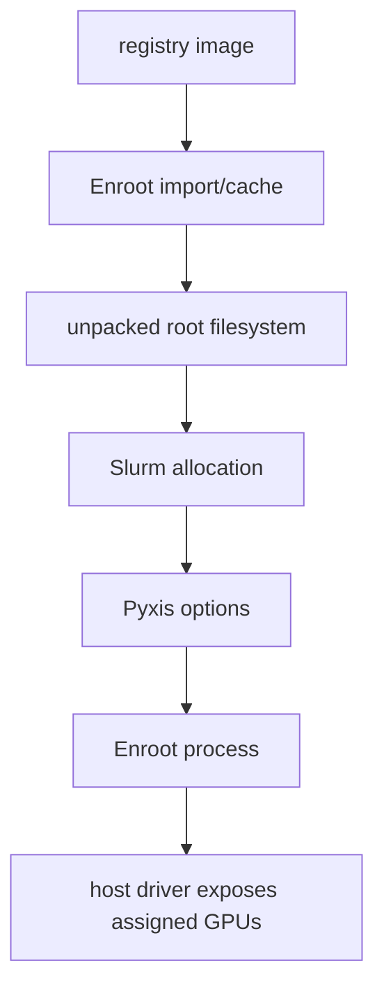
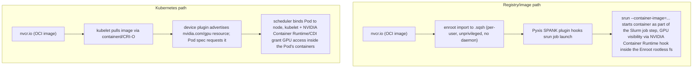

**Learning outcome:** Explain why HPC clusters run containers differently from Kubernetes, walk the Enroot/Pyxis workflow end to end, and diagnose a container that can't see the GPU.

## Start here — separate the image, runtime, and scheduler integration

The word "container" hides three different responsibilities:

- An **image** is a packaged user-space filesystem plus metadata. It does not run by itself.
- A **runtime** creates an isolated process view from that image. Enroot fills this role without a permanent privileged daemon.
- A **scheduler integration** starts that runtime inside resources already allocated to a job. Pyxis connects Slurm to Enroot through Slurm's SPANK plugin interface.



The host still owns the kernel, NVIDIA kernel driver, devices, cgroups, network, and mounted storage. The image supplies user-space libraries and the application. This explains two frequent surprises: a container cannot carry its own Linux kernel, and shipping CUDA user-space libraries does not eliminate the need for a compatible host driver.

### A safe progression for your first container job

1. Prove the image can be imported and started without a GPU.
2. Print identity, mounts, working directory, and environment inside it.
3. Request one GPU through Slurm and run `nvidia-smi` inside the container.
4. Run a tiny CUDA/framework device check.
5. Only then add multiple GPUs, nodes, MPI/PMIx, NCCL, and production storage.

At each step compare host, Slurm allocation, and container views. If Slurm allocates no GPU, Enroot cannot create one. If `/dev/nvidia*` is present but a framework fails, compare host driver and container user-space compatibility. If an image repeatedly downloads or extraction fills a filesystem, inspect Enroot cache/data paths and permissions. If a mount is absent, distinguish "source path missing on host" from "mount not requested" from "policy denied it."

## Why not just run Docker on the cluster

Docker's architecture assumes a persistent, root-owned daemon (`dockerd`) that every container launch talks to over a socket. On a shared multi-tenant HPC node — where dozens of different research groups' jobs land on the same physical machine via Slurm, often back-to-back within minutes of each other — that model is a security and operational liability: any user who can reach the Docker socket can, in practice, get root on the host (mount `/`, `--privileged`, escape via a known daemon CVE), and running a long-lived daemon per compute node adds an attack surface and a failure mode (`dockerd` wedged = every container on that node is stuck) that HPC operators have historically refused to accept on shared supercomputing-style infrastructure. This is why traditional HPC sites containerized late and cautiously, and why Singularity/Apptainer and later Enroot emerged specifically to give researchers containers *without* a privileged daemon in the loop.

## What Enroot solves

Enroot is an unprivileged container runtime built for exactly this constraint. It:

- Runs entirely as the invoking user — no daemon, no root requirement, no setuid binary in the common path.
- Imports Docker/OCI images **directly** — no separate registry proxy or conversion service — flattening the image's layers into a single squashed rootless filesystem image (`.sqsh`) that the user's own account owns and controls.
- Starts containers as regular user-namespaced processes: from the kernel's point of view, it's just another process tree owned by that user, not a container-runtime-mediated root process.

```bash
enroot import docker://nvcr.io#nvidia/pytorch:24.05-py3
enroot create --name pt2405 nvidia+pytorch+24.05-py3.sqsh
enroot start --root --rw pt2405 nvidia-smi
```

`enroot import` downloads the image, flattens its layers, and writes `nvidia+pytorch+24.05-py3.sqsh` — a squashed, rootless filesystem image. `enroot create` unpacks that squash file and registers it as a named, runnable container (`pt2405`). `enroot start` runs a command inside the container as the invoking user; `--rw` makes the container filesystem writable for this invocation, and `--root` maps the user to container-root (still unprivileged on the host) for install-time operations.

## Pyxis: the Slurm SPANK plugin

Enroot alone still requires a user to manually import/create/start containers around their job. **Pyxis** is a Slurm SPANK plugin — SPANK being Slurm's supported extension mechanism for hooking into job launch — that adds container-aware flags directly to `srun`, so a container launches as a first-class part of a normal Slurm job rather than needing a separate orchestrator layered on top of the scheduler. This is the core architectural difference from Kubernetes: **containerization and scheduling compose in the same command**, instead of Slurm handing off to something else that then talks to a container runtime.

```bash
$ srun --nodes=2 --ntasks-per-node=4 --gpus-per-node=4 \
    --container-image=nvcr.io#nvidia/pytorch:24.05-py3 \
    --container-mounts=/lustre/datasets:/data,/lustre/checkpoints:/ckpt \
    --container-workdir=/workspace \
    python train.py --data /data/imagenet --ckpt-dir /ckpt

pyxis: importing docker image: nvcr.io#nvidia/pytorch:24.05-py3
pyxis: img: nvidia+pytorch+24.05-py3 successfully imported and cached
pyxis: creating container filesystem...
pyxis: starting container...
==========
== PyTorch ==
==========
NVIDIA Release 24.05 (build 12345678)
...
Epoch 1: loss=4.213 step_time=0.812s
```

Pyxis handles the `enroot import`/`create`/`start` sequence transparently behind `--container-image`; `--container-mounts` is the Enroot/Pyxis equivalent of a Kubernetes volume mount — a bind mount from a host path into the container's filesystem — and is required for any dataset, checkpoint, or scratch path the job needs, since the squashed container image itself is otherwise self-contained and sees nothing of the host filesystem beyond the standard bind mounts Pyxis sets up by default.



Both paths ultimately run the same OCI images and the same NVIDIA driver/toolkit underneath — the difference is entirely in launch mechanism and isolation model. Slurm+Pyxis composes container launch into a scheduler that already understands multi-node MPI-style jobs and **gang scheduling** — the property that a distributed job needs all of its N processes running and rendezvoused at the same time to make forward progress at all, since a collective operation (an all-reduce across GPUs, for example) blocks every participant until every other participant arrives; a scheduler that gang-schedules either allocates all N nodes together or queues the whole job, rather than starting some ranks early and leaving them idle waiting for the rest. Kubernetes, by contrast, composes container launch into a continuously-reconciled desired-state model: a controller watches a declared Pod spec and keeps nudging the live cluster toward it, and GPU visibility is advertised through a **device plugin** (a small daemon that tells the kubelet "this node has N allocatable `nvidia.com/gpu` resources") combined with **CDI (Container Device Interface)** — a standard, vendor-neutral file format that describes exactly which device nodes, driver libraries, and environment variables a container needs to see a GPU, which the container runtime reads and injects at container-start time. Sites running both typically choose per-workload: Slurm/Enroot/Pyxis for traditional HPC/MPI-heavy training and simulation jobs, Kubernetes for service-shaped or elastically-scaled inference and platform workloads — nothing prevents the same GPU images from running under either.

## Common failure modes

- **Missing `--container-mounts` for dataset paths.** The squashed image is self-contained; a job referencing `/data/imagenet` that forgot `--container-mounts=/lustre/datasets:/data` fails with a mundane "path not found" inside the container even though the path is right there on the host filesystem — this is the single most common Enroot support ticket.
- **GPU not visible inside the container despite the host seeing it.** Enroot needs the NVIDIA Container Runtime hook correctly registered (`/etc/enroot/hooks.d/` or the equivalent `nvidia-container-runtime` hook config) for GPU devices and driver libraries to be bind-mounted into the container at start time. This is a *different* mechanism from Kubernetes' CDI-based GPU advertisement (where a device plugin advertises the GPU as an allocatable resource and the runtime injects device nodes/libraries per a CDI spec file at container-start) — same end goal, different injection path — so a working Kubernetes GPU path on the same node says nothing about whether Enroot's separate hook is configured correctly.
- **Squash/unsquash disk pressure on shared filesystems.** Large images (multi-GB PyTorch/CUDA base images) squashed per-user onto a shared NFS/Lustre home or scratch filesystem multiply quickly across a research team; Enroot's image cache location (`ENROOT_CACHE_PATH`, `ENROOT_DATA_PATH`) needs deliberate placement (often local NVMe scratch, not networked home directories) or shared clusters silently run out of quota during a burst of concurrent imports.

## Worked scenario

**Situation:** A job's container can't see the GPU even though `nvidia-smi` works fine on the bare host.

1. Confirm the host-level baseline first: `nvidia-smi -L` on the compute node directly — if this fails, it's not a container problem at all, it's a driver/node problem (out of scope for Enroot).
2. Check whether Enroot's NVIDIA hook is actually enabled: look for `/etc/enroot/hooks.d/*nvidia*` on the node and confirm it's not disabled or missing (a fresh BCM-imaged node or an updated Enroot package can silently drop this file). Without it, Enroot has no mechanism to bind-mount driver libraries/devices into the rootless filesystem at all — the container will run, `nvidia-smi` inside it will report "command not found" or "no devices found," and the failure looks identical to a permissions problem but is actually a missing-hook problem.
3. If the hook is present, check Pyxis/Enroot's own logging for whether the hook fired: rerun with `srun --container-image=... --container-remap-root nvidia-smi -L` and read the Pyxis import/create log lines for any hook-related error, and check that the job actually requested GPU resources — via `--gpus-per-node` or Slurm's older, more general resource-request syntax `--gres=gpu:N` (GRES stands for "Generic RESource," Slurm's mechanism for tracking and allocating resources beyond plain CPU/memory, of which GPUs are the most common example) — Enroot's NVIDIA hook typically keys off the same GPU-visibility environment variable (`NVIDIA_VISIBLE_DEVICES`, which lists which GPU indices/UUIDs a container is allowed to see) that the Kubernetes/CDI path also uses, but sets it via the hook rather than via CDI device injection, so an empty or unset `NVIDIA_VISIBLE_DEVICES` inside the container is the tell either way.
4. Compare against the Kubernetes path only to rule things out, not to fix Enroot: if the same node's Kubernetes-launched Pods see GPUs fine via CDI, that confirms the driver and device nodes are healthy on the host — it does **not** confirm Enroot's separate hook configuration is correct, because the two mechanisms are independent code paths achieving the same end state through different injection points.
5. Fix is almost always one of: reinstall/re-enable the Enroot NVIDIA hook package, correct an `ENROOT_RUNTIME_PATH`/hook ordering misconfiguration, or add the missing `--gpus-per-node`/GRES request to the `srun` line so Slurm allocates and Pyxis wires up GPU visibility in the first place.

**Conclusion:** "the host can see the GPU" and "Enroot's hook injects GPU visibility into this specific container" are two independent facts — treat a working Kubernetes GPU path on the same node as evidence the driver is fine, never as evidence Enroot is configured correctly.

**Mnemonic:** "**No daemon, no root, no visibility without the hook.**" Enroot buys you no-daemon/no-root by not doing anything Docker's daemon does automatically — including GPU visibility, which has to be explicitly wired via its own NVIDIA hook rather than inherited from a system-wide container runtime config.

**Interview-ready line:** "Enroot gives HPC clusters unprivileged, daemonless containers built directly from OCI images, and Pyxis is the Slurm SPANK plugin that makes `srun --container-image=...` launch one as part of a normal job — same images as Kubernetes' GPU containers, but composed into the scheduler instead of into a separate orchestrator, and GPU visibility inside it depends on Enroot's own NVIDIA hook, not on the CDI path Kubernetes uses."

## Practice

1. Why does a privileged, persistently-running container daemon like classic `dockerd` pose a specifically worse risk on a shared multi-tenant HPC node than on a single-tenant cloud VM?
2. Walk through what `enroot import`, `enroot create`, and `enroot start` each do, and which of the three Pyxis performs transparently on your behalf when you use `srun --container-image=...`.
3. A researcher's job fails with "file not found: /data/train.csv" inside an Enroot/Pyxis container, but `/lustre/datasets/train.csv` exists on the host. What flag did they most likely omit, and why does the squashed image make this failure mode inevitable without it?
4. Explain why "Kubernetes Pods on this node can see the GPU" is not sufficient evidence that an Enroot container on the same node will also see the GPU.
5. Name one operational reason a large research site running both Slurm/HPC training jobs and Kubernetes-based inference services might legitimately keep both stacks rather than migrating everything to one.
