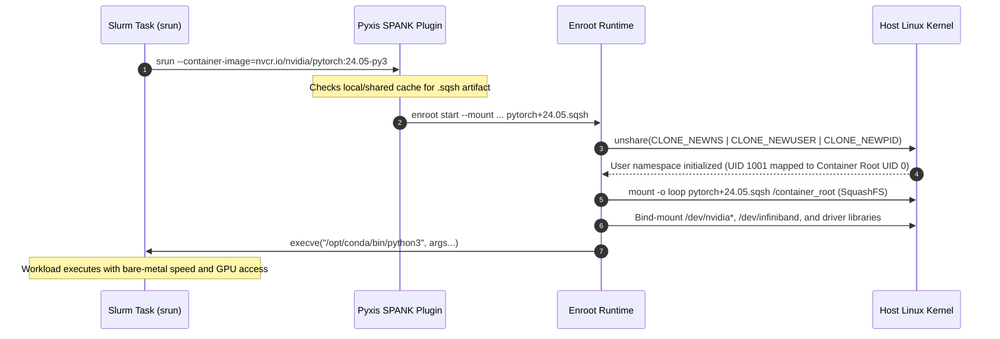
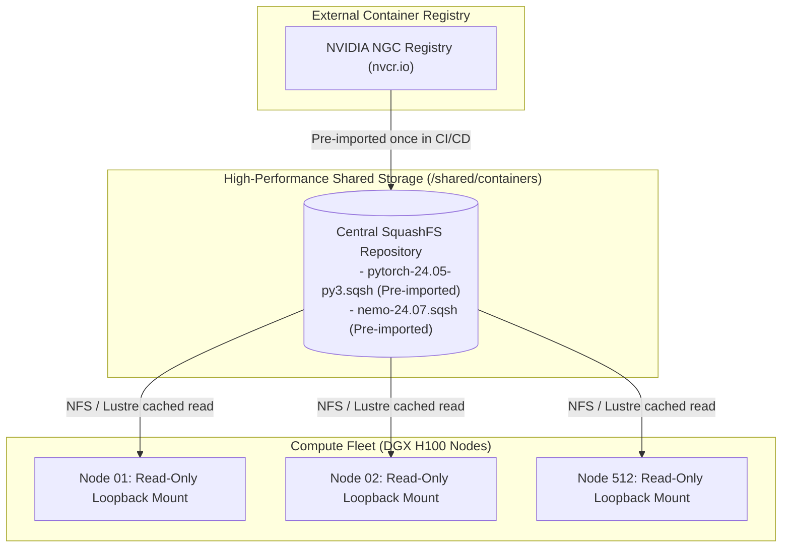

# Chapter 8 — Enroot and Pyxis: Unprivileged Containers for AI Supercomputing

In enterprise AI supercomputing, deploying containerized deep learning workloads across thousands of GPUs presents a severe architectural dilemma. Traditional container engines (such as Docker) rely on a persistent, root-privileged daemon (`dockerd`). In a shared, multi-tenant HPC cluster governed by Slurm, granting users access to a root-owned container daemon breaks security boundaries, risks container escapes, and creates operational bottlenecks.

To deliver cloud-native container convenience with bare-metal HPC performance, NVIDIA developed **Enroot** and **Pyxis**:
- **Enroot**: A lightweight, rootless container runtime that translates standard OCI/Docker container images into simple, unprivileged **SquashFS filesystems**.
- **Pyxis**: A Slurm **SPANK (Slurm Plug-in Architecture for Node and Job (K)ontrol)** plugin that integrates Enroot directly into `srun` and `sbatch`, allowing researchers to execute containerized AI workloads natively without root privileges or long-lived daemons.

As an **NVIDIA Senior Solutions Architect**, you must understand why Enroot and Pyxis form the container backbone of the **NVIDIA DGX SuperPOD**, how GPU and InfiniBand devices are mapped into unprivileged user namespaces, and how to engineer large-scale image caching architectures that prevent container registry pull-storms.

---

## 1. Architectural Contrast: Docker/Kubernetes vs. Enroot/Pyxis

```mermaid
flowchart TD
    subgraph CloudNative["Traditional Cloud-Native (Docker / Kubernetes)"]
        D_USER["User Request"] --> KUBELET["kubelet (Root Daemon)"]
        KUBELET --> CRI["CRI Runtime (containerd)"]
        CRI --> OCI_HOOK["NVIDIA Container Toolkit Hook"]
        OCI_HOOK --> D_CONT["Container (Rootless or Root daemon overhead)"]
    end

    subgraph HPC_Native["HPC & AI Supercomputing (Enroot / Pyxis)"]
        H_USER["srun --container-image=..."] --> SLURM_D["slurmd (Root Daemon)"]
        SLURM_D --> SPANK["Pyxis SPANK Plugin (Runs in job context)"]
        SPANK --> ENROOT["Enroot (Unprivileged User Process)"]
        ENROOT --> SQSH["Mounts SquashFS (.sqsh) in User Namespace"]
        ENROOT --> DEV_MAP["Bind-mounts /dev/nvidia* and /dev/infiniband"]
        DEV_MAP --> H_CONT["Native Process in Linux Namespaces (Zero Daemon)"]
    end
```



### Architectural Comparison

| Dimension | Docker / containerd in K8s | Enroot + Pyxis in Slurm |
|---|---|---|
| **Daemon Architecture** | Persistent root daemon (`dockerd`, `containerd`). | **Daemonless**. Invoked as a transient process by the user. |
| **Privilege Model** | Requires root daemon or complex RootlessKit translation. | Native Linux **User Namespaces (`CLONE_NEWUSER`)**; completely unprivileged. |
| **Filesystem Model** | OverlayFS with multi-layered read-write COW stacks. | **SquashFS single-file image** mounted read-only loopback with memory/tmpfs overlay. |
| **Startup Overhead** | 2–5 seconds per container; registry API round-trips. | **< 200 milliseconds** per container task. |
| **Slurm Integration** | Awkward wrapper scripts or external agents. | **Native SPANK flags** (`--container-image`, `--container-mounts`). |
| **GPU & RDMA Injection** | NVIDIA Container Toolkit (CDI or OCI prestart hooks). | Enroot native hardware configuration hooks (`enroot.conf`). |

---

## 2. Enroot Internal Mechanics: SquashFS and Hardware Injection

Enroot avoids layered container file systems (OverlayFS) because managing thousands of directory inodes over parallel file systems (Lustre, GPFS) causes severe metadata latency.

Instead, Enroot flattens an entire Docker/OCI container image into a **single, compressed SquashFS file (`.sqsh`)**.



### Hardware Device and Driver Passthrough

How does an unprivileged Enroot container access host GPUs and 400G InfiniBand adapters without running as root?
1. **Device Isolation via Slurm cgroups**: Prior to Enroot execution, Slurm creates the job step's cgroup and whitelists only the assigned `/dev/nvidiaX` minor device files.
2. **Enroot Hardware Hooks (`/etc/enroot/environ.d/nvidia.conf`)**:
   Enroot automatically detects the presence of the NVIDIA driver on the host and dynamically bind-mounts:
   - GPU character device nodes: `/dev/nvidiactl`, `/dev/nvidia-uvm`, `/dev/nvidia-uvm-tools`, and assigned `/dev/nvidia0..7`.
   - InfiniBand Verbs device nodes: `/dev/infiniband/uverbs0..7`, `/dev/infiniband/rdma_cm`.
   - User-space driver libraries: `libcuda.so.1`, `libnvidia-ml.so.1`, `libnvidia-ptxjitcompiler.so.1`, and `libibverbs.so.1`.

---

## 3. Large-Scale Image Caching Architecture

When a researcher launches a 512-node job (4,096 GPUs) requesting `--container-image=nvcr.io#nvidia/pytorch:24.05-py3`, allowing 4,096 tasks to simultaneously pull a 20GB container image from NVIDIA GPU Cloud (NVCR) will cause:
1. Instant rate-limiting and connection timeouts from the container registry.
2. Massive saturation of the cluster’s internet egress gateway.
3. Severe job startup delays (20–40 minutes).



### The Solution: Pre-Imported Central SquashFS Caching

1. **Pre-Staging in CI/CD**:
   Images are imported once using `enroot import` and saved as `.sqsh` files on the shared parallel file system:
   ```bash
   # Central administrative pull and compression
   enroot import -o /shared/containers/pytorch-24.05-py3.sqsh docker://nvcr.io#nvidia/pytorch:24.05-py3
   ```
2. **Submitting via Direct File Path**:
   Users point Pyxis directly to the `.sqsh` path:
   ```bash
   srun --nodes=64 --ntasks-per-node=8 --gpus-per-node=8 \
     --container-image=/shared/containers/pytorch-24.05-py3.sqsh \
     --container-mounts=/shared/datasets:/data,/shared/checkpoints:/ckpt \
     python3 /workspace/train.py
   ```
3. **Startup Acceleration**: Because SquashFS is read-only and sequential, the parallel storage filesystem (Lustre / GPFS / WEKA) caches the file blocks in memory. All 512 nodes mount the image in **less than 3 seconds**, with zero external network traffic.

---

## 4. Senior Solutions Architect Interview Scenarios

### Scenario 1: Pyxis Fails to Enumerate GPUs Inside the Container
**Interviewer:** *"A customer runs `srun --gpus=8 --container-image=... nvidia-smi` and receives: `NVIDIA-SMI has failed because it couldn't communicate with the NVIDIA driver`. However, running `nvidia-smi` on the host works cleanly. How do you triage this?"*

**Candidate Answer:**
> "This indicates that **Enroot failed to inject the NVIDIA driver libraries or device nodes into the container's mount namespace**:
> 1. **Check Enroot Configuration:** I inspect `/etc/enroot/enroot.conf` and `/etc/enroot/environ.d/nvidia.conf`. Enroot relies on `ENROOT_CONFIG_PATH` to discover GPU injection hooks. If `MELLANOX_VISIBLE_DEVICES` or `NVIDIA_VISIBLE_DEVICES` is set to `void` or unset in the user's environment, Enroot will skip GPU device bind-mounts.
> 2. **Inspect Slurm cgroup Constraints:** I verify if Slurm's device cgroup whitelisted `/dev/nvidiactl` and `/dev/nvidia-uvm`. If the Slurm `cgroup.conf` whitelists `/dev/nvidia0..7` but omits the control character devices, `nvidia-smi` inside the container cannot initialize the NVML handshake with the kernel module.
> 3. **Library Path Resolution:** If the host OS installed the NVIDIA driver in non-standard paths (e.g., custom library directories instead of `/usr/lib64`), Enroot's dynamic linker search path will fail to find `libcuda.so.1`. Adding the driver path to `/etc/enroot/mounts.d/nvidia.conf` resolves the issue immediately."

---

### Scenario 2: Enroot vs. Kubernetes/Containerd for Large Foundation Models
**Interviewer:** *"Why does NVIDIA recommend Enroot and Pyxis over standard Kubernetes for pre-training massive 400B+ parameter LLMs in DGX SuperPOD architectures?"*

**Candidate Answer:**
> "NVIDIA recommends Enroot and Pyxis for large-scale pre-training due to **operational simplicity, bare-metal I/O performance, and tight coupling with high-performance networking**:
> 1. **Zero Daemon Overhead:** Kubernetes requires long-lived `kubelet`, `containerd`, and CNI network plugin daemons on every compute node. In an extreme-scale synchronized training run across 2,048 GPUs, periodic background housekeeping threads in these daemons induce CPU core scheduling jitter, causing barrier synchronization delays in NCCL All-Reduce. Enroot has zero daemons; once launched, the container is simply a standard Linux process tree.
> 2. **SquashFS vs. Layered OverlayFS:** In large foundation model training, loading thousands of small Python packages and model tokenizers over distributed file systems causes severe metadata lock contention on OverlayFS. Enroot’s single-file SquashFS layout is optimized for high-bandwidth sequential I/O and loopback block caching.
> 3. **Native Slurm Integration:** Slurm provides unmatched multi-node gang scheduling, hardware topology reservation, and integration with InfiniBand Subnet Managers (OpenSM). Pyxis allows researchers to leverage these HPC capabilities without giving up modern OCI container packaging."

---

## Key Takeaways

1. **Rootless by Design:** Enroot requires no root privileges and runs without a persistent daemon, eliminating container escape security risks on multi-tenant HPC nodes.
2. **SquashFS Eliminates Inode Storms:** Converting OCI images to single `.sqsh` files prevents parallel file system metadata bottlenecks during distributed container initialization.
3. **Pyxis Provides First-Class Slurm Flags:** Pyxis integrates Enroot into `srun` (`--container-image`, `--container-mounts`), unifying scheduling and containerization in a single command.
4. **Pre-Importing Prevents Registry Overload:** Pre-stage compressed `.sqsh` images on shared storage to enable instant container startup across thousands of GPUs without external registry pull-storms.
5. **Hardware Passthrough is Automatic:** Enroot dynamically binds `/dev/nvidia*`, `/dev/infiniband`, and host driver libraries directly into the container's mount namespace.
