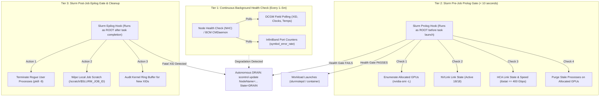

# Chapter 9 — Job Provisioning, Health Gating, and Workflow Orchestration

In an **NVIDIA AI Factory**, raw node availability is a dangerous illusion. A compute node can pass basic operating system boot, report a healthy status to the Slurm controller, and advertise 8 GPUs, while harboring a degraded NVLink connection, an intermittent PCIe AER error, or a flapped 400 Gb/s InfiniBand port. 

Because large-scale distributed training relies on **gang-scheduled, synchronized collectives** (such as `All-Reduce`), every GPU in a job must complete its backward pass before the model weights can synchronize. If one GPU among 1,024 operates at 20% degraded throughput—a **silent straggler**—the entire multi-million dollar job slows to the speed of that degraded GPU. Even worse, if a single GPU drops off the bus mid-job due to an unhandled ECC failure, the entire multi-node run aborts.

As an **NVIDIA Senior Solutions Architect**, you must design an automated, multi-tiered **Hardware Health Gating Architecture**. This chapter covers pre-job admission gates, automated Slurm Prolog and Epilog hooks, NVIDIA Data Center GPU Manager (DCGM) diagnostic tiers, and autonomous node quarantining.

---

## 1. The Straggler Problem and Multi-Tiered Health Architecture

In a distributed training run across `N` nodes, hardware Mean Time Between Failures (MTBF) scales inversely with cluster size:

```text
Cluster MTBF = Single Node MTBF / N
```

If a single DGX node has an MTBF of 1,000 days (~3 years), a cluster of 512 DGX nodes (4,096 GPUs) will experience an unhandled hardware fault or link drop every **1.95 days**. Without proactive health gating, jobs spend more time crashing, restarting, and reloading checkpoints than making training progress.



---

## 2. NVIDIA DCGM Diagnostic Tiers

The **NVIDIA Data Center GPU Manager (DCGM)** provides standardized, active diagnostic testing engines capable of identifying subtle hardware, thermal, and memory defects.

| Diagnostic Tier | Command | Execution Time | Scope & Verification Engine | Operational Phase |
|---|---|---|---|---|
| **Level 1 (Quick)** | `dcgmi diag -r 1` | 5–10 seconds | Blacklist test, NVML API functionality, CUDA runtime initialization, basic PCIe bus enumeration. | Used in **Slurm Job Prolog** before every job launch. |
| **Level 2 (Medium)** | `dcgmi diag -r 2` | 2–5 minutes | PCIe Gen5 bus bandwidth validation, GPUDirect P2P bandwidth, targeted memory stress. | Used during **scheduled maintenance** and after node boot/join. |
| **Level 3 (Stress)** | `dcgmi diag -r 3` | 15–30 minutes | Full Tensor Core stress (FP16/FP8/TF32 GEMM kernels), maximum power draw verification, deep HBM3 memory ECC error generation. | Used during **Day-0 node acceptance**, RMA hardware burn-in, and after node drain. |

### Running Level 1 Diagnostic as an Admission Test

```bash
$ sudo dcgmi diag -r 1 -j
{
  "version": "3.3.5",
  "gpu_count": 8,
  "test_categories": [
    {
      "category": "Deployment",
      "tests": [
        {"name": "Denylist", "status": "Pass"},
        {"name": "NVML Library", "status": "Pass"},
        {"name": "CUDA Main Library", "status": "Pass"},
        {"name": "Permissions and Devices", "status": "Pass"}
      ]
    },
    {
      "category": "Hardware",
      "tests": [
        {"name": "Memory", "status": "Pass"},
        {"name": "PCIe", "status": "Pass"}
      ]
    }
  ],
  "overall_result": "Pass"
}
```

---

## 3. Production Slurm Prolog Implementation: The Pre-Job Gate

The Slurm `Prolog` script executes as `root` on every allocated compute node immediately before the user's workload container or task launches. If the script exits with a non-zero return code, **Slurm cancels the job step on this node and drains the machine**, protecting the customer from running on bad silicon.

```bash
#!/usr/bin/env bash
# /etc/slurm/prolog.d/90-ai-health-gate.sh
# Slurm Job Prolog Health Gate for NVIDIA DGX H100
# Target execution time: < 8 seconds

set -euo pipefail

NODE_NAME="$(hostname -s)"
LOG_FILE="/var/log/slurm/prolog_health.log"
DRAIN_REASON=""

drain_node() {
    local reason="$1"
    echo "$(date '+%Y-%m-%d %H:%M:%S') [CRITICAL] Draining ${NODE_NAME}: ${reason}" >> "${LOG_FILE}"
    # Issue administrative drain to Slurm controller
    scontrol update NodeName="${NODE_NAME}" State=DRAIN Reason="PrologFail: ${reason}"
    exit 1
}

# 1. Verify all 8 physical GPUs are enumerated and responsive to NVML
GPU_COUNT=$(nvidia-smi --query-gpu=name --format=csv,noheader | wc -l)
if [ "${GPU_COUNT}" -ne 8 ]; then
    drain_node "Missing GPUs! Expected 8, enumerated ${GPU_COUNT}"
fi

# 2. Check for active uncorrectable ECC memory errors
UNCORRECTABLE_ECC=$(nvidia-smi --query-gpu=ecc.errors.uncorrected.volatile.total --format=csv,noheader,nounits | awk '{s+=$1} END {print s}')
if [ "${UNCORRECTABLE_ECC}" -gt 0 ]; then
    drain_node "Uncorrectable ECC memory errors detected (Count: ${UNCORRECTABLE_ECC})"
fi

# 3. Check for GPU Thermal or Power Hardware Slowdown
THROTTLED=$(nvidia-smi --query-gpu=clocks_event_reasons.hw_slowdown,clocks_event_reasons.sw_thermal_slowdown --format=csv,noheader | grep -ic "ACTIVE" || true)
if [ "${THROTTLED}" -gt 0 ]; then
    drain_node "Active Thermal/Hardware throttling detected on GPUs"
fi

# 4. Verify InfiniBand Compute HCAs (8x ConnectX-7 adapters active at 400 Gbps)
EXPECTED_HCA_PORTS=8
ACTIVE_HCA_PORTS=$(ibstat | grep -E "State: Active" | wc -l)
if [ "${ACTIVE_HCA_PORTS}" -lt "${EXPECTED_HCA_PORTS}" ]; then
    drain_node "InfiniBand degradation! Active ports: ${ACTIVE_HCA_PORTS}/${EXPECTED_HCA_PORTS}"
fi

# Verify link speed is NDR 400G (Active at 4X Rate 100G)
DEGRADED_RATES=$(ibstat | grep "Rate:" | grep -v "400" | wc -l || true)
if [ "${DEGRADED_RATES}" -gt 0 ]; then
    drain_node "InfiniBand link speed trained down below 400G line rate"
fi

# 5. Clean up any leftover orphan GPU processes from previous jobs
ORPHAN_PIDS=$(nvidia-smi --query-compute-apps=pid --format=csv,noheader)
if [ -n "${ORPHAN_PIDS}" ]; then
    echo "$(date '+%Y-%m-%d %H:%M:%S') [WARN] Killing orphan GPU processes: ${ORPHAN_PIDS}" >> "${LOG_FILE}"
    echo "${ORPHAN_PIDS}" | xargs -r kill -9 || true
fi

echo "$(date '+%Y-%m-%d %H:%M:%S') [PASS] Node ${NODE_NAME} passed health gate for Job ${SLURM_JOB_ID}" >> "${LOG_FILE}"
exit 0
```

---

## 4. Production Slurm Epilog Implementation: Post-Job Sanitization

When a training job terminates (whether by successful completion, cancellation, or crash), the compute node must be sanitized before being returned to the eligible scheduling pool. Residual zombie processes holding GPU VRAM, leaked IPC shared memory segments, or corrupt temporary files will cause the next user's job to fail.

```bash
#!/usr/bin/env bash
# /etc/slurm/epilog.d/99-ai-cleanup.sh
# Slurm Job Epilog: Process Cleanup, Scratch Purge, and Kernel XID Audit

set -uo pipefail

NODE_NAME="$(hostname -s)"
LOG_FILE="/var/log/slurm/epilog_cleanup.log"

# 1. Forcibly terminate any residual user processes belonging to the finished job
if [ -n "${SLURM_JOB_USER:-}" ]; then
    pkill -9 -u "${SLURM_JOB_USER}" || true
fi

# 2. Release allocated GPU memory and reset compute modes
nvidia-smi --gpu-reset || true

# 3. Purge job-specific local scratch and container overlays
if [ -n "${SLURM_JOB_ID:-}" ]; then
    SCRATCH_DIR="/scratch/job_${SLURM_JOB_ID}"
    if [ -d "${SCRATCH_DIR}" ]; then
        rm -rf "${SCRATCH_DIR}"
    fi
fi

# 4. Audit Kernel dmesg for Critical NVIDIA XIDs during the job run
# Critical XIDs: 79 (GPU fallen off bus), 48 (Double-bit ECC), 62 (Internal Microcontroller fault)
CRITICAL_XIDS=$(dmesg -T --since "5 minutes ago" | grep -E "NVRM: Xid.*:( 79| 48| 62)" | tail -n 1 || true)
if [ -n "${CRITICAL_XIDS}" ]; then
    echo "$(date '+%Y-%m-%d %H:%M:%S') [CRITICAL] Fatal XID encountered: ${CRITICAL_XIDS}" >> "${LOG_FILE}"
    scontrol update NodeName="${NODE_NAME}" State=DRAIN Reason="EpilogFail: Fatal ${CRITICAL_XIDS}"
fi

exit 0
```

---

## 5. Senior Solutions Architect Interview Scenarios

### Scenario 1: The "Silent Straggler" in a 1,024-GPU Cluster
**Interviewer:** *"A research team is training a 405B parameter model across 128 DGX H100 nodes. Every few hours, training step time doubles from 1.2 seconds to 2.4 seconds, but no node crashes, and no errors appear in Slurm logs. How do you design an automated system to detect and isolate the offending straggler?"*

**Candidate Answer:**
> "This is the classic synchronized collective straggler problem:
> 1. **Data Plane vs. Kernel Symptoms:** In synchronized PyTorch DDP or Megatron pipeline training, a single GPU running slow forces all 1,023 other GPUs to sit idle in `ncclKernel_AllReduce` execution. Standard monitoring metrics like GPU utilization will show 100% across all GPUs because idling in an active collective spinlock registers as 100% compute utilization!
> 2. **Telemetry Collection via DCGM:**
>    - I deploy **DCGM Exporter with custom high-frequency profiling metrics**: `DCGM_FI_DEV_GPU_UTIL`, `DCGM_FI_DEV_MEM_COPY_UTIL`, and specifically `DCGM_FI_PROF_SM_ACTIVE` (Streaming Multiprocessor activity) vs `DCGM_FI_PROF_PIPE_TENSOR_ACTIVE`.
>    - Crucially, I monitor **InfiniBand port packet error rates and congestion marks** (`port_rcv_switch_relay_errors`, `PortXmitWait`).
> 3. **The Root Cause:** A degraded optical transceiver on one ConnectX-7 HCA causes forward error correction (FEC) packet retransmits. The link does not drop, but effective bandwidth falls from 400 Gbps to 120 Gbps, creating an RDMA bottleneck.
> 4. **Automated Isolation Architecture:**
>    - We implement an **NCCL Health Hook** using `NCCL_DEBUG=INFO` and `NCCL_DEBUG_SUBSYS=COLL` to log per-rank all-reduce latency.
>    - We configure an automated Prometheus alert: if any node’s `PortXmitWait` spikes by $> 3\sigma$ relative to cluster peers, the orchestrator triggers an automatic Slurm step pause, checkpoints the job, drains the straggler node, and resumes the job on a spare healthy node."

---

### Scenario 2: Distinguishing Transient Workload Errors from True Hardware Defects
**Interviewer:** *"When a GPU job crashes with CUDA error: out of memory or a PyTorch assertion failure, should the node be drained by the Epilog script?"*

**Candidate Answer:**
> "No, draining a node on application-layer errors is a severe operational flaw that leads to unnecessary cluster depletion:
> 1. **Categorizing the Error Boundary:**
>    - **Application/Software Errors (No Drain):** CUDA Out of Memory (OOM), NaN loss assertions, missing container libraries, and SIGKILL (exit code 137 from hitting memory cgroups) are purely user-space faults. The node hardware is completely healthy. The Epilog must cleanly purge `/tmp`, reset GPU memory via `nvidia-smi --gpu-reset`, and leave the node in `IDLE` state.
>    - **Hardware/Driver Faults (Immediate Drain):** Hardware faults are identified strictly by kernel-level indicators: NVIDIA XID errors logged in `dmesg`, InfiniBand link-state flapping, PCIe AER fatal errors, or uncorrectable double-bit ECC events.
> 2. **Remediation Architecture:**
>    The Epilog checks kernel ring buffers specifically for fatal hardware XIDs (e.g., XID 79 for GPU fallen off the bus, XID 48 for double-bit ECC, XID 62 for microcode panic). Only upon matching verified hardware signatures does it issue `scontrol update NodeName=... State=DRAIN`."

---

## Key Takeaways

1. **Availability $\neq$ Readiness:** A node answering ping and running `slurmd` is not ready to train. Every node must pass active hardware gates before receiving work.
2. **Gang Scheduling Amplifies Degradation:** In multi-node AI training, a single degraded GPU running 20% slow wastes 100% of the computing capacity across the entire allocated partition.
3. **Prolog Prevents Waste; Epilog Guarantees Cleanliness:** The Slurm Prolog runs in under 10 seconds to validate GPU enumeration, NVLink mesh, and InfiniBand line rates. The Epilog kills zombie processes, resets GPU state, and checks for hardware XIDs.
4. **DCGM Diagnostic Tiers Serve Different Lifecycles:** Use Level 1 for rapid pre-job admission, Level 2 for scheduled maintenance, and Level 3 for Day-0 burn-in and post-drain hardware qualification.
5. **Never Drain on User-Space Errors:** Differentiate application exceptions (OOM, PyTorch NaNs) from hardware faults (XID 79, PCIe AER, double-bit ECC) to prevent artificial cluster starvation.
