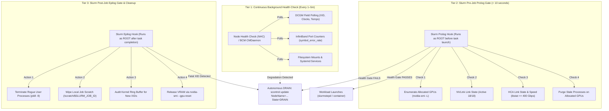
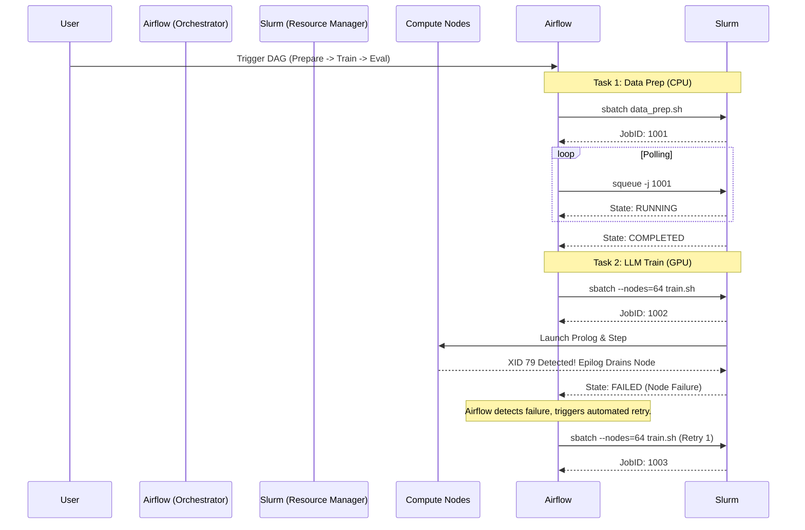

# Chapter 9 — Job Provisioning, Health Gating, and Workflow Orchestration

**Learning outcome:** Architect, write, and safely operate production-grade job provisioning, health gating mechanisms, and workflow orchestrations in an NVIDIA AI Factory. You will master Slurm Prolog/Epilog hooks, DCGM diagnostics, hardware error identification (XID codes), automated node quarantining, Node Health Check (NHC) framework integration, and workflow orchestration concepts using Apache Airflow and Kubeflow. You will also dive deep into PyTorch DDP submission scripts, Kubernetes Volcano schedulers, and Prometheus alerting rules for silent straggler detection.

**Prerequisites:** Familiarity with Linux command line, cluster computing basics, basic Slurm administration (`slurm.conf`), Python/Bash scripting, Kubernetes fundamentals, and distributed training concepts.

**Difficulty:** Beginner to Advanced.

**Estimated reading time:** 150 minutes plus hands-on implementation practice.

---

## 1. Foundations: The AI Factory Job Lifecycle and the Threat of Stragglers

In traditional High-Performance Computing (HPC) running CPU-bound simulation workloads, jobs are often loosely coupled (e.g., Monte Carlo simulations or rendering farms). If one compute node fails, the overall throughput of a cluster decreases slightly, but other jobs continue unaffected.

In an **NVIDIA AI Factory**, raw node availability is a dangerous illusion. A compute node can pass basic operating system boot, report an `idle` (healthy) status to the Slurm controller or Kubernetes API server, and advertise 8 GPUs via PCI enumeration, while harboring a degraded NVLink connection, an intermittent PCIe Advanced Error Reporting (AER) fault, or a flapped 400 Gb/s InfiniBand optical transceiver. 

Because large-scale distributed training relies on **gang-scheduled, synchronized collectives** (such as `All-Reduce` in PyTorch DDP or Megatron-LM), every single GPU in a job must complete its backward pass before the model weights can synchronize across the cluster. If one GPU among 1,024 operates at 20% degraded throughput—a phenomenon known as a **silent straggler**—the entire multi-million dollar job slows to the speed of that degraded GPU. Even worse, if a single GPU drops off the PCIe bus mid-job due to an unhandled ECC memory failure, the entire multi-node training run aborts, resulting in lost compute hours and forcing a rollback to the last checkpoint.

### The Basic Job Lifecycle

Before diving into advanced health gating, let's establish the fundamental job lifecycle in an AI cluster running a resource manager like Slurm.

1.  **Submission:** A user or orchestrator submits a job script specifying resource requirements (e.g., 64 GPUs across 8 nodes).
2.  **Scheduling & Allocation:** The scheduler evaluates cluster resources, prioritizes the job based on fair-share algorithms, and allocates specific physical nodes once resources are available.
3.  **Controller Prolog (`PrologSlurmctld`):** The Slurm controller (head node) runs a preliminary script to setup centralized resources (e.g., burst buffer allocations).
4.  **Node Prolog (`Prolog`):** The resource manager runs a pre-job setup script as root on every allocated compute node. This is the primary pre-flight health gate.
5.  **Execution (Step Launch):** The user's application (e.g., a PyTorch training container via Enroot or Singularity/Apptainer) is launched on the allocated compute resources under specific Linux control groups (cgroups).
6.  **Completion/Termination:** The application finishes successfully, fails due to software/hardware errors, or is preempted/canceled.
7.  **Node Epilog (`Epilog`):** The resource manager runs a post-job cleanup script as root on every allocated compute node to sanitize the hardware.
8.  **Controller Epilog (`EpilogSlurmctld`):** The controller finishes any centralized accounting or teardown.
9.  **Deallocation:** Nodes are returned to the idle pool for the next job.

### Why Health Gating is Critical

In a distributed training run across `N` nodes, hardware Mean Time Between Failures (MTBF) scales inversely with cluster size:

```text
Cluster MTBF = Single Node MTBF / N
```

If a single DGX node has an MTBF of 1,000 days (~3 years), a cluster of 512 DGX nodes (4,096 GPUs) will experience an unhandled hardware fault or link drop roughly every **1.95 days**. Without proactive, automated health gating at the *Prolog* and *Epilog* stages, nodes with degraded hardware are blindly fed to multi-million parameter workloads. Jobs spend more time crashing, restarting, and reloading checkpoints than making training progress, severely impacting the Return on Investment (ROI) of the AI Factory.

---

## 2. Advanced Slurm Configuration for AI Workloads

To properly provision jobs and integrate health scripts, the Slurm controller (`slurm.conf`) requires highly specific tuning for GPU architectures. Out-of-the-box Slurm configurations are designed for CPU clusters and will severely bottleneck an NVIDIA AI Factory.

### Core `slurm.conf` Parameters for Health and Scheduling

```text
# /etc/slurm/slurm.conf

# ------------------------------------------------------------------------------
# Topology and GPU Scheduling
# The topology plugin ensures Slurm understands the spine-leaf network 
# architecture to place jobs on nodes connected to the same leaf switch when possible.
TopologyPlugin=topology/tree

# SelectType determines how resources are allocated. 
# cons_tres (Consumable Trackable Resources) is mandatory for GPU scheduling.
SelectType=select/cons_tres
SelectTypeParameters=CR_Core_Memory,CR_CORE_DEFAULT_DIST_BLOCK

# Enable the GRES (Generic Resource) plugin for GPUs
GresTypes=gpu,mps

# Prolog and Epilog Configuration
# The Prolog runs as root before the job step. If it exits non-zero, the job is 
# requeued and the node is marked DOWN or DRAINED (depending on PrologFlags).
Prolog=/etc/slurm/prolog.sh

# The Epilog runs as root after the job step.
Epilog=/etc/slurm/epilog.sh

# PrologFlags Alloc ensures the prolog runs at the time of resource allocation,
# before the user can interactively access the node or run `srun`.
PrologFlags=Alloc

# Background Health Checking (NHC)
HealthCheckProgram=/usr/sbin/nhc
HealthCheckInterval=300
HealthCheckNodeState=ANY

# Job Limits and Timeouts
# Essential: Prevent the Epilog from taking down the cluster if it hangs.
EpilogMsgTime=300 # Wait 5 minutes for Epilog to finish before marking node DOWN
UnkillableStepTimeout=60 # Force kill processes that ignore SIGTERM after 60s
```

### Implementing `gres.conf` for Accurate GPU Mapping

To ensure Slurm knows exactly which GPU corresponds to which NUMA node and which InfiniBand NIC, `gres.conf` must be auto-generated or meticulously mapped. This ensures CPU-GPU affinity (binding the CPU process to the core closest to the GPU) and GPUDirect RDMA.

```text
# /etc/slurm/gres.conf for DGX H100
# Auto-detects GPUs using the NVML library (recommended for modern setups)
AutoDetect=nvml
```

If manual mapping is required (e.g., in legacy environments without `AutoDetect`), the configuration maps the physical device files and links them to CPUs:

```text
# Legacy /etc/slurm/gres.conf example
Name=gpu Type=h100 File=/dev/nvidia0 Cores=0-15
Name=gpu Type=h100 File=/dev/nvidia1 Cores=16-31
```

---

## 3. Cgroups v2: Enforcing Hardware Boundaries

When jobs are launched, the resource manager must enforce strict hardware isolation. If User A requests 4 GPUs on an 8-GPU node, and User B requests the other 4 GPUs, the OS must ensure User A cannot accidentally access User B's GPUs.

In modern AI Factories, **cgroups v2** (Control Groups version 2) is the standard for resource constraint.

### Slurm `cgroup.conf`

```text
# /etc/slurm/cgroup.conf
CgroupAutomount=yes
ConstrainCores=yes
ConstrainRAMSpace=yes
ConstrainSwapSpace=yes
ConstrainDevices=yes
```

When `ConstrainDevices=yes` is set, Slurm uses the Linux device cgroup controller to strictly limit which `/dev/nvidiaX` character devices the user's process can see and access. 

This prevents "noisy neighbor" issues on shared nodes. However, in large-scale LLM training, jobs typically request exclusive node access (`--exclusive`), meaning the cgroup is primarily used to ensure rogue processes are easily killed when the job ends, rather than for multi-tenant isolation on the same physical node.

---

## 4. Writing the Perfect AI Job Submission Script

An architect must provide templates to data scientists to ensure workloads leverage the cluster efficiently. A naive `sbatch` script will result in poor GPU utilization, CPU starvation, and network congestion.

### The Physics of the PyTorch PyData Stack

Before looking at the script, understand the processes involved:
1.  **Main Process:** Orchestrates the training loop, computes loss, and triggers the `All-Reduce`.
2.  **Dataloader Workers (CPUs):** PyTorch spawns multiple CPU threads to read data from the NVMe/network, augment the images/text, and stage them in RAM.
3.  **GPU Execution:** The data is pushed from RAM to GPU VRAM via PCIe, and the GPU executes the matrix multiplications.

If you allocate 8 GPUs but only 2 CPU cores per task, your GPUs will sit idle at 0% utilization waiting for the CPUs to fetch data. A balanced DGX H100 has 112 or 128 cores per socket. You must map these correctly.

### Deconstructing PyTorch DistributedDataParallel (DDP) Variables

PyTorch DDP requires specific environment variables to establish the NCCL communication mesh:
*   `MASTER_ADDR`: The IP address or hostname of the rank 0 node (the node coordinating the setup).
*   `MASTER_PORT`: A free TCP port on the `MASTER_ADDR` used for initial rendezvous.
*   `WORLD_SIZE`: The total number of GPUs across the entire cluster participating in the job.
*   `RANK`: The global index of a specific GPU (0 to `WORLD_SIZE - 1`).
*   `LOCAL_RANK`: The local index of a GPU on a specific physical node (0 to 7 on an 8-GPU node).

### Masterclass `sbatch` Template for PyTorch DDP / Megatron

```bash
#!/bin/bash
#SBATCH --job-name=llama3_70b_pretrain
#SBATCH --nodes=32                     # Number of physical nodes (256 GPUs total)
#SBATCH --ntasks-per-node=8            # One task per GPU (crucial for PyTorch DDP)
#SBATCH --gpus-per-node=8              # Request all 8 GPUs per node
#SBATCH --cpus-per-task=12             # Allocate 12 CPU cores per GPU task (data loaders)
#SBATCH --mem=0                        # Request all available memory on the node
#SBATCH --exclusive                    # Do not share nodes with other jobs
#SBATCH --time=48:00:00                # Max runtime (48 hours)
#SBATCH --partition=llm-training
#SBATCH --output=/scratch/logs/%x-%j.out
#SBATCH --error=/scratch/logs/%x-%j.err

# 1. Environment Setup & NCCL Tuning
# Disable NCCL InfiniBand fallbacks. If IB fails, we want the job to crash immediately,
# not silently fall back to slow Ethernet (TCP), which causes silent stragglers.
export NCCL_IB_DISABLE=0
export NCCL_NET_GDR_LEVEL=2            # Enable GPUDirect RDMA
# Explicitly map the ConnectX-7 HCAs to ensure NCCL doesn't guess wrong
export NCCL_IB_HCA=mlx5_0:1,mlx5_1:1,mlx5_2:1,mlx5_3:1,mlx5_4:1,mlx5_5:1,mlx5_6:1,mlx5_7:1
export NCCL_IB_TIMEOUT=22              # Increase timeout for large clusters
export NCCL_DEBUG=INFO                 # Crucial for troubleshooting

# 2. PyTorch Distributed Configuration
# Fetch the master node IP address dynamically from Slurm
MASTER_ADDR=$(scontrol show hostnames $SLURM_JOB_NODELIST | head -n 1)
MASTER_PORT=6000
WORLD_SIZE=$(( SLURM_NNODES * SLURM_NTASKS_PER_NODE ))

echo "Training on $WORLD_SIZE GPUs. Master: $MASTER_ADDR:$MASTER_PORT"

# 3. Launch the Workload via srun
# srun propagates the tasks to all allocated nodes.
# We use Apptainer (Singularity) or Enroot to run the NVIDIA PyTorch container.
srun \
  --mpi=pmix \
  apptainer exec --nv \
  --bind /scratch/datasets:/data \
  --bind /scratch/checkpoints:/checkpoints \
  /shared/containers/pytorch_24.03.sif \
  python3 /opt/megatron-lm/pretrain_gpt.py \
    --num-layers 80 \
    --hidden-size 8192 \
    --num-attention-heads 64 \
    --micro-batch-size 4 \
    --global-batch-size 1024 \
    --tensor-model-parallel-size 8 \
    --pipeline-model-parallel-size 4 \
    --distributed-backend nccl \
    --master-addr $MASTER_ADDR \
    --master-port $MASTER_PORT \
    --node-rank $SLURM_NODEID \
    --world-size $WORLD_SIZE
```

Notice the explicit failure boundaries: `NCCL_IB_DISABLE=0` ensures that if the health gates failed to catch an InfiniBand failure, the job hard-crashes rather than silently falling back to a slower interface.

### Masterclass `sbatch` Template for MPI-based NCCL Tests

While PyTorch DDP uses its own rendezvous mechanism (TCP/IP), pure MPI-based jobs (like NCCL bandwidth tests) rely entirely on PMIx or OpenMPI for process coordination. The script below tests the InfiniBand fabric by running a synchronized `all_reduce_perf` test across multiple nodes.

```bash
#SBATCH --job-name=nccl_ib_test
#SBATCH --nodes=4
#SBATCH --ntasks-per-node=8
#SBATCH --gpus-per-node=8
#SBATCH --exclusive
#SBATCH --time=00:30:00

# Bind tasks strictly to their local NUMA node sockets
export OMPI_MCA_hwloc_base_binding_policy=numa
export OMPI_MCA_pml=ucx
export OMPI_MCA_btl=^openib

# Force NCCL to use all 8 InfiniBand cards (NDR 400G)
export NCCL_IB_HCA=mlx5_0:1,mlx5_1:1,mlx5_2:1,mlx5_3:1,mlx5_4:1,mlx5_5:1,mlx5_6:1,mlx5_7:1
export NCCL_ALGO=Ring
export NCCL_P2P_DISABLE=0

# Use srun with PMIx to launch the pre-compiled C++ MPI binary
srun --mpi=pmix /shared/nccl-tests/build/all_reduce_perf \
    -b 1G \
    -e 10G \
    -f 2 \
    -g 1 \
    -c 1 \
    -n 100
```
Running this test after node maintenance is critical for verifying that the full 3.2 Tbps of non-blocking bandwidth is available across the physical NVLink and InfiniBand fabrics.

---

## 5. The Multi-Tiered Health Architecture

As an **NVIDIA Senior Solutions Architect**, you must design an automated, multi-tiered **Hardware Health Gating Architecture**. This architecture is not a single script; it is a layered defense mechanism against continuous hardware entropy.



### The Three Tiers Explained

1.  **Tier 1 (Continuous Polling):** Lightweight agents monitor standard metrics (temperatures, basic link states, filesystem mounts) asynchronously. Tools like LBNL Node Health Check (NHC) or NVIDIA Base Command Manager (BCM) CMDaemon operate here. This tier catches nodes that fail while sitting idle in the pool.
2.  **Tier 2 (Pre-Job Prolog Gate):** A synchronous, deterministic check immediately before workload execution. This ensures that *right now*, at the exact moment of launch, the hardware allocated to the job is functionally pristine.
3.  **Tier 3 (Post-Job Epilog Gate):** A post-mortem sanitization and audit. It aggressively reclaims resources and checks if the job caused (or was killed by) a critical hardware fault during execution.

---

## 6. Tier 1: Continuous Background Health Monitoring (NHC)

Before jobs are even scheduled, nodes must monitor themselves. The **Node Health Check (NHC)** framework is an industry standard for executing periodic checks. Base Command Manager (BCM) also offers a proprietary equivalent called `CMDaemon`.

In `slurm.conf`, NHC is configured via the `HealthCheckProgram` and `HealthCheckInterval` parameters.

### NHC Configuration Examples

NHC uses a configuration file (`/etc/nhc/nhc.conf`) to define checks.

```bash
# /etc/nhc/nhc.conf

# 1. System basics
 * || check_fs_mount_rw -t nfs -f /shared_scratch
 * || check_hw_mem 2000000000  # Verify at least 2TB RAM exists
 * || check_ps_service -S slurmd

# 2. NVIDIA GPU Checks (Requires NHC GPU Plugins)
 * || check_nv_health
 * || check_nvsmi_healthmon

# 3. InfiniBand Fabric Checks
 * || check_ib_link_state mlx5_0 1 Active
 * || check_ib_link_speed mlx5_0 1 400
 * || check_ib_link_state mlx5_1 1 Active
 * || check_ib_link_speed mlx5_1 1 400
```

When NHC detects a failure, it immediately interfaces with Slurm to drain the node (`scontrol update NodeName=$HOSTNAME State=DRAIN`), preventing the scheduler from assigning new jobs to it.

### Custom NHC Checks (Python)

While Bash is common, Python allows for deeper querying of the system state. You can write custom NHC checks for specific hardware bugs. For example, verifying PCIe ACS (Access Control Services) is disabled, which is strictly required for GPUDirect RDMA.

```python
#!/usr/bin/env python3
# /etc/nhc/scripts/check_pcie_acs.py
import subprocess
import sys

def check_pcie_acs():
    try:
        # Query all PCIe devices for Access Control Services
        lspci_out = subprocess.check_output(["lspci", "-vvv"], universal_newlines=True)
        acs_count = 0
        lines = lspci_out.split('\n')
        
        for i, line in enumerate(lines):
            if "Access Control Services" in line:
                # Look at the next few lines for Enable+
                for j in range(1, 4):
                    if i+j < len(lines) and "Enable+" in lines[i+j]:
                        acs_count += 1
                        
        if acs_count > 0:
            print(f"CRITICAL: PCIe ACS is enabled on {acs_count} devices. GPUDirect RDMA will degrade.")
            sys.exit(1)
            
        print("OK: PCIe ACS is correctly disabled.")
        sys.exit(0)
    except Exception as e:
        print(f"UNKNOWN: Failed to run lspci - {str(e)}")
        sys.exit(2)

if __name__ == "__main__":
    check_pcie_acs()
```

---

## 7. NVIDIA DCGM Diagnostic Tiers (The Source of Truth)

The **NVIDIA Data Center GPU Manager (DCGM)** provides standardized, active diagnostic testing engines capable of identifying subtle hardware, thermal, and memory defects. DCGM is the source of truth for GPU health in the AI Factory.

### DCGM Run Levels (Diagnostics)

| Diagnostic Tier | Command | Execution Time | Scope & Verification Engine | Operational Phase |
|---|---|---|---|---|
| **Level 1 (Quick)** | `dcgmi diag -r 1` | 5–10 seconds | Blacklist test, NVML API functionality, CUDA runtime initialization, basic PCIe bus enumeration. | Used in **Slurm Job Prolog** before every job launch. |
| **Level 2 (Medium)** | `dcgmi diag -r 2` | 2–5 minutes | PCIe Gen5 bus bandwidth validation, GPUDirect P2P bandwidth, targeted memory stress. | Used during **scheduled maintenance** and after node boot/join. |
| **Level 3 (Stress)** | `dcgmi diag -r 3` | 15–30 minutes | Full Tensor Core stress (FP16/FP8/TF32 GEMM kernels), maximum power draw verification, deep HBM3 memory ECC error generation. | Used during **Day-0 node acceptance**, RMA hardware burn-in, and after node drain. |

### Executing and Parsing DCGM Diagnostics in Automation

While `dcgmi diag` outputs text for humans, in automation scripts (like the Prolog), we mandate JSON output for robust parsing.

```bash
# Example: Running a Level 1 Diagnostic with JSON output
$ sudo dcgmi diag -r 1 -j > /tmp/dcgm_diag.json
```

*JSON output structure snippet:*

```json
{
  "version": "3.3.5",
  "gpu_count": 8,
  "test_categories": [
    {
      "category": "Deployment",
      "tests": [
        {"name": "Denylist", "status": "Pass"},
        {"name": "NVML Library", "status": "Pass"},
        {"name": "CUDA Main Library", "status": "Pass"},
        {"name": "Permissions and Devices", "status": "Pass"}
      ]
    },
    {
      "category": "Hardware",
      "tests": [
        {"name": "Memory", "status": "Pass"},
        {"name": "PCIe", "status": "Pass"}
      ]
    }
  ],
  "overall_result": "Pass"
}
```

If `"overall_result"` is not `"Pass"`, the node must be immediately drained and subjected to Level 3 diagnostics or an RMA process. In an automated Python script, you would load this JSON, check `overall_result == "Pass"`, and iterate through `test_categories` to extract the exact failure reason for the drain message.

### Real-time Telemetry and Straggler Detection with DCGM-Exporter

Beyond point-in-time diagnostics, DCGM runs a continuous background engine (`nv-hostengine`) that polls GPU sensors at 1-second or 100-millisecond intervals. This data is exposed via `dcgm-exporter` to Prometheus. 

By monitoring specific metrics, your observability stack can detect **silent stragglers** that pass prolog checks but degrade under load.

**Prometheus Config for Scraping DCGM Exporter (YAML):**

```yaml
# prometheus.yml snippet
scrape_configs:
  - job_name: 'dcgm-exporter'
    scrape_interval: 10s
    static_configs:
      - targets: ['dgx-node-01:9400', 'dgx-node-02:9400']
```

**Prometheus Alerting Rule for Straggler Detection (YAML):**

```yaml
# prometheus-rules/gpu-straggler.yaml
groups:
- name: gpu-straggler-alerts
  rules:
  - alert: GPUStragglerDetected
    # Detect if one GPU's tensor core activity is significantly lower than the node average
    # during active training (GPU util > 80%)
    expr: >
      (avg by (instance) (DCGM_FI_PROF_PIPE_TENSOR_ACTIVE) 
       - DCGM_FI_PROF_PIPE_TENSOR_ACTIVE) > 15
      and on (instance) (DCGM_FI_DEV_GPU_UTIL > 80)
    for: 5m
    labels:
      severity: critical
    annotations:
      summary: "GPU Straggler detected on {{ $labels.instance }} (GPU {{ $labels.gpu }})"
      description: "GPU {{ $labels.gpu }} Tensor Core activity is 15% lower than the node average for 5 minutes. This is stalling the entire All-Reduce collective."
```

When this alert fires, an automation webhook (e.g., via AWX or a custom Python service) can trigger a targeted pause, checkpoint, and drain of the offending node, allowing the job to resume on healthy hardware.

---

## 8. Production Slurm Prolog Implementation: The Pre-Job Gate

The Slurm `Prolog` script executes as `root` on every allocated compute node immediately before the user's workload container or task launches. If the script exits with a non-zero return code, **Slurm cancels the job step on this node, requeues the job, and drains the machine**, protecting the customer from running on bad silicon.

A production Prolog must be incredibly fast (typically < 10 seconds). It cannot run deep stress tests; it must verify current state interfaces (NVML, ibstat, sysfs).

### Masterclass Prolog Script (Bash)

```bash
#!/usr/bin/env bash
# ==============================================================================
# Script: /etc/slurm/prolog.d/90-ai-health-gate.sh
# Purpose: Slurm Job Prolog Health Gate for NVIDIA DGX H100
# Execution: Runs as root immediately prior to job step launch.
# Target runtime: < 8 seconds.

set -euo pipefail

NODE_NAME="$(hostname -s)"
LOG_FILE="/var/log/slurm/prolog_health.log"
DRAIN_REASON=""

# Helper function to drain the node on failure
drain_node() {
    local reason="$1"
    echo "$(date '+%Y-%m-%d %H:%M:%S') [CRITICAL] Draining ${NODE_NAME}: ${reason}" >> "${LOG_FILE}"
    
    # Issue administrative drain to Slurm controller asynchronously
    # We use nohup and backgrounding so the prolog exits quickly without blocking
    nohup scontrol update NodeName="${NODE_NAME}" State=DRAIN Reason="PrologFail: ${reason}" > /dev/null 2>&1 &
    
    # Returning a non-zero exit code tells Slurm to abort this job's launch on this node
    exit 1
}

echo "$(date '+%Y-%m-%d %H:%M:%S') [INFO] Starting Prolog for Job ${SLURM_JOB_ID:-UNKNOWN} on ${NODE_NAME}" >> "${LOG_FILE}"

# Gate 1: GPU Enumeration and NVML Responsiveness
# A crashed driver or hung PCIe bus will cause nvidia-smi to hang or return fewer GPUs.
GPU_COUNT=$(timeout 5s nvidia-smi --query-gpu=name --format=csv,noheader | wc -l || echo "0")
if [ "${GPU_COUNT}" -ne 8 ]; then
    drain_node "Missing GPUs! Expected 8, enumerated ${GPU_COUNT} or NVML hung."
fi

# Gate 2: Uncorrectable ECC Memory Errors (Volatile)
# Double-bit ECC errors will cause application crashes and data corruption.
UNCORRECTABLE_ECC=$(nvidia-smi --query-gpu=ecc.errors.uncorrected.volatile.total --format=csv,noheader,nounits | awk '{s+=$1} END {print s}')
if [ "${UNCORRECTABLE_ECC}" -gt 0 ]; then
    drain_node "Uncorrectable ECC memory errors detected (Count: ${UNCORRECTABLE_ECC})"
fi

# Gate 3: Thermal or Power Hardware Slowdown (Throttling)
# If a cooling loop failed, the GPU might still enumerate but run at 300MHz.
# This creates a silent straggler.
THROTTLED=$(nvidia-smi --query-gpu=clocks_event_reasons.hw_slowdown,clocks_event_reasons.sw_thermal_slowdown --format=csv,noheader | grep -ic "ACTIVE" || true)
if [ "${THROTTLED}" -gt 0 ]; then
    drain_node "Active Thermal/Hardware throttling detected on GPUs"
fi

# Gate 4: InfiniBand Fabric Health (Compute HCAs)
# Ensure all 8 ConnectX-7 compute fabric adapters are physically linked and active.
EXPECTED_HCA_PORTS=8
# Use a fast rdma-core utility or ibstat
ACTIVE_HCA_PORTS=$(ibstat | grep -E "State: Active" | wc -l || echo "0")
if [ "${ACTIVE_HCA_PORTS}" -lt "${EXPECTED_HCA_PORTS}" ]; then
    drain_node "InfiniBand degradation! Active ports: ${ACTIVE_HCA_PORTS}/${EXPECTED_HCA_PORTS}"
fi

# Verify link speed is NDR 400G (Active at 4X Rate 100G)
# A faulty optical cable might cause the link to negotiate down to 200G or 100G.
DEGRADED_RATES=$(ibstat | grep "Rate:" | grep -v "400" | wc -l || true)
if [ "${DEGRADED_RATES}" -gt 0 ]; then
    drain_node "InfiniBand link speed trained down below 400G line rate on one or more ports."
fi

# Gate 5: NVLink Fabric Health (NVSwitch)
# Verify no NVLink ports are disabled or degraded between the GPUs and NVSwitches.
# We parse the output of nvidia-smi nvlink.
NVLINK_DOWN=$(nvidia-smi nvlink --status | grep -ic "Down" || true)
if [ "${NVLINK_DOWN}" -gt 0 ]; then
    drain_node "NVLink degradation! One or more NVLink ports are down."
fi

# Gate 6: Process Sanitization
# Clean up any leftover orphan GPU processes from previous jobs or interactive sessions.
# This prevents OOM errors on job start.
ORPHAN_PIDS=$(nvidia-smi --query-compute-apps=pid --format=csv,noheader)
if [ -n "${ORPHAN_PIDS}" ]; then
    echo "$(date '+%Y-%m-%d %H:%M:%S') [WARN] Killing orphan GPU processes: ${ORPHAN_PIDS}" >> "${LOG_FILE}"
    echo "${ORPHAN_PIDS}" | xargs -r kill -9 || true
    sleep 1 # Allow VRAM to be reclaimed
fi

# Gate 7: Fast DCGM Diagnostics (Optional)
# If you have strict SLA requirements, you can run Level 1 DCGM here.
# Note: Ensure dcgmi diag -r 1 executes in <10s on your environment.
DCGM_RES=$(dcgmi diag -r 1 -j | grep -c '"overall_result": "Pass"' || true)
if [ "${DCGM_RES}" -eq 0 ]; then
    drain_node "DCGM Level 1 Diagnostic Failed"
fi

echo "$(date '+%Y-%m-%d %H:%M:%S') [PASS] Node ${NODE_NAME} passed health gate for Job ${SLURM_JOB_ID}" >> "${LOG_FILE}"
exit 0
```

### Key Considerations for Prolog Scripts

*   **Idempotency & Safety:** The script must not crash if a command is unavailable. Use `|| true` and `timeout` heavily. A crashing prolog drains the node.
*   **Speed:** Never run `dcgmi diag -r 3` in a Prolog. The scheduler will time out the script and mark the node as DOWN, or users will experience massive queuing delays.
*   **Logging:** Always log locally to `/var/log/slurm/` or forward to a centralized logging system (syslog/FluentBit).
*   **Permissions:** Prolog runs as `root`. Be extremely careful with `rm` commands or user inputs.

---

## 9. Production Slurm Epilog Implementation: Post-Job Sanitization

When a training job terminates (whether by successful completion, cancellation, or crash), the compute node must be sanitized before being returned to the eligible scheduling pool. Residual zombie processes holding GPU VRAM, leaked IPC shared memory segments, or corrupt temporary files will cause the next user's job to fail immediately.

Crucially, the Epilog is the primary deterministic detection mechanism for **Hardware XID Errors** that occurred *during* the workload execution.

### Understanding NVIDIA XID Errors

An **XID error** is an event recorded by the NVIDIA kernel driver (`nvidia.ko`) into the operating system's kernel ring buffer (`dmesg`). It indicates a hardware, thermal, driver, or application-level fault.

*Not all XID errors require hardware replacement or node draining.* Some are purely user-space errors (e.g., an application accessing out-of-bounds memory). Draining nodes for user-space errors creates artificial cluster starvation.

**Critical Hardware XIDs (Require Immediate Drain & Diagnostics):**
*   **XID 44:** Graphics Engine fault (often hardware related if recurrent).
*   **XID 48:** Double-bit ECC error. Data is corrupt. Hardware replacement often needed.
*   **XID 62:** Internal microcontroller halt. Requires GPU reset, often indicates hardware instability.
*   **XID 74:** NVLink Error. Often indicates a faulty NVSwitch or GPU baseboard.
*   **XID 79:** GPU has fallen off the PCIe bus. Severe hardware or PCIe fabric issue.
*   **XID 119/120:** GSP (GPU System Processor) RPC timeout or failure.

**Application XIDs (Require Reset, but No Drain):**
*   **XID 13:** Graphics Engine Exception. Often a segmentation fault in user code.
*   **XID 31:** GPU memory page fault. The user application accessed invalid memory.
*   **XID 109:** Context switch timeout. The user application hung the GPU.

### Masterclass Epilog Script (Python)

To demonstrate advanced parsing, here is a production Epilog written in Python, utilizing standard libraries for robust log analysis and system manipulation. Python is preferred over Bash for complex array parsing, regex, and structured logging.

```python
# Script: /etc/slurm/epilog.d/99-ai-cleanup.py
# Purpose: Slurm Job Epilog: Process Cleanup, Scratch Purge, and Kernel XID Audit
# Execution: Runs as root after task completion.

import os
import subprocess
import sys
import syslog
import re
import time
from datetime import datetime

NODE_NAME = os.uname().nodename
LOG_FILE = "/var/log/slurm/epilog_cleanup.log"

# Define hardware-fatal XIDs that mandate node quarantining
FATAL_XIDS = {44, 48, 62, 74, 79, 119, 120}

def log(msg, level="INFO"):
    timestamp = datetime.now().strftime('%Y-%m-%d %H:%M:%S')
    log_line = f"{timestamp} [{level}] {msg}\n"
    with open(LOG_FILE, "a") as f:
        f.write(log_line)
    # Also log to syslog for centralized aggregation
    syslog.syslog(syslog.LOG_INFO if level == "INFO" else syslog.LOG_ERR, f"SlurmEpilog: {msg}")

def run_cmd(cmd, ignore_errors=False):
    try:
        result = subprocess.run(cmd, shell=True, check=True, stdout=subprocess.PIPE, stderr=subprocess.PIPE, text=True)
        return result.stdout.strip()
    except subprocess.CalledProcessError as e:
        if not ignore_errors:
            log(f"Command failed: {cmd}, Error: {e.stderr.strip()}", "ERROR")
        return ""

def drain_node(reason):
    log(f"Draining node {NODE_NAME}: {reason}", "CRITICAL")
    # Asynchronous drain command to Slurm
    run_cmd(f"nohup scontrol update NodeName={NODE_NAME} State=DRAIN Reason='EpilogFail: {reason}' > /dev/null 2>&1 &", ignore_errors=True)

def step_1_terminate_zombies():
    job_user = os.environ.get("SLURM_JOB_USER")
    if job_user and job_user != "root":
        log(f"Terminating residual processes for user {job_user}")
        # Send SIGKILL to all processes owned by the user on this node
        run_cmd(f"pkill -9 -u {job_user}", ignore_errors=True)
        time.sleep(2) # Allow OS to reclaim resources

def step_2_gpu_reset():
    log("Releasing GPU memory and resetting compute modes")
    # GPU reset clears VRAM and IPC memory segments
    # The -i flag can be used if targeting specific GPUs, but we reset all
    run_cmd("nvidia-smi --gpu-reset", ignore_errors=True)

def step_3_purge_scratch():
    job_id = os.environ.get("SLURM_JOB_ID")
    if job_id:
        scratch_dir = f"/scratch/job_{job_id}"
        if os.path.exists(scratch_dir):
            log(f"Purging job scratch directory: {scratch_dir}")
            # Use background removal for large I/O to prevent Epilog hang
            run_cmd(f"mv {scratch_dir} /scratch/trash/job_{job_id}_{int(time.time())}", ignore_errors=True)
            run_cmd(f"nohup rm -rf /scratch/trash/job_{job_id}_* > /dev/null 2>&1 &", ignore_errors=True)
            
        # Clean shared memory segments
        run_cmd(f"find /dev/shm -user {os.environ.get('SLURM_JOB_USER', 'nobody')} -delete", ignore_errors=True)

def step_4_audit_dmesg_xids():
    log("Auditing kernel ring buffer for critical XID errors")
    # Fetch dmesg logs from the last 30 minutes (to cover the end of the job and cleanup)
    # Using journalctl is often more reliable than dmesg -T
    journal_output = run_cmd("journalctl -k --since '30 minutes ago'")
    
    # Regex to match NVRM Xid messages. Example: "NVRM: Xid (PCI:0000:01:00): 79, GPU has fallen off the bus."
    xid_pattern = re.compile(r"NVRM: Xid.*?: (\d+),")
    
    fatal_found = set()
    for line in journal_output.splitlines():
        match = xid_pattern.search(line)
        if match:
            xid_code = int(match.group(1))
            if xid_code in FATAL_XIDS:
                fatal_found.add(xid_code)
                log(f"Detected Fatal XID: {line}", "CRITICAL")
            else:
                log(f"Detected Non-Fatal XID (Application level): {line}", "WARN")

    if fatal_found:
        reason = f"Fatal XID(s) detected during job: {', '.join(map(str, fatal_found))}"
        drain_node(reason)

if __name__ == "__main__":
    try:
        step_1_terminate_zombies()
        step_2_gpu_reset()
        step_3_purge_scratch()
        step_4_audit_dmesg_xids()
    except Exception as e:
        log(f"Epilog encountered an unhandled exception: {str(e)}", "ERROR")
        # Do not fail the epilog if python crashes, just exit 0 to allow node return,
        # relying on Tier 1 monitors to catch persistent issues if the epilog failed to clean up.
    
    # Always exit 0 unless you want the node to remain in 'completing' state indefinitely.
    # We handle failures by explicitly issuing a DRAIN command, not by exiting non-zero.
    sys.exit(0)
```

---

## 10. Deploying Health Gates via Ansible / Terraform

In a true IaC environment, these scripts are never created manually. They are templated via Ansible or Terraform during cluster provisioning. Utilizing dynamic inventory allows Ansible to target only specific GPU models for specific scripts.

**Ansible Task for Epilog Deployment:**

```yaml
# deploy_epilog.yml
- name: Deploy Slurm Epilog Script
  hosts: compute_nodes
  become: yes
  tasks:
    - name: Ensure epilog directory exists
      file:
        path: /etc/slurm/epilog.d
        state: directory
        mode: '0755'

    - name: Copy Python cleanup script
      copy:
        src: files/slurm/99-ai-cleanup.py
        dest: /etc/slurm/epilog.d/99-ai-cleanup.py
        owner: root
        group: root
        mode: '0755'

    - name: Ensure Slurm configuration points to epilog
      lineinfile:
        path: /etc/slurm/slurm.conf
        regexp: '^Epilog='
        line: 'Epilog=/etc/slurm/epilog.d/99-ai-cleanup.py'
      notify: Restart slurmd

  handlers:
    - name: Restart slurmd
      systemd:
        name: slurmd
        state: restarted
```

---

## 11. Workflow Orchestration in AI Factories

While Slurm is exceptional at resource allocation, node management, and gang-scheduling raw binaries or containers (`sbatch`, `srun`), it is not a pipeline orchestrator. It does not understand dependencies between datasets, training jobs, and deployment servers.

Modern AI development involves complex **Directed Acyclic Graphs (DAGs)** of tasks:
1.  **Data Ingestion & Preprocessing (CPU/Spark):** Terabytes of text/images are cleaned and tokenized.
2.  **Model Training (GPU/Slurm or Volcano):** The tokens are fed into an LLM training run across 1,024 GPUs.
3.  **Model Evaluation (GPU/Slurm):** Checkpoints are evaluated against benchmark datasets.
4.  **Model Export & Deployment (Kubernetes/Triton):** The final weights are converted to TensorRT and deployed to inference servers.

This end-to-end pipeline requires workflow orchestrators like **Apache Airflow**, **Kubeflow Pipelines**, or **Prefect**, which submit and monitor jobs *on behalf of the user* into various backend systems (Slurm, Kubernetes, Spark).

### Integrating Apache Airflow with Slurm

Airflow operates as the "conductor." It doesn't run the heavy workloads directly; it delegates them to Slurm and polls for the results.



**Airflow Slurm Operator Example (Python):**

```python
from airflow import DAG
from airflow.providers.ssh.operators.ssh import SSHOperator
from datetime import datetime, timedelta

# A simple DAG that uses SSHOperator to interact with the Slurm login node
with DAG(
    dag_id='llm_training_pipeline',
    start_date=datetime(2024, 1, 1),
    schedule_interval=None,
    catchup=False,
    default_args={
        'retries': 2, # Automatically retry if the job fails (e.g., due to a drained node)
        'retry_delay': timedelta(minutes=5),
    }
) as dag:

    # 1. Submit the training job and wait for it to complete.
    # Note: In production, use dedicated Slurm Operators (like slurm-airflow-provider)
    # or the Slurm REST API, but SSH is common for legacy cluster integration.
    submit_training = SSHOperator(
        task_id='submit_slurm_training',
        ssh_conn_id='slurm_login_node',
        command="""
        # Submit the job and parse the Job ID
        JOB_ID=$(sbatch --parsable /shared/scripts/train_megatron.sh)
        echo "Submitted Job: $JOB_ID"
        
        # Polling loop (Airflow sensors are preferred in prod, but this illustrates the concept)
        while true; do
            STATE=$(squeue -j $JOB_ID -h -o %T)
            if [ -z "$STATE" ]; then
                # Job no longer in queue, check accounting
                FINAL_STATE=$(sacct -j $JOB_ID -X -n -o State | tr -d ' ')
                if [[ "$FINAL_STATE" == "COMPLETED" ]]; then
                    echo "Job completed successfully."
                    exit 0
                else
                    echo "Job failed with state: $FINAL_STATE"
                    exit 1
                fi
            fi
            sleep 60
        done
        """,
        cmd_timeout=86400 # 24 hour timeout
    )
```

### Kubernetes Volcano Schedulers

While Slurm dominates the training phase in bare-metal environments, **Kubernetes** is increasingly used for training via specialized schedulers like **Volcano** or **Kueue**.

Standard Kubernetes schedulers process pods individually. This breaks distributed training because if K8s schedules 63 pods of a 64-pod job and runs out of resources, those 63 pods will sit idle indefinitely, locking up cluster resources. 

**Volcano** solves this by implementing **gang scheduling**. It evaluates the entire `PodGroup`. If all 64 pods cannot be scheduled simultaneously, none are scheduled. 

In a hybrid AI Factory, Kubernetes and Slurm often co-exist. The **NVIDIA Triton Inference Server** deployments are managed by Kubernetes, while large-scale pre-training is managed by Slurm. KFP (Kubeflow Pipelines) can orchestrate tasks across both environments by using specialized components that submit jobs via the Slurm REST API, retrieve checkpoints from S3, and deploy the resulting model to a Kubernetes cluster via Helm charts.

---

## 12. Real-World Troubleshooting: A Day in the Life of an AI SRE

Managing an AI factory requires deep forensics. When a job fails, the immediate question is always: *was it the code, or was it the hardware?*

### Scenario 1: The "Silent Straggler" in a 1,024-GPU Cluster
**Interviewer:** *"A research team is training a 405B parameter model across 128 DGX H100 nodes. Every few hours, training step time doubles from 1.2 seconds to 2.4 seconds, but no node crashes, and no errors appear in Slurm logs. How do you design an automated system to detect and isolate the offending straggler?"*

**Candidate Answer:**
> "This is the classic synchronized collective straggler problem:
> 1. **Data Plane vs. Kernel Symptoms:** In synchronized PyTorch DDP or Megatron pipeline training, a single GPU running slow forces all 1,023 other GPUs to sit idle in `ncclKernel_AllReduce` execution. Standard monitoring metrics like GPU utilization will show 100% across all GPUs because idling in an active collective spinlock registers as 100% compute utilization!
> 2. **Telemetry Collection via DCGM:**
>    - I deploy **DCGM Exporter with custom high-frequency profiling metrics**: `DCGM_FI_DEV_GPU_UTIL`, `DCGM_FI_DEV_MEM_COPY_UTIL`, and specifically `DCGM_FI_PROF_SM_ACTIVE` (Streaming Multiprocessor activity) vs `DCGM_FI_PROF_PIPE_TENSOR_ACTIVE`.
>    - Crucially, I monitor **InfiniBand port packet error rates and congestion marks** (`port_rcv_switch_relay_errors`, `PortXmitWait`).
> 3. **The Root Cause:** A degraded optical transceiver on one ConnectX-7 HCA causes forward error correction (FEC) packet retransmits. The link does not drop (so Prolog passes), but effective bandwidth falls from 400 Gbps to 120 Gbps, creating an RDMA bottleneck.
> 4. **Automated Isolation Architecture:**
>    - We implement an **NCCL Health Hook** using `NCCL_DEBUG=INFO` and `NCCL_DEBUG_SUBSYS=COLL` to log per-rank all-reduce latency.
>    - We configure an automated Prometheus alert: if any node’s `PortXmitWait` spikes by $> 3\sigma$ relative to cluster peers, the orchestrator triggers an automatic Slurm step pause, checkpoints the job, drains the straggler node, and resumes the job on a spare healthy node."

---

### Scenario 2: Distinguishing Transient Workload Errors from True Hardware Defects
**Interviewer:** *"When a GPU job crashes with CUDA error: out of memory or a PyTorch assertion failure, should the node be drained by the Epilog script?"*

**Candidate Answer:**
> "No, draining a node on application-layer errors is a severe operational flaw that leads to unnecessary cluster depletion:
> 1. **Categorizing the Error Boundary:**
>    - **Application/Software Errors (No Drain):** CUDA Out of Memory (OOM), NaN loss assertions, missing container libraries, and SIGKILL (exit code 137 from hitting memory cgroups) are purely user-space faults. The node hardware is completely healthy. The Epilog must cleanly purge `/tmp`, reset GPU memory via `nvidia-smi --gpu-reset`, and leave the node in `IDLE` state.
>    - **Hardware/Driver Faults (Immediate Drain):** Hardware faults are identified strictly by kernel-level indicators: NVIDIA XID errors logged in `dmesg`, InfiniBand link-state flapping, PCIe AER fatal errors, or uncorrectable double-bit ECC events.
> 2. **Remediation Architecture:**
>    The Epilog checks kernel ring buffers specifically for fatal hardware XIDs (e.g., XID 79 for GPU fallen off the bus, XID 48 for double-bit ECC, XID 62 for microcode panic). Only upon matching verified hardware signatures does it issue `scontrol update NodeName=... State=DRAIN`."

---

### Scenario 3: The Infinite Loop Epilog Hang
**Interviewer:** *"An operations team added a massive file deletion routine to the Epilog to clean up terabytes of user checkpoints. Now, nodes are stuck in the `alloc` or `completing` state in Slurm forever and never return to `idle`. What happened, and how do you fix it architecturally?"*

**Candidate Answer:**
> "The node is hanging because the Epilog script is blocking the Slurm Daemon (`slurmd`) from finalizing the job state.
> 1. **The Mechanism:** Slurm waits for the Node Epilog script to exit before transitioning the node from `completing` back to `idle`. If the script executes `rm -rf /scratch/terabytes_of_small_files`, the I/O bottleneck on the local NVMe or networked file system causes the script to take hours.
> 2. **The Failure Cascade:** If the Epilog takes longer than `EpilogMsgTime` (default is often too long or infinite), the node hangs. If it times out, Slurm usually marks the node as `DOWN`, effectively removing it from the cluster.
> 3. **The Architectural Fix:**
>    - **Never perform unbounded synchronous I/O in an Epilog.**
>    - **Solution A (Backgrounding):** Move the heavy `rm -rf` into an asynchronous background process using `nohup` or `systemd-run`.
>    - **Solution B (Fast Filesystem Actions):** Instead of deleting files, delete the directory inode instantly by moving it to a background trash folder, then deleting the trash folder asynchronously.
>    - **Example Fix:**
>      ```bash
>      # Fast synchronous move
>      mv /scratch/job_$SLURM_JOB_ID /scratch/trash/job_$SLURM_JOB_ID
>      # Asynchronous removal
>      systemd-run --unit=cleanup_job_$SLURM_JOB_ID rm -rf /scratch/trash/job_$SLURM_JOB_ID
>      exit 0 # Return control to Slurm immediately
>      ```

---

### Scenario 4: Investigating Job Failures using `sacct` and Cgroups

When a user complains that their job "just died," the first tool is `sacct` (Slurm Accounting).

```bash
# Query the job state, exit code, and maximum memory used
$ sacct -j 104523 --format=JobID,JobName,State,ExitCode,MaxRSS,NodeList
```

If the `ExitCode` is `0:137`, the process was killed by the OOM (Out Of Memory) killer because it exceeded the memory requested in the `sbatch` script (`#SBATCH --mem`). The Epilog will run and clean up, and the node remains healthy. 

To verify this, an SRE can look directly at the Linux kernel cgroup logs (if systemd is managing cgroups):
```bash
# Check the systemd log for the slurmd slice
$ journalctl -u slurmd.service | grep -i oom
```

---

### Scenario 5: NVSwitch Routing Failures and XID 74

**Interviewer:** *"A multi-node job fails immediately upon start. The application logs show an NCCL timeout, and dmesg on one node shows `XID 74`. The `nvidia-smi nvlink -s` output shows all links are up. What is happening?"*

**Candidate Answer:**
> "XID 74 indicates an NVLink error. While the physical PHY layer might be up (so `nvidia-smi` reports links as active), the data link or routing layer within the **NVSwitch** fabric may be degraded or misconfigured.
> 1. **Investigation:** I would use `dcgmi diag -r 2` to run the targeted P2P bandwidth test. If it fails, the issue is not the optical cables, but the internal baseboard NVLink routing.
> 2. **Resolution:** A soft reset of the NVSwitch via `nvidia-smi` or a full node power cycle (cold boot via BMC) is required to reset the baseboard microcontroller. If the issue persists, the GPU baseboard requires an RMA."

---

## 13. Recommended Reading and External References

To continue your masterclass education, you should consult the following primary source documents maintained by NVIDIA and the open-source community:

*   **NVIDIA DCGM Documentation:** `https://docs.nvidia.com/datacenter/dcgm/latest/`
*   **Slurm Workload Manager:** `https://slurm.schedmd.com/documentation.html`
*   **NCCL Troubleshooting Guide:** `https://docs.nvidia.com/deeplearning/nccl/user-guide/docs/troubleshooting.html`
*   **LBNL Node Health Check:** `https://github.com/mej/nhc`
*   **Kubernetes Volcano Scheduler:** `https://volcano.sh/en/docs/`

---

## Key Takeaways

1. **Availability $\neq$ Readiness:** A node answering ping and running `slurmd` is not ready to train. Every node must pass active hardware gates before receiving work.
2. **Gang Scheduling Amplifies Degradation:** In multi-node AI training, a single degraded GPU running 20% slow wastes 100% of the computing capacity across the entire allocated partition.
3. **Prolog Prevents Waste; Epilog Guarantees Cleanliness:** The Slurm Prolog runs in under 10 seconds to validate GPU enumeration, NVLink mesh, and InfiniBand line rates. The Epilog kills zombie processes, resets GPU state, and checks for hardware XIDs.
4. **DCGM Diagnostic Tiers Serve Different Lifecycles:** Use Level 1 for rapid pre-job admission, Level 2 for scheduled maintenance, and Level 3 for Day-0 burn-in and post-drain hardware qualification.
5. **Never Drain on User-Space Errors:** Differentiate application exceptions (OOM, PyTorch NaNs) from hardware faults (XID 79, PCIe AER, double-bit ECC) to prevent artificial cluster starvation.
6. **Workflow Orchestrators Manage the DAG, Not the Hardware:** Tools like Airflow submit workloads to Slurm/Kubernetes and monitor state, allowing complex pipelines (data prep $\rightarrow$ train $\rightarrow$ eval) to flow automatically without human intervention, implementing retry logic when hardware inevitably fails.
7. **Straggler Detection is Proactive, Not Reactive:** Do not wait for jobs to fail. Use high-frequency DCGM and InfiniBand counter scraping via Prometheus to detect micro-degradations and autonomously quarantine the faulty silicon.
