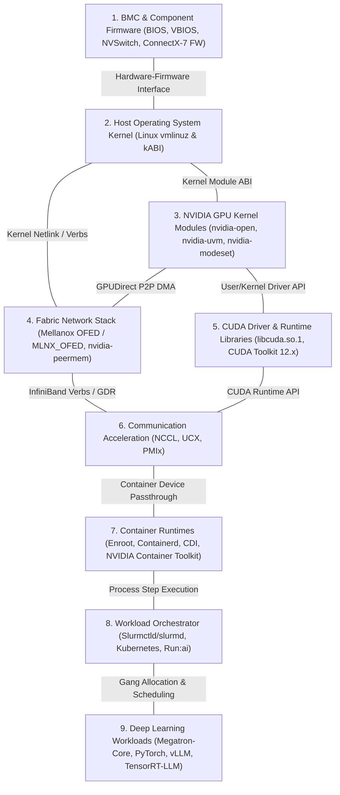
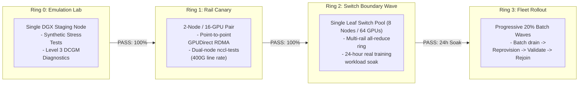

# Chapter 10 — Coordinated Cluster-Wide Software Change Management

In general enterprise IT, application changes are decoupled from the host operating system through virtualization or container abstractions. In an **NVIDIA AI Factory**, this abstraction disappears. High-throughput distributed training and low-latency inference tightly couple **hardware firmware, host kernel, out-of-tree device drivers, user-space acceleration libraries, network switch microcode, and cluster schedulers**.

A routine kernel patch or minor driver update can break the Open-Source GPU kernel module, desynchronize Mellanox OFED (MOFED) InfiniBand queue pairs, or trigger silent fallbacks in NCCL that cut training performance by 70%.

As an **NVIDIA Senior Solutions Architect**, you cannot manage AI infrastructure using ad-hoc scripts or un-coordinated rolling reboots. You must engineer a **Full-Stack Coordinated Change Management Framework** built on deterministic compatibility matrices, phased deployment rings, and non-destructive rollback paths.

---

## 1. The 9-Layer AI Factory Compatibility Hierarchy

No software or firmware layer in an accelerated compute cluster changes in isolation. Every update touches adjacent upstream and downstream contracts.



### The Invalidation Chain

1. **Kernel Bump $\rightarrow$ Driver Invalidation:** Upgrading the Linux kernel without a matching pre-compiled `kmod-nvidia` package leaves compute nodes without `nvidia.ko` after reboot.
2. **Driver Upgrade $\rightarrow$ CUDA Minimum Floor:** A newer CUDA framework requires a driver version at or above its documented minimum floor (e.g., CUDA 12.4 requires NVIDIA driver $\ge$ 550.54.14).
3. **NCCL Bump $\rightarrow$ HCA Firmware Feature Probe:** A newer NCCL release may leverage hardware-accelerated reduction features (e.g., SHARP v3 or adaptive routing) present only in recent ConnectX-7 firmware. If HCA firmware is stale, NCCL silently drops back to single-queue socket emulation, causing massive latency regression.

---

## 2. The Production Compatibility Matrix

Before any maintenance window is approved, the engineering team must publish and sign off on a strict **Compatibility Matrix Artifact**:

| Stack Layer | Current Production Baseline | Proposed Target Baseline | Validation Method | Rollback Feasibility |
|---|---|---|---|---|
| **System BIOS / BMC** | BIOS 1.24 / BMC 23.09 | BIOS 1.28 / BMC 24.03 | Out-of-band Redfish flash in staging lab | **Irreversible / Cold reboot required** |
| **GPU VBIOS / NVSwitch** | 96.00.74.00.04 | 96.00.89.00.01 | DGX Firmware Container run on canary node | **High Risk** (Downgrades often blocked) |
| **Linux Kernel** | 5.14.0-362 (Rocky 9.3) | 5.14.0-427 (Rocky 9.4) | KMOD compilation in CI/CD pipeline | **Reversible** (Reboot to previous kernel) |
| **NVIDIA Driver** | 535.129.03 (R535) | 550.90.07 (R550) | `kmod-nvidia` package build & DCGM check | **Reversible** (Package downgrade) |
| **Mellanox OFED** | MLNX_OFED 23.10-1.1.9 | MLNX_OFED 24.04-0.7.0 | `ib_write_bw` GPUDirect RDMA verification | **Reversible** (DKMS/KMOD rollback) |
| **CUDA Toolkit** | CUDA 12.2.2 | CUDA 12.4.1 | Framework compilation & symbol resolution | **Reversible** (Multi-version modulepath) |
| **NCCL** | 2.18.5 | 2.21.5 | `nccl-tests` (Ring & Tree `all_reduce_perf`) | **Reversible** (User-space library swap) |
| **Orchestrator** | Slurm 23.02.7 | Slurm 24.05.1 | RPC backward-compatibility verification | **Forward-Only** (Database schema changes) |

---

## 3. Phased Deployment: The 4-Ring Canary Architecture

Never push software or firmware updates to an entire AI cluster at once. Deployments follow progressive **Canary Rings**:



### Why Ring 1 (Rail Canary) is Crucial
A single isolated node (Ring 0) cannot test the high-speed network. Ring 1 tests two adjacent DGX systems across all 8 InfiniBand leaf switch rails, proving that:
- ConnectX-7 firmware and MOFED drivers communicate cleanly over PCIe Gen5.
- GPUDirect RDMA (`nvidia-peermem`) operates without memory corruption.
- RoCE v2 PFC/ECN flow control parameters are respected.

---

## 4. Slurm Reservation and Maintenance Scheduling

In an AI supercomputer, training jobs frequently run uninterrupted for weeks. Operators cannot simply terminate running jobs or evict containers without warning.

### Step-by-Step Maintenance Window Scheduling

```bash
# 1. Create an Administrative Slurm Reservation for the Maintenance Window
# Prevents new jobs from scheduling into nodes dgx-[01-64] after 02:00 UTC
$ scontrol create reservation \
    ReservationName=Maint_Driver_Upgrade \
    StartTime=2026-08-15T02:00:00 \
    Duration=08:00:00 \
    Nodes=dgx-[01-64] \
    Users=root \
    Flags=MAINT,IGNORE_JOBS

# 2. Monitor Running Jobs to Allow Natural Completion or Checkpointing
# Jobs with walltimes ending before 02:00 UTC will continue running.
# Long-running jobs are notified via SIGUSR1 30 minutes prior to checkpoint.
$ squeue --reservation=Maint_Driver_Upgrade

# 3. Drain Specific Canary Wave Nodes
$ scontrol update NodeName=dgx-[01-08] State=DRAIN Reason="MaintWave1: BCM Driver Upgrade"

# 4. Reprovision via BCM Software Image Reassignment
$ cmsh -c "device range dgx-01..dgx-08; set category dgx-canary-r550; commit"

# 5. Reboot and Execute Health Gating
$ srun --nodelist=dgx-[01-08] /cm/local/apps/cmd/etc/healthcheck.d/check_all.sh

# 6. Release Reservation and Return Nodes to Scheduling
$ scontrol update NodeName=dgx-[01-08] State=RESUME
```

---

## 5. Senior Solutions Architect Interview Scenarios

### Scenario 1: The Irreversible Firmware Trap
**Interviewer:** *"You are leading a maintenance upgrade on a 128-node DGX H100 cluster. Halfway through flashing a new system BIOS and GPU VBIOS bundle, the AI engineering team reports that a critical PyTorch model experiences numerical instability under the new microcode. Can you simply execute a rollback script?"*

**Candidate Answer:**
> "No, rolling back firmware is fundamentally different from rolling back software or container images:
> 1. **Firmware Downgrade Protections (Anti-Rollback):** Modern enterprise hardware incorporates hardware Root-of-Trust (RoT) security engines (e.g., NVIDIA ERoT, Intel PFR). Microcode updates often blow internal electronic fuses or update cryptographic key revocation lists (anti-rollback counters) to protect against downgrade attacks. Consequently, many GPU VBIOS and motherboard BIOS updates are **strictly forward-only and physically irreversible**.
> 2. **Pre-Change Qualification Strategy:** Because firmware downgrades cannot be guaranteed, production clusters must never update firmware directly across the fleet without an exhaustive staging phase:
>    - The target firmware bundle must be qualified in **Ring 0 and Ring 1** for at least 72 hours.
>    - The validation suite must include numerical precision regression tests (e.g., FP8 and BF16 GEMM loss curves against a reference model) to catch mathematical divergence before fleet-wide commitment.
> 3. **The Roll-Forward Recovery Path:** If numerical divergence occurs after a forward-only firmware flash, the operational response is a **roll-forward workaround**: identifying the specific compiler flag, CUDA math library setting (e.g., disabling specific Tensor Core fused operations via `torch.backends.cuda.matmul.allow_tf32=False`), or driver parameter that mitigates the numerical drift until a hotfix microcode bundle is provided by NVIDIA engineering."

---

## Key Takeaways

1. **AI Infrastructure is a Coupled Stack:** A change at any layer (BIOS, kernel, driver, OFED, CUDA, NCCL, Slurm) directly impacts adjacent layers. Always manage updates as a validated 9-layer unit.
2. **Validate Per-Cell Compatibility:** Maintain a signed-off compatibility matrix distinguishing verified combinations from unverified assumptions.
3. **Progressive Canary Rings Eliminate Catastrophe:** Follow the strict progression: **Ring 0 (Emulation)** $\rightarrow$ **Ring 1 (Rail Canary)** $\rightarrow$ **Ring 2 (Switch Boundary)** $\rightarrow$ **Ring 3 (Fleet Batches)**.
4. **Firmware Downgrades are Often Impossible:** Treat BIOS and VBIOS updates as irreversible actions governed by anti-rollback fuses; mandate comprehensive numerical verification prior to deployment.
5. **Respect Training Lifecycles:** Use Slurm reservations with `Flags=MAINT` to allow long-running training jobs to complete or checkpoint cleanly before draining nodes.
