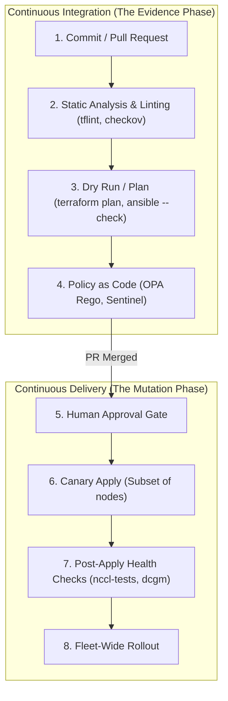
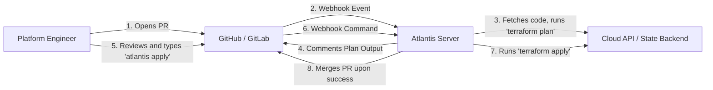
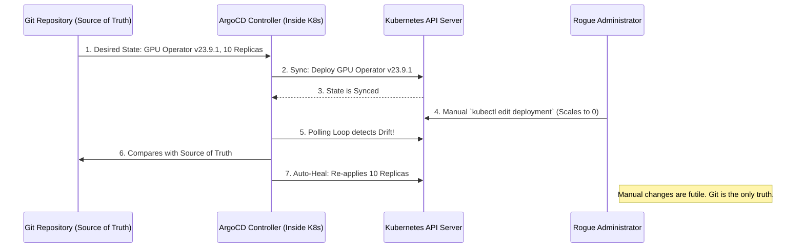
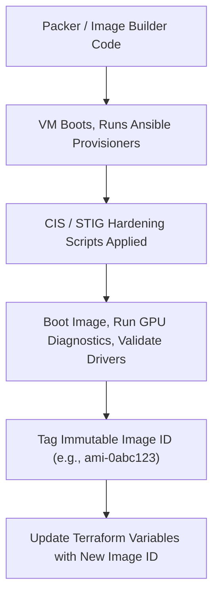
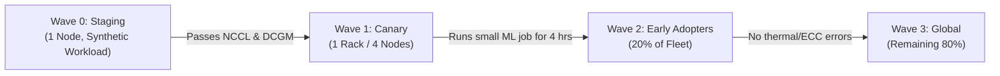

# Chapter 11 — CI/CD for Infrastructure and Cluster Configuration

**Learning outcome:** Architect, implement, and operate enterprise-grade Continuous Integration and Continuous Delivery (CI/CD) pipelines specifically designed for physical and cloud infrastructure. Master the distinction between application delivery and infrastructure state reconciliation, implement push-based (Atlantis, GitHub Actions, GitLab CI) and pull-based (ArgoCD, Flux) GitOps workflows, enforce Policy-as-Code (OPA/Rego) guardrails to control blast radius, and automate the safe rollout of OS images, kernel drivers, and Kubernetes/Slurm configurations across massive-scale NVIDIA GPU clusters.

**Prerequisites:** Deep understanding of Infrastructure as Code (Terraform, Ansible), containerization (Docker, Kubernetes), Linux system administration, and basic understanding of CI/CD concepts (pipelines, runners, Git branching strategies).

**Difficulty:** Beginner to Advanced.

**Estimated reading time:** 120 minutes plus hands-on implementation practice.

---

## 1. The Paradigm Shift: Application CI/CD vs. Infrastructure CI/CD

To understand CI/CD for infrastructure, we must unlearn the assumptions of application CI/CD. When an engineer merges code for a web application, the pipeline builds a stateless artifact (a container image or a JAR file) and deploys it. If the deployment fails, the orchestrator rolls back to the previous image tag. The cost of a bad merge is temporary downtime, easily remedied.

When a Platform Engineer merges code for a massive-scale NVIDIA AI Factory, the artifact is a **change to physical or near-physical reality**: re-partitioning a bare-metal NVMe array, flashing a ConnectX-7 NIC firmware, updating an NVIDIA kernel driver across 2,000 nodes, or recreating a Terraform cloud network topology. 

**Infrastructure changes are stateful, often destructive, and rarely "roll-backable" with a simple command.** You cannot easily "undo" the deletion of a 100 TB S3 checkpoint bucket or the formatting of a persistent volume.

### 1.1 The Core Differences

| Dimension | Application CI/CD | Infrastructure CI/CD |
|---|---|---|
| **Artifact** | Immutable binary, container image, or package. | A declared end-state (Terraform plan, Ansible inventory, Kubernetes manifests). |
| **Pipeline Output** | A deployed service running the new code. | Evidence of safety (Plans, Policy Checks) followed by mutation of environment state. |
| **Rollback Strategy** | Trivial: Re-deploy the previous image version tag. | Complex: Roll-forward with a revert commit, or execute a careful state-restoration procedure. |
| **Primary Risk** | Correctness (Does the application crash?). | **Blast Radius** (Does this syntactically valid change destroy the entire data center?). |
| **Testing Approach** | Unit tests, integration tests, end-to-end user flows. | Dry-runs, policy-as-code (OPA), linting, and physical canary node deployments. |
| **Execution Environment** | Ephemeral runners that push artifacts to registries. | Highly privileged runners that require "god-mode" IAM access to cloud/bare-metal control planes. |

### 1.2 Push vs. Pull Deployments (The GitOps Divide)

There are two fundamental architectures for deploying infrastructure changes: **Push-based** and **Pull-based**.

#### The Push Model (Traditional CI/CD)
A CI/CD runner (Jenkins, GitHub Actions, GitLab CI) executes a script that connects to the target environment and pushes the changes (e.g., running `terraform apply` or `ansible-playbook`).
*   **Pros:** Familiar to most developers, highly customizable, supports imperative steps (like orchestrating a rolling reboot sequence).
*   **Cons:** Requires granting the CI system highly privileged credentials to production environments. Susceptible to configuration drift if an admin manually changes the environment without updating Git.

#### The Pull Model (GitOps)
An agent running *inside* the target environment (e.g., ArgoCD, Flux) continuously monitors the Git repository. When it detects a change in the declared state, the agent reaches out, pulls the new configuration, and reconciles the environment.
*   **Pros:** Unprecedented security—the cluster reaches out to Git; Git does not reach into the cluster. No inbound firewall rules or external cloud credentials needed. Continuous reconciliation automatically reverts manual, out-of-band changes (preventing drift).
*   **Cons:** Works natively for declarative systems like Kubernetes, but is harder to implement for imperative tasks (like running an Ansible playbook to patch kernel parameters).

---

## 2. Foundational Principles: CI Produces Evidence; CD Controls Mutation

A robust infrastructure pipeline separates **Integration** (producing evidence of safety) from **Delivery** (executing the mutation).



### The Six Golden Stages of Infrastructure CI/CD

1.  **Static Analysis & Linting:** Catching formatting errors, syntax issues, and known security misconfigurations before any APIs are invoked.
2.  **Dry Run & Plan Rendering:** Showing exactly what *will* happen. For Terraform, this is saving a binary plan file. For Kubernetes, this is `kubectl diff` or Kustomize rendering.
3.  **Policy as Code (The Blast Radius Gate):** A non-human engine (like Open Policy Agent) evaluates the rendered plan against strict corporate rules (e.g., "No deletion of placement groups," "No security groups open to 0.0.0.0/0").
4.  **Approval Gate:** For infrastructure, especially destructive actions, a human architect must review the exact plan artifact produced in Step 2.
5.  **Canary Rollout:** Applying the change to a representative fraction of the hardware (e.g., one rack of DGX nodes) to catch hardware-specific bugs that dry-runs cannot detect (e.g., kernel panics on a new driver).
6.  **Post-Apply Validation:** Running actual GPU diagnostics (`dcgm-diag`, `nccl-tests`) to prove the infrastructure is fully operational before proceeding to the rest of the fleet.

---

## 3. Pull Requests as the Control Plane: Terraform with Atlantis

When an engineering team scales, running `terraform apply` locally becomes an existential threat to stability. State files get locked, code drifts from reality, and auditability is lost. **Atlantis** is the industry standard for Terraform pull request automation.

### 3.1 Atlantis Architecture

Atlantis is a self-hosted Golang application that listens for Git webhooks. When an engineer opens a Pull Request modifying `.tf` files, Atlantis automatically runs `terraform plan` and comments the output directly on the PR.



### 3.2 Atlantis Configuration

Atlantis requires a server configuration and a repository-level `atlantis.yaml` file to define custom workflows, allowing you to enforce policy checks (like Checkov or OPA) before an apply is permitted.

**Server Configuration (`repos.yaml`):**
```yaml
# server-side repos.yaml - Controls what repositories are allowed to do
repos:
  - id: github.com/nvidia-ai-factory/infrastructure
    # Enforce that PRs must be approved by a human before 'atlantis apply' works
    apply_requirements: [approved, mergeable]
    # Allow the repository to define its own custom workflows in atlantis.yaml
    allowed_overrides: [workflow, apply_requirements]
    allow_custom_workflows: true
```

**Repository Configuration (`atlantis.yaml`):**
```yaml
# Committed to the root of the infrastructure git repository
version: 3
automerge: true
projects:
  - name: production-cluster-network
    dir: environments/production/network
    workspace: default
    terraform_version: v1.7.0
    autoplan:
      when_modified: ["*.tf", "*.tfvars"]
      enabled: true
    workflow: secure-infrastructure

workflows:
  secure-infrastructure:
    plan:
      steps:
        - init
        - plan:
            extra_args: ["-out", "tfplan.binary"]
        # Convert binary plan to JSON for policy evaluation
        - run: terraform show -json tfplan.binary > tfplan.json
        # 1. Run Checkov for static security analysis
        - run: checkov -f tfplan.json --quiet
        # 2. Run Open Policy Agent (OPA) / Conftest for custom blast-radius policies
        - run: conftest test tfplan.json -p ../../../policies/
    apply:
      steps:
        - apply
```

### 3.3 The Atlantis Experience

When an engineer opens a PR that modifies the VPC CIDR, Atlantis blocks the merge. It runs the plan, executes OPA, and comments:

> **Atlantis Plan Output:**
> ❌ **OPA Policy Violation:** 
> `FAIL - tfplan.json - main - destroy action detected on aws_vpc.main. Modifying the CIDR block forces replacement of the VPC and all contained subnets. This violates the 'prevent-network-destruction' policy.`

This brings the CI/CD feedback loop directly into the code review process, preventing the engineer from ever applying the change.

---

## 4. Kubernetes GitOps: ArgoCD and Flux

For Kubernetes-native AI factories (where workloads, GPU Operators, and Slurm clusters are deployed as Helm charts or custom resources), push-based CI/CD is an anti-pattern. **GitOps** using controllers like **ArgoCD** or **Flux** is the standard.

### 4.1 The GitOps Reconciliation Loop

In GitOps, the desired state of the cluster (deployments, configmaps, NVIDIA GPU Operator configurations) is declared purely in Git. An operator running *inside* the Kubernetes cluster continuously polls Git (e.g., every 3 minutes). If the live cluster state deviates from Git, the operator automatically forces the cluster back into alignment.



### 4.2 ArgoCD Application Manifests

ArgoCD relies on `Application` Custom Resources to link a Git path to a Kubernetes namespace.

```yaml
# argocd-gpu-operator-app.yaml
apiVersion: argoproj.io/v1alpha1
kind: Application
metadata:
  name: nvidia-gpu-operator
  namespace: argocd
spec:
  project: ai-factory-infrastructure
  source:
    repoURL: 'https://github.com/enterprise-org/k8s-infrastructure.git'
    targetRevision: HEAD
    path: clusters/prod-us-east/gpu-operator
  destination:
    server: 'https://kubernetes.default.svc'
    namespace: gpu-operator
  syncPolicy:
    # Automatically apply changes when Git is updated
    automated:
      prune: true     # Delete resources that were removed from Git
      selfHeal: true  # Revert manual changes made directly to the cluster
    syncOptions:
      - CreateNamespace=true
      - ServerSideApply=true # Better for large CRDs
```

### 4.3 Automated Dependency DAGs with Sync Waves

Infrastructure is highly dependent. You cannot deploy the Slurm cluster until the GPU Operator has successfully loaded the NVIDIA drivers on the nodes, and you cannot deploy the GPU Operator until the Node Feature Discovery (NFD) daemon has labeled the nodes.

ArgoCD handles this using **Sync Waves**, ensuring a topological rollout order:

```yaml
# 1. Node Feature Discovery (Deploys First)
apiVersion: apps/v1
kind: Deployment
metadata:
  name: node-feature-discovery
  annotations:
    argocd.argoproj.io/sync-wave: "-1" # Executes before wave 0

---
# 2. NVIDIA GPU Operator (Deploys Second, waits for NFD to be healthy)
apiVersion: apps/v1
kind: Deployment
metadata:
  name: gpu-operator
  annotations:
    argocd.argoproj.io/sync-wave: "0"
```

---

## 5. Ansible Automation Platform (AWX/Tower) CI Integration

While Terraform handles cloud resources and Kubernetes handles containerized workloads, **Ansible** remains the undisputed king of bare-metal OS configuration, network switch management (Cumulus/SONiC), and complex stateful software deployments (like configuring Base Command Manager or Slurm).

### 5.1 The Risk of Ad-Hoc Ansible

Running `ansible-playbook -i inventory.ini site.yml` from a laptop is dangerous:
*   It requires SSH keys distributed to laptops.
*   Execution logs are lost on the user's terminal.
*   There is no peer review or concurrency control.

### 5.2 Enterprise Ansible Architecture

In a production AI factory, Ansible code is stored in Git. CI pipelines perform syntax checks, linting (`ansible-lint`), and functional tests (`molecule`). Once merged to the `main` branch, a webhook triggers **Ansible Automation Platform (AAP)** or its upstream open-source version, **AWX**. AWX serves as the centralized execution engine, providing RBAC, secure credential storage, and a REST API.

### 5.3 Automated GitLab CI to AWX Pipeline

The following is an enterprise-grade `.gitlab-ci.yml` that validates Ansible code and triggers an AWX Job Template automatically upon merge.

```yaml
# .gitlab-ci.yml
stages:
  - lint
  - security
  - trigger_deployment

variables:
  AWX_HOST: "https://awx.enterprise.local"

# Stage 1: Fast static analysis
ansible_lint:
  stage: lint
  image: quay.io/ansible/creator-ee:latest
  script:
    - ansible-lint playbooks/*.yml roles/

# Stage 2: Secret scanning to ensure no SSH keys or API tokens were committed
secret_scanning:
  stage: security
  image: trufflesecurity/trufflehog:latest
  script:
    - trufflehog git file://. --only-verified --fail

# Stage 3: Trigger the actual deployment in AWX/Tower
deploy_to_production:
  stage: trigger_deployment
  image: curlimages/curl:latest
  only:
    - main
  script:
    - echo "Triggering AWX Job Template to deploy Slurm Configuration..."
    - |
      RESPONSE=$(curl -s -X POST "${AWX_HOST}/api/v2/job_templates/24/launch/"         -H "Authorization: Bearer ${AWX_OAUTH_TOKEN}"         -H "Content-Type: application/json"         -d '{"extra_vars": {"target_environment": "production"}}')
    - JOB_ID=$(echo $RESPONSE | jq -r '.job')
    - echo "Deployment started in AWX. Job ID: $JOB_ID"
    # Polling script to wait for AWX job completion and fail the pipeline if AWX fails
    - |
      while true; do
        STATUS=$(curl -s -H "Authorization: Bearer ${AWX_OAUTH_TOKEN}" "${AWX_HOST}/api/v2/jobs/${JOB_ID}/" | jq -r '.status')
        if [[ "$STATUS" == "successful" ]]; then
          echo "Ansible Deployment Successful!"; exit 0;
        elif [[ "$STATUS" == "failed" || "$STATUS" == "canceled" ]]; then
          echo "Ansible Deployment Failed in AWX!"; exit 1;
        fi
        echo "Waiting for AWX job to complete... Current status: $STATUS"
        sleep 10
      done
```

---

## 6. The Ultimate GitHub Actions Pipeline for Infrastructure

For teams relying on pure CI/CD runners (rather than Atlantis or AWX), building a safe pipeline requires meticulous design. The pipeline must handle OpenID Connect (OIDC) authentication, state locking, binary plan passing, and manual approval environments.

### 6.1 The "Plan-and-Apply" Anti-Pattern

A common beginner mistake is writing a pipeline that runs `terraform plan` on a Pull Request, and then runs a completely new `terraform apply -auto-approve` when the PR merges.

**Why is this dangerous?**
Between the time the PR was approved and the time it merged, someone else might have merged a different change, or the cloud state might have drifted. The `apply` running on the main branch is evaluating state *for the first time*. It might destroy resources that the original `plan` did not show.

**The Solution:** The pipeline must save the exact binary `.tfplan` file generated during the CI stage, upload it as an artifact, and the CD stage must download and execute *that exact binary file*: `terraform apply tfplan.binary`. This guarantees zero drift between the review and the execution.

### 6.2 Production-Grade GitHub Actions Workflow

```yaml
# .github/workflows/ai-infra-deployment.yml
name: "Production AI Infrastructure Deployment"

on:
  push:
    branches:
      - main
  pull_request:
    paths:
      - 'environments/production/**'

# Use OIDC to eliminate long-lived cloud credentials
permissions:
  id-token: write 
  contents: read
  pull-requests: write

env:
  TF_WORKING_DIR: "environments/production"
  AWS_REGION: "us-east-1"

jobs:
  validate_and_plan:
    name: "Validate, Lint, and Plan"
    runs-on: ubuntu-latest
    defaults:
      run:
        working-directory: ${{ env.TF_WORKING_DIR }}
    
    steps:
      - name: Checkout Code
        uses: actions/checkout@v4

      - name: Setup Terraform
        uses: hashicorp/setup-terraform@v3
        with:
          terraform_version: "1.7.0"

      - name: Configure AWS Credentials via OIDC
        uses: aws-actions/configure-aws-credentials@v4
        with:
          role-to-assume: arn:aws:iam::123456789012:role/GitHubActions-Terraform-Role
          aws-region: ${{ env.AWS_REGION }}

      - name: Terraform Format
        run: terraform fmt -check -diff

      - name: Terraform Init
        run: terraform init

      - name: Terraform Validate
        run: terraform validate

      - name: Run Checkov (Security Static Analysis)
        uses: bridgecrewio/checkov-action@master
        with:
          directory: ${{ env.TF_WORKING_DIR }}
          framework: terraform
          soft_fail: false # Fail the pipeline on high/critical security findings

      - name: Terraform Plan
        id: plan
        run: |
          terraform plan -out=tfplan.binary
          # Convert to JSON for OPA
          terraform show -json tfplan.binary > tfplan.json
        
      - name: Open Policy Agent (OPA) Blast-Radius Check
        uses: open-policy-agent/conftest-action@v1.2.0
        with:
          files: ${{ env.TF_WORKING_DIR }}/tfplan.json
          policy: policies/terraform/
        
      - name: Upload Binary Plan Artifact
        uses: actions/upload-artifact@v4
        with:
          name: terraform-plan
          path: ${{ env.TF_WORKING_DIR }}/tfplan.binary
          retention-days: 1

      - name: Post Plan to GitHub PR
        if: github.event_name == 'pull_request'
        uses: actions/github-script@v7
        with:
          script: |
            const fs = require('fs');
            github.rest.issues.createComment({
              issue_number: context.issue.number,
              owner: context.repo.owner,
              repo: context.repo.repo,
              body: `✅ **Terraform Plan & Security Scans Passed.** 
Review the plan output in the Action logs.`
            })

  # This job only runs on the main branch, AFTER human approval, using the exact binary plan.
  apply:
    name: "Apply Infrastructure Configuration"
    needs: validate_and_plan
    runs-on: ubuntu-latest
    if: github.ref == 'refs/heads/main'
    environment: production-approval-gate # Requires human click in GitHub UI
    defaults:
      run:
        working-directory: ${{ env.TF_WORKING_DIR }}
    
    steps:
      - name: Checkout Code
        uses: actions/checkout@v4

      - name: Setup Terraform
        uses: hashicorp/setup-terraform@v3

      - name: Configure AWS Credentials via OIDC
        uses: aws-actions/configure-aws-credentials@v4
        with:
          role-to-assume: arn:aws:iam::123456789012:role/GitHubActions-Terraform-Role
          aws-region: ${{ env.AWS_REGION }}

      - name: Download Binary Plan Artifact
        uses: actions/download-artifact@v4
        with:
          name: terraform-plan
          path: ${{ env.TF_WORKING_DIR }}

      - name: Terraform Init
        run: terraform init

      - name: Terraform Apply
        run: terraform apply -auto-approve tfplan.binary
```

---

## 7. Policy as Code: Open Policy Agent (OPA) / Rego

The most critical component of an infrastructure pipeline is the Blast Radius gate. A syntactically perfect Terraform plan is still disastrous if it deletes a production database or provisions 100x out-of-budget GPU nodes.

**Open Policy Agent (OPA)** is an open-source, general-purpose policy engine. You write policies in a declarative language called **Rego**. The pipeline feeds the JSON-formatted plan to OPA, which returns a pass/fail.

### 7.1 Complex Rego Policy Example: Preventing Cloud-Scale Bankruptcy

This Rego policy analyzes a Terraform plan and fails the CI pipeline if an engineer attempts to provision more than 16 H100 instances without explicit approval tags.

```rego
# policies/terraform/cost_control.rego
package main

# Deny by default
default allow = false

# Define restricted high-cost instance types (NVIDIA GPUs)
restricted_instances = {
  "p5.48xlarge",   # AWS H100
  "p4d.24xlarge",  # AWS A100
  "nd96isr_h100_v5" # Azure H100
}

# Find all resources in the plan that are being created
new_instances[resource] {
    resource := input.resource_changes[_]
    resource.type == "aws_instance"
    resource.change.actions[_] == "create"
    restricted_instances[resource.change.after.instance_type]
}

# Calculate the total count of new GPUs being provisioned in this PR
total_new_gpus = count(new_instances)

# Rule 1: Reject if someone tries to spin up more than 16 GPUs without an explicit 'Override-Capacity' tag
deny[msg] {
    total_new_gpus > 16
    
    # Check if the engineer provided an override tag
    override_tag_missing(new_instances)
    
    msg := sprintf("COST VIOLATION: Plan attempts to provision %v GPU instances (Max allowed: 16). Add the 'Override-Capacity' tag with Director approval to proceed.", [total_new_gpus])
}

override_tag_missing(instances) {
    some resource in instances
    not resource.change.after.tags["Override-Capacity"]
}

# Rule 2: Prevent deletion of ANY resource tagged with "Mission-Critical: true"
deny[msg] {
    resource := input.resource_changes[_]
    resource.change.actions[_] == "delete"
    resource.change.before.tags["Mission-Critical"] == "true"
    
    msg := sprintf("BLAST RADIUS VIOLATION: Attempting to destroy mission-critical resource '%v'. This is hard-blocked by policy.", [resource.address])
}
```

When `conftest test tfplan.json` runs in the pipeline, OPA parses the JSON structure of the plan, applies the Rego math, and forces the pipeline to exit `1` if rules are violated.

---

## 8. Golden Images as Pipeline Artifacts

In an AI factory, configuring drivers and CUDA toolkits at boot time via `cloud-init` or Ansible is too slow and fragile. If the NVIDIA package repository is briefly down, scaling up a GPU node fails. 

The industry standard is to bake immutable "Golden Images" (AMIs, QCOW2s, or OCI containers) containing the OS, STIG hardening, kernel, MLNX_OFED, NVIDIA Drivers, and Container Toolkit.

**The Golden Image pipeline is the foundational CI pipeline.**



### The Immutable Rule of Infrastructure Artifacts
Never use tags like `latest`. Always pin infrastructure to exact, cryptographically hashed image IDs. An OS image is an artifact just like a Docker container.

---

## 9. Testing Infrastructure Code: Pre-commit and Terratest

Relying entirely on remote CI runners for feedback is slow. A robust engineering culture implements local feedback loops and automated integration tests.

### 9.1 Local Feedback: Pre-commit Hooks

Pre-commit hooks run locally on the engineer's workstation before `git commit` is allowed, catching trivial errors instantly.

```yaml
# .pre-commit-config.yaml
repos:
  - repo: https://github.com/antonbabenko/pre-commit-terraform
    rev: v1.86.0
    hooks:
      - id: terraform_fmt
      - id: terraform_tflint
        args:
          - '--args=--only=terraform_deprecated_interpolation'
          - '--args=--only=terraform_deprecated_index'
      - id: terraform_docs # Auto-generates README.md from variables
  - repo: https://github.com/adrienverge/yamllint.git
    rev: v1.33.0
    hooks:
      - id: yamllint
        args: ['-d', '{extends: relaxed, rules: {line-length: {max: 120}}}']
```

### 9.2 Functional Testing: Terratest

While `terraform plan` proves syntax, it cannot prove functionality. Can the EC2 instance actually reach the internet? Did the security group actually attach?

**Terratest** is a Go library that programmatically spins up real infrastructure, runs functional tests against it (e.g., SSHing in, pinging endpoints), and then tears it down (`terraform destroy`).

```go
// test/vpc_network_test.go
package test

import (
	"testing"
	"github.com/gruntwork-io/terratest/modules/terraform"
	"github.com/stretchr/testify/assert"
)

func TestAiFactoryNetwork(t *testing.T) {
	terraformOptions := terraform.WithDefaultRetryableErrors(t, &terraform.Options{
		TerraformDir: "../environments/testing/network",
	})

	// Defer the teardown to execute at the end of the test, regardless of success/failure
	defer terraform.Destroy(t, terraformOptions)

	// Execute terraform init and apply
	terraform.InitAndApply(t, terraformOptions)

	// Fetch the output of the VPC ID
	vpcId := terraform.Output(t, terraformOptions, "vpc_id")

	// Assert the VPC ID begins with "vpc-"
	assert.Contains(t, vpcId, "vpc-")
    
    // Additional logic to deploy a temporary pod/instance and ping a gateway
    // ...
}
```

---

## 10. Senior SRE & Solutions Architect Troubleshooting Scenarios

### Scenario 1: Runner Starvation and State Lock Poisoning

**The Production Incident:**
A large Terraform apply targeting 500 bare-metal node configurations was running on a GitLab CI runner. The runner node experienced an Out of Memory (OOM) kill. The pipeline crashed. All subsequent pipelines attempting to run Terraform plan fail instantly with: `Error acquiring the state lock: ConditionalCheckFailedException`. Production deployments are halted globally.

**Root Cause Analysis:**
Terraform uses a locking mechanism (DynamoDB for AWS, Consul, or Postgres) to prevent concurrent applies from corrupting the state file. When the runner died abruptly, it never sent the unlock API call. The lock became "poisoned" (held indefinitely by a dead process).

**Remediation Runbook:**
1. **Verify Runner Death:** Check the CI system to guarantee no rogue processes are still executing network calls.
2. **Execute Force Unlock:** A senior administrator must run `terraform force-unlock <LOCK_ID>`.
3. **State Reconciliation:** Because the apply was interrupted, the state file is likely out of sync with physical reality. The immediate next action must be `terraform plan -refresh-only` to align the state file with the half-deployed infrastructure, followed by a careful `terraform apply` to finish the job.

### Scenario 2: Drift Reconciliation Failures (The "Dirty" Cluster)

**The Production Incident:**
During a sev-1 network outage, a network engineer manually logged into the cloud console and deleted an offensive route table entry to restore connectivity. Three days later, a platform engineer merges a minor CI/CD change adding a new IAM role. The pipeline succeeds, but the CD deployment wipes out the emergency network fix, causing a secondary sev-1 outage.

**Root Cause Analysis:**
The CI/CD pipeline was using a blind `terraform apply`. Terraform realized the route table entry was missing from reality (drift), consulted its code (which still had the route defined), and automatically re-created it, breaking the network again. 

**Remediation and Prevention:**
This is why Terraform/Ansible should *not* auto-reconcile on a continuous loop like ArgoCD unless the team has extremely mature processes. 
1. **Drift Detection Pipelines:** Implement a scheduled pipeline (e.g., cron job every 4 hours) that runs `terraform plan -detailed-exitcode`. If the exit code is `2` (meaning drift detected), it sends a Slack alert to the SRE team, rather than automatically applying it.
2. **Backporting Fixes:** When the emergency fix was made manually, it should have been immediately backported to Git.

### Scenario 3: Secret Injection and OIDC Authentication Failures

**The Production Incident:**
A GitHub Actions pipeline fails with `InvalidIdentityToken: OpenIDConnect provider's thumbprint doesn't match`. The pipeline had been working flawlessly for six months without any code changes.

**Root Cause Analysis:**
Historically, CI pipelines used long-lived static API keys (e.g., AWS Access Keys) stored in GitHub Secrets. This is a massive security risk. Modern pipelines use OpenID Connect (OIDC), where GitHub presents a short-lived cryptographic identity token to the cloud provider, which verifies GitHub's certificate thumbprint and grants temporary access.
The cloud provider rotated or updated their trusted root CA thumbprints, or GitHub rotated theirs, causing the trust relationship to sever.

**Remediation:**
The Identity Provider (IdP) configuration in the cloud (e.g., AWS IAM OIDC Provider) must be updated to trust the new certificate thumbprints provided by the VCS platform (GitHub/GitLab).

---

## 11. Interview-Ready Concepts & Practice

### The Core Philosophy
*"Application CI/CD optimizes for speed and feedback loops. Infrastructure CI/CD optimizes for predictability, blast-radius containment, and state consistency. A fast infrastructure pipeline that can silently destroy a storage array is worse than no pipeline at all."*

### Practice Questions

1. **You are designing a CI/CD pipeline for Terraform. Explain precisely why you must pass a `.tfplan` artifact between the Plan job and the Apply job, rather than just running `terraform apply -auto-approve`.**
   *Answer focus:* State drift, race conditions between PR merge and apply execution, guaranteeing that the exact reviewed DAG is the one executed.
2. **Explain the difference between a Push-based pipeline (GitHub Actions) and a Pull-based GitOps pipeline (Flux/ArgoCD) in the context of Kubernetes.**
   *Answer focus:* Where the credentials live, who initiates the connection, and continuous reconciliation vs event-driven triggers.
3. **Write a conceptual Open Policy Agent (OPA) rule that prevents any Terraform plan from deleting an AWS S3 bucket if the bucket's name contains the string "checkpoint".**
   *Answer focus:* Target the `delete` action in `resource.change.actions`, check `resource.type == "aws_s3_bucket"`, and use a string match on the `bucket` attribute.
4. **An Ansible pipeline fails because a target node is unreachable via SSH. The pipeline exits with code `4`. How do you structure the CI pipeline to handle transient network blips versus hard failures?**
   *Answer focus:* Ansible retry logic, `ansible-playbook --limit @retry`, or step-level retries in the CI runner configuration, distinguishing between host unreachability and task failures.
5. **Why is it dangerous to manage long-lived stateful resources (like an RDS database or a Slurm Control node) using ArgoCD's `prune: true` feature?**
   *Answer focus:* If the Git repository is accidentally corrupted, or someone deletes the YAML file by mistake, ArgoCD will immediately delete the production database to match the new "empty" Git state. Critical stateful resources often require `prune: false` or specific deletion-protection annotations.

---

## 12. Golden Images CI/CD Deep Dive: Packer and Ansible

Building immutable node images (Golden Images) requires its own dedicated CI/CD lifecycle. In an AI factory, you cannot afford to have 1,000 nodes download the NVIDIA driver simultaneously upon boot. 

The pipeline uses **HashiCorp Packer** to launch a temporary build VM, run **Ansible** to install drivers and harden the OS, and output an immutable machine image (AMI on AWS, QCOW2 on-prem).

### 12.1 The Packer HCL Configuration

```hcl
# packer/nvidia-ai-node.pkr.hcl
packer {
  required_plugins {
    amazon = {
      version = ">= 1.2.8"
      source  = "github.com/hashicorp/amazon"
    }
    ansible = {
      version = ">= 1.1.0"
      source  = "github.com/hashicorp/ansible"
    }
  }
}

variable "ami_prefix" {
  type    = string
  default = "nvidia-ai-factory-node"
}

variable "nvidia_driver_version" {
  type    = string
  default = "535.104.05"
}

locals {
  timestamp = regex_replace(timestamp(), "[- TZ:]", "")
  image_name = "${var.ami_prefix}-${var.nvidia_driver_version}-${local.timestamp}"
}

source "amazon-ebs" "ubuntu_gpu" {
  ami_name      = local.image_name
  instance_type = "g5.2xlarge" # Build on a smaller GPU instance to compile drivers
  region        = "us-east-1"
  ssh_username  = "ubuntu"

  source_ami_filter {
    filters = {
      name                = "ubuntu/images/hvm-ssd/ubuntu-jammy-22.04-amd64-server-*"
      root-device-type    = "ebs"
      virtualization-type = "hvm"
    }
    most_recent = true
    owners      = ["099720109477"] # Canonical
  }

  tags = {
    Name          = local.image_name
    OS_Version    = "Ubuntu 22.04"
    DriverVersion = var.nvidia_driver_version
    Type          = "GoldenImage"
  }
}

build {
  sources = ["source.amazon-ebs.ubuntu_gpu"]

  # Step 1: Wait for cloud-init to finish on the base image
  provisioner "shell" {
    inline = [
      "while [ ! -f /var/lib/cloud/instance/boot-finished ]; do echo 'Waiting for cloud-init...'; sleep 1; done",
      "sudo apt-get update && sudo apt-get upgrade -y",
      "sudo apt-get install -y linux-headers-$(uname -r) gcc make software-properties-common"
    ]
  }

  # Step 2: Run Ansible to install NVIDIA drivers, CUDA, and apply STIG hardening
  provisioner "ansible" {
    playbook_file = "../ansible/build-golden-image.yml"
    extra_arguments = [
      "--extra-vars", "nvidia_driver_version=${var.nvidia_driver_version}"
    ]
  }

  # Step 3: Run Goss or InSpec tests to validate the built image BEFORE creating the AMI
  provisioner "shell" {
    inline = [
      "nvidia-smi --query-gpu=driver_version --format=csv,noheader",
      "systemctl is-active sshd"
    ]
  }
}
```

### 12.2 Golden Image CI/CD Trigger

A standard pipeline pattern is to trigger the Packer build automatically when the `nvidia_driver_version` variable is updated in Git.

```yaml
# .gitlab-ci.yml for Golden Image Factory
build_golden_image:
  stage: build
  image: hashicorp/packer:1.9
  script:
    - packer init packer/
    - packer validate packer/
    - packer build -machine-readable packer/ | tee build.log
    # Extract the new AMI ID from the Packer logs using grep and awk
    - AMI_ID=$(grep 'artifact,0,id' build.log | cut -d, -f6 | cut -d: -f2)
    - echo "BUILT_AMI_ID=$AMI_ID" > build.env
  artifacts:
    reports:
      dotenv: build.env
```

---

## 13. Advanced Policy as Code: Guarding Network and IAM

Expanding on OPA, here are highly advanced Rego policies designed for Enterprise AI Security.

### 13.1 Rule: Forbid Public Ingress on HPC Security Groups

You must never allow `0.0.0.0/0` ingress on port 22 or InfiniBand/RoCE ports in a GPU cluster.

```rego
# policies/terraform/network_security.rego
package network_security

deny_public_ssh[msg] {
    resource := input.resource_changes[_]
    resource.type == "aws_security_group_rule"
    resource.change.actions[_] != "delete"
    
    # Check if this rule allows port 22
    resource.change.after.from_port <= 22
    resource.change.after.to_port >= 22
    resource.change.after.type == "ingress"
    
    # Check if cidr_blocks contains 0.0.0.0/0
    cidr_blocks := resource.change.after.cidr_blocks[_]
    cidr_blocks == "0.0.0.0/0"
    
    msg := sprintf("SECURITY VIOLATION: Security Group Rule '%v' allows public SSH access (0.0.0.0/0). Use Bastion/SSM instead.", [resource.address])
}
```

### 13.2 Rule: Prevent IAM Privilege Escalation

Do not allow CI/CD to provision IAM roles with `AdministratorAccess`.

```rego
# policies/terraform/iam_security.rego
package iam_security

deny_admin_iam[msg] {
    resource := input.resource_changes[_]
    resource.type == "aws_iam_role_policy_attachment"
    resource.change.actions[_] != "delete"
    
    policy_arn := resource.change.after.policy_arn
    endswith(policy_arn, "AdministratorAccess")
    
    msg := sprintf("IAM VIOLATION: Resource '%v' attempts to attach AdministratorAccess. Use least-privilege custom policies.", [resource.address])
}
```

---

## 14. Secrets Management in Infrastructure Pipelines

Infrastructure code requires secrets: database passwords for SlurmDBD, BMC/IPMI passwords for physical nodes, and API tokens. **Never commit secrets to Git.**

### 14.1 The Anti-Pattern: CI/CD Environment Variables

Storing a Slurm database password in GitHub Actions Secrets and passing it to Terraform via `TF_VAR_slurm_password` is better than plaintext, but still flawed. The secret is held in memory by the runner, and if the Terraform state file is compromised, the secret is exposed in plaintext JSON inside the state bucket.

### 14.2 The Enterprise Solution: HashiCorp Vault Integration

The infrastructure pipeline should authenticate with HashiCorp Vault (or AWS Secrets Manager), retrieve a short-lived dynamic credential, and inject it directly into the target infrastructure.

**Dynamic Vault Provider in Terraform:**
```hcl
provider "vault" {
  # Authenticate using the CI runner's JWT/OIDC token
  auth_login {
    path = "auth/jwt/login"
    parameters = {
      role = "github-actions-infra-role"
      jwt  = var.ci_jwt_token
    }
  }
}

# Fetch the BMC/IPMI password directly from Vault at runtime
data "vault_generic_secret" "bmc_credentials" {
  path = "secret/bare-metal/bmc-admin"
}

# Use it in a provider (e.g., Redfish provider for bare metal)
provider "redfish" {
  endpoint = "https://10.10.1.50"
  username = "admin"
  password = data.vault_generic_secret.bmc_credentials.data["password"]
}
```

### 14.3 SOPS and Sealed Secrets for GitOps

If you are using ArgoCD, how do you store a Kubernetes `Secret` manifest in Git? You use cryptographic sealing.

**Mozilla SOPS** allows you to encrypt the values of a YAML file using an AWS KMS key, while leaving the keys (structure) in plaintext. You commit the encrypted file to Git. 

```yaml
# encrypted-secret.yaml (Committed to Git)
apiVersion: v1
kind: Secret
metadata:
  name: slurmdbd-password
type: Opaque
stringData:
  # The value below is encrypted by AWS KMS. ArgoCD's SOPS plugin decrypts it in-memory.
  password: ENC[AES256_GCM,data:xyz123...,iv:abc...,tag:def...,type:str]
sops:
  kms:
    - arn: arn:aws:kms:us-east-1:1234567890:key/abcdef
```
ArgoCD pulls this file, uses the AWS KMS key (via an IAM role attached to the ArgoCD pod) to decrypt it, and applies it to the cluster as a native Kubernetes Secret.

---

## 15. Canary Deployments for Physical Infrastructure

Canary deployments are easy for web apps (route 1% of HTTP traffic to a new pod). They are extremely difficult for physical infrastructure (e.g., updating the OS on 500 GPUs).

### 15.1 The "Rings of Protection" Deployment Model

An infrastructure pipeline must deploy in blast-radius waves, halting completely if a wave fails health checks.



### 15.2 Implementing an Ansible Canary Pipeline

To execute a canary rollout of a driver update using Ansible in CI/CD:

```bash
# Step 1: Drain the Canary Nodes via Slurm
scontrol update NodeName=canary-[01-04] State=DRAIN Reason="Driver Update Canary"

# Step 2: Run Ansible limited to the canary group
ansible-playbook update-driver.yml --limit "canary_rack"

# Step 3: Run validation playbook
ansible-playbook validate-gpu-health.yml --limit "canary_rack"
# (If this exits non-zero, the CI pipeline halts and fails)

# Step 4: Resume nodes
scontrol update NodeName=canary-[01-04] State=RESUME

# Step 5: (Manual Approval Gate in CI/CD)

# Step 6: Rollout to the rest of the fleet in batches of 10
ansible-playbook update-driver.yml --limit "production_fleet" --forks 10 --serial 10
```

---

## 16. Further Advanced Troubleshooting Scenarios

### Scenario 4: The Silent Terraform State Corruption

**The Incident:** 
An engineer bypassed the CI pipeline and ran `terraform apply` locally using an older version of the Terraform binary (v1.3.0) against a state file that was previously upgraded by the CI pipeline to v1.7.0. The state file was corrupted, and the remote S3 backend rejected further updates due to lineage mismatches.

**Root Cause:**
Terraform state files track the `terraform_version` that last modified them. Downgrading versions against a remote state is unsupported and causes structural corruption in the JSON graph.

**Remediation:**
1. Enforce `required_version = "~> 1.7.0"` in the `terraform {}` block to prevent older binaries from executing.
2. Recover the state file from the S3 bucket's version history. Revert the object in S3 to the version immediately preceding the local corruption event.
3. Run `terraform force-unlock` if a lock is lingering.

### Scenario 5: Flux Reconciliation Hangs on Webhook Failures

**The Incident:**
A Flux Kustomization controller is stuck in a `ReconciliationFailed` state for an NVIDIA GPU Operator deployment. The Git repository is fully accessible, the YAML is valid, but the objects in the cluster are not updating.

**Root Cause:**
Kubernetes Validating or Mutating Webhooks (e.g., from an OPA Gatekeeper or a security mesh) are failing or unreachable. When Flux attempts a `ServerSideApply`, the Kubernetes API server forwards the request to the broken webhook, which times out, causing the entire Flux reconciliation loop to hang.

**Remediation:**
Identify broken webhooks using `kubectl get validatingwebhookconfigurations`. If a webhook backend pod is dead (e.g., a node crashed), temporarily delete the webhook configuration or fix the backend pod to unblock the API server, allowing Flux to resume synchronization.

---

## 17. Final Review and Mnemonic

When designing CI/CD for infrastructure, repeat the mnemonic: **L.P.P.A.C.V.**

*   **Lint:** Catch syntax fast.
*   **Plan:** Generate the evidence.
*   **Police:** Enforce blast-radius via OPA.
*   **Approve:** Human review of the exact plan artifact.
*   **Canary:** Test on real silicon.
*   **Validate:** Run telemetry diagnostics against a baseline.

## 18. Practice Scenarios

1.  **Design an Audit Mechanism for Emergency Overrides:** An emergency override flag bypasses OPA checks in your CI pipeline. How do you ensure it is audited and rare?
    *Answer focus:* The pipeline must still log the override to a SIEM (Splunk/Datadog), automatically create a Sev-2 incident ticket in Jira assigned to the Platform Lead, and require a post-hoc PR to back-fill policy justification.
2.  **A Golden-Image pipeline succeeds in building the image, but fails the isolated boot-test on `nccl-tests` bandwidth.** What does this tell you?
    *Answer focus:* The software compiled correctly against the kernel (successful build), but there is a physical hardware misconfiguration, an incorrect PCI topology assignment, or a missing GPU Direct RDMA driver preventing line-rate memory transfer. This failure prevented a massive production performance degradation.
3.  **Explain why storing `.terraform.lock.hcl` in Git is critical for CI/CD.**
    *Answer focus:* It guarantees that the exact provider binaries (and their cryptographic hashes) tested locally are the identical binaries downloaded and executed by the CI runner, preventing upstream supply chain attacks or unexpected provider breaking changes.

---

## 19. Advanced Drift Detection and Self-Healing Automation

Infrastructure drift occurs when the live state of a system diverges from its codified definition in version control. While GitOps natively handles drift for Kubernetes, Terraform and Ansible require specialized CI/CD patterns to detect and mitigate drift safely.

### 19.1 Automated Drift Detection Pipelines

An enterprise AI factory should run a continuous drift detection pipeline (e.g., every 4 hours). This pipeline does NOT apply changes; it only alerts operators when discrepancies are found.

```yaml
# .github/workflows/drift-detection.yml
name: "Continuous Drift Detection"

on:
  schedule:
    - cron: '0 */4 * * *' # Every 4 hours

jobs:
  detect_drift:
    runs-on: ubuntu-latest
    steps:
      - uses: actions/checkout@v4
      
      - name: Setup Terraform
        uses: hashicorp/setup-terraform@v3
      
      - name: Configure Cloud Credentials
        uses: aws-actions/configure-aws-credentials@v4
        with:
          role-to-assume: arn:aws:iam::1234567890:role/DriftDetector
          aws-region: us-east-1
          
      - name: Terraform Init
        run: terraform init
        
      - name: Terraform Plan (Detailed Exitcode)
        id: drift_plan
        # -detailed-exitcode returns 0 (no diff), 1 (error), or 2 (diff exists)
        continue-on-error: true
        run: terraform plan -detailed-exitcode -refresh-only
        
      - name: Alert on Drift
        if: steps.drift_plan.outputs.exitcode == '2'
        uses: slackapi/slack-github-action@v1.24.0
        with:
          payload: |
            {
              "text": "🚨 *INFRASTRUCTURE DRIFT DETECTED* 🚨
The production Terraform state no longer matches the live cloud environment. Please investigate immediately to prevent subsequent apply failures."
            }
        env:
          SLACK_WEBHOOK_URL: ${{ secrets.SLACK_WEBHOOK_URL }}
```

### 19.2 The "Reconciliation vs. Backport" Decision Matrix

When drift is detected, the SRE team must choose between two paths:

| Scenario | Recommended Action | Explanation |
|---|---|---|
| **Malicious or Accidental Modification** (e.g., a junior dev opened SSH to the world) | **Auto-heal / Revert** | Run `terraform apply` to overwrite the manual change and restore the Git-defined secure state. |
| **Emergency Incident Response** (e.g., increased an EBS volume size at 3 AM to prevent an outage) | **Backport to Git** | Modifying the Terraform code to match reality, then running `terraform apply -refresh-only` to update state. Reverting this would cause a recurrence of the outage. |

---

## 20. Conclusion: The Pipeline as a Product

In an AI factory, the CI/CD pipeline is not just a delivery mechanism—it is a **first-class product**. It requires the same level of architectural rigor, monitoring, and engineering investment as the GPU clusters it manages. 

A mature infrastructure pipeline transforms the historically terrifying act of updating core cluster components into a mundane, auditable, and easily executable event. By implementing stringent Policy-as-Code checks, separating integration from delivery, and adopting immutable golden images, platform teams can operate massive-scale infrastructure at peak velocity without sacrificing stability.

### The Architect's Checklist

Before authorizing the deployment of a new infrastructure CI/CD pipeline, a Senior Solutions Architect must verify:
- [ ] **State Backend Security:** Are the Terraform/Ansible state backends isolated, versioned, and restricted via IAM?
- [ ] **OIDC Integration:** Are we using identity federation instead of static, long-lived credentials?
- [ ] **Blast Radius Policies:** Is OPA/Sentinel blocking catastrophic actions (e.g., destroying placement groups or databases)?
- [ ] **Plan Artifact Passing:** Is the exact binary output of the CI plan stage being downloaded and executed by the CD apply stage?
- [ ] **Canary Gates:** Are physical hardware updates gated by a canary node subset and automated telemetry validation?
- [ ] **Break-Glass Procedures:** Is there a documented, auditable process for bypassing the pipeline during a total catastrophic outage?
