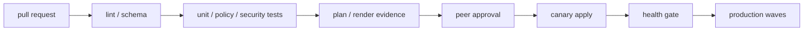
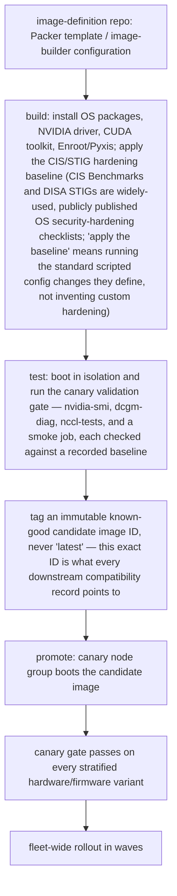

**Learning outcome:** Design a CI/CD pipeline whose artifact is cluster state (node config, driver/CUDA image, Kubernetes/Slurm manifests) rather than an application binary, with the specific gates that make destructive infrastructure changes safe to automate instead of merely fast.

## Start here — CI produces evidence; delivery controls mutation

For infrastructure, a pipeline is not automatically safe because it is automated. **Continuous integration** checks a proposed change and produces reviewable evidence. **Delivery/deployment** promotes an approved, immutable artifact into increasingly important environments.



Different sources need different evidence:

| Source | Artifact/evidence to promote |
|---|---|
| Terraform | Reviewed saved plan tied to commit and target workspace |
| Ansible | Versioned role plus inventory diff and check/test results |
| Golden image | Immutable image ID, package manifest, SBOM (Software Bill of Materials — a complete inventory of every package/library/version baked into the image, used to answer "are we exposed to CVE-X" without re-scanning), signature, test report |
| Kubernetes | Rendered manifests, policy results, signed container digests |
| Slurm config | Validated bundle, semantic diff, controller/canary test |

Do not rebuild between test and production; promote the same immutable artifact or digest. Keep credentials short-lived and environment-scoped. Protect logs and plan files because they can contain sensitive values.

Rollback is pipeline logic, not a sentence in a ticket. Define whether recovery means Git revert plus reconciliation, applying the previous image/config artifact, restoring state, or rolling forward. Then test that path on a canary. A green syntax check cannot prove that a driver loads after reboot or a Slurm change preserves running jobs, so post-change operational gates remain mandatory.

## Broader than application CI/CD

A conventional application CI/CD pipeline — lint, unit tests, build, publish — treats the artifact as a wheel or a container image, and the risk of a bad merge is a bad application release: cheap to detect (the new version either serves traffic correctly or it doesn't) and cheap to roll back (redeploy the previous image tag). This chapter is about CI/CD applied to the infrastructure itself: Ansible playbooks, Terraform modules, and Kubernetes/Slurm manifests that describe cluster state, where the artifact is a *change to physical or near-physical reality* — a node's OS image, a driver version, a NIC firmware setting, a Slurm partition definition. The risk profile is different in kind, not just degree: a bad application release loses you a rollback window; a bad Terraform apply against a cloud VPC or a bad Ansible run against 200 bare-metal nodes can be destructive and only partially reversible, which is exactly the class of mistake this chapter's gates exist to prevent.

## GitOps for cluster configuration

The discipline is the same one Kubernetes GitOps popularized, applied one layer down: declarative desired state lives in Git, and a controller or pipeline reconciles the live cluster to match it — nobody runs `terraform apply` or `ansible-playbook` ad hoc from a laptop against production.

1. **Git repo (source of truth)**
   - `terraform/` — cloud VPC, load balancers, IAM, node pools
   - `ansible/` — OS hardening, driver install, Slurm config
   - `k8s-manifests/` — the GPU Operator (a Kubernetes operator that installs and manages the NVIDIA driver, container toolkit, and device plugin across every node in the cluster so GPUs become schedulable resources), the Network Operator (its counterpart for RDMA/high-speed NIC drivers and configuration), and workload CRDs (custom resource definitions — Kubernetes' mechanism for extending its API with new object types)
   - `golden-image/` — packer/image-builder definitions (topic below)
2. **CI/CD pipeline or GitOps controller** — a GitOps controller such as Flux or Argo CD (software that runs inside the Kubernetes cluster itself, continuously watches a Git repo, and applies any diff it finds) for k8s manifests; an ordinary pipeline runner for Terraform/Ansible, since neither of those tools has a native continuous-reconciliation controller the way Kubernetes does
3. **Live cluster state** — converges toward Git; drift is detected and either auto-corrected (k8s manifests) or flagged for review (Terraform/Ansible, where auto-correction of a diff can itself be destructive)

The asymmetry matters: Kubernetes manifests are naturally idempotent and low-risk to auto-reconcile continuously (that's what Flux/Argo CD do). Terraform and Ansible changes are not automatically safe to auto-apply on drift-detection alone — a live change made for an emergency reason (e.g., someone hand-patched a firewall rule during an incident) can look like "drift" to the controller and get silently reverted, re-introducing the very problem the emergency change fixed. This is why Terraform/Ansible pipelines are typically triggered by merge, not by continuous reconciliation, with drift detection as a *reporting* signal, not an auto-apply trigger.

## Pipeline stages for infrastructure changes

| Stage | Command / tool | Notes |
|---|---|---|
| 1. commit | PR opened | — |
| 2. lint / static validation | `terraform fmt -check`, `terraform validate`, `ansible-lint`, `yamllint` / `kubeconform` | — |
| 3. plan / dry-run | `terraform plan -out=tfplan`, `ansible-playbook --check --diff` | — |
| 4. policy check | a policy-as-code engine evaluates the rendered plan against a rule set — e.g. Open Policy Agent (OPA) with its Conftest wrapper for testing structured config/plan files, or HashiCorp Sentinel for Terraform specifically | e.g. "no security group open to 0.0.0.0/0," "no node pool resize > N without approval," "no removal of a Slurm partition with running jobs" — rules are written once and applied automatically to every plan, instead of relying on a human reviewer to notice a dangerous change buried in a long diff |
| 5. manual approval gate | required specifically when the plan contains a destroy/replace action | additive-only plans may auto-proceed past this gate |
| 6. apply to canary | apply against a canary node group or staging cluster first | a small, deliberately representative slice of the fleet (stratified by hardware/firmware variant, not just "whatever nodes were idle") takes the change before anything else does |
| 7. post-apply validation | re-run health checks | GPU/DCGM diagnostics, NCCL bandwidth test, and a representative training/inference smoke job — pass/fail against a recorded baseline, not a subjective "looks fine" |
| 8. apply to fleet | waved rollout | — |

The policy-check stage is what separates infra CI/CD from application CI/CD: an application pipeline's gates are almost entirely about correctness (does the code work); an infrastructure pipeline's gates are substantially about *blast radius* (even a correct change can be catastrophically scoped — a syntactically valid Terraform plan that destroys and recreates a storage volume is "correct" and still wrong to auto-apply).

### Annotated example: a merge-blocking plan-review gate

```bash
$ terraform plan -out=tfplan
...
Terraform will perform the following actions:

  # aws_instance.gpu_node["gpu-041"] must be replaced
-/+ resource "aws_instance" "gpu_node" {
      ~ instance_type = "p4d.24xlarge" -> "p5.48xlarge"  # forces replacement
        id             = "i-0abc123..."
      ~ tags           = {
          - "maintenance-window" = "2026-08-01" -> null
        }
    }

Plan: 1 to add, 0 to change, 1 to destroy.
```
```bash
$ conftest test tfplan.json -p policy/
FAIL - tfplan.json - main - destroy action detected on resource tagged
       "gpu-node" without an approved change-ticket reference in commit
       message (expected: "Change-Ticket: CHG-#####")
```
The plan output alone (`1 to destroy`) is necessary but not sufficient evidence for a human reviewer — it says *what* will happen, not whether it's *authorized*. The policy check turns "this plan will destroy a GPU node" from a fact a reviewer might miss in a long diff into a hard merge-blocking failure with a specific, actionable reason. This is the infrastructure analog of a unit test failing in application CI — except the thing under test is "is this change allowed," not "does this function return the right value."

## Golden node images as a CI pipeline output

A "golden image" — a validated OS+driver+CUDA combination baked once and rolled out identically to every node — is itself the output of a CI pipeline, not a manually-maintained snapshot:



Treating the image build itself as a tested pipeline stage — rather than testing only after it's deployed to real nodes — catches a class of defect earlier and cheaper: a driver that fails to build against the target kernel headers fails in the image-build stage in minutes, instead of failing during a live fleet rollout after nodes are already cordoned for the change.

## Testing infrastructure changes safely: canary as the test environment

You cannot unit-test a kernel driver the way you unit-test a function — there is no mock for "does this driver's kernel module load on this exact kernel version." The closest available equivalent is a staging cluster or canary node group that is structurally identical to (a slice of) production, used as the actual test environment:

- **Staging cluster**: a small, permanently-provisioned cluster running the same OS/driver/orchestrator versions as production, used to catch gross breakage (playbook typos, Terraform provider bugs, manifest schema errors) before anything touches real capacity.
- **Canary node group**: the staging cluster's limitation is that it's synthetic — it won't have production's exact hardware mix. A canary node group is a small, cordoned-and-drained *subset of real production nodes* — deliberately stratified across every GPU/NIC/firmware variant present in the fleet, not just whichever nodes happened to be idle — that takes the full proposed change (firmware, OS, driver, CUDA, NCCL together) while the rest of the fleet stays on the known-good combination, gated by the same pass/fail-against-baseline checklist as the golden-image test stage above. It is the test environment for questions staging cannot answer, which is why infra CI/CD pipelines for cluster-scale changes route through *both*: staging catches cheap mistakes fast, canary catches the hardware-interaction mistakes staging structurally cannot.

## Worked scenario: the override that made the gate meaningless

A policy-check gate blocked a Terraform plan that would have destroyed and recreated a production storage volume attached to a Lustre metadata server, because the change lacked a change-ticket reference. Under deadline pressure, an engineer used an "emergency override" path — a documented but rarely-audited flag that bypassed the policy-check stage entirely — to merge and apply the change directly. The volume was recreated empty; the metadata server lost its backing store, and recovery took longer than the original change would have taken if it had gone through the normal gate.

The postmortem's conclusion was specifically **not** "remove the override" — an emergency path that lets a genuinely urgent fix bypass a slow approval chain is a legitimate tool, and removing it just pushes the next real emergency toward an even less controlled workaround (someone SSHing in and hand-editing state). The fix was to make the override **audited and rare**: every use of the override path now requires a post-hoc, mandatory incident ticket filed within one hour, is visible on a dashboard that a platform lead reviews weekly, and triggers an automatic follow-up PR that re-runs the full policy check against what was actually applied. The override still exists; what changed is that using it now has a cost and a paper trail, so it's reserved for changes that are actually emergencies rather than deadline convenience.

## Mnemonic

**"Lint, Plan, Police, Approve, Canary, Validate."** Six words, six stages, in order — and the ordering matters because each stage is cheaper to fail at than the one after it: a lint failure costs seconds, a fleet-wide bad apply costs an incident.

## Interview-ready line

"Infrastructure CI/CD isn't 'run the same pipeline as an app, but for YAML' — the gates are different because the risk is different. An application pipeline is mostly testing correctness; an infrastructure pipeline has to gate blast radius explicitly, with a policy check that can fail a syntactically perfect plan, and a canary stage that exists because you cannot unit-test whether a kernel driver loads."

## Practice

1. Design the policy-check rules (in plain English, not Rego syntax) you'd write to prevent a Terraform plan from silently deleting a Kubernetes node pool that has GPU nodes with running jobs on them.
2. Explain why continuous auto-reconciliation (Flux/Argo CD style) is appropriate for Kubernetes manifests but risky to apply the same way to Terraform-managed cloud infrastructure, using the "hand-patched firewall rule during an incident" example from this chapter.
3. A golden-image pipeline's build stage succeeds but its test stage (boot + canary gate) fails on `nccl-tests` bandwidth only. Should this block promotion to "known-good candidate," and what does this failure mode tell you that a successful build alone would have hidden?
4. Design an audit mechanism for an emergency-override path in a policy-check gate that makes it "rare" as well as "audited" — not just logged after the fact, but structurally discouraged from casual use without removing it entirely.
5. Explain the difference between a staging cluster and a canary node group as test environments for infrastructure CI/CD — specifically, name one class of defect each one catches that the other structurally cannot.
