**Learning outcome:** Produce a runbook that a customer's on-call engineer can execute correctly at 3am under pressure without you in the room, and an onboarding guide that gives a new customer team enough context to make good decisions on day one — and know why these are two different documents, not one document written twice.

## Start here — choose the document by the reader's task

Documentation is part of the operating system of a team. Choose its form from the decision the reader must make:

| Document | Reader's question | Required shape |
|---|---|---|
| Concept/explanation | "How does this system work?" | working model, boundaries, examples |
| Tutorial | "Can you teach me once, safely?" | Guided end-to-end learning exercise |
| How-to/SOP | "How do I perform this known task?" | Preconditions, ordered procedure, validation |
| Runbook | "How do I respond to this symptom now?" | Triage, decision branches, mitigation, escalation |
| Reference | "What exactly does this field/command mean?" | Precise, searchable facts |
| Design record | "Why did we choose this architecture?" | Context, options, decision, consequences |

An operational step needs five things: **action, purpose, expected result, branch on unexpected result, and risk**. "Run `scontrol show node node042`" is incomplete. Say which fields matter, what healthy looks like, whether it is read-only, and where each result sends the responder next.

Test documentation like code. Give it to an engineer who did not write it in a safe environment; begin with only the documented symptom and access; record ambiguity, missing prerequisites, unsafe copy/paste, and dead ends; then verify ownership, review date, supported versions, contacts, and links.

For a new learner, onboarding should progress from architecture and vocabulary to read-only observation, a sandbox task, a controlled change, troubleshooting, and on-call shadowing. Access alone is not readiness. Define observable completion criteria such as: "can submit and explain a Slurm job, locate its logs/accounting, and diagnose three safe failure exercises."

## Two documents, two audiences, two timeframes

```
                     RUNBOOK                         ONBOARDING / BEST-PRACTICES GUIDE
  When read:         incident-time, minutes matter    steady-state, before anything is wrong
  Who reads it:      on-call engineer, adrenaline up   new team member, has time to think
  Scope:              one narrow symptom               the whole system's shape and rationale
  Style:              imperative, prescriptive           explanatory, educational
  Success looks like: correct action taken fast          correct working model formed
  Failure mode if
  conflated:          prose explanation slows down       a command list with no "why" leaves
                      the exact moment speed matters      the reader unable to adapt when the
                                                           real situation doesn't match the script
```

Conflating the two produces a document that serves neither purpose: pad a runbook with architectural rationale and the on-call engineer has to read past three paragraphs of "why this matters" to find the command they need while a page is going off; strip an onboarding guide down to bare command lists and the new team has no way to reason about a situation the guide didn't explicitly anticipate. The failure mode in each direction is different, which is the actual reason to keep them as separate documents rather than one document with an "if you're in a hurry, skip to section 4" note.

## Runbook template: symptom → verification → decision tree → mitigation → escalation → follow-up

```
1. SYMPTOM           — exact alert text or exact user-visible complaint, verbatim,
                        so pattern-matching against this runbook is unambiguous
2. VERIFICATION       — one or two commands, with the EXACT expected output for
                        both the "this runbook applies" case and the "this is
                        actually something else" case
3. DECISION TREE      — branches on the verification output, not on judgment calls;
                        every branch either ends in a mitigation step or in an
                        explicit "STOP — escalate" instruction
4. MITIGATION          — the exact command(s) to run, in order, with what to expect
                        after each one
5. ESCALATION         — a named contact/channel, and the EXACT condition that
                        triggers escalation instead of another mitigation attempt
                        (not "if it doesn't work" — a specific, checkable condition)
6. POST-INCIDENT       — what to capture before closing the ticket (logs already
   FOLLOW-UP            gathered, timestamps, whether this is a recurrence)
```

The discipline in steps 2 and 3 is the one most runbooks get wrong: verification has to specify what "this doesn't apply" looks like, not just what "this applies" looks like, or the on-call engineer has no way to know when they've mispattern-matched their symptom against the wrong runbook. The decision tree has to be branches on command output, not on-call judgment — if the runbook's next step is "assess whether the situation looks stable," that's not a decision tree, that's the runbook delegating its own job back to the reader.

### Annotated example: "Slurm node stuck in DRAIN state"

```mermaid
flowchart LR
  %% Converted from the original ASCII diagram; source wording is preserved.
  n0["SYMPTOM"]
  n1["`sinfo` shows a node in state `drain` or `drng` for longer than expected,"]
  n2["and it is not associated with a maintenance window on the change calendar."]
  n3["VERIFICATION"]
  n4["$ scontrol show node gpu-node-041 | grep -E 'State|Reason'"]
  n5["State=DRAINED"]
  n6["Reason=Kill task failed [root@2026-07-30T02:14:11]"]
  n7["If 'Reason' is blank or references an active, calendared maintenance"]
  n8["window"]
  n9["this runbook does NOT apply, see the maintenance-window runbook"]
  n10["instead. If 'Reason' names a kill-task failure, low memory, or a health"]
  n11["check script failure"]
  n12["continue below."]
  n13["DECISION TREE"]
  n14["Is there a job still shown RUNNING on this node in `squeue -w gpu-node-041`?"]
  n15["YES"]
  n16["do NOT force-resume the node. Confirm via `nvidia-smi` on the node"]
  n17["(SSH or `pdsh`) whether the GPU is actually healthy."]
  n18["nvidia-smi hangs or times out"]
  n19["STOP, ESCALATE (see below) —"]
  n20["do not attempt further mitigation on a node whose GPU driver"]
  n21["is unresponsive; escalation owns physical/BMC-level recovery."]
  n22["nvidia-smi returns normally, GPUs show no ECC/Xid errors"]
  n23["the drain reason was a stale kill-task failure; proceed to"]
  n24["MITIGATION step A."]
  n25["NO (no job running)"]
  n26["proceed to MITIGATION step B."]
  n27["MITIGATION"]
  n28["A. (job appears healthy despite stale drain reason)"]
  n29["$ scontrol update nodename=gpu-node-041 state=resume"]
  n30["Expect: `sinfo` shows the node back in `idle` or `alloc` within ~30s."]
  n31["If the node re-enters `drain` automatically within 5 minutes with the"]
  n32["SAME reason string"]
  n33["STOP, ESCALATE."]
  n34["B. (no job running, node genuinely idle)"]
  n35["Expect: node returns to `idle`. Monitor `sinfo` for 10 minutes; if a"]
  n36["new job lands and completes normally, close as resolved."]
  n37["ESCALATION"]
  n38["Trigger: nvidia-smi unresponsive on the node, OR the node re-drains with"]
  n39["an identical reason string within 5 minutes of a resume attempt."]
  n40["Contact: platform on-call (#gpu-fleet-oncall), page via PagerDuty"]
  n41["service 'gpu-cluster-hw'. Do not attempt a second resume before paging."]
  n42["POST-INCIDENT FOLLOW-UP"]
  n43["Attach: `scontrol show node` output at time of drain, `sinfo` history,"]
  n44["and whether this node has drained for the same reason in the last 30 days"]
  n45["(recurring drain on one node is a hardware-suspect signal, not a fluke)."]
  n8 --> n9
  n11 --> n12
  n15 --> n16
  n18 --> n19
  n25 --> n26
  n32 --> n33
```

Every command in this example has an expected output written next to it, and the escalation trigger is a checkable condition ("re-drains within 5 minutes with the same reason string"), not a feeling. That is the entire difference between a usable runbook and a prose paragraph that happens to contain commands.

## Onboarding / best-practices guide template: overview → access → workflows → troubleshooting → contacts

```
1. ARCHITECTURE OVERVIEW    — what the cluster is, the layers involved (tie to
                               Chapters 1-11 of this volume: BCM, Ansible/
                               Terraform-managed config, Slurm, MPI, Enroot,
                               the coordinated-change process), and WHY it was
                               built this way, not just what exists
2. ACCESS / PERMISSIONS      — how to get an account, what roles exist, what
                               each role can and cannot do, and why the
                               boundaries are where they are
3. COMMON WORKFLOWS          — submitting a job, requesting a reservation,
                               building a container, checking allocation/
                               quota — the things a new user does weekly
4. TROUBLESHOOTING ENTRY     — NOT the runbooks themselves — pointers to
   POINTS                     which runbook to consult for which symptom
                               class, and how to tell which situation you're
                               actually in
5. WHO TO CONTACT FOR WHAT   — a table, not a single "contact support" line:
                               hardware issues vs. scheduler issues vs.
                               software/library issues vs. account/access
                               issues often have different owners
```

The onboarding guide's job is to make the *rest* of this volume's operational knowledge findable and load-bearing for a team that wasn't in the room when the cluster was designed. Section 4 deliberately does not duplicate runbook content — it routes to it, because a runbook that gets copy-pasted into an onboarding doc immediately goes stale in one location while being updated in the other.

```mermaid
flowchart TD
  %% Converted from the original ASCII diagram; source wording is preserved.
  n0["RUNBOOK ONBOARDING GUIDE"]
  n1["'node stuck 'here's how the"]
  n2["in DRAIN' ◀ referenced by cluster works, and"]
  n3["exact steps (not copied) here's WHERE to"]
  n4["for THIS look when something"]
  n5["symptom goes wrong'"]
  n6["incident-time day-one / steady-state"]
  n7["narrow, prescriptive broad, educational"]
```



## Closing the loop with the rest of Volume 10

Every chapter in this volume produces operational knowledge that is worthless to a customer's ops team unless it survives the handoff in one of these two forms: BCM node provisioning and lifecycle become runbook entries for "node fails to image" and onboarding-guide sections on "how nodes get added to the cluster"; Ansible/Terraform-managed configuration becomes onboarding-guide sections on "how to propose a config change" and runbook entries for "a config apply failed partway through"; Slurm administration becomes the DRAIN-state runbook above and an onboarding section on partition/QOS structure; MPI and Enroot/Pyxis become troubleshooting-entry-point references for "my multi-node job hangs" or "my container won't launch"; and Chapter 10's coordinated change management becomes the change-calendar process a new team needs to know exists before they file a ticket assuming they can apply a config change themselves at any time. A Solutions Architect handing off a cluster is graded on whether this documentation lets the customer's team operate without a call back to the SA — that is the actual acceptance criterion, and it is testable: hand the documentation to someone who wasn't in the deployment and see if they resolve a seeded, realistic incident using only what's written down.

## Worked scenario: the runbook that was actually a prose essay

A customer's platform team wrote a document titled "Runbook: GPU node health issues" that opened with three paragraphs explaining MIG, ECC error semantics, and how the DCGM health check subsystem works, followed by a narrative description of "what to do" written in flowing prose rather than steps. A routine, previously-seen issue — a single MIG-partition ECC event degrading a subset of pods, the same class of event as this volume's earlier MIG worked examples — occurred at 2am. The on-call engineer read the document, understood the background, but could not quickly extract the actual sequence of commands to run under time pressure, and escalated a routine, already-documented issue as a full incident, paging two additional engineers who were not needed.

The postmortem's finding was not "the on-call engineer should have read more carefully" — it was that the document was written as an onboarding-guide explanation wearing a runbook's title. The fix split it into two real documents: a short runbook (symptom → `dcgm diag`/`nvidia-smi -q -d ECC` verification → decision tree by error severity → mitigation → escalation trigger) that a person under pressure could execute in under two minutes, and a separate best-practices page carrying the MIG/ECC background explanation for people onboarding with time to actually read it. Nothing about the underlying technical content changed — only which document format it was forced into.

## Mnemonic

**"Runbooks are scripts, guides are maps."** A script under pressure needs to be followed line by line with no interpretation required. A map, read calmly, needs to show the whole territory and why the roads go where they go. Writing a map when a script is needed loses time; writing a script when a map is needed loses understanding.

## Interview-ready line

"A runbook and an onboarding guide fail for opposite reasons if you write one when you meant the other — a runbook padded with rationale costs you time exactly when you can least afford it, and an onboarding guide stripped to bare commands leaves the new team unable to reason about anything the document didn't explicitly anticipate. I write runbooks as decision trees with checkable escalation triggers, and I test them the same way I'd test code: hand it to someone who wasn't in the room and see if they resolve a seeded incident without calling me."

## Practice

1. Take the "Slurm node stuck in DRAIN state" runbook above and identify every point where a less disciplined version of this runbook might have written "use your judgment" instead of a checkable condition — then state what checkable condition you'd substitute.
2. A customer asks for "one document that covers everything about the cluster." Explain, using the two-document table in this chapter, why you would push back on that request rather than just writing a very long single document.
3. Design the "who to contact for what" table for a cluster with separate hardware/firmware, scheduler/Slurm, software/library (CUDA/NCCL/MPI), and account/access ownership — and explain what goes wrong operationally if this table doesn't exist and everything routes to one general "support" channel.
4. Explain why a runbook should reference troubleshooting entry points in an onboarding guide rather than the onboarding guide duplicating runbook content inline, using the staleness argument from this chapter.
5. Write the verification step (command plus both possible outputs) for a runbook titled "GPU job hangs at NCCL init across nodes," given what you know from this volume about NIC firmware and NCCL transport negotiation — and state the specific condition that should trigger escalation rather than further self-service troubleshooting.
