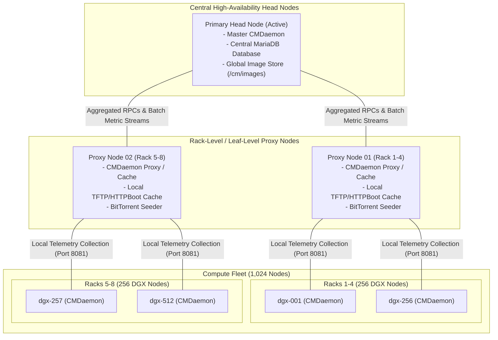
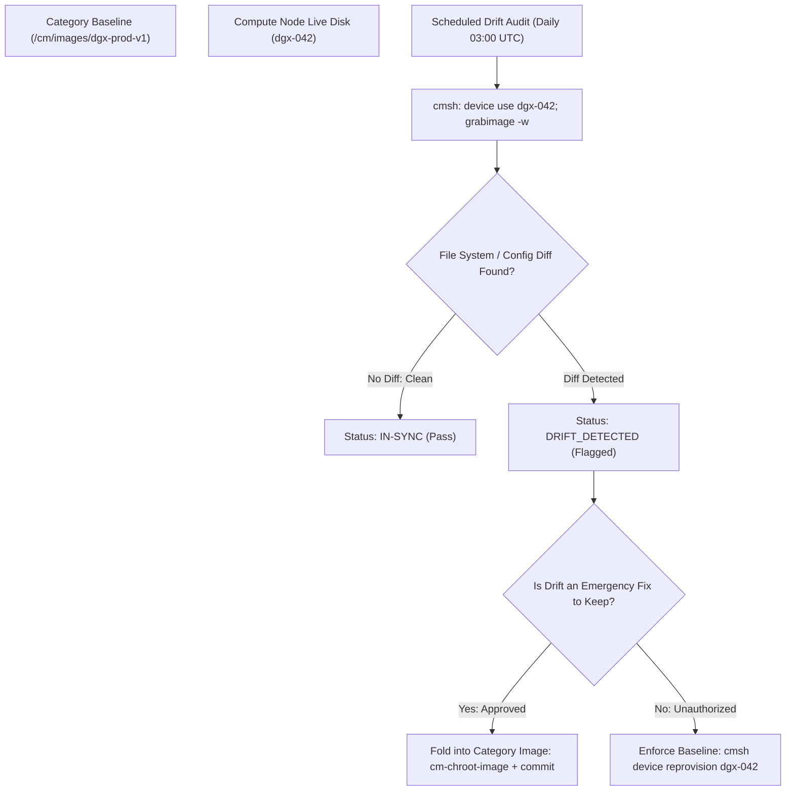
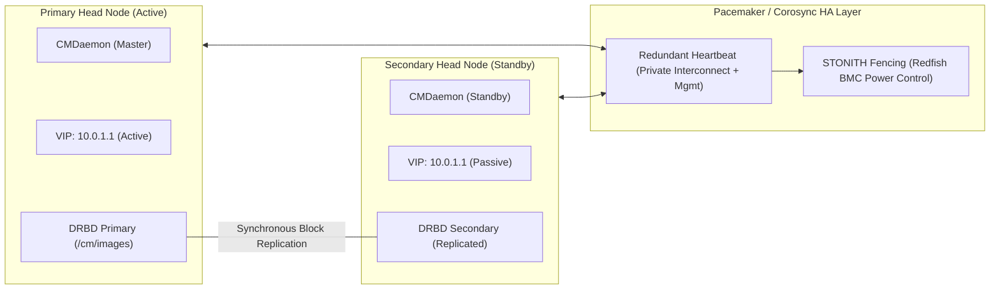

# Senior Deep Dive 1 — BCM at Fleet Scale: Hierarchical Daemons, Category Drift, and Health Architecture

At the scale of an enterprise AI SuperPOD (e.g., 256 to 1,024 DGX H100/H200 nodes, 2,048 to 8,192 GPUs), managing infrastructure via centralized single-server models collapses. If 1,000 compute nodes simultaneously stream hardware telemetry, query image repositories, and report health events to a single head node, the head node suffers **CPU core starvation, MariaDB thread pool exhaustion, and network interface drops**.

Furthermore, long-running production clusters naturally suffer from **configuration drift**: operators make out-of-band manual edits on individual compute nodes under fire, breaking cluster immutability and creating irreproducible failure domains.

As an **NVIDIA Senior Solutions Architect**, you must design BCM architectures capable of scaling to thousands of nodes using hierarchical proxy topologies, automated image drift reconcilers, and intelligent multi-tiered health remediation engines.

---

## 1. Hierarchical CMDaemon Architecture for Fleet Scaling

In a default BCM installation, every compute node’s local CMDaemon communicates directly with the active head node over the cluster management network. At 64 nodes, this is trivial. At 512+ nodes, thousands of concurrent sensor streams overwhelm the head node’s RPC listener.



### Scaling Mechanisms:
1. **CMDaemon Proxy Roles**: BCM supports designating specific management nodes (or storage nodes) as **CMDaemon Proxies**. Instead of 1,024 compute nodes hammering the head node, nodes report to rack-level proxies. The proxy batches metric updates, caches local image chunks, and forwards compressed telemetry to the master head node.
2. **Telemetry Sampling Rate Decoupling**: High-frequency metrics (e.g., GPU power draw sampled at 1 Hz for anomaly detection) are buffered locally on the compute node or proxy, while long-term averages (10-second rollups) are streamed to the central MariaDB time-series database.

---

## 2. Category Inheritance and Drift Detection

In BCM, a **Node Category** represents the declarative single source of truth. Every physical node in a category must be an exact reproduction of that category template: software image, kernel version, boot parameters, and configuration overlays.

### The Phenomenon of Configuration Drift

Under production incident pressure, an engineer might SSH into node `dgx-042` to troubleshoot a failing job and run:
- `dnf install -y libibverbs-devel` (installs an untracked library).
- `sysctl -w vm.max_map_count=2097152` (temporary memory fix).
- `nvidia-smi -pl 650` (caps GPU power draw to avoid a thermal trip).

Node `dgx-042` is now out of sync with its category. BCM still displays the node as a member of `dgx-h100-prod`, but its behavior diverged. If another node rebooted into the clean category image, it would lack these changes.

### Automated Drift Detection Architecture



```bash
# Auditing configuration drift from cmsh
$ cmsh
[headnode]% device use dgx-042
[headnode->device[dgx-042]]% grabimage -w -s /etc,/usr/local
# Comparing /cm/images/dgx-prod-v1 against live node dgx-042:
# [CHANGED]  /etc/sysctl.d/99-custom.conf (Mismatch: vm.max_map_count)
# [ADDED]    /usr/local/bin/debug_nccl.sh
# [WARNING]  Package divergence: libibverbs-devel installed out-of-band!
```

---

## 3. The Three-Tier Health Check and Autonomous Remediation Engine

A common failure in naive cluster management is applying a blanket remediation policy (such as `reboot on failure`) across all health alarms. In BCM, health checks must be split into three distinct operational tiers because the appropriate remediation action differs completely by failure domain.

| Tier | Failure Classification | Example Symptoms | Autonomous Action | Operational Rationale |
|---|---|---|---|---|
| **Tier 1** | **Unrecoverable Hardware** | GPU XID 79 (fallen off bus), Double-Bit ECC memory error, NVLink symbol errors, PSU failure, broken optical transceiver. | **ALERT + Immediate Slurm DRAIN (Never auto-reboot!)** | Hardware faults cannot be fixed by rebooting. Auto-rebooting a node with degraded HBM3 memory silently returns bad silicon to the scheduler, causing subsequent jobs to crash. Requires human hardware triage. |
| **Tier 2** | **Reproducible Software Drift** | Divergent kernel module, missing Lustre/NFS mount, corrupted container cache, stale CUDA runtime libraries. | **Slurm DRAIN + Automated REIMAGE from Category** | Software state is fully reproducible. Reimaging the node from the golden category image restores verified state without human intervention. |
| **Tier 3** | **Workload-Readiness / Transient** | NCCL self-test timeout, temporary DNS/LDAP lookup lag, transient InfiniBand fabric congestion. | **Slurm DRAIN + Wait for Secondary Confirmation** | The node hardware and OS may be completely healthy; the failure was caused by transient external network congestion. Reimaging would waste 20 minutes; hold in drain until confirmed. |

---

## 4. Head Node High-Availability: Quorum, Fencing, and DRBD

In an AI supercomputer running 24/7 training runs, the BCM head node cannot be a single point of failure.



### Failover Sequence:
1. Primary head node experiences kernel freeze or power supply drop.
2. Corosync misses heartbeat messages across configured timeout (10 seconds).
3. Pacemaker initiates **STONITH**: It issues an out-of-band Redfish power-cut command to the primary head node's BMC to guarantee it cannot write to disk.
4. Pacemaker promotes DRBD storage on the secondary node to `Primary`, mounts `/cm/images` and `/cm/shared`, starts `CMDaemon`, and brings up the Virtual IP (`10.0.1.1`).
5. Total failover completes in **< 45 seconds**. Compute nodes and running Slurm training jobs experience zero interruption.

---

## 5. Senior Solutions Architect Interview Scenarios

### Scenario 1: Scaling BCM to 1,000+ Accelerated Nodes
**Interviewer:** *"We are architecting a cluster of 1,024 DGX H100 nodes managed by BCM. How do you design the image provisioning and telemetry collection architecture so that the head node does not saturate its network interfaces or crash MariaDB?"*

**Candidate Answer:**
> "To scale BCM to 1,024 nodes (8,192 GPUs), I implement a **hierarchical aggregation architecture**:
> 1. **Hierarchical CMDaemon Proxies:** We deploy intermediate proxy nodes (e.g., 1 proxy per 4 compute racks). Compute node CMDaemons connect to their local leaf proxy on port 8081. The proxies aggregate sensor data and forward batched metric updates to the primary head node, cutting direct TCP connection overhead by 90%.
> 2. **Peer-to-Peer BitTorrent Image Staging:** We configure BCM categories to use BitTorrent provisioning. The head node seeds the 25GB OS image to the leaf proxies; the leaf proxies and the first wave of booted compute nodes then act as distributed seeders for the rest of the cluster, distributing network egress across the entire spine-leaf fabric.
> 3. **Database Tuning for Time-Series Ingestion:** In MariaDB, we separate transaction logs onto dedicated NVMe arrays, increase `innodb_buffer_pool_size` to 80% of host RAM, and configure BCM to downsample high-frequency hardware metrics to 10-second averages before central relational storage."

---

## Key Takeaways

1. **Hierarchical Proxies Enable Scale:** At 500+ nodes, direct compute-to-head-node communication must be replaced with intermediate CMDaemon proxies to prevent control plane saturation.
2. **Category Drift is Technical Debt:** Enforce automated drift audits (`grabimage -w`); commit legitimate fixes into the golden image or reimage drifted nodes to maintain cluster determinism.
3. **Remediation Must Match the Failure Domain:** Never auto-reboot on Tier 1 hardware errors (ECC, XIDs); auto-reimage on Tier 2 software drift; hold for confirmation on Tier 3 transient workload timeouts.
4. **STONITH Fencing Prevents Split-Brain:** BCM head node HA requires out-of-band Redfish fencing to power off the failing primary before the secondary mounts shared DRBD filesystems.
