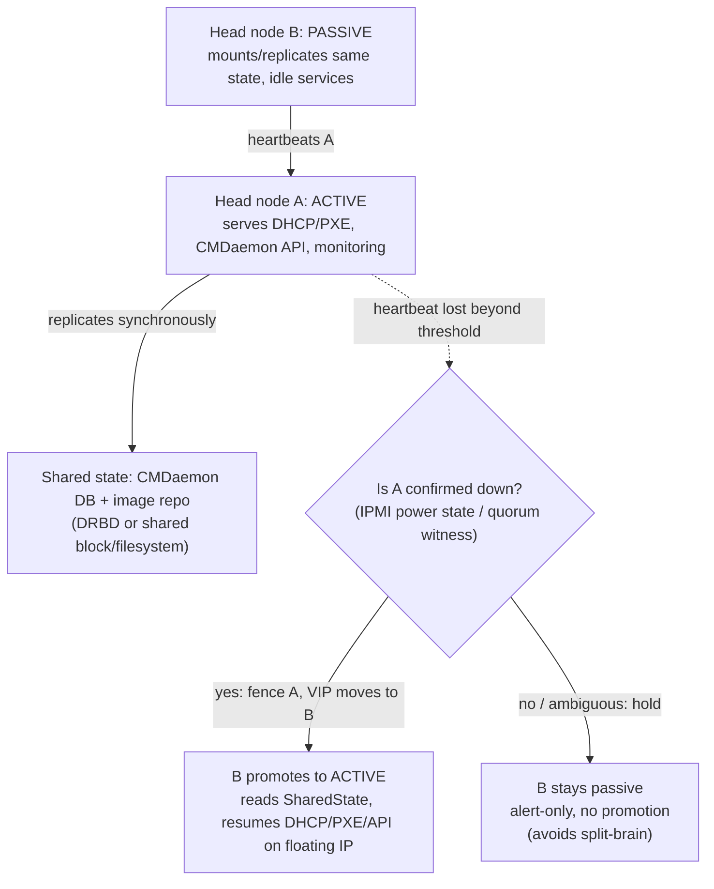

`docs/volume-10/02-nvidia-base-command-manager.md` covers BCM's architecture — head node, node categories, software images, and the provisioning lifecycle. This deep dive covers three things that only surface once a fleet has been running for months rather than days: category drift, health-check taxonomy, and head-node HA.

## Before this deep dive — convert the basics into operational questions

Be comfortable explaining **head node, compute node, software image, category, desired state, and live state** from Chapter 2. Then ask the questions scale introduces:

- If one node differs from its category, how will we detect it before a user's job does?
- Which health failure should warn, drain, quarantine, reimage, or page a human?
- Which BCM services and data must survive a head-node failure, and how is failover tested?
- Can an operator reproduce every emergency fix from version-controlled desired state?

Read this chapter with an evidence ladder in mind: fleet summary → category comparison → node-level observation → service/image logs → controlled remediation → post-remediation workload test. A dashboard showing green is the beginning of evidence, not the end.

As with Chapter 2's `cmsh` sessions, the exact commands and flags below (`grabimage`, `imageupdate`, `healthconf`, `failafter`) are illustrative of the *shape* of BCM's category-drift and health-check model, not a syntax reference — verify exact flags against the installed BCM release's admin manual before quoting or running them.

## Category inheritance and drift

A node category in BCM is a template: software image, kernel modules, roles, and a set of category-level configuration overlays that every member node inherits. The model only holds if every node's live state is *derived* from the category, never edited directly. In practice this breaks the first time someone SSHes into a struggling node and hand-fixes it under pressure — a driver downgrade to unblock a job, a `/etc/security/limits.conf` tweak to raise a file-descriptor cap, a manually-added udev rule for a flaky NIC.

That node is now out of band with its category. BCM does not automatically notice this — `cmgui`/`cmsh` will still report the node as belonging to the category, because category membership is a label, not a live state comparison. Drift is only surfaced by an explicit check:

```
cmsh -c "device use node042; grabimage -w"
```

`grabimage` captures the node's current on-disk state and diffs it against the category's provisioned image. A clean node returns no diff. A drifted node returns a file-level delta — and the delta only tells you *what* changed, not *why*, which is why the operational discipline has to be: no interactive fixes on category members, ever; every fix goes into the category (or a dedicated node-installer finalize script) and gets pushed via `imageupdate`, so the fleet stays reproducible. When drift is found on a production node, the remediation is to either re-image the node from the category (destructive, safe) or capture the delta, decide whether it's a legitimate category-level change, and either fold it into the category image or explicitly revert it — never leave it as a silent one-off.

The scale problem: with 200+ nodes in a category, drift detection can't be a manual `grabimage` per node. It has to run as a scheduled health check (see below) that flags any node whose checksum of tracked config paths disagrees with the category baseline, before that node is trusted for the next job.

## Health-check taxonomy: three tiers, three remediation actions

BCM's healthchecker framework (`cmhealth`, wired into `cmsh -c "device; healthconf"`) treats every check as equivalent — pass/fail/unknown. Operationally they are not equivalent, and a mature deployment separates checks into three tiers because the *correct remediation* differs by tier:

| Tier | Example symptoms | Remediation | Why |
|---|---|---|---|
| Tier 1 — Hardware health | GPU ECC errors (Xid), NVLink link-down, PSU/fan fault, disk SMART pre-fail | ALERT + auto-DRAIN (never auto-reboot) | Hardware faults don't self-heal on reboot, and a reboot can silently mask an escalating ECC pattern you need to see |
| Tier 2 — Software health | driver/CUDA version mismatch vs category baseline, category drift (`grabimage` diff), stuck kernel module, filesystem mount missing | auto-DRAIN + auto-REIMAGE from category | Software state is reproducible from the image — a reboot alone won't fix a bad driver, but re-provisioning will |
| Tier 3 — Workload-readiness health | NCCL self-test failure, GPU-to-GPU bandwidth below threshold, Slurm prolog health-check script failure, PMIx bootstrap probe | auto-DRAIN only (mark unavailable to the scheduler) | Do NOT auto-reboot or auto-reimage — the node may be fine and the failure may be transient/topology-related, so it needs a human or a second confirming check before anything destructive happens |

The reason this separation matters: an auto-reboot policy applied uniformly across all checks is actively dangerous. Rebooting a node with an escalating GPU ECC error can silently accept a partially-failed HBM row and put it back into service; auto-reimaging in response to a transient NCCL self-test blip (e.g., a leaf switch briefly recalculating routes) throws away twenty minutes of provisioning time to fix nothing. Tier 1 gets you paged; Tier 2 gets you a self-healing image re-push; Tier 3 gets you a drained node and a decision point.

BCM expresses these policies through `healthconf`, its health-check configuration. A check can wait for repeated failures before acting (`failafter`), send an external notification (`notify`), request an image refresh (`imageupdate`), or make the node unavailable to Slurm (`drain`).

Each health tier deliberately receives a different action. Tier 1 hardware checks use `failafter` and `notify` with PagerDuty or webhook integration, but no automatic `poweroff` or `reboot`. Tier 2 reproducible-software failures invoke a controlled remediation script that refreshes the known-good image. Tier 3 workload-readiness failures only drain the node. It stays in Slurm's `DRAIN` state until a human validates it and runs `scontrol update state=RESUME`.

## Single head-node architecture: the SPOF problem

A default BCM deployment runs one head node performing provisioning (image serving, PXE/DHCP, node-installer orchestration), monitoring (CMDaemon metrics collection), and cluster management UI/API in one process tree. This is a single point of failure in three distinct ways that fail differently:

- **Provisioning outage**: if the head node is down when a node reboots or a new node is added, that node cannot PXE-boot or pull its image — it hangs at network boot. Already-running compute nodes are unaffected (slurmd/user jobs don't depend on the head node once booted), so the blast radius is "no new nodes, no re-images" rather than "cluster down."
- **Monitoring outage**: CMDaemon-based metrics collection stops, so BCM's own dashboards go dark, but this doesn't affect Slurm scheduling — Slurm has its own independent state. The operational risk here is invisibility, not job loss: incidents happen and no one sees them.
- **Management-plane outage**: `cmsh`/`cmgui`/API access is gone, so no configuration changes, no category pushes, no `cmsh` diagnostics — administrators are blind and hands-off until the head node is restored.

BCM's documented HA option is an active/passive head-node pair: two head nodes sharing a replicated/synchronized state store (the CMDaemon database and shared image/filesystem storage over NFS or a shared block device), with a floating/virtual IP and a failover mechanism that promotes the passive node when the active one stops responding to heartbeats. The failover unit is the whole head-node role — provisioning, monitoring, and management move together, because they all depend on the same underlying state (node categories, image repository, node installer state).

The practical constraint: HA head nodes only protect against head-node failure, not against a bad category push. If an admin pushes a broken image update, both head nodes will serve the same broken image after failover — HA doesn't guard against operator error, only hardware/process failure of the head node itself. That has to be caught by the coordinated-change-management discipline in `docs/volume-10/10-coordinated-cluster-wide-software-change-management.md`, not by head-node redundancy.

## How node provisioning actually writes the category to disk

Drift and health checks only make sense once you know what "the category" physically is and how it gets onto a node, because the remediation for Tier 2 findings (`imageupdate`) is a specific mechanism, not a magic re-sync button.

A BCM software image is a full root filesystem tree held on the head node (by default under something like `/cm/images/<image-name>`), not a disk image file — it's just a directory that gets exported (NFS) or copied to each node in the category. When a node boots:

1. **PXE/DHCP stage** — the node's NIC broadcasts a DHCP request; the head node's DHCP server (scoped to known MAC addresses registered in BCM's device list) replies with an IP and a PXE boot filename pointing at BCM's node-installer kernel/initrd.
2. **Node-installer stage** — the node boots into a minimal Linux environment (the node-installer, not the production OS) that queries the head node's CMDaemon for that node's category and full provisioning parameters — which image, partitioning layout, kernel modules, network config.
3. **Provisioning stage** — the node-installer synchronizes the category's image onto local disk. This is the step with two distinct modes that matter operationally:
   - **Full provisioning** (a full reinstall, e.g. triggered by `imageupdate -f` or a normal PXE reprovision) wipes and rewrites the node's local disk from the category image — this is the "destructive, safe" remediation referenced above: destructive to any local state, but guaranteed to converge to category baseline.
   - **Incremental sync** (`imageupdate` without a full flag, or the periodic `excludelistupdate`-scoped sync some sites schedule) uses an rsync-like delta transfer that only pushes changed files, respecting an **exclude list** (`excludelistupdate`/`excludelistfullinstall`) — a configured set of paths (typically `/var/log`, swap files, node-local scratch, sometimes `/etc/hostname`-equivalent identity files) that are deliberately *not* overwritten by a sync, because they're legitimately node-specific and not part of category identity.
4. **Finalize stage** — post-sync scripts (`finalize` scripts, category-scoped) run once the filesystem is in place — this is where category-level customizations that can't just be "files in the image" get applied (e.g., registering the node with a license server using its own hostname).

The operational implication: `grabimage -w`'s diff is comparing the node's live disk against this same image tree, path by path (modulo the exclude list, which is why `/var/log` differences never show up as drift — they're supposed to differ). When Tier 2 remediation runs `imageupdate`, it is re-running step 3 against the already-booted node rather than a full PXE cycle, which is faster but still authoritative, because it pulls from the same category image tree the node-installer would have used on a fresh boot. A full reimage (PXE reboot into node-installer, full provisioning) is reserved for drift that an incremental `imageupdate` can't cleanly resolve — for example, a corrupted filesystem, a partition-table mismatch, or drift in something the exclude list was (mis)configured to skip.

This is also why exclude-list configuration is itself a drift-adjacent risk: an overly broad exclude list (e.g., someone added `/etc/modprobe.d/` to stop a legitimate hand-fix from being clobbered) silently converts a category-tracked path into a permanently untracked one — future `imageupdate` runs will never touch it again, and `grabimage` will stop flagging drift there, which is worse than visible drift because the fleet loses the ability to detect the exact class of problem the mechanism exists to catch. Exclude-list changes should go through the same change-review discipline as category image changes, not be treated as a quick unblock.

## Head-node HA failover mechanics, step by step

The single-sentence description ("active/passive pair with a floating IP") hides the parts that actually make failover safe or unsafe in practice. A production HA pair has three cooperating mechanisms, and a gap in any one of them turns "HA configured" into "HA configured but doesn't actually protect you":

- **State replication.** The active head node's CMDaemon database (device inventory, category definitions, health-check state, job/monitoring history) and the image repository (`/cm/images/...`) must be present, current, and consistent on the passive node *before* it needs to take over — not reconstructed at failover time. In practice this is done with synchronous or near-synchronous block-level replication (e.g., DRBD) under the CMDaemon database and image storage, or a shared filesystem both nodes mount (NFS/shared block device with a cluster filesystem), so the passive node isn't relying on a stale periodic copy the way a nightly backup would be.
- **Heartbeat / failure detection.** The passive node monitors the active node's liveness (network heartbeat, and in well-built deployments a secondary out-of-band channel such as IPMI/BMC access, so a partitioned-but-alive active node can still be power-fenced rather than just presumed dead). The detection window is a real trade-off: too short and a transient network blip triggers an unnecessary failover (and a brief window where both nodes believe they might be active); too long and node reboots/PXE requests during the outage window simply hang until failover completes.
- **Fencing (STONITH-equivalent).** Before the passive node promotes itself to active and starts answering DHCP/PXE requests and accepting `cmsh`/API writes, the formerly-active node must be guaranteed to stop acting as active — either because it's confirmed powered off/fenced (via IPMI power control) or because a quorum/witness mechanism confirms only one side can win. Skipping this step is the actual split-brain risk: without fencing, a head node that's merely network-partitioned (not actually down) may still be alive, still serving DHCP/PXE, still accepting `cmsh` writes to the *same shared state store* the passive node just took over — two active head nodes racing to write the same database is a more dangerous failure than no HA at all, because it corrupts the very state store both sides depend on for correctness.



**Testing failover for real** means more than confirming the passive node's CMDaemon service starts. A credible test drains no production traffic risk by running against a staging head-node pair or a maintenance window, and validates each of the three mechanisms independently:

```bash
# On the currently-active head node, simulate a hard failure
# (power off via IPMI rather than a clean shutdown — a clean
# shutdown lets services deregister gracefully, which a real
# hardware failure will not do, so it under-tests the failure path)
ipmitool -I lanplus -H hn01-bmc -U admin power off
```

```
# Expected sequence on the passive node's log, roughly:
# t+0s    heartbeat loss detected
# t+8s    heartbeat threshold exceeded, checking fencing status
# t+9s    IPMI confirms hn01 power state: off
# t+10s   promoting to ACTIVE, acquiring floating IP 10.10.0.5
# t+12s   DHCP/PXE service started on floating IP
# t+13s   CMDaemon API now answering on floating IP
```

A missing or delayed `t+9s` line (fencing confirmation) is the finding that matters most — if the passive node promotes without ever querying IPMI power state, the deployment has no real fencing and is running on a "probably fine" heartbeat-only failover that will split-brain the first time it's a network partition rather than an actual power loss. After promotion, validate the *provisioning* path end-to-end, not just the API: PXE-boot a spare node against the floating IP and confirm it completes node-installer against the now-active B, proving the image repository replication (not just the database) came over correctly.

## Worked scenario A user reports one node, `node057`, throwing intermittent CUDA `initialization error` while its 95 category-mates are fine. First check is category drift, not hardware:

```
cmsh -c "device use node057; grabimage -w"
# diff shows: /etc/modprobe.d/nvidia.conf modified, /usr/lib/... nvidia-persistenced binary older
```

The diff shows someone manually rolled back the driver on `node057` two weeks earlier to work around an unrelated issue, and never rolled it forward or captured it in the category. This is a Tier 2 (software health) finding, not a Tier 1 hardware fault — the fix is `cmsh -c "device use node057; imageupdate"` to re-sync to category baseline, not a GPU RMA. Root cause of the *drift* (why was a manual fix applied instead of a category change) goes into the retro; root cause of the *symptom* is closed by the reimage.

## Interview-ready line

"BCM's node category is only trustworthy if nothing ever touches a member node outside the category — the moment someone hand-fixes one node, `grabimage` is the only thing that tells you it drifted, and health checks need three separate tiers with three separate remediation actions, because auto-rebooting a hardware fault or auto-reimaging a transient network blip both cause more damage than the original failure."
