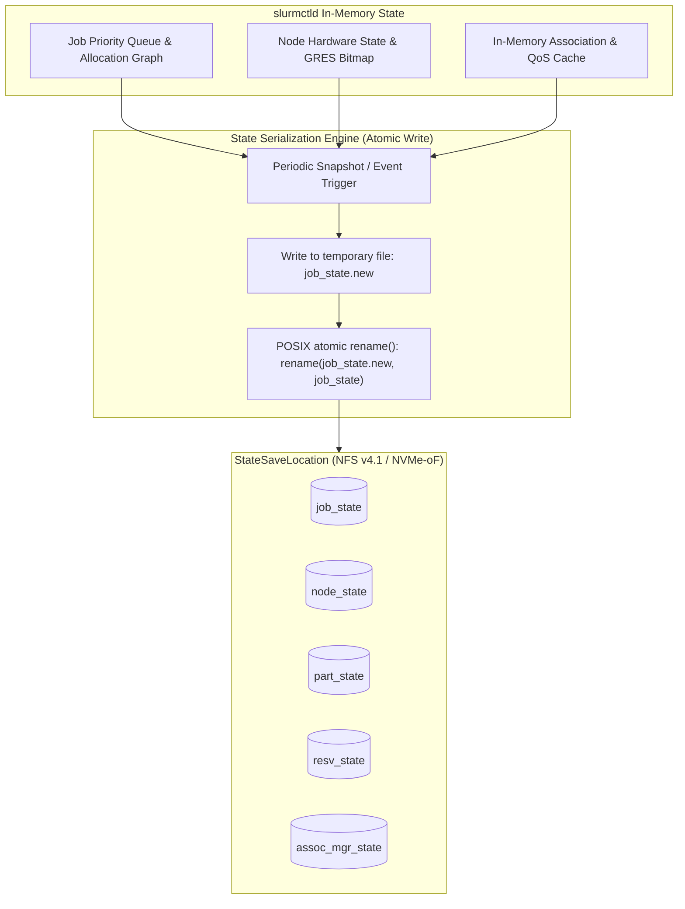
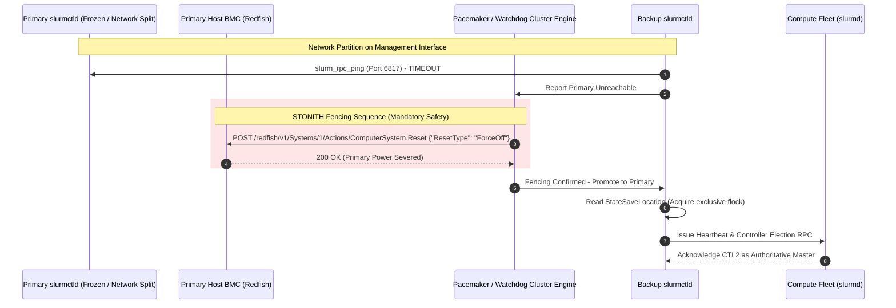
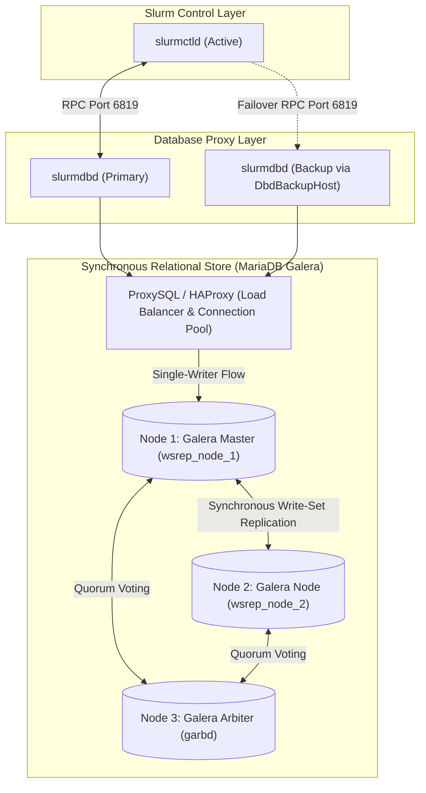

# Senior Deep Dive 2 — Slurm HA, Database Clustering, and Accounting Internals

Operating Slurm at Tier-1 supercomputer scale (1,000+ DGX nodes, 8,000+ GPUs) requires deep mastery of the internal serialization engines, remote procedure call (RPC) state machines, and relational database backends that power the scheduler. While high-level documentation suggests that declaring `SlurmctldHost=primary,backup` guarantees high availability, the reality in production is fraught with **POSIX locking races, state-desynchronization splits, MariaDB deadlock cascades, and accounting rollup staleness**.

This deep dive covers the internal mechanics of state preservation, split-brain fencing, database replication topologies, and the decayed fairshare mathematics required for an **NVIDIA Senior Solutions Architect**.

---

## 1. Internal State Serialization and the `StateSaveLocation` Contract

`slurmctld` is fundamentally an in-memory graph processor. To achieve sub-millisecond scheduling decisions across hundreds of thousands of cores and tens of thousands of queued tasks, it does not query a database on every scheduling cycle. Instead, the entire cluster topology, pending queue, running job steps, node hardware states, and partition matrices reside directly in the controller's virtual address space.



### The Atomic Serialization Algorithm

Every 2 to 5 seconds (governed by `SlurmctldTimeout` and internal transaction triggers), `slurmctld` flushes its memory structures to disk:
1. It serializes the job table into a temporary file: `${StateSaveLocation}/job_state.new`.
2. It executes a POSIX `fsync()` to force disk blocks to non-volatile shared storage.
3. It performs a POSIX atomic rename: `rename("job_state.new", "job_state")`.

### Failure Mode: Why NFS Cache Consistency Can Corrupt Failover
If `StateSaveLocation` is mounted over standard NFS without strict cache synchronization (`sync`, `noac`, `lookupcache=none`), the following disaster occurs:
1. Primary controller updates `job_state` and crashes.
2. Backup controller promotes to primary and reads `job_state` from its local NFS client cache, which is 30 seconds stale.
3. The backup controller allocates nodes that were already assigned to a running 512-GPU job, resulting in **two distinct training jobs attempting to use the same physical GPUs simultaneously**.
4. Both jobs crash immediately with fatal CUDA/NCCL bus lockups.

**Production Architectural Rule:** `StateSaveLocation` must be hosted on high-performance enterprise shared storage using **NFS v4.1/v4.2 with `sync` and `hard,intr` mount options**, or an active/passive block storage device replicated synchronously via **DRBD dual-primary protocol C**.

---

## 2. Split-Brain Dynamics and Fencing (STONITH)

Slurm's built-in failover mechanism is **optimistic**. The backup controller polls the primary via `slurm_rpc_ping` on TCP port 6817. If the primary does not respond within `SlurmctldTimeout` seconds, the backup assumes authority.



### Why Built-in Slurm HA Is Not Enough for AI SuperPODs

If a transient network partition isolates `slurmctl-01` from `slurmctl-02`, but leaves `slurmctl-01` connected to the compute nodes:
- `slurmctl-02` promotes itself and starts accepting new jobs.
- `slurmctl-01` continues running and dispatching jobs.
- Both controllers attempt to read and write `StateSaveLocation`, destroying the binary state files and corrupting the cluster.

**The Solution:** Deploy **Pacemaker with Corosync** to govern the Slurm service. Pacemaker controls the virtual IP (VIP) and implements **STONITH (Shoot The Other Node In The Head)** via out-of-band Redfish or IPMI power cycling before promoting the backup controller.

---

## 3. Database Clustering: `slurmdbd` and MariaDB Galera Internals

While `slurmctld` manages live scheduling, `slurmdbd` (Slurm Database Daemon) manages historical usage, multi-tenant accounting, and QoS limits.



### Why Standard Active-Active Multi-Writer Galera Fails with Slurm

In high-throughput clusters running tens of thousands of job steps per hour, configuring a load balancer to distribute SQL writes from `slurmdbd` across multiple Galera database nodes concurrently causes **fatal database deadlock cascades (`wsrep_conflict`)**.

- **The Mechanism:** `slurmdbd` executes batch updates across shared accounting parent tables (`cluster_assoc_table`, `usage_hour_table`). If Node 1 and Node 2 simultaneously commit updates touching the same association row, Galera certification test detects a write conflict and forces one node to abort with `Deadlock found when trying to get lock; try restarting transaction`.
- **The Architectural Fix:** Configure ProxySQL or HAProxy in **Single-Writer Active / Standby-Reader** mode. All SQL writes flow strictly to Galera Node 1. Node 2 acts as a synchronous hot replica that only accepts traffic if Node 1 drops out of the cluster.

---

## 4. Fairshare Internal Mathematics and Usage Decay

Slurm’s multifactor priority plugin uses an exponential decay algorithm to compute fairshare priority:

```text
F = 2 ^ (- U_E / S_N)
```

Where:
- `S_N`: Normalized Share assigned to the user or department association.
- `U_E`: Effective Usage, computed through historical usage decay.

### The Half-Life Decay Formula

At every periodic interval `Delta_t`, the historical raw usage `U_raw` is decayed according to the half-life constant `lambda`:

```text
U_decayed(t + Delta_t) = U_decayed(t) * e^(-lambda * Delta_t) + U_new
```

Where the decay parameter `lambda` is defined by `PriorityDecayHalfLife`:

```text
lambda = ln(2) / PriorityDecayHalfLife_in_seconds
```

```text
Decay Impact Example (PriorityDecayHalfLife = 7 Days):
- Day 0: Team trains massive 1,024-GPU job for 24 hours (24,576 GPU-hours). Effective Usage spikes.
- Day 7: If no further jobs are run, historical usage penalty decays by 50% (12,288 GPU-hours).
- Day 14: Historical usage penalty decays to 25% (6,144 GPU-hours).
- Day 21: Historical usage penalty decays to 12.5% (3,072 GPU-hours). Fairshare factor returns to near 0.5.
```

---

## 5. Senior Solutions Architect Interview Scenarios

### Scenario 1: MariaDB Deadlocks Causing Slurmctld Thread Exhaustion
**Interviewer:** *"During a 10,000-job synthetic benchmark run, `slurmctld` stops responding to `squeue` and `sbatch` commands. The process is still running, but all administrative commands hang. Inspecting `slurmdbd.log` shows hundreds of MariaDB deadlock errors. What happened, and how do you re-architect the accounting pipeline?"*

**Candidate Answer:**
> "This is a classic connection exhaustion cascade between `slurmctld`, `slurmdbd`, and MariaDB:
> 1. **The Root Cause:** In a high-throughput job submission burst, `slurmdbd` issues concurrent write-sets to MariaDB. If MariaDB is configured as a multi-writer Galera cluster or lacks appropriate index caching, row-level certification deadlocks occur. `slurmdbd` threads block waiting for database locks, eventually exhausting `slurmdbd`'s connection pool.
> 2. **Cascade to the Controller:** Because `slurmctld` communicates synchronously with `slurmdbd` for association and QoS verifications on incoming `sbatch` calls, its internal RPC handler threads (`MaxQueryTime`, `SlurmctldParameters=server_thread_count`) exhaust. The controller freezes and stops servicing client RPCs.
> 3. **The Solution:**
>    - **Single-Writer DB Proxy:** Route all `slurmdbd` traffic through ProxySQL to a single designated Galera writer node to eliminate write-set certification conflicts.
>    - **Async Rollup Configuration:** In `slurmdbd.conf`, configure `PurgeEventAfter=1month` and tune `RollupStats=yes` so accounting rollups do not lock active job tables during business hours.
>    - **Slurmctld Decoupling:** In `slurm.conf`, configure `AccountingStorageEnforce=associations,limits` and ensure `SlurmctldParameters=enable_step_mgr` is active, allowing `slurmctld` to cache association decisions and continue scheduling even during transient database stalls."

---

## Key Takeaways

1. **`StateSaveLocation` is the Single Source of Truth:** High availability relies entirely on synchronous POSIX shared storage. A backup controller starting with stale state will cause double-allocation and crash running jobs.
2. **Pacemaker STONITH is Required:** Slurm's native ping-timeout mechanism cannot prevent split-brain during complex network partitions; hardware-level BMC fencing is mandatory in enterprise SuperPODs.
3. **Single-Writer for MariaDB Galera:** Never configure active-active multi-writer database topologies under `slurmdbd`; certification deadlocks will exhaust controller threads.
4. **Exponential Decay Governs Equity:** `PriorityDecayHalfLife` balances burst consumption against long-term fairness, allowing accounts that burst during deadlines to naturally recover their queue priority over time.
