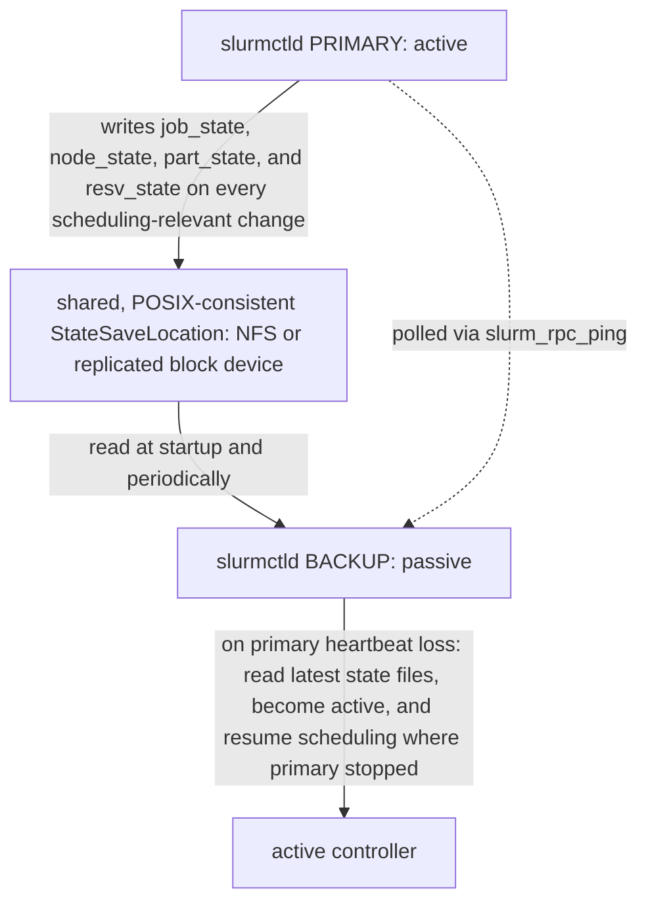

`docs/volume-10/06-slurm-administration-ha-accounting-and-upgrades.md` covers the operational surface of Slurm HA (primary/backup `slurmctld`), fairshare, and version upgrades. This deep dive covers the state-consistency mechanics that make failover *safe* rather than merely configured, the actual fairshare math, and multi-cluster federation.

## Before this deep dive — separate availability, durability, and correctness

These properties are related but not interchangeable:

- **Availability:** clients can submit/query jobs and the scheduler can make progress.
- **Durability:** queue, node, reservation, and accounting state survives failure.
- **Correctness:** no resources are double-allocated and policy is applied consistently.

An HA configuration file proves none of them by itself. Before continuing, be able to trace `sbatch → slurmctld → slurmd` and explain the separate role of `slurmdbd`. For every failover design, identify the authoritative state, consistency mechanism, failure detector, fencing/split-brain protection, recovery objective, and test method.

A safe exercise uses a non-production cluster: submit a long sleep job and queued jobs, capture `squeue`, node state, controller logs, and accounting state, fail the primary through the supported procedure, then compare job IDs, allocations, reasons, and records after takeover. "Backup process started" is not the acceptance criterion; preserved behavior and state are.

## What must be consistent for failover to be safe

A backup `slurmctld` is not a cold standby that simply starts scheduling when the primary disappears — if it started from empty state, every running job's allocation record, every pending job's position in the queue, and every node's current state would be lost or reconstructed wrong, and Slurm would either double-allocate resources or drop jobs. Failover is safe only because both controllers read and write the same `StateSaveLocation`:



Slurm persists scheduler state beneath `StateSaveLocation`. The files include job state (`job_state`), node state (`node_state`), partition and reservation state (`part_state`, `resv_state`), triggers (`trigger_state`), and `assoc_mgr_state`, which holds the cached account, fairshare, and QoS association tree.

Both controllers must see the same current directory through shared storage or a synchronously replicated equivalent. The backup controller does not reconstruct reality by querying every compute node. Its failover contract is simpler: read the last state written by the primary, then continue scheduling from that point.

A stale or local copy creates a **fork of reality**. The backup may believe a completed job is still running or an allocated node is idle, which can cause double-booking. Therefore, configuring `SlurmctldHost=primary,backup` is necessary but insufficient. Shared, current `StateSaveLocation` data is what makes the takeover safe; DRBD or another replicated block layer is one way to provide it.

`slurmdbd`, the accounting daemon, is separate from `slurmctld`, the scheduling controller. Controller failover protects scheduling continuity. Accounting availability protects the freshness of fairshare and QoS policy because `slurmdbd` populates the controller's in-memory association tree from its MySQL/MariaDB backend.

If `slurmdbd` is unreachable when `slurmctld` starts, jobs can still run using cached association data. The risk is subtler: priority, fairshare, or QoS limits may be enforced from stale information until accounting reconnects. Scheduling availability and accounting-policy correctness are therefore two different HA problems.

## Fairshare mechanics beyond "there's a fairshare score"

Slurm's default multifactor priority plugin computes a fairshare component from **usage decayed over time**, not raw cumulative usage — this is the mechanism that answers "why doesn't one burst of jobs permanently tank a group's priority."

- Every association (user/account/partition combination) accumulates *raw usage* (CPU-seconds × TRES weight, effectively normalized resource-seconds) as jobs complete.
- That usage is decayed on a half-life set by `PriorityDecayHalfLife` (commonly 7 or 14 days in production configs). Usage from a job 14 days ago (at the default half-life) counts for half as much as usage from today; usage from 28 days ago counts for a quarter. This is literally a radioactive-decay model applied to compute consumption.
- The fairshare *score* itself is not raw decayed usage — it's decayed usage **normalized against the association's allocated share** of the tree. An account with 20% of a fairshare tree's shares that has consumed 20% of the (decayed) cluster usage gets a fairshare factor near 0.5 (right at parity); consuming more than its share pushes the factor toward 0, consuming less pushes it toward 1. `sshare -l` shows this directly:

```
sshare -l -A team-vision
# Account   User   RawShares  NormShares  RawUsage   EffectvUsage  FairShare
# team-vision       -         0.20         0.20      842391          0.34         0.62
```

`FairShare=0.62` above means team-vision has been under-consuming relative to its 20% allocation, so its jobs get a priority boost. If that team then submits 500 jobs in one afternoon, `RawUsage`/`EffectvUsage` rises immediately and `FairShare` drops toward 0 for their *next* submissions — but critically, that drop is against the decayed history, so it self-corrects: the burst ages out over the next one to two half-lives (roughly two to four weeks at a 14-day half-life) and their fairshare factor recovers automatically, without any admin intervention, as long as the burst doesn't repeat. A **sustained** high-usage pattern — the same account consistently over-consuming every week — never lets the decayed usage average back down, because new usage keeps arriving before the old usage has decayed out, which is exactly the "one burst forgiven, a pattern isn't" behavior the source chapter alludes to.

This is also why `PriorityDecayHalfLife` is a cluster-policy decision, not just a config default: a short half-life (e.g., 1 day) makes the scheduler forgive usage almost immediately — fairshare becomes close to "who used the GPUs in the last day," favoring bursty fairness. A long half-life (e.g., 30+ days) makes historical usage sticky — a group that over-consumed a month ago is still being penalized today, favoring long-run fairness at the cost of slow recovery for teams that had one legitimate heavy month (e.g., a paper deadline).

## Fencing and split-brain: what actually stops two controllers from both being active

The mermaid diagram above describes the happy path. The failure mode that makes Slurm HA genuinely hard is the same one that makes any active/passive system hard: what happens if the primary is not dead, only unreachable from the backup's point of view (a network partition), while still being fully alive and reachable from compute nodes?

Slurm's HA model does **not** include STONITH-style hardware fencing the way some database or filesystem HA stacks do. Its protection against split-brain is narrower and more implicit:

- The backup only takes over after failing to reach the primary via `slurm_rpc_ping` for a configured number of retries (`SlurmctldTimeout`). This proves the backup can't reach the primary; it does not prove the primary is down.
- `slurmd` on every compute node also independently pings whichever `slurmctld` it believes is primary, and — this is the actual safety mechanism — compute nodes only accept scheduling instructions (new allocations) from the controller they currently recognize as authoritative, based on `SlurmctldHost` order and the same reachability logic. If the network partition is such that compute nodes can still reach the *original* primary, and the backup promotes itself because *it* individually lost contact with the primary, you can end up with compute nodes still taking instructions from the old primary while the backup believes it is now authoritative — this is the actual split-brain scenario, and Slurm's mitigation is topological, not protocol-level: production HA pairs are placed such that the backup's connectivity to the primary is representative of the compute fleet's connectivity to the primary (e.g., backup and primary on the same network segment as the compute nodes, not on a separate management network that can partition independently), so that "backup can't reach primary" and "compute fleet can't reach primary" fail together rather than independently.
- The stronger, more surgical mitigation many sites add is an external fencing step in the failover automation itself (not built into `slurmctld`): before promoting the backup, a wrapper script power-fences the primary via IPMI/BMC, the same pattern used for the BCM head-node HA case in the fleet-scale deep dive. This converts "assumed dead because unreachable" into "confirmed dead because powered off," closing the gap Slurm's own ping-timeout mechanism leaves open.

The consequence for anyone designing or auditing a Slurm HA deployment: "we have `SlurmctldHost=primary,backup` configured" answers almost none of the actual safety question. The real questions are (1) is `StateSaveLocation` synchronously consistent, (2) is the backup's network path to the primary representative of the compute fleet's path, and (3) is there an explicit fencing step, or is the design implicitly betting that partition scenarios where the backup is wrong about the primary being down simply don't happen in this topology. Absent (3), that bet should be stated explicitly in the runbook, not left as an unstated assumption discovered during an actual incident.

## `slurmdbd` and the accounting database: what's actually inside it

`slurmdbd` is commonly described as "the accounting daemon" as if it were a passive logger. Operationally it's closer to a live cache-backing store for policy data the controller needs on every scheduling decision, plus a historical ledger, and the two roles have different consistency and performance requirements.

**Schema shape (MySQL/MariaDB backend).** Without reproducing exact table names (verify against the installed version), the practically important structure is:

- **Association table** — the tree of cluster → account → user → (optional partition/QoS overrides), each row carrying `RawShares`, cached usage, and applicable QoS/limits. This is what gets pulled into `slurmctld`'s in-memory `assoc_mgr_state` at startup and refreshed periodically — it's the table `sshare` reads from (indirectly, through the controller's cache) and the table an admin edits with `sacctmgr modify account ... set fairshare=...`.
- **Per-job accounting rows** — one row (plus job-step rows) per submitted job: submit time, start time, end time, requested and allocated TRES (CPU, memory, GPU counts), exit code, and the association it charged against. This is the raw material `sacct` queries.
- **Usage rollup tables** — hourly, daily, and monthly aggregate usage per association, maintained by `slurmdbd`'s internal rollup process rather than computed fresh from the job table on every query. This exists purely for performance: computing "cluster usage for team-vision over the last 90 days" by summing raw per-job rows across millions of historical jobs on every `sshare`/`sreport` call would be far too slow at fleet scale, so `slurmdbd` periodically (by default roughly hourly) aggregates completed-job usage into these rollup tables, and `sreport`-style usage reporting reads the rollups, not the raw job table.

**Why rollup timing matters operationally.** Because fairshare's decayed-usage calculation and `sreport` usage numbers are ultimately fed by these rollups (directly or via the controller's periodically-refreshed association cache), there's a real, bounded staleness window between a job completing and its usage being fully reflected in fairshare-affecting numbers. In steady state this window is small and invisible. It becomes visible during a `slurmdbd` outage or backlog: if `slurmdbd` is down or behind, `slurmctld` keeps scheduling using its last-cached association/fairshare snapshot (this is the "jobs still run on cached data" behavior from earlier), but freshly-completed usage isn't being rolled up or pushed back into that cache — so a burst of jobs that completes during a `slurmdbd` outage doesn't affect priority for *subsequent* submissions until `slurmdbd` catches up, which can transiently look like "fairshare isn't working" when it's actually "fairshare is working off data that's temporarily frozen."

**Archiving and purging.** Left unmanaged, the per-job accounting table grows without bound — a busy fleet running tens of thousands of jobs a day accumulates a large table within months, which eventually slows both `sacct` queries and the rollup process itself. Production deployments configure `slurmdbd.conf`'s purge/archive settings (commonly `PurgeJobAfter`, `ArchiveJobs`, and an `ArchiveDir`) to periodically move job records older than a retention window out of the live table into flat-file archives (and, if needed, reload them later with `sacctmgr archive load` for a historical audit). The operational trade-off is retention length versus live-table/query performance: a site with compliance or grant-reporting requirements to retain full job history for years typically keeps the live table lean (a rolling 90–180 day window) and relies on the archived flat files (or a separate long-term reporting datastore) for anything older, rather than trying to keep the operational database itself unbounded.

**QoS and limits enforcement.** Quality-of-Service definitions (`sacctmgr add qos`) carry their own limits — max jobs per user, max TRES per job, max wall time, preemption behavior — which are enforced by the controller at submission and scheduling time using its cached association/QoS data, the same cache that goes stale during a `slurmdbd` outage. This is the concrete version of the earlier "priority, fairshare, or QoS limits may be enforced from stale information" risk: if an admin tightens a QoS limit (say, dropping a burst-partition's max-jobs-per-user from 50 to 10) while `slurmdbd` happens to be unreachable, `slurmctld` keeps enforcing the *old* limit of 50 until it can refresh from `slurmdbd`, because the controller has no other source of truth for QoS definitions than its last successful sync.

## Multi-cluster federation, briefly

Slurm federation (`sacctmgr add federation`) lets multiple independently-managed Slurm clusters share one `slurmdbd` accounting backend and present a federated view — `squeue --federation` shows jobs across all member clusters, and a job submitted to the federation can be routed to whichever member cluster has capacity, with `slurmdbd` acting as the single source of truth for fairshare across the whole federation rather than per-cluster. This matters operationally when a site has, e.g., a research cluster and a production cluster that need combined accounting/fairshare — federation lets central IT enforce one usage policy without merging the clusters' `slurmctld`/node management under one control plane. Each member cluster keeps its own `slurmctld` and its own HA pair as described above; federation only changes accounting/routing, not the failover mechanics within a single cluster.

## Worked scenario

`team-genomics` has been running steadily under its fairshare allocation for two months (`FairShare≈0.7`, jobs scheduling promptly). On Friday they submit 2,000 short jobs to backfill a grant deadline. By Monday, other teams are complaining that genomics jobs are starving everyone else. Checking `sshare -l -A team-genomics` shows `FairShare` has dropped to 0.05 — expected, they blew through several days of decayed-usage headroom in one weekend. The question is whether to intervene: given a 14-day `PriorityDecayHalfLife`, this recovers on its own within roughly two to three weeks without any admin action, purely from decay, *provided genomics doesn't repeat the burst*. If they do repeat it every week, that's no longer a burst — that's their new sustained usage pattern, and a real conversation about their allocated share (`RawShares`) is needed instead of waiting for decay that will never catch up.

## Interview-ready line

"Slurm failover is only as safe as `StateSaveLocation` being genuinely shared, synchronously-consistent storage between primary and backup — a backup with the right `slurm.conf` but its own copy of the state files will take over scheduling and immediately start making decisions against stale reality; and fairshare recovers from a one-time burst automatically because usage decays on a half-life, but a sustained pattern never decays out because new usage keeps arriving before the old usage ages off."
