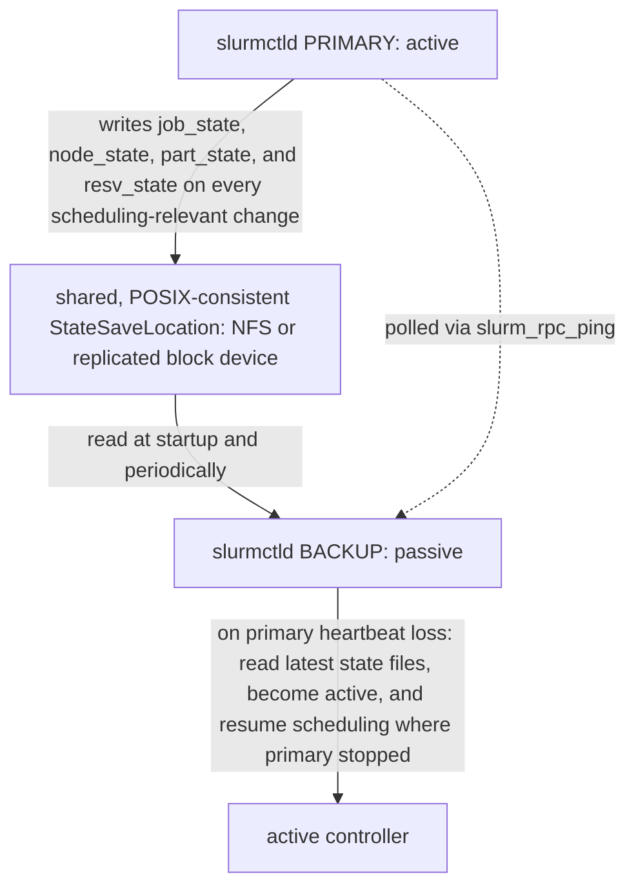

`docs/volume-10/06-slurm-administration-ha-accounting-and-upgrades.md` covers the operational surface of Slurm HA (primary/backup `slurmctld`), fairshare, and version upgrades. This deep dive covers the state-consistency mechanics that make failover *safe* rather than merely configured, the actual fairshare math, and multi-cluster federation.

## Before this deep dive — separate availability, durability, and correctness

These properties are related but not interchangeable:

- **Availability:** clients can submit/query jobs and the scheduler can make progress.
- **Durability:** queue, node, reservation, and accounting state survives failure.
- **Correctness:** no resources are double-allocated and policy is applied consistently.

An HA configuration file proves none of them by itself. Before continuing, be able to trace `sbatch → slurmctld → slurmd` and explain the separate role of `slurmdbd`. For every failover design, identify the authoritative state, consistency mechanism, failure detector, fencing/split-brain protection, recovery objective, and test method.

A safe exercise uses a non-production cluster: submit a long sleep job and queued jobs, capture `squeue`, node state, controller logs, and accounting state, fail the primary through the supported procedure, then compare job IDs, allocations, reasons, and records after takeover. "Backup process started" is not the acceptance criterion; preserved behavior and state are.

## What must be consistent for failover to be safe

A backup `slurmctld` is not a cold standby that simply starts scheduling when the primary disappears — if it started from empty state, every running job's allocation record, every pending job's position in the queue, and every node's current state would be lost or reconstructed wrong, and Slurm would either double-allocate resources or drop jobs. Failover is safe only because both controllers read and write the same `StateSaveLocation`:



Slurm persists scheduler state beneath `StateSaveLocation`. The files include job state (`job_state`), node state (`node_state`), partition and reservation state (`part_state`, `resv_state`), triggers (`trigger_state`), and `assoc_mgr_state`, which holds the cached account, fairshare, and QoS association tree.

Both controllers must see the same current directory through shared storage or a synchronously replicated equivalent. The backup controller does not reconstruct reality by querying every compute node. Its failover contract is simpler: read the last state written by the primary, then continue scheduling from that point.

A stale or local copy creates a **fork of reality**. The backup may believe a completed job is still running or an allocated node is idle, which can cause double-booking. Therefore, configuring `SlurmctldHost=primary,backup` is necessary but insufficient. Shared, current `StateSaveLocation` data is what makes the takeover safe; DRBD or another replicated block layer is one way to provide it.

`slurmdbd`, the accounting daemon, is separate from `slurmctld`, the scheduling controller. Controller failover protects scheduling continuity. Accounting availability protects the freshness of fairshare and QoS policy because `slurmdbd` populates the controller's in-memory association tree from its MySQL/MariaDB backend.

If `slurmdbd` is unreachable when `slurmctld` starts, jobs can still run using cached association data. The risk is subtler: priority, fairshare, or QoS limits may be enforced from stale information until accounting reconnects. Scheduling availability and accounting-policy correctness are therefore two different HA problems.

## Fairshare mechanics beyond "there's a fairshare score"

Slurm's default multifactor priority plugin computes a fairshare component from **usage decayed over time**, not raw cumulative usage — this is the mechanism that answers "why doesn't one burst of jobs permanently tank a group's priority."

- Every association (user/account/partition combination) accumulates *raw usage* (CPU-seconds × TRES weight, effectively normalized resource-seconds) as jobs complete.
- That usage is decayed on a half-life set by `PriorityDecayHalfLife` (commonly 7 or 14 days in production configs). Usage from a job 14 days ago (at the default half-life) counts for half as much as usage from today; usage from 28 days ago counts for a quarter. This is literally a radioactive-decay model applied to compute consumption.
- The fairshare *score* itself is not raw decayed usage — it's decayed usage **normalized against the association's allocated share** of the tree. An account with 20% of a fairshare tree's shares that has consumed 20% of the (decayed) cluster usage gets a fairshare factor near 0.5 (right at parity); consuming more than its share pushes the factor toward 0, consuming less pushes it toward 1. `sshare -l` shows this directly:

```
sshare -l -A team-vision
# Account   User   RawShares  NormShares  RawUsage   EffectvUsage  FairShare
# team-vision       -         0.20         0.20      842391          0.34         0.62
```

`FairShare=0.62` above means team-vision has been under-consuming relative to its 20% allocation, so its jobs get a priority boost. If that team then submits 500 jobs in one afternoon, `RawUsage`/`EffectvUsage` rises immediately and `FairShare` drops toward 0 for their *next* submissions — but critically, that drop is against the decayed history, so it self-corrects: the burst ages out over the next one to two half-lives (roughly two to four weeks at a 14-day half-life) and their fairshare factor recovers automatically, without any admin intervention, as long as the burst doesn't repeat. A **sustained** high-usage pattern — the same account consistently over-consuming every week — never lets the decayed usage average back down, because new usage keeps arriving before the old usage has decayed out, which is exactly the "one burst forgiven, a pattern isn't" behavior the source chapter alludes to.

This is also why `PriorityDecayHalfLife` is a cluster-policy decision, not just a config default: a short half-life (e.g., 1 day) makes the scheduler forgive usage almost immediately — fairshare becomes close to "who used the GPUs in the last day," favoring bursty fairness. A long half-life (e.g., 30+ days) makes historical usage sticky — a group that over-consumed a month ago is still being penalized today, favoring long-run fairness at the cost of slow recovery for teams that had one legitimate heavy month (e.g., a paper deadline).

## Multi-cluster federation, briefly

Slurm federation (`sacctmgr add federation`) lets multiple independently-managed Slurm clusters share one `slurmdbd` accounting backend and present a federated view — `squeue --federation` shows jobs across all member clusters, and a job submitted to the federation can be routed to whichever member cluster has capacity, with `slurmdbd` acting as the single source of truth for fairshare across the whole federation rather than per-cluster. This matters operationally when a site has, e.g., a research cluster and a production cluster that need combined accounting/fairshare — federation lets central IT enforce one usage policy without merging the clusters' `slurmctld`/node management under one control plane. Each member cluster keeps its own `slurmctld` and its own HA pair as described above; federation only changes accounting/routing, not the failover mechanics within a single cluster.

## Worked scenario

`team-genomics` has been running steadily under its fairshare allocation for two months (`FairShare≈0.7`, jobs scheduling promptly). On Friday they submit 2,000 short jobs to backfill a grant deadline. By Monday, other teams are complaining that genomics jobs are starving everyone else. Checking `sshare -l -A team-genomics` shows `FairShare` has dropped to 0.05 — expected, they blew through several days of decayed-usage headroom in one weekend. The question is whether to intervene: given a 14-day `PriorityDecayHalfLife`, this recovers on its own within roughly two to three weeks without any admin action, purely from decay, *provided genomics doesn't repeat the burst*. If they do repeat it every week, that's no longer a burst — that's their new sustained usage pattern, and a real conversation about their allocated share (`RawShares`) is needed instead of waiting for decay that will never catch up.

## Interview-ready line

"Slurm failover is only as safe as `StateSaveLocation` being genuinely shared, synchronously-consistent storage between primary and backup — a backup with the right `slurm.conf` but its own copy of the state files will take over scheduling and immediately start making decisions against stale reality; and fairshare recovers from a one-time burst automatically because usage decays on a half-life, but a sustained pattern never decays out because new usage keeps arriving before the old usage ages off."
