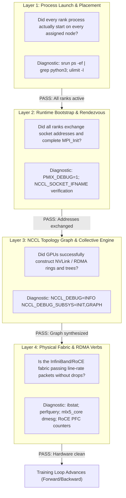
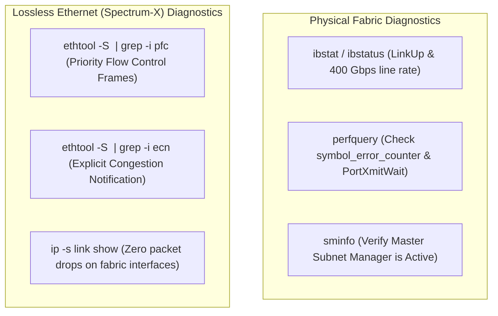
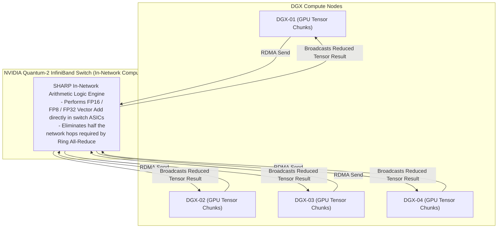

# Senior Deep Dive 3 — MPI, NCCL, and Fabric Joint Debugging

In distributed deep learning, multi-node training stalls represent the most expensive failure mode in the data center. When a 1,024-GPU job hangs, millions of dollars of compute capacity idle in real time. Because distributed training couples the resource orchestrator (Slurm), the process bootstrap protocol (PMIx/MPI), the GPU collective communication library (NCCL), and the high-speed network fabric (InfiniBand/RoCE), determining **which layer caused the hang** is notoriously difficult.

As an **NVIDIA Senior Solutions Architect**, you cannot guess or randomly reboot nodes. You must follow a mathematically grounded, layered diagnostic methodology that isolates the defect to the exact component within minutes.

---

## 1. The 4-Layer Diagnostic Ladder

When a multi-node GPU job hangs at startup or stalls mid-training, the fault exists at exactly one of four distinct layers. Debugging out of sequence wastes hours.



---

## 2. Layer-by-Layer Diagnostic Execution and Terminal Evidence

### Layer 1: Process Launch and System Limits
**The Question:** Did the orchestrator fork the intended number of OS processes, or did local system constraints kill ranks silently?

**Diagnostic Verification:**
```bash
# Verify process count across all allocated nodes in Job 48210
$ srun --jobid=48210 bash -c 'echo "$(hostname): $(pgrep -fc python3)"'
dgx-01: 8
dgx-02: 8
dgx-03: 6  <-- DEFECT: Only 6 ranks launched!
dgx-04: 8
```

#### Root Causes for Layer 1 Failure:
1. **`pids_max` Exhaustion in systemd/cgroups:** The compute node’s cgroup PID ceiling (`/sys/fs/cgroup/pids.max`) was reached, rejecting subsequent `fork()` calls.
2. **`ulimit -l` (Locked Memory Limits):** GPUDirect RDMA requires pinning GPU and host memory buffers in physical RAM. If `ulimit -l` is not set to `unlimited`, ranks fail during driver initialization with `Cannot allocate memory`.

---

### Layer 2: PMIx and Out-of-Band Network Rendezvous
**The Question:** All processes exist, but are they able to exchange IP:Port metadata across node boundaries?

**Diagnostic Verification:**
Enable PMIx client/server trace logging on a hanging run:
```bash
$ srun --mpi=pmix -v --export=ALL,PMIX_MCA_pmix_base_verbose=10 python3 train.py
```

#### Terminal Evidence of Layer 2 Rendezvous Hang:
```text
[dgx-02:42819] PMIX ERROR: UNREACHABLE in file server.c at line 142
[dgx-02:42819] pmix: server connection to dgx-01:41293 failed: Connection refused
```

#### Root Causes for Layer 2 Failure:
1. **Firewall / iptables Dropping Ephemeral Ports:** Slurm or PMIx chooses dynamic high-numbered TCP ports (e.g., ports 30000–65535) for rendezvous. If internal node firewalls are active without proper subnet allowances, the TCP handshake is dropped.
2. **Interface Name Collision (`NCCL_SOCKET_IFNAME`):**
   - Node `dgx-01` has active interfaces: `eth0` (10.0.1.11, Management) and `docker0` (172.17.0.1).
   - Node `dgx-02` has active interfaces: `ens5f0` (10.0.1.12, Management).
   - Without explicit pinning, NCCL on `dgx-01` binds to `docker0`, while `dgx-02` attempts to reach it over the physical management VLAN, hanging forever.
   - **Fix:** Explicitly export `export NCCL_SOCKET_IFNAME=eth0,ens5f0,bond0` across all nodes.

---

### Layer 3: NCCL Graph Construction and Algorithm Selection
**The Question:** Control-plane sockets connected, but can NCCL map the physical NVLink, PCIe, and InfiniBand channels into a valid collective ring or tree?

**Diagnostic Verification:**
```bash
export NCCL_DEBUG=INFO
export NCCL_DEBUG_SUBSYS=INIT,GRAPH,ENV
```

#### Terminal Evidence of Clean Topology Synthesis (H100 SXM5):
```text
dgx-01: NCCL INFO Channel 00/08 : 0[0] 1[1] 2[2] 3[3] 4[4] 5[5] 6[6] 7[7] via NVL [direct]
dgx-01: NCCL INFO Channel 00/08 : 7[7] -> 8[0] via NET/IB/0/GDRDMA
dgx-02: NCCL INFO Channel 00/08 : 8[0] 9[1] 10[2] 11[3] 12[4] 13[5] 14[6] 15[7] via NVL [direct]
dgx-02: NCCL INFO Channel 00/08 : 15[7] -> 0[0] via NET/IB/7/GDRDMA
dgx-01: NCCL INFO Trees [0] 1/-1/-1->0->-1 [1] 2/-1/-1->1->0 ...
dgx-01: NCCL INFO Ring 00 : 0 -> 1 -> 2 -> 3 -> 4 -> 5 -> 6 -> 7 -> 8 -> 9 ...
dgx-01: NCCL INFO 8 coll channels, 8 nvlink channels, 8 net channels
```

#### Terminal Evidence of Layer 3 Failure:
```text
dgx-03: NCCL INFO Call to connect returned Connection refused
dgx-03: NCCL WARN Bootstrap : timed out after 1200 seconds [rank 24]
dgx-03: NCCL WARN Process group watchdog thread terminated with exception: [NCCL error: unhandled system error]
```

#### Root Causes for Layer 3 Failure:
- **Asymmetric GPU Failure / GPU Fallen off the Bus (XID 79):** If GPU 3 on `dgx-03` suffered a PCIe AER fatal link collapse during initialization, NVML reports the device, but CUDA kernel initialization hangs, breaking ring completion.
- **Topology Mismatch / Missing `nvidia-peermem`:** If the GPUDirect RDMA driver is missing on one node, NCCL cannot bridge NVLink to InfiniBand HCAs, stalling the entire collective graph.

---

### Layer 4: Physical Fabric Health (InfiniBand & RoCE)
**The Question:** The collective graph is compiled, but is the underlying network dropping packets under high-throughput RDMA stress?



#### Production Fabric Diagnostic Commands:

```bash
# 1. Audit all 8 HCA ports for physical link rate and state
$ ibstat | grep -E "CA '|Port [0-9]|State:|Physical state:|Rate:"
CA 'mlx5_0'
        Port 1:
                State: Active
                Physical state: LinkUp
                Rate: 400

# 2. Check for physical optical link degradation (Symbol Errors & Retransmits)
$ sudo perfquery -x 1 1 | grep -E "SymbolErrorCounter|PortXmitWait|PortRcvErrors"
SymbolErrorCounter: ..................0
PortXmitWait: ........................0  <-- Non-zero indicates downstream fabric congestion!
PortRcvErrors: .......................0
```

---

## 3. The "2 Nodes Work, 8 Nodes Hang" Syndrome

One of the most frequent escalations in an AI supercomputer is a workload that runs cleanly on 2 nodes (16 GPUs), but hangs completely when scaled to 8 nodes (64 GPUs).

```text
The Mechanics of Scale-Dependent Collective Hangs:

1. Radix Boundary & Spine Hops:
   - A 2-node job sits entirely on a single Leaf Switch. Traffic never crosses the spine.
   - An 8-node job crosses Leaf-Spine-Leaf uplinks, exposing routing errors, optic degradation, 
     or oversubscription on spine switches.

2. Multi-Rail InfiniBand Architecture:
   - Modern DGX SuperPODs deploy an 8-Rail Network. GPU 0 across all nodes connects to Rail 0 (Switch 0); 
     GPU 1 connects to Rail 1 (Switch 1), up to Rail 7.
   - In a 2-node job, a marginal cable on Rail 5 may pass small test packets.
   - In an 8-node job, all 8 rails must operate in lockstep. If Rail 5 experiences packet drops 
     and invokes InfiniBand Adaptive Routing or packet retransmission, Rail 5 falls behind. 
     Because all 8 GPUs per node synchronize in the local NVLink all-reduce step, the entire 
     cluster stalls waiting for Rail 5.
```

---

## 4. Advanced Hardware Acceleration: NVIDIA SHARP (In-Network Computing)

On **NVIDIA Quantum-2 (NDR 400G)** InfiniBand fabrics, collective reduction operations do not have to be performed purely on GPU Streaming Multiprocessors. **NVIDIA SHARP (Scalable Hierarchical Aggregation and Reduction Protocol)** moves the arithmetic reduction directly into the switch silicon!



### Enabling and Verifying SHARP in NCCL

```bash
# Enable SHARP in NCCL execution environment
export NCCL_COLLNET_ENABLE=1
export NCCL_ALGO=CollNet
export NCCL_DEBUG=INFO
export NCCL_DEBUG_SUBSYS=INIT,COLL

# Terminal verification:
# Look for CollNet initialization confirming switch-assisted reduction:
# [dgx-01] NCCL INFO Connected CollNet engine to Quantum-2 Switch ASIC
# [dgx-01] NCCL INFO Using In-Network Aggregation (SHARP v3) for AllReduce
```

---

## 5. Senior Solutions Architect Interview Scenarios

### Scenario 1: Intermittent NCCL Watchdog Timeout at Scale
**Interviewer:** *"A customer is training an LLM on 64 DGX H100 nodes. Every 8 to 12 hours, the job crashes with: `RuntimeError: NCCL error: unhandled system error, NCCL version 2.20.5 - watchdog thread terminated`. The customer blames the PyTorch framework. How do you lead this investigation?"*

**Candidate Answer:**
> "The NCCL watchdog thread fires when a collective operation takes longer than the configured timeout (default: 1,800 seconds / 30 minutes). PyTorch is merely the victim reporting that the GPU communication engine locked up:
> 1. **Step 1: Check Kernel Ring Buffers for Hardware XIDs:** Across all 64 nodes, I immediately run:
>    `srun --jobid=<id> dmesg -T | grep -E "NVRM: Xid|AER"`
>    If a GPU hit an XID 79 (fallen off the bus) or XID 48 (uncorrectable double-bit memory ECC error), that GPU stopped responding, causing its rank to halt. Because NCCL collectives are synchronized across all ranks, every other rank eventually timed out.
> 2. **Step 2: Inspect InfiniBand Fabric Congestion and Errors:** If all GPUs report zero hardware XIDs, I inspect the high-speed network. I run a cluster-wide query for `PortXmitWait` and `SymbolErrorCounter` using `perfquery`. A dirty optical fiber or loose MPO cable on a single 400G leaf switch port introduces packet retransmissions.
> 3. **Step 3: Analyze Dump via NCCL Debugging:** For subsequent runs, I configure:
>    `export NCCL_DEBUG=INFO NCCL_DEBUG_SUBSYS=COLL NCCL_WATCHDOG_DUMP=1`
>    When the timeout threshold is reached, NCCL dumps the exact rank, collective operation (e.g., `AllReduce on Channel 3`), and target peer IP that failed to complete the handshake, pointing directly to the offending node."

---

### Scenario 2: Debugging RoCE v2 vs. InfiniBand on Spectrum-X
**Interviewer:** *"A customer is deploying 32 DGX H100 systems on an NVIDIA Spectrum-X Ethernet network using RoCE v2. During NCCL benchmarks, they observe severe throughput drops and intermittent collective hangs. What switch and host parameters must be verified?"*

**Candidate Answer:**
> "RoCE v2 operates on Ethernet, which is inherently a lossy medium. To achieve line-rate GPUDirect RDMA performance comparable to native InfiniBand, **Lossless Ethernet must be rigorously enforced**:
> 1. **Priority Flow Control (PFC):** PFC must be enabled on Priority 3 (DSCP 26 or 48) end-to-end across the host HCAs and Spectrum-X leaf switches. I inspect host counters:
>    `ethtool -S <interface> | grep -E "pfc_requests_rx|pfc_requests_tx"`
>    If PFC frames are zero or packet drops (`rx_discards_phy`) are climbing, switches are dropping packets due to misconfigured traffic classes.
> 2. **Explicit Congestion Notification (ECN) & RED:** Spectrum-X uses hardware-accelerated congestion control (RoCE CC). Switches must mark ECN bits in the IP header (Congestion Experienced - CE) before packet buffers overflow, signaling the ConnectX-7 HCA to throttle back transmission rates before packet drops occur.
> 3. **Host GID Selection:** In the launch script, I ensure:
>    `export NCCL_IB_GID_INDEX=3` (or the specific RoCE v2 GID index mapped to the tagged VLAN interface). If the default GID index 0 (RoCE v1) is selected, RoCE packets lack IP/UDP headers and cannot route through Layer 3 leaf-spine fabrics, causing instant communication failure."

---

## Key Takeaways

1. **Follow the Diagnostic Ladder:** Triage multi-node hangs in strict sequence: **Process Launch** $\rightarrow$ **PMIx Rendezvous** $\rightarrow$ **NCCL Graph Construction** $\rightarrow$ **Physical Fabric**.
2. **"2 Nodes Pass, 8 Nodes Hang" is a Multi-Rail Indicator:** Collective scaling exposes spine switch hops, rail-to-rail latency desynchronization, and subtle optic degradation that single-switch tests cannot detect.
3. **Always Check Interface Naming:** Set `NCCL_SOCKET_IFNAME` explicitly to prevent NCCL from binding to container bridges (`docker0`) or mismatched host interfaces.
4. **NVIDIA SHARP Eliminates In-Network Latency:** On Quantum-2 InfiniBand fabrics, offloading All-Reduce math into switch silicon via SHARP (`NCCL_COLLNET_ENABLE=1`) cuts network hops in half.
5. **Lossless RoCE Requires PFC + ECN:** On Spectrum-X Ethernet, high-bandwidth RDMA requires strict end-to-end Priority Flow Control, ECN marking, and correct RoCE v2 GID selection (`NCCL_IB_GID_INDEX=3`).
