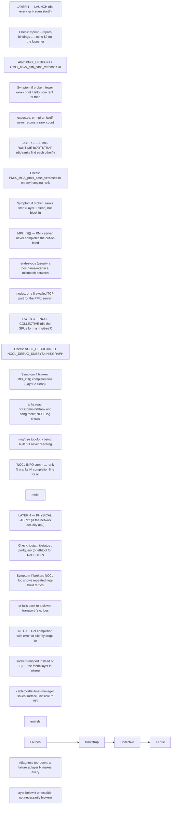

`docs/volume-10/07-mpi-fundamentals-for-hpc-ai-workloads.md` covers MPI's process model and its relationship to NCCL (MPI for launch/coordination, NCCL for the actual GPU collective bandwidth). Volume 6's collective-communication material covers what NCCL rings/trees are and why they matter for AI training. This deep dive is the diagnostic procedure for the single most common senior-level incident in multi-node GPU training: **the job hangs at startup and neither team's first instinct (MPI logs, NCCL logs) is checked in the right order.**

## Before this deep dive — establish a known-good ladder

Do not begin with the full training command. Record a known-good result for each increasing layer:

1. one process imports required libraries and sees its assigned GPU;
2. all local MPI ranks start and complete a CPU barrier;
3. ranks across two nodes complete a CPU collective;
4. one node completes an NCCL collective on assigned GPUs;
5. two nodes complete `nccl-tests` with expected topology and bandwidth;
6. the smallest framework workload runs before scaling to the failing size.

For every test, capture allocation, hosts, rank count, CPU/GPU binding, library versions, chosen interfaces/transports, exit status, duration, and relevant logs. Change one dimension at a time. This turns "distributed training hangs" into the first rung that changes from pass to fail and gives the network, scheduler, platform, or application owner a reproducible handoff.

## The layered decision tree

A multi-node GPU job that hangs before producing any training output is failing at exactly one of four layers, and each layer has one diagnostic command that definitively rules it in or out. Debugging out of order — e.g., staring at `NCCL_DEBUG=INFO` output when the real problem is that half the MPI ranks never launched — wastes the most time on this class of incident.

The ordering matters because layers 2–4 are each *invisible* from the layer above if the layer above never got that far: if Layer 1 shows only 6 of 8 expected ranks launched, there is no point enabling `NCCL_DEBUG=INFO` yet — the two missing ranks (usually a bad hostfile entry, an `srun`/`mpirun` node-count mismatch, or a node that failed the BCM/Slurm health check tier from the fleet-scale deep dive) are the whole incident, and NCCL has nothing to say about ranks that were never spawned.

## Environment-variable interactions that cause silent misconfiguration

Two classes of NCCL/MPI environment-variable mismatch produce hangs (not errors) because NCCL will silently choose a fallback rather than fail loudly:

- **`NCCL_SOCKET_IFNAME` / `NCCL_IB_HCA` inconsistent across nodes.** If node A's launch environment sets `NCCL_SOCKET_IFNAME=eth0` but node B (different NIC naming from a different hardware batch, or a partially-applied category push — see the fleet-scale deep dive) doesn't have `eth0` and needs `ens5f0`, NCCL on node B either picks a default interface that can't reach node A, or hangs waiting for a connection that never completes on the expected interface. Because `mpirun` typically propagates environment variables from the launching node uniformly, an interface name that's valid on the launcher but not on every worker is a common source of "hangs on some runs, not others," correlating with which physical nodes land in the allocation.
- **MPI process-pinning vs. NCCL's own GPU-affinity assumptions.** MPI binds ranks to CPU cores/NUMA nodes (`mpirun --bind-to core --map-by ppr:8:node`); NCCL separately assumes each rank's GPU affinity follows the PCIe/NVLink topology (rank N on GPU N, typically pinned via `CUDA_VISIBLE_DEVICES` per rank). If MPI's binding maps rank ordering one way and the launch script's `CUDA_VISIBLE_DEVICES` assignment maps GPUs a different way, ranks end up CPU-pinned to a NUMA node that isn't local to the GPU they were handed — the job doesn't hang, it runs, but at a fraction of expected bandwidth because every collective now crosses a NUMA/PCIe boundary it shouldn't need to. This is the specific case where the symptom isn't a hang at all — it's a training step time 2-3x worse than expected with no error anywhere, which is why bandwidth regression should always prompt an affinity check (`nvidia-smi topo -m` cross-referenced against the actual rank-to-GPU mapping the job used), not just a "network is slow" assumption.

## Why "worked with 2 nodes, hangs with 8"

This is a specific, recognizable symptom class, not a vague scaling issue. A 2-node NCCL ring only ever crosses one link (one NIC pair, possibly one switch). An 8-node job's ring or tree topology spans more switches and — on a rail-optimized fabric — potentially more rails than a 2-node job ever touches, so it exercises paths the 2-node case never did. The most common root causes:

- A **straggler node**: one of the eight nodes has a marginal NIC/port/cable (not fully failed — `ibstat` shows `LinkUp`, but at reduced width or with elevated symbol-error counters) that's invisible in isolation and only manifests as a stall once every rank in a ring must synchronize with it. NCCL rings/trees are only as fast as the slowest hop; with 2 nodes there's a 50% chance the marginal node isn't even in the tiny test allocation, with 8 nodes it's far more likely to be included and its degraded link now blocks the whole collective.
- A **topology/rail mismatch that only appears past a certain switch-radix boundary**: a 2-node job may stay within one leaf switch; an 8-node job may span a leaf-spine hop or cross rails, exposing a subnet-manager routing issue or an oversubscribed spine link that a single-switch test never touched. This is the same failure-domain reasoning as volume 6's rail material — a change or defect confined to one rail/switch is statistically far more likely to be sampled and hit once a collective spans multiple failure domains.

The diagnostic response is the same either way: don't retry the 8-node job blindly. Instead run pairwise or small-group NCCL tests (`nccl-tests` all_reduce_perf across specific node pairs) to bisect which node or which link is the outlier, rather than treating "8 nodes hangs, 2 doesn't" as one big undifferentiated network problem.

## Worked scenario

A training job launched across 8 nodes (64 GPUs) hangs with no output after `mpirun` reports all 64 ranks started. `NCCL_DEBUG=INFO` shows ring-building log lines for 62 of 64 ranks reaching `NCCL INFO comm ... nranks 64` — two ranks on node06 never print the completion line. `ibstat` on node06 shows `State: Active`, `Physical state: LinkUp`, but `port_xmit_wait` counters climbing continuously versus flat on other nodes — a marginal link, not a down link, which is why the job hangs rather than erroring: NCCL is still trying to establish that connection, not failing to. The fix is draining node06 for a link/cable inspection (Tier 1 hardware-health remediation from the fleet-scale deep dive: alert + drain, not reboot) and re-running the 8-node job on a substitute node, which completes cleanly — confirming the root cause was that one marginal link, invisible at 2-node scale, gating the entire 8-node collective.

## Interview-ready line

"A multi-node GPU job hanging at startup is four layers deep — launch, PMIx bootstrap, NCCL collective formation, physical fabric — and each has exactly one diagnostic command that rules it in or out; the reason '2 nodes works, 8 hangs' is a specific and common pattern rather than vague scaling flakiness is that an 8-node collective's ring or tree crosses more switches and links than a 2-node test ever samples, so a marginal link that was never exercised at small scale becomes the bottleneck the entire collective blocks on at scale."
