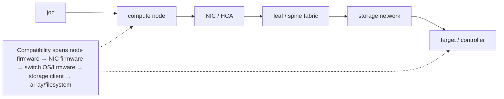

`docs/volume-10/10-coordinated-cluster-wide-software-change-management.md` covers the compatibility matrix and canary rollout pattern for cluster-wide software changes. That chapter's model is largely compute-node-centric: driver/CUDA/container-toolkit versions validated on a canary node, then rolled forward. This deep dive covers what breaks when the change surface extends past compute nodes into network fabric and storage — because those two subsystems have compatibility matrices and blast radii that the compute canary process does not exercise at all.

## Before this deep dive — map failure domains and dependency owners

Draw the service path before planning the window:



Annotate each component with owner, current and target version, redundancy/failover behavior, affected racks/tenants, validation test, rollback support, and recovery time. A component list is not enough: the important information is which workload paths share each component and can therefore fail together.

Classify evidence at three levels. **Component health** says devices and links report healthy. **Path health** proves packets and I/O traverse the intended redundant paths. **Workload health** proves representative communication, checkpoint, restart, correctness, and performance. A rollout gate needs all three; green switch ports cannot prove that distributed checkpoints still meet their latency objective.

## Why network and storage firmware need their own validation track

The compute-side compatibility matrix (driver × CUDA × container toolkit × kernel) is validated by running representative workloads on a canary node and checking for crashes, wrong results, or performance regressions on *that node*. This validates nothing about switch firmware, NIC firmware, or storage-controller firmware, because:

- A **canary compute node** exercises the fabric it's connected to, but a firmware change on a leaf switch or a NIC typically ships to the whole rack or the whole fabric generation at once in most vendor tooling — there usually isn't a clean way to canary "one switch" the way there is to canary "one node," because switches sit in the data path for every node behind them, not just one.
- A **storage-controller firmware update** changes I/O latency/throughput characteristics cluster-wide the moment it's applied to a shared storage backend (parallel filesystem controller, NVMe-oF target, etc.) — there is no such thing as a storage canary in the same sense, because most HPC storage backends are shared infrastructure, not one-node-at-a-time infrastructure. A firmware change there is closer to a database upgrade than a compute-node OS patch.

The dangerous scenario is not "network/storage changes are risky" in the abstract — it's that a **compute-side change can pass its canary perfectly** while an unrelated storage-controller firmware update, queued in the same maintenance window because "we had a window anyway," changes I/O latency in a way the canary process never tests, because the canary process's success criteria was written for driver/CUDA correctness, not for checkpoint I/O latency:

Maintenance window: 2026-08-02 02:00–06:00

| | Compute change | Storage change (same window) |
|---|---|---|
| What changed | driver 550 → 560, canary-tested on node-canary-01, workload correctness + perf: PASS | NVMe-oF target controller firmware v3.2 → v3.4, applied cluster-wide (no per-node canary concept for shared storage backend) |
| Rollout | rolled forward, applied same night, compute side "validated" | NOT covered by the compute canary's success criteria |
| Outcome | Training job resumes Monday with new driver — correct results, no crashes | Checkpoint write latency now ~40ms higher p99 (controller firmware changed queue-depth behavior under sustained write bursts) |
| Downstream effect | — | Job's checkpoint cadence (tuned assuming old latency profile) now causes checkpoint writes to overrun into the next training step — throughput regression misattributed to the driver change, because that's the change everyone was watching |

The postmortem cost here is entirely attributable to treating "things happening in the same maintenance window" as one validated change instead of two independent changes each needing its own compatibility/impact validation — the driver bump was innocent; the storage firmware was the actual regression; and because only the compute change had a formal canary/rollback gate, the storage change had no equivalent checkpoint before it was already live cluster-wide.

## Change windows sized to the job-length distribution, not the calendar

A maintenance window chosen calendar-style ("second Tuesday of the month, 2–6 AM") ignores the actual constraint that matters: how long the running jobs on the cluster take, because a maintenance window that starts while P90/P99-length jobs are mid-run either forces a preemption (losing that work, or requiring a checkpoint/restore that itself depends on the storage path you're about to change) or forces the window to be delayed indefinitely waiting for long jobs to drain.

The right sizing question is: pull `sacct` job-length distribution for the partition(s) affected —

```
sacct -a -S now-30days -o JobID,Partition,Elapsed --state=COMPLETED \
  | awk '{print $3}' | sort -n
# ... compute p50/p90/p99 elapsed time from this
```

— and set the maintenance-window cadence and drain lead-time against the **p90/p99**, not the median. If p50 job length is 4 hours but p99 is 5 days (a long-running pretraining job), a monthly maintenance window has to either (a) be announced far enough in advance that the p99 jobs' owners can checkpoint deliberately before the window, or (b) exempt the partition running long jobs from that window's blast radius entirely (change only the partitions/racks not currently hosting a long job) and catch it on the next window. Picking the window size and cadence off p50 alone guarantees that every maintenance cycle either kills long jobs or gets rescheduled ad hoc, which is itself an availability/predictability problem for every team relying on the published cadence.

## Blast-radius containment: sequencing by failure domain, not node list

A change that must eventually reach 100% of the fleet (a security patch, a mandatory driver CVE fix) still needs to be sequenced so that a bad change is caught while contained to the smallest possible failure domain — sequencing by an arbitrary node list (alphabetical hostname order, or "whatever's idle right now") gives no such containment, because a bad change can land on nodes spread across every rack/rail simultaneously before anyone notices.

The pattern is to sequence by the physical failure-domain/rail boundaries described in volume 6's fabric material: one rack (one leaf switch's worth of nodes, one power domain) at a time, and within a multi-rail fabric, further split by rail so a bad change never touches more than one rail's coverage of a given rack in the first wave.

```text
Fleet: 16 racks × 8 nodes, 2 rails per rack
Wave 1: rack-03 ONLY, rail A nodes only (4 of 8 nodes in rack-03)
validate: health checks pass, NCCL self-test across rail A
in rack-03 clean, no Tier-1/Tier-2 health findings
Wave 2: rack-03 remaining rail B nodes (contained: still one rack)
validate again before leaving the rack
Wave 3: remaining racks, one full rack at a time, same rail-split
pattern, each wave gated on the previous wave's health checks
```

If wave 1 surfaces a problem — say the new firmware causes intermittent NIC resets under load — the blast radius is 4 nodes in 1 rack, not a fleet-wide incident, and the remaining 15 racks are untouched and available to absorb load while the issue is root-caused. This is the same logic as a canary deployment in software, mapped onto physical topology instead of a percentage-of-traffic split, and it composes directly with the health-check taxonomy from the fleet-scale BCM deep dive: each wave's gate is "zero new Tier-1 or Tier-2 findings attributable to the change," not just "nodes came back up."

## The dependency chain within a single compute node: GPU vBIOS, driver, CUDA, and NIC firmware are four separate compatibility surfaces

"Update the driver" undersells how many independently-versioned components sit on a single GPU node, each with its own compatibility matrix against its neighbors, and each capable of breaking the others silently rather than loudly:

- **GPU firmware (vBIOS / GSP firmware)** — lives on the GPU itself, flashed independently of the OS driver. A GPU driver release is validated against a specific vBIOS/GSP firmware version range; running a newer driver against stale GPU firmware can still boot and pass basic checks while silently disabling newer features (some power-management or MIG-related behavior, for example) or, in worse cases, producing intermittent Xid errors that look like a hardware fault rather than a firmware/driver mismatch. Updating GPU firmware is its own operation (vendor tooling, typically requiring a node power cycle, not just a reboot, since firmware flashes often need a full power-cycle to take effect) — it is not bundled into a driver package install and is easy to omit from a "driver upgrade" plan that only tests OS-level driver install success.
- **GPU driver (kernel module)** — what most people mean by "the driver," this must match both the GPU firmware range above and the CUDA toolkit version applications were built/linked against.
- **CUDA toolkit / container base image** — application-facing; a driver upgrade that's ABI-compatible with the currently-deployed CUDA toolkit is usually safe, but a driver *downgrade* below the minimum required by an already-built container image will fail at container start, not at OS boot — meaning a rollback of the driver can break a fleet that appeared to update cleanly, if the rollback isn't checked against the same compatibility matrix as the forward update was.
- **NIC/HCA firmware and driver (e.g., ConnectX firmware plus the OFED/kernel driver stack)** — a separate pair from the GPU side entirely, with its own compatibility range, and the one most likely to be forgotten in a "GPU driver update" change ticket because it's physically a different piece of silicon on the same node, updated through different tooling, on a different release cadence set by the network vendor rather than the GPU vendor.

The practical consequence is that a compute-node canary needs a compatibility check across all four surfaces before it's declared clean, not just "did the OS boot and did `nvidia-smi` return a GPU list." A canary that only checks driver-load success can pass while GPU firmware is stale, and the resulting intermittent Xid pattern shows up two weeks later as a Tier 1 hardware-health alert on a random subset of the fleet — misattributed to hardware, when the actual cause was an incomplete rollout that updated the driver layer but skipped the firmware layer on some nodes (commonly because firmware updates require a step, like a full power cycle, that a routine "reboot the node after driver update" maintenance script doesn't perform).

## Network OS/firmware rollback: why "revert the package" doesn't work the way it does on a compute node

Rolling back a bad driver on a compute node is comparatively simple: reinstall the previous package version (or reimage from the category's previous-known-good image, per the fleet-scale deep dive) and reboot. Switch operating systems (Cumulus Linux, SONiC, or a vendor NOS) are usually built around an **image-based, dual-partition** upgrade model instead, precisely because network gear can't tolerate the compute-node approach of "apt/yum downgrade and hope dependency resolution works" — a switch that fails to boot after a bad package operation takes down every node behind it, with no independent recovery path the way a compute node has (a compute node's failure is contained to that node; a leaf switch's failure is contained to everything downstream of that switch).

The dual-partition model keeps the previously-running OS image intact on a separate partition while the new image is written to the other partition; the bootloader is pointed at the new partition only after the write completes successfully, and — critically — a rollback is then "point the bootloader back at the untouched previous partition and reboot," not "attempt to un-apply changes on top of a partially-modified filesystem." This makes rollback close to as safe and fast as the forward upgrade, but only if the operational procedure actually validates the new image *before* deleting or overwriting the old partition on a subsequent update — a site that always upgrades onto "the other" partition without ever confirming the previous partition is a validated-good fallback (for example, if two upgrades happen back to back before either is confirmed stable) can find itself with no known-good partition to roll back to.

The sequencing implication for the wave-based rollout pattern described above: a switch OS/firmware wave's validation step must include confirming the rollback path is intact (previous partition still holds a known-good, bootable image) before moving to the next wave, not just confirming the new image works — because the value of the dual-partition model is entirely in having a tested fallback, and that fallback is only real if it hasn't been silently overwritten by the time it's needed.

## Storage controller/array firmware updates: why "online" firmware updates still need a failover test, not just an announcement

Enterprise and HPC storage arrays (dual-controller NVMe-oF targets, parallel-filesystem metadata/object servers with redundant controllers) advertise "non-disruptive" or "online" firmware updates, which typically means: update controller B's firmware while controller A continues serving I/O, force a controlled failover of active paths from A to B once B is validated running the new firmware, then update A while B (now on new firmware) serves I/O, then fail back (or leave A as the new standby, per the array's supported topology). This is non-disruptive *if every failover in that sequence actually works cleanly* — and the entire point of a controlled firmware-update window is that it's the one time you're deliberately exercising a failover path that, on a healthy day, might not get exercised for months.

The failure mode worth planning for explicitly: a storage multipath client (the compute-side driver managing paths to the array, e.g., Linux native multipath/DM-MPIO or a vendor-specific NVMe-oF multipath stack) that has a stale or misconfigured path table can fail to detect the controller-B-to-controller-A path transition cleanly, resulting in I/O errors or elevated latency on the compute side during the exact failover step the storage vendor calls "non-disruptive." This is why the checkpoint-latency regression scenario earlier in this chapter is not a hypothetical edge case — it's the expected shape of failure when a storage-side change (firmware update, controller failover) interacts with compute-side assumptions (multipath configuration, checkpoint-write timing) that nobody re-validated together. The mitigation is the same "path health, not just component health" principle from this chapter's evidence-tiering: before trusting a storage firmware update's non-disruptive claim, force a manual controller failover during a *pre-production* validation window (not the actual maintenance window) and watch compute-side I/O latency and error counters through the transition, so the first time that failover path is exercised isn't during the real change.

## Worked scenario

A site plans a cluster-wide RDMA driver update to fix a CVE, required on all 128 nodes within two weeks. Instead of pushing fleet-wide, they sequence by rack: rack 1 (8 nodes, single rail first) gets the update, followed by a 4-hour soak running `nccl-tests` and the production training workload's normal checkpoint cycle. Rack 1 is clean. Rack 2 surfaces a Tier-3 workload-readiness finding — NCCL self-test intermittently reports degraded bandwidth on 2 of 8 nodes. Because the rollout is contained to 2 racks (16 nodes) rather than the full fleet, the remaining 14 racks are held at the old driver version while the 2 affected nodes are isolated and the vendor engages on the regression — the CVE deadline is still met on 126 of 128 nodes on schedule, with the 2 outliers fixed and rolled forward once root-caused, instead of a fleet-wide driver regression discovered only after all 128 nodes were already updated.

## Interview-ready line

"Compute-side canary validation only proves the driver/CUDA/container-toolkit matrix is safe — it says nothing about network or storage firmware changed in the same maintenance window, because those have their own compatibility surface and usually can't be canaried per-node the way compute can; and a fleet-wide rollout has to be sequenced by rack/rail failure domain, gated wave-by-wave on health-check results, not by an arbitrary node list, so a bad change is caught while it's still contained to one rack instead of discovered after it's already everywhere."
