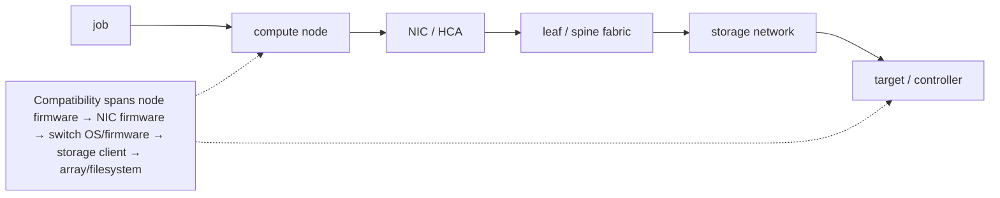

`docs/volume-10/10-coordinated-cluster-wide-software-change-management.md` covers the compatibility matrix and canary rollout pattern for cluster-wide software changes. That chapter's model is largely compute-node-centric: driver/CUDA/container-toolkit versions validated on a canary node, then rolled forward. This deep dive covers what breaks when the change surface extends past compute nodes into network fabric and storage — because those two subsystems have compatibility matrices and blast radii that the compute canary process does not exercise at all.

## Before this deep dive — map failure domains and dependency owners

Draw the service path before planning the window:



Annotate each component with owner, current and target version, redundancy/failover behavior, affected racks/tenants, validation test, rollback support, and recovery time. A component list is not enough: the important information is which workload paths share each component and can therefore fail together.

Classify evidence at three levels. **Component health** says devices and links report healthy. **Path health** proves packets and I/O traverse the intended redundant paths. **Workload health** proves representative communication, checkpoint, restart, correctness, and performance. A rollout gate needs all three; green switch ports cannot prove that distributed checkpoints still meet their latency objective.

## Why network and storage firmware need their own validation track

The compute-side compatibility matrix (driver × CUDA × container toolkit × kernel) is validated by running representative workloads on a canary node and checking for crashes, wrong results, or performance regressions on *that node*. This validates nothing about switch firmware, NIC firmware, or storage-controller firmware, because:

- A **canary compute node** exercises the fabric it's connected to, but a firmware change on a leaf switch or a NIC typically ships to the whole rack or the whole fabric generation at once in most vendor tooling — there usually isn't a clean way to canary "one switch" the way there is to canary "one node," because switches sit in the data path for every node behind them, not just one.
- A **storage-controller firmware update** changes I/O latency/throughput characteristics cluster-wide the moment it's applied to a shared storage backend (parallel filesystem controller, NVMe-oF target, etc.) — there is no such thing as a storage canary in the same sense, because most HPC storage backends are shared infrastructure, not one-node-at-a-time infrastructure. A firmware change there is closer to a database upgrade than a compute-node OS patch.

The dangerous scenario is not "network/storage changes are risky" in the abstract — it's that a **compute-side change can pass its canary perfectly** while an unrelated storage-controller firmware update, queued in the same maintenance window because "we had a window anyway," changes I/O latency in a way the canary process never tests, because the canary process's success criteria was written for driver/CUDA correctness, not for checkpoint I/O latency:

Maintenance window: 2026-08-02 02:00–06:00

| | Compute change | Storage change (same window) |
|---|---|---|
| What changed | driver 550 → 560, canary-tested on node-canary-01, workload correctness + perf: PASS | NVMe-oF target controller firmware v3.2 → v3.4, applied cluster-wide (no per-node canary concept for shared storage backend) |
| Rollout | rolled forward, applied same night, compute side "validated" | NOT covered by the compute canary's success criteria |
| Outcome | Training job resumes Monday with new driver — correct results, no crashes | Checkpoint write latency now ~40ms higher p99 (controller firmware changed queue-depth behavior under sustained write bursts) |
| Downstream effect | — | Job's checkpoint cadence (tuned assuming old latency profile) now causes checkpoint writes to overrun into the next training step — throughput regression misattributed to the driver change, because that's the change everyone was watching |

The postmortem cost here is entirely attributable to treating "things happening in the same maintenance window" as one validated change instead of two independent changes each needing its own compatibility/impact validation — the driver bump was innocent; the storage firmware was the actual regression; and because only the compute change had a formal canary/rollback gate, the storage change had no equivalent checkpoint before it was already live cluster-wide.

## Change windows sized to the job-length distribution, not the calendar

A maintenance window chosen calendar-style ("second Tuesday of the month, 2–6 AM") ignores the actual constraint that matters: how long the running jobs on the cluster take, because a maintenance window that starts while P90/P99-length jobs are mid-run either forces a preemption (losing that work, or requiring a checkpoint/restore that itself depends on the storage path you're about to change) or forces the window to be delayed indefinitely waiting for long jobs to drain.

The right sizing question is: pull `sacct` job-length distribution for the partition(s) affected —

```
sacct -a -S now-30days -o JobID,Partition,Elapsed --state=COMPLETED \
  | awk '{print $3}' | sort -n
# ... compute p50/p90/p99 elapsed time from this
```

— and set the maintenance-window cadence and drain lead-time against the **p90/p99**, not the median. If p50 job length is 4 hours but p99 is 5 days (a long-running pretraining job), a monthly maintenance window has to either (a) be announced far enough in advance that the p99 jobs' owners can checkpoint deliberately before the window, or (b) exempt the partition running long jobs from that window's blast radius entirely (change only the partitions/racks not currently hosting a long job) and catch it on the next window. Picking the window size and cadence off p50 alone guarantees that every maintenance cycle either kills long jobs or gets rescheduled ad hoc, which is itself an availability/predictability problem for every team relying on the published cadence.

## Blast-radius containment: sequencing by failure domain, not node list

A change that must eventually reach 100% of the fleet (a security patch, a mandatory driver CVE fix) still needs to be sequenced so that a bad change is caught while contained to the smallest possible failure domain — sequencing by an arbitrary node list (alphabetical hostname order, or "whatever's idle right now") gives no such containment, because a bad change can land on nodes spread across every rack/rail simultaneously before anyone notices.

The pattern is to sequence by the physical failure-domain/rail boundaries described in volume 6's fabric material: one rack (one leaf switch's worth of nodes, one power domain) at a time, and within a multi-rail fabric, further split by rail so a bad change never touches more than one rail's coverage of a given rack in the first wave.

```text
Fleet: 16 racks × 8 nodes, 2 rails per rack
Wave 1: rack-03 ONLY, rail A nodes only (4 of 8 nodes in rack-03)
validate: health checks pass, NCCL self-test across rail A
in rack-03 clean, no Tier-1/Tier-2 health findings
Wave 2: rack-03 remaining rail B nodes (contained: still one rack)
validate again before leaving the rack
Wave 3: remaining racks, one full rack at a time, same rail-split
pattern, each wave gated on the previous wave's health checks
```

If wave 1 surfaces a problem — say the new firmware causes intermittent NIC resets under load — the blast radius is 4 nodes in 1 rack, not a fleet-wide incident, and the remaining 15 racks are untouched and available to absorb load while the issue is root-caused. This is the same logic as a canary deployment in software, mapped onto physical topology instead of a percentage-of-traffic split, and it composes directly with the health-check taxonomy from the fleet-scale BCM deep dive: each wave's gate is "zero new Tier-1 or Tier-2 findings attributable to the change," not just "nodes came back up."

## Worked scenario

A site plans a cluster-wide RDMA driver update to fix a CVE, required on all 128 nodes within two weeks. Instead of pushing fleet-wide, they sequence by rack: rack 1 (8 nodes, single rail first) gets the update, followed by a 4-hour soak running `nccl-tests` and the production training workload's normal checkpoint cycle. Rack 1 is clean. Rack 2 surfaces a Tier-3 workload-readiness finding — NCCL self-test intermittently reports degraded bandwidth on 2 of 8 nodes. Because the rollout is contained to 2 racks (16 nodes) rather than the full fleet, the remaining 14 racks are held at the old driver version while the 2 affected nodes are isolated and the vendor engages on the regression — the CVE deadline is still met on 126 of 128 nodes on schedule, with the 2 outliers fixed and rolled forward once root-caused, instead of a fleet-wide driver regression discovered only after all 128 nodes were already updated.

## Interview-ready line

"Compute-side canary validation only proves the driver/CUDA/container-toolkit matrix is safe — it says nothing about network or storage firmware changed in the same maintenance window, because those have their own compatibility surface and usually can't be canaried per-node the way compute can; and a fleet-wide rollout has to be sequenced by rack/rail failure domain, gated wave-by-wave on health-check results, not by an arbitrary node list, so a bad change is caught while it's still contained to one rack instead of discovered after it's already everywhere."
