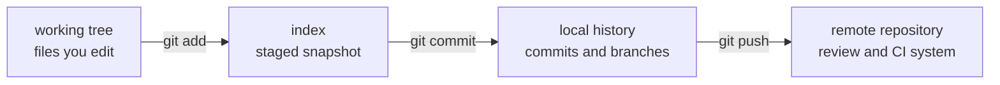
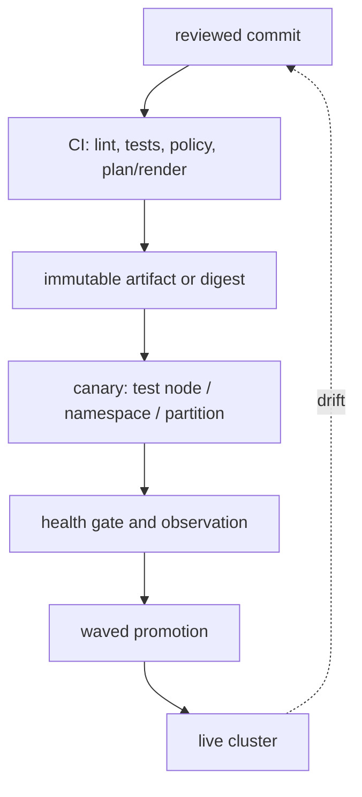

# Chapter 17 — Git for infrastructure and operations

Git is not just a place to store Python or YAML. For a DevOps or Solutions Architect, Git is the evidence trail for desired state: which driver image, Slurm policy, Terraform module, Ansible role, Kubernetes manifest or runbook was proposed, reviewed, tested and promoted.

The command syntax is small. The operational consequences are large. A one-line change to a GPU image definition can reboot hundreds of nodes; a one-line Terraform change can replace a network or storage resource. This chapter teaches the mental model first, then the commands and recovery techniques.

## Start here — four objects and three boundaries

Git stores a directed history of **snapshots**, not a sequence of file edits. The important objects are:

| Object | Beginner meaning | Operational interpretation |
|---|---|---|
| working tree | files currently on disk | what you are editing, not yet recorded |
| index/staging area | selected next snapshot | the exact change you intend to commit |
| commit | immutable snapshot plus parent, author and message | reviewable change unit and audit evidence |
| branch/ref | movable name pointing to a commit | a line of work, release pointer or environment candidate |

The three boundaries are:



`git diff` compares working tree to the index. `git diff --cached` compares the index to the last commit. `git log` shows committed history. Keeping those comparisons distinct prevents the common mistake of committing unrelated or secret files because “the diff looked fine” in the wrong view.

## The safe first workflow

```bash
git status --short
git switch -c change/slurm-gpu-health-gate
git diff -- docs/volume-10/06-slurm-administration-ha-accounting-and-upgrades.md
git add docs/volume-10/06-slurm-administration-ha-accounting-and-upgrades.md
git diff --cached --check
git diff --cached
git commit -m "docs: explain GPU health gates for Slurm nodes"
git log -1 --oneline --decorate
```

Why each step exists:

1. `status` reveals untracked and modified files before you touch anything.
2. A branch isolates the proposal from the protected production branch.
3. A path-specific diff limits review to the intended file.
4. `add` selects content for the next snapshot; it does not publish it.
5. `diff --cached --check` catches whitespace mistakes and lets you inspect exactly what will be committed.
6. The commit message names the intent, not the implementation trivia.
7. `log` confirms the commit points where you expect.

Do not use `git add .` reflexively in a repository containing generated files, local state, credentials, build output or work from another engineer. Stage deliberately. If Claude or another automation is editing in parallel, inspect `git status` and file ownership before staging.

## Branches, remotes and tracking

A branch is only a movable pointer. It is not a second copy of every file and it is not a deployment environment by itself. A remote-tracking branch such as `origin/main` is your local record of the remote’s last fetched state; it changes after `git fetch`, not magically after somebody pushes.

```bash
git remote -v
git fetch origin
git branch -vv
git log --oneline --graph --decorate --all -20
```

`fetch` downloads remote history without changing your working files. `pull` is a policy choice: usually fetch plus merge or rebase. In production repositories, prefer making that policy explicit so you understand whether local commits will be merged or replayed.

## Merge versus rebase

Both integrate history; they communicate different intent.

| Operation | What it does | Good use |
|---|---|---|
| merge | creates a commit joining two histories | preserve a published integration event |
| rebase | copies your unshared commits onto a new base | keep a private feature branch current |

Never rewrite commits that teammates or automation already depend on without an explicit agreement. Rebase changes commit IDs because the parent changes. A force push can therefore remove someone else’s remote work or invalidate an approval reference.

```bash
git fetch origin
git rebase origin/main
# resolve one conflict at a time
git add path/to/resolved-file
git rebase --continue
```

During a conflict, Git has not “lost” the file; it has marked two competing versions and paused. Read the conflict markers, decide the desired result, run the relevant tests, then stage the resolution. If the rebase direction was wrong, `git rebase --abort` returns to the pre-rebase state.

## Review infrastructure changes by blast radius

A good Git review asks more than “does the YAML parse?” Use this sequence:

1. What operational object changes: image, node category, driver, firewall, Slurm association, GPU deployment or secret reference?
2. What is the smallest affected unit: one test node, one partition, one namespace, one account or the whole fleet?
3. Is the change additive, in-place, destructive or replacement-triggering?
4. What command or plan output proves the intended effect?
5. What health gate and rollback artifact exist?
6. Does the commit contain generated output or unrelated edits?

For Terraform, commit the module and policy but do not commit production state or casually commit a saved plan that can contain sensitive values. For an image pipeline, commit the immutable image definition and dependency versions, then promote the built image digest. For Slurm, review semantic configuration and a staged validation result rather than treating a text diff as proof that scheduling behavior is safe.

## Git, GitOps and the live cluster

Git is a source of desired state; it is not automatically the reconciler. A pipeline, BCM process, Terraform run, Ansible play, or Kubernetes GitOps controller must apply the approved commit.



Kubernetes controllers are designed for continuous reconciliation. Terraform and Ansible are normally merge-triggered or explicitly approved because automatically correcting every drift can overwrite a deliberate incident mitigation. BCM image/category changes require their own provisioning and maintenance workflow. Git records intent and evidence; each runtime system owns the mechanism that turns intent into state.

## Secrets and sensitive history

`.gitignore` prevents accidental addition; it does not protect a secret already committed. Treat a leaked token as compromised:

1. revoke or rotate it immediately;
2. identify every system and log that may have copied it;
3. remove it from the current tree and history using an approved secret-removal procedure;
4. add a scanner and a pre-commit/CI gate;
5. document the incident and replacement credential owner.

Do not put NGC tokens, cloud keys, Slurm accounting passwords, kubeconfig files, Terraform state, private keys or customer data into ordinary commits. Use a secret manager, short-lived CI identity, encrypted secret mechanism, or approved vault workflow. A secret hidden in a later commit is still present in the earlier commit and can remain in clones, caches and pull-request metadata.

## Recovery: the commands worth practising

### Undo an unstaged edit

```bash
git restore -- path/to/file
```

This discards working-tree edits in that path. Confirm the path and inspect `git diff` first; it is destructive to those uncommitted edits.

### Unstage without losing edits

```bash
git restore --staged -- path/to/file
```

The file remains edited in the working tree but is no longer selected for the next commit.

### Move a branch pointer back safely

`git revert <commit>` creates a new inverse commit and is usually appropriate for a published branch. `git reset` moves a local pointer and can discard or hide commits; use it only when you understand whether the commits are private and what the reflog can recover.

### Find a lost local commit

```bash
git reflog --date=local
git show <candidate-commit>
```

The reflog is local recovery metadata, not a permanent remote audit trail. It is a rescue tool, not a reason to force-push carelessly.

### Find the first bad change

```bash
git bisect start
git bisect bad                 # current revision fails the test
git bisect good <known-good>
# run a deterministic health/test command, then:
git bisect good   # or git bisect bad
git bisect reset
```

`bisect` is useful when a GPU health test, scheduler regression, or parser failure has a reproducible pass/fail command. It is not useful when the test depends on changing external state without recording the environment.

## Worked scenario — a driver change that passed CI and harmed the fleet

**Situation:** A pull request updates the NVIDIA driver version in a golden-image definition. Unit tests and YAML validation pass. After rollout, new nodes register with Slurm but distributed jobs show poor NCCL bandwidth.

**Reasoning:** Git proves which commit changed the image definition; CI proves syntax and policy, not hardware compatibility. Compare the old and new image manifests, driver/CUDA/NCCL versions, topology, and canary test results. If the canary was skipped, the process failed even though the code pipeline was green. Roll back by promoting the last-known-good immutable image, drain and reboot only the affected wave, validate `nvidia-smi`, a single-node workload and a controlled NCCL test, then investigate the new version in a separate branch.

**Interview line:** “Git gives us traceability and a reversible intent change; it does not turn a hardware interaction into a unit test. The promotion gate must include a representative canary workload and an immutable previous image.”

## Practice lab

Create a temporary repository in a disposable directory and practise:

```bash
mkdir git-lab && cd git-lab
git init
printf 'driver=known-good\n' > image.env
git add image.env && git commit -m 'lab: record known-good image'
git switch -c change/candidate-image
printf 'driver=candidate\n' > image.env
git diff
git add image.env
git diff --cached
git commit -m 'lab: propose candidate image'
git log --oneline --decorate --graph --all
```

Then deliberately create a conflict in two branches, resolve it, and practise `git merge --abort`. Add a fake token, detect it with a simple pattern search, remove it before committing, and explain why removal after a commit would require rotation. Finally, use `git bisect` with a deterministic shell test that fails when `driver=candidate` is present.

## Interview questions

1. Why is `git diff --cached` more important than `git diff` immediately before a commit?
2. Why can a green CI pipeline fail to prove that a GPU driver or Slurm configuration is safe?
3. When is merge safer than rebase?
4. What is the difference between Git source of truth and a GitOps reconciler?
5. What do you do if an NGC token was committed and pushed?
6. How would you use `git bisect` to investigate a regression in NCCL throughput?
7. How do you prevent an infrastructure pull request from quietly replacing a storage volume or GPU node pool?
8. What is a safe rollback for a published infrastructure commit?

## References

- [Git reference](https://git-scm.com/docs)
- [Pro Git book — Git basics](https://git-scm.com/book/en/v2/Git-Basics-Getting-a-Git-Repository)
- [Git branching and merging](https://git-scm.com/book/en/v2/Git-Branching-Basic-Branching-and-Merging)
- [Git bisect](https://git-scm.com/docs/git-bisect)
- [Git reflog](https://git-scm.com/docs/git-reflog)
- [GitHub secret scanning guidance](https://docs.github.com/en/code-security/secret-scanning/introduction/about-secret-scanning)
- [Volume 10 CI/CD for infrastructure](./chapter-11-cicd-for-infrastructure-and-cluster-configuration)
- [Volume 10 Terraform and Ansible foundation](./foundation-iac-terraform-ansible)
