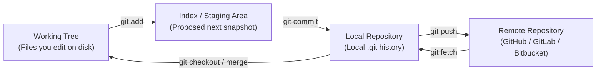
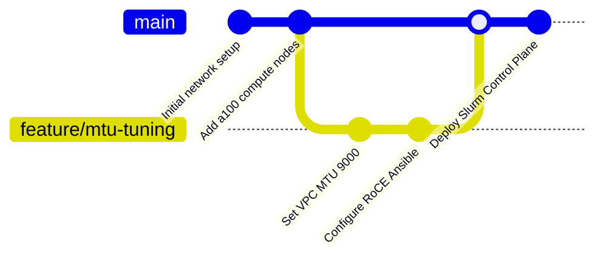
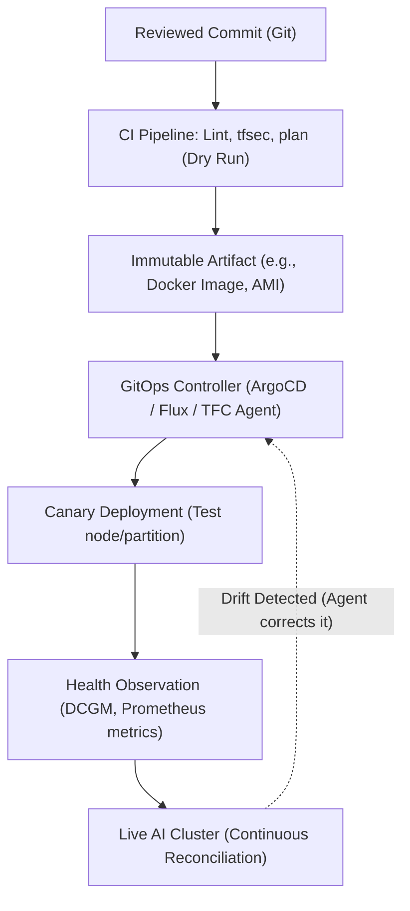

# Chapter 17 — Git for Infrastructure and Operations

**Learning outcome:** Master Git as the foundational engine for AI infrastructure delivery. You will architect repository structures (monorepos vs. polyrepos), enforce branch protection for Infrastructure as Code (IaC) and configuration management, execute advanced recovery operations (`git rebase --onto`, `git bisect`, `git reflog`), and safely manage sensitive credentials. By the end of this chapter, you will understand Git not merely as a version control system, but as the authoritative, cryptographically verifiable ledger of your data center's desired state.

**Prerequisites:** Familiarity with the Linux command line, foundational knowledge of YAML/JSON configuration files, and an understanding of imperative vs. declarative infrastructure (e.g., Terraform, Ansible).

**Difficulty:** Beginner to Advanced.

**Estimated reading time:** 150 minutes plus hands-on lab practice.

---

## 1. Foundations: The Evidence Trail of Infrastructure

Git is not just a place to store Python scripts or Kubernetes manifests. For a DevOps Engineer, SRE, or Solutions Architect operating an NVIDIA AI Factory, Git is the immutable evidence trail for the desired state of the entire fleet. 

A one-line YAML edit can deploy a new NVIDIA driver image, rebooting hundreds of nodes. A misplaced Terraform variable can tear down a multi-terabyte checkpoint bucket. Consequently, understanding Git's internal mental model is a non-negotiable prerequisite before operating any declarative infrastructure.

### 1.1 The Imperative vs Declarative Source of Truth

In the early days of systems administration, the source of truth was the live server itself. If you needed to know the MTU of a network interface, you SSH'd into the node and ran `ip link`. Configuration was imperative and mutable. If an engineer typed `ip link set eth0 mtu 9000` to enable Jumbo frames for RoCEv2 (RDMA over Converged Ethernet) testing, that state existed only in the kernel memory of that specific machine. If the machine rebooted, the state was lost. If another engineer joined the team, they had no visibility into why the machine was configured that way.

In modern infrastructure, the source of truth has shifted left. The live server is merely an ephemeral projection of the declarations stored in Git. If a node drifts from the state defined in Git (e.g., an engineer manually runs `sysctl -w net.ipv4.tcp_rmem="4096 87380 16777216"` on a production host to troubleshoot InfiniBand performance), the next CI/CD run of Ansible or Terraform will overwrite the manual change. 

Git, therefore, must be treated with the same reverence as the production database. It dictates what *will* happen. The commit history is the exact timeline of the datacenter's evolution. When an incident occurs, Git is the first place you look to understand what changed, who changed it, and why.

### 1.2 The Git Directed Acyclic Graph (DAG)

Unlike Subversion (SVN) or CVS, which stored differences (deltas) between file versions, Git models history as a mathematical **Directed Acyclic Graph (DAG)** of complete snapshots. 

When you commit, Git does not calculate the difference between the previous state and the current state. Instead, it takes a picture of the exact state of your working tree at that moment. This is a fundamental concept that separates Git from legacy version control systems, and it is why operations like branching and reverting are nearly instantaneous.

#### The Four Core Objects

Git's storage model is built on four fundamental object types, compressed and stored in the `.git/objects` directory. To understand Git, you must understand these objects:

| Object | Definition | Operational Interpretation for Infrastructure |
|---|---|---|
| **Blob (Binary Large Object)** | Stores the file content. It does not store the file name, permissions, or any metadata. If two files have the exact same contents, Git stores only one blob. | The raw bytes of your `main.tf`, `slurm.conf`, or Ansible `site.yml`. |
| **Tree** | Stores file names, permissions, and directory structures, pointing to blobs or other nested trees. | The directory hierarchy of your AI factory repository, linking the names like `vpc.tf` to their underlying blobs. |
| **Commit** | Points to a single top-level Tree object, representing the entire project state. Also contains author metadata, a timestamp, a message, and zero or more parent commit pointers. | A reviewable unit of change, an audit evidence record, and a rollback target. In an AI factory, a commit represents a specific, deployable state of the infrastructure. |
| **Annotated Tag** | Points to a commit and contains a message, tagger identity, and optional GPG cryptographic signature. | An immutable release point (e.g., `v2.4.1` of an infrastructure module, or `release-2023-10` for an environment state). |

Because every object is cryptographically hashed (using SHA-1 or, in newer repositories, SHA-256), history is strictly immutable. If a single byte of a Terraform configuration changes, the blob hash changes. Because the tree points to the blob hash, the tree hash changes. Because the commit points to the tree hash, the commit hash changes. This cryptographic chain ensures that no one can quietly alter the history of an AI factory without detection. If an attacker tries to retroactively inject an SSH key into an old commit, the hashes of all subsequent commits would change, breaking the entire history and immediately alerting the team.

#### A Deep Dive into the Objects Directory

To truly understand how this works, let's look at the raw data structure inside a `.git` repository when you commit a single file:

```bash
$ mkdir ai-factory && cd ai-factory
$ git init
Initialized empty Git repository in /tmp/ai-factory/.git/

$ echo "mtu: 9000" > network.yml
$ git add network.yml
$ git commit -m "Configure Jumbo Frames"
[main (root-commit) 3a9c7b2] Configure Jumbo Frames
 1 file changed, 1 insertion(+)
 create mode 100644 network.yml
```

Let's inspect the `.git/objects` directory:
```bash
$ find .git/objects -type f
.git/objects/0f/598fa206b1e5a59666f00f074a3f5a2ccfdfcf  # This is the Blob (content)
.git/objects/c3/8ea8a7ef9f257bf8561d5f8b91dbf08c3d8208  # This is the Tree (directory)
.git/objects/3a/9c7b2cc8d39c9df3c0e66c7b9c9d5d8e7f1234  # This is the Commit
```

If we use `git cat-file -p` to inspect the commit object:
```bash
$ git cat-file -p 3a9c7b2
tree c38ea8a7ef9f257bf8561d5f8b91dbf08c3d8208
author SRE Admin <sre@example.com> 1698765432 -0400
committer SRE Admin <sre@example.com> 1698765432 -0400

Configure Jumbo Frames
```
You can see the commit points to a `tree`. If we inspect the tree:
```bash
$ git cat-file -p c38ea8a7
100644 blob 0f598fa206b1e5a59666f00f074a3f5a2ccfdfcf    network.yml
```
You can see the tree points to a `blob` and assigns the filename `network.yml`. If we inspect the blob:
```bash
$ git cat-file -p 0f598fa2
mtu: 9000
```
This is the raw content. This layered hashing structure is what makes Git cryptographically secure and incredibly fast.

### 1.4 The Three Boundaries of Change

Understanding the boundaries between these objects prevents catastrophic mistakes, such as committing raw AWS credentials because "the diff looked fine" in the wrong tool, or pushing a broken Terraform configuration directly to production.



- **Working Tree:** The actual files you are modifying in your IDE or text editor. This is your scratchpad. If you run `terraform plan`, Terraform generates temporary files (like `.terraform.lock.hcl` updates or `.terraform/` provider binaries) in the working tree.
- **Index (Staging Area):** A critical buffer zone. It allows you to selectively choose *which* modifications from the working tree will be included in the next commit. If you edited `main.tf` and also have a temporary `debug.log` file, you can stage `main.tf` and ignore the log file.
- **Local Repository:** The committed history on your laptop, stored in the hidden `.git/` directory. Commits here are safe, but they only exist on your machine.
- **Remote Repository:** The shared source of truth (e.g., GitHub Enterprise, GitLab, Bitbucket) where CI/CD pipelines operate. When you push, you synchronize your local repository's graph with the remote's graph.

**Crucial Commands for Boundaries:**
- `git diff`: Compares the **working tree** to the **index**. Shows what you have changed but *not yet staged*. Use this continuously as you work.
- `git diff --cached` (or `--staged`): Compares the **index** to the **last commit (HEAD)**. Shows exactly what *will* be in the next commit. This is your final safety check before running `git commit`.
- `git log`: Shows the committed history in the **local repository**. It tells the story of how the infrastructure arrived at its current state.

Always inspect `git diff --cached` before creating an infrastructure commit. This ensures you only record intended changes, excluding temporary local overrides, unencrypted secrets, or local Terraform state files (`.tfstate`) that might have accidentally been created if you ran an operation without the proper remote backend configured.

---

## 2. The Safe Infrastructure Workflow

A reflex to type `git add . && git commit -m "update" && git push` is incredibly dangerous in infrastructure operations. If you run `terraform init` or `terraform plan` locally, Terraform creates hidden directories (like `.terraform/`) that download hundreds of megabytes of provider binaries (written in Go) for AWS, Azure, or Kubernetes. If you blindly add all files and commit, you will bloat the Git repository size immediately, slowing down all future clones for every engineer. Furthermore, if you are testing an Ansible playbook locally, it might generate debug logs or local key files. Committing these by accident can leak cloud credentials or overwrite remote state locks.

A safe, deliberate workflow designed for Systems Reliability Engineers (SREs) looks like this:

```bash
# 1. Fetch the latest remote history without modifying your working tree.
# This ensures your local Git database is aware of what your colleagues have done.
git fetch origin

# 2. Isolate your proposed change from the protected mainline branch.
# We branch from origin/main to ensure we are starting from the absolute latest truth.
git switch -c feature/slurm-gpu-health-gate origin/main

# ... (Open your editor and make your edits to the configuration files) ...
# Example: You edit docs/volume-10/06-slurm-administration-ha-accounting-and-upgrades.md
# You also accidentally run a script that creates a 'crash.log' file.

# 3. Inspect the state of your working directory.
git status --short
# Expected output:
#  M docs/volume-10/06-slurm-administration-ha-accounting-and-upgrades.md
# ?? .terraform/
# ?? crash.log

# 4. Review the exact modifications in the working tree.
# Always review your own work before staging it. Did you leave a 'TODO' or hardcode a password?
git diff -- docs/volume-10/06-slurm-administration-ha-accounting-and-upgrades.md

# 5. Stage ONLY the intended file, specifically ignoring the untracked junk like crash.log.
# Do not use 'git add .'. Explicitly name the files you want to commit.
git add docs/volume-10/06-slurm-administration-ha-accounting-and-upgrades.md

# 6. Verify the index for whitespace errors and exact content.
# The --check flag warns you if you have trailing whitespace or mixed spaces/tabs, 
# which can break YAML parsers in Ansible or Kubernetes.
git diff --cached --check
git diff --cached

# 7. Commit with an intent-focused message conforming to Conventional Commits.
# A good commit message explains the 'why'.
git commit -m "docs: explain GPU health gates for Slurm nodes

Added detailed documentation covering how to configure Slurm health checks
using DCGM to automatically drain nodes reporting XID errors. This prevents
large MPI jobs from failing due to a single degraded H100 GPU."

# 8. Confirm the local history looks correct.
# --oneline keeps it concise; --decorate shows branch pointers.
git log -1 --oneline --decorate

# 9. Push the new branch to the remote to trigger CI/CD speculative plans.
# The -u flag sets the upstream tracking branch.
git push -u origin feature/slurm-gpu-health-gate
```

### Why Each Step Exists in an SRE Context
1. `fetch` ensures your local knowledge of `origin/main` is accurate before branching. If you branch from a stale local `main`, you will immediately create merge conflicts.
2. A branch ensures your unvalidated configuration does not pollute the `main` branch, which is often tied to continuous deployment.
3. `status` prevents accidental inclusions of `.terraform/` directories, `.tfstate` files, or `.env` files containing secrets.
4. Path-specific diffs limit cognitive load during self-review, allowing you to focus on the exact infrastructure component you are modifying.
5. `add` carefully selects the next snapshot. This is a conscious decision point.
6. `diff --cached` is your final safety check. It answers the question: "If I run commit right now, what exactly goes into the database?"
7. The commit message explains *why* the change is happening. When a cluster breaks at 3:00 AM three months from now, the SRE on call will use `git blame` to find this commit. If the message says "update config", it is useless. If it says "Tune MTU for RoCE fabric to fix NCCL timeouts (Ticket OPS-492)", it immediately gives the SRE context.

---

## 3. The Ultimate `.gitignore` for AI Infrastructure

A robust `.gitignore` is the first line of defense against committing secrets, large binaries, or state files. Every AI Factory infrastructure repository must include a `.gitignore` that handles Terraform, Ansible, Python, and OS-level cruft.

Here is the production-standard `.gitignore` for an NVIDIA AI Factory IaC repository:

```text
# ==============================================================================
# Terraform
# ==============================================================================
# Local .terraform directories
**/.terraform/*
# .tfstate files
*.tfstate
*.tfstate.*
# Crash log files
crash.log
crash.*.log
# Exclude all .tfvars files, which are likely to contain sensitive data, such as
# password, private keys, and other secrets. These should not be part of version 
# control as they are data points which are potentially sensitive and subject 
# to change depending on the environment.
*.tfvars
*.tfvars.json
# Ignore override files as they are usually used to override resources locally and so
# are not checked in
override.tf
override.tf.json
*_override.tf
*_override.tf.json
# Include override files you do wish to add to version control using negated pattern
# !example_override.tf
# Include tfplan files to ignore the plan output of command: terraform plan -out=tfplan
# example: *tfplan*
*tfplan*
# Ignore CLI configuration files
.terraformrc
terraform.rc

# ==============================================================================
# Ansible
# ==============================================================================
*.retry
/ansible.log
/.ansible/
# Ignore private keys and certificates
*.pem
*.key
*.crt
*.p12
*.pfx
# Ignore sensitive inventory variables
group_vars/all/vault.yml
host_vars/*/vault.yml

# ==============================================================================
# Python / Automation Scripts
# ==============================================================================
# Byte-compiled / optimized / DLL files
__pycache__/
*.py[cod]
*$py.class
# C extensions
*.so
# Distribution / packaging
.Python
build/
develop-eggs/
dist/
downloads/
eggs/
.eggs/
lib/
lib64/
parts/
sdist/
var/
wheels/
share/python-wheels/
*.egg-info/
.installed.cfg
*.egg
# Virtual Environments
venv/
.venv/
env/
.env/
pip-log.txt
pip-delete-this-directory.txt

# ==============================================================================
# OS and IDE Cruft
# ==============================================================================
.DS_Store
.AppleDouble
.LSOverride
Icon
._*
.DocumentRevisions-V100
.fseventsd
.Spotlight-V100
.TemporaryItems
.Trashes
.VolumeIcon.icns
.com.apple.timemachine.donotpresent
.idea/
.vscode/
*.swp
*.swo

# ==============================================================================
# ML / Data (If managed in the same repo, though Git LFS is preferred)
# ==============================================================================
*.pt
*.pth
*.onnx
*.safetensors
datasets/
checkpoints/
```

---

## 4. Pre-commit Hooks: Shifting Left

Even with a strong `.gitignore`, human error happens. An engineer might name a secret file `aws-keys.txt` which isn't caught by the wildcard rules. 

To prevent bad commits from ever entering the local Git database, you must configure **Pre-commit hooks**. These are scripts that run automatically when you type `git commit`. If the scripts fail, the commit is aborted.

Using the Python `pre-commit` framework, here is a production-grade `.pre-commit-config.yaml` for an AI Infrastructure repo:

```yaml
# .pre-commit-config.yaml
repos:
  - repo: https://github.com/pre-commit/pre-commit-hooks
    rev: v4.4.0
    hooks:
      - id: trailing-whitespace
      - id: end-of-file-fixer
      - id: check-yaml
      - id: check-json
      - id: check-added-large-files
        args: ['--maxkb=5000'] # Prevent committing files > 5MB
      - id: check-merge-conflict
      - id: detect-private-key # Immediately fails if an SSH key is found

  - repo: https://github.com/antonbabenko/pre-commit-terraform
    rev: v1.83.1
    hooks:
      - id: terraform_fmt
      - id: terraform_validate
      - id: terraform_tflint
      - id: terraform_tfsec # Scans for security misconfigurations (e.g., open security groups)

  - repo: https://github.com/ansible/ansible-lint.git
    rev: v6.17.2
    hooks:
      - id: ansible-lint
        files: \.(yaml|yml)$

  - repo: https://github.com/zricethezav/gitleaks
    rev: v8.18.0
    hooks:
      - id: gitleaks # Scans for hardcoded AWS keys, NGC tokens, passwords
```

To install this across your team:
```bash
pip install pre-commit
pre-commit install
```
Now, every time `git commit` is executed, formatting is enforced, security vulnerabilities are blocked, and leaked secrets are rejected instantly.

---

## 5. Advanced Repository Architectures for AI Factories

As your NVIDIA AI Factory scales to thousands of GPUs, multiple teams will interact with the infrastructure codebase. You will have Network Engineers managing switches and VPCs, Storage Admins managing high-performance file systems (like WEKA, VAST, or Lustre), Compute Admins managing the base OS and Slurm scheduler, and MLOps Engineers managing Kubernetes and Kubeflow.

How you organize your Git repositories drastically affects operational velocity, CI/CD complexity, and blast radius. The two dominant patterns in the industry are Monorepos and Polyrepos.

### 5.1 The Polyrepo Strategy

In a polyrepo architecture, you divide the infrastructure into dozens or hundreds of small, domain-specific repositories. Each repository has a single responsibility.

**Example Structure:**
- `ai-factory-tf-module-vpc` (Terraform module for networking)
- `ai-factory-tf-module-gpu-cluster` (Terraform module for EC2/EKS compute)
- `ai-factory-ansible-role-slurm` (Ansible role for Slurm installation)
- `ai-factory-ansible-role-dcgm` (Ansible role for NVIDIA DCGM telemetry)
- `ai-factory-env-production` (The root implementation repository that glues the modules together)

**Advantages:**
- **Strict Blast Radius:** Git permissions native to GitHub/GitLab natively restrict access at the repository level. The Data Science team can be granted read/write access to a `kubernetes-manifests` repository, but absolutely zero access to the foundational `tf-module-vpc` repository.
- **Targeted CI Pipelines:** The CI/CD pipeline is extremely simple. The pipeline for `ansible-role-dcgm` only runs Ansible molecule tests and YAML linting. It doesn't waste compute time running `terraform init`.
- **Semantic Versioning:** Consumers can pin to specific, immutable module versions using Git tags (e.g., `git@github.com:org/tf-module-vpc.git?ref=v1.2.0`). This ensures that changes to a module do not break production until the production repository explicitly updates its version pin.

**Disadvantages (Dependency Hell):**
- **Coordinating Cross-Cutting Changes:** This is the major flaw of polyrepos. If you need to enable Jumbo Frames (MTU 9000) across the entire stack to support GPUDirect RDMA, you might need to open Pull Requests in the VPC module repo, the GPU cluster module repo, the Ansible role repo, and finally the production environment repo. You must merge them in the exact correct sequence, waiting for CI to pass on each. It turns a one-hour task into a three-day ordeal.
- **Tool Sprawl:** Keeping GitHub Actions workflows, pre-commit hooks, and linting rules synchronized across 50 different repositories requires complex templating tools or massive duplication of effort.

### 5.2 The Monorepo Strategy

A single Git repository containing all Terraform modules, Ansible playbooks, Kubernetes manifests, documentation, and Python operational scripts for the entire AI Factory.

**Example Structure:**
```text
ai-factory-infrastructure/
├── .github/workflows/           # Centralized CI/CD logic for the entire factory
├── terraform/
│   ├── modules/
│   │   ├── network-fabric/      # Reusable module for VPCs, Subnets, Routing
│   │   ├── gpu-superpod/        # Reusable module for Compute instances, Placement Groups
│   │   └── storage-cluster/     # Reusable module for parallel file systems
│   └── environments/
│       ├── development/         # Calls modules with dev sizing (e.g., 2 GPUs)
│       ├── staging/             # Calls modules with staging sizing (e.g., 8 GPUs)
│       └── production/          # Calls modules with prod sizing (e.g., 1024 GPUs)
├── ansible/
│   ├── roles/
│   │   ├── mofed-install/       # Installs Mellanox OFED drivers
│   │   ├── slurm-client/        # Configures Slurm worker nodes
│   │   └── dcgm-exporter/       # Sets up Prometheus metrics for GPUs
│   └── playbooks/
│       ├── provision-cluster.yml
│       └── patch-drivers.yml
├── kubernetes/
│   ├── base/
│   └── overlays/
└── scripts/
    ├── cluster_health_check.py
    └── drain_failed_gpus.sh
```

**Advantages:**
- **Atomic Commits:** A single PR can update the Terraform VPC MTU parameter, bump the Ansible Slurm configuration to recognize the new network interface, and update the Python health check script. When merged, the entire state of the factory moves forward synchronously. There is no dependency hell.
- **Universal Refactoring:** You can perform a global search-and-replace for an outdated variable (like renaming `instance_type` to `gpu_sku`) across the entire infrastructure footprint in seconds using your IDE.
- **Simplified Dependency Management:** You don't need to manage Git tags or SSH keys for internal modules. The environment files just reference local relative paths (`source = "../../modules/network-fabric"`).

**Disadvantages:**
- **CI/CD Complexity:** If not configured carefully, changing a Markdown file in the `docs/` folder might trigger a 45-minute Terraform and Ansible integration test suite. You must use path-filtering in CI triggers (e.g., `paths: ['terraform/**']` in GitHub Actions).
- **Granular Permissions:** Git natively only supports repo-level write access. If someone has write access to the monorepo, they theoretically have write access to production. To restrict production writes in a monorepo, you must heavily rely on the `CODEOWNERS` file and branch protection rules, ensuring that changes to `terraform/environments/production/` require mandatory approval from the `Global-SRE` team.

**Industry Consensus for AI Infrastructure:** For modern AI factories, a heavily governed **Monorepo** is generally preferred. The ability to make atomic cross-domain changes is absolutely critical when tuning high-performance networking and compute stacks, where a change in Terraform often requires a corresponding change in Ansible and Kubernetes.

---

## 6. Branching Strategies: Trunk-Based Development vs GitFlow

How branches are created, named, and merged defines the team's operational tempo. Choosing the wrong strategy for infrastructure leads to massive merge conflicts and dangerous state divergence.

### 6.1 GitFlow (Not Recommended for Infrastructure as Code)

GitFlow was designed for boxed software releases (e.g., a desktop application or an on-premise enterprise software suite that releases v1.0, v1.1, v2.0). It relies on long-lived `develop` and `release` branches. Developers branch off `develop`, merge back into `develop`, and eventually `develop` is merged into `main` (or `master`) for a release.

**Why GitFlow fails spectacularly in Infrastructure:**
Infrastructure code is a reflection of reality. Reality drifts. Cloud APIs change, nodes die, disks fill up, and SREs make emergency hotfixes in production. 

If you keep an infrastructure change on a `develop` branch for three weeks while waiting for a "release window", the real-world environment (and the `main` branch) will have changed significantly. When you finally attempt to merge `develop` to `main`, the resulting `terraform plan` will be an incomprehensible mess of conflicts, unintended destructions, and out-of-sync state. 

Long-lived branches in IaC guarantee drift. They assume that infrastructure is static while the code is being written, which is false.

### 6.2 Trunk-Based Development (Highly Recommended)

Trunk-Based Development uses short-lived feature branches that merge directly into a single, protected `main` branch (the "trunk"). There is no `develop` branch. 

1. **Branch:** Create a branch (e.g., `feature/add-h100-nodes`) directly from `main`.
2. **Develop:** Write the Terraform and Ansible code locally. Keep the scope small. Do not try to rewrite the entire network and add compute nodes in the same branch.
3. **Validate:** Open a Pull Request as soon as possible. CI runs automated linting, security policy checks (e.g., OPA/Sentinel), and speculative execution (`terraform plan`, `ansible-playbook --check`).
4. **Merge:** The PR is reviewed and merged into `main` quickly—ideally within 24 to 48 hours. If it takes longer than 48 hours, the PR is too large and should be broken down.
5. **Deploy:** The `main` branch represents the single source of truth and is continuously or explicitly deployed to staging, then production, via automated pipelines.



Trunk-based development forces small, frequent, easily reviewable updates. If a change breaks production, the blast radius is small, the root cause is obvious (because the commit only changed one thing), and reverting a small commit is trivial. 

In Trunk-Based Development for Infrastructure, **environments are represented by directories, not by branches**. You do not merge a `staging` branch into a `production` branch. Instead, you update the code in `environments/staging/`, test it, and then copy or promote those changes to `environments/production/` on the same `main` branch.

---

## 7. A Complete CI/CD Pipeline for Terraform via GitHub Actions

To enforce Trunk-Based Development securely, you must automate the feedback loop. When a pull request is opened, Git should trigger a pipeline that validates the code and posts a speculative execution plan back to the PR comments.

Here is a comprehensive GitHub Actions YAML workflow (`.github/workflows/terraform-plan.yml`) that achieves this:

```yaml
name: "Terraform Plan (Speculative Execution)"

on:
  pull_request:
    branches:
      - main
    paths:
      - 'terraform/**'

permissions:
  id-token: write # Required for OIDC authentication to AWS/Azure
  contents: read
  pull-requests: write # Required to post comments on the PR

jobs:
  terraform-plan:
    name: "Terraform Plan"
    runs-on: ubuntu-latest
    defaults:
      run:
        working-directory: ./terraform/environments/production

    steps:
      - name: Checkout the repository
        uses: actions/checkout@v4

      - name: Configure AWS Credentials via OIDC
        uses: aws-actions/configure-aws-credentials@v4
        with:
          role-to-assume: arn:aws:iam::123456789012:role/GitHubActionsTerraformRole
          aws-region: us-east-1

      - name: Setup Terraform
        uses: hashicorp/setup-terraform@v3
        with:
          terraform_version: 1.7.0
          terraform_wrapper: true

      - name: Terraform Format Check
        id: fmt
        run: terraform fmt -check -recursive
        continue-on-error: true

      - name: Terraform Init
        id: init
        run: terraform init

      - name: Terraform Validate
        id: validate
        run: terraform validate -no-color

      - name: Terraform Plan
        id: plan
        run: terraform plan -no-color -out=tfplan
        continue-on-error: true

      - name: Update Pull Request with Plan Output
        uses: actions/github-script@v7
        env:
          PLAN: "terraform\n${{ steps.plan.outputs.stdout }}"
        with:
          github-token: ${{ secrets.GITHUB_TOKEN }}
          script: |
            const output = `#### Terraform Format and Style 🖌\`${{ steps.fmt.outcome }}\`
            #### Terraform Initialization ⚙️\`${{ steps.init.outcome }}\`
            #### Terraform Validation 🤖\`${{ steps.validate.outcome }}\`
            #### Terraform Plan 📖\`${{ steps.plan.outcome }}\`

            <details><summary>Show Plan</summary>

            \`\`\`\n
            ${process.env.PLAN}
            \`\`\`

            </details>

            *Pusher: @${{ github.actor }}, Action: \`${{ github.event_name }}\`, Working Directory: \`${{ env.working-directory }}\`, Workflow: \`${{ github.workflow }}\`*`;

            github.rest.issues.createComment({
              issue_number: context.issue.number,
              owner: context.repo.owner,
              repo: context.repo.repo,
              body: output
            })

      - name: Terraform Plan Status Evaluation
        if: steps.plan.outcome == 'failure'
        run: exit 1
```

This workflow safely authenticates to AWS using OIDC (no stored secrets in Git!), runs the plan, and posts the output directly to the PR, allowing reviewers to evaluate the blast radius before merging.

---

## 8. Merging, Rebasing, and History Integration

When multiple engineers work on a monorepo, their branches will inevitably diverge. Integrating history in infrastructure repositories requires strict adherence to clean history principles to ensure clear audit logs for incident response.

### 8.1 Merge vs. Rebase: The Conceptual Difference

Both commands solve the exact same problem—integrating changes from one branch into another—but they manipulate the Git DAG differently.

| Operation | What it does | Impact on History | Operational Use Case |
|---|---|---|---|
| **Merge** | Creates a new "merge commit" that has two parent commits, joining the histories together. | Preserves the exact chronological history. The DAG looks like a tangled web (a "subway map"). | Preserving a published integration event (e.g., merging a tested PR into the `main` branch via GitHub). |
| **Rebase** | Lifts your unshared commits off their current base and replays them one-by-one onto a new base commit. | Rewrites history. Creates entirely new commit IDs. The DAG remains perfectly linear. | Keeping a private feature branch up-to-date with `main` before submitting a PR. |

### 8.2 The Golden Rule of Rebase

**Never rebase commits that have been pushed to a shared remote branch that others are depending on.**

Because `git rebase` creates entirely new commit hashes for the replayed commits, if you rebase a shared branch (like `main`), you diverge from the remote server. To push your changes, you will be forced to use `git push --force`. This will overwrite the remote branch, destroying any commits your teammates might have pushed in the meantime, and severely confusing their local repositories when they next run `git pull`. Their Git client will complain that histories have diverged.

Rebase is a tool for cleaning up your *private, unmerged* work before presenting it to the team.

### 8.3 A Safe Rebase Workflow for IaC

Suppose you are working on a branch `feature/slurm-upgrades`. Meanwhile, an urgent hotfix was merged to `main` by another team member that updates the Terraform AWS provider version. If you open a PR now, GitHub will warn you that you have merge conflicts in `.terraform.lock.hcl`.

You should rebase your *local, unmerged* branch against `main` to resolve this before opening the PR:

```bash
# Ensure your local tracking of main is up to date
git checkout main
git pull origin main

# Switch back to your feature branch
git checkout feature/slurm-upgrades

# Rebase your work onto the updated main
# This means: "Take my slurm-upgrades commits, pretend I wrote them today,
# and stack them on top of the current state of main."
git rebase main
```

If conflicts occur during the rebase (because both you and the hotfix modified the same line of code), Git pauses, marks the conflicting files in your working directory, and lets you resolve them.

### 8.4 Detailed Walkthrough: Resolving Merge Conflicts in Lockfiles

Merge conflicts are extremely common in `terraform.lock.hcl`, Python `Pipfile.lock`, or Node `package-lock.json` files when multiple branches update dependencies concurrently.

**Never attempt to manually resolve a lockfile conflict line-by-line using standard conflict markers (`<<<<<<<`, `=======`, `>>>>>>>`).** You will almost certainly corrupt the file formatting or hashes, breaking the pipeline.

**Transcript of a resolution:**

```bash
$ git rebase main
Auto-merging .terraform.lock.hcl
CONFLICT (content): Merge conflict in .terraform.lock.hcl
error: could not apply 3b2a1f8... Update Slurm configuration

# Git is paused. We check the status.
$ git status
rebase in progress; onto e5f6g7h
You are currently rebasing branch 'feature/slurm-upgrades' on 'e5f6g7h'.
  (fix conflicts and then run "git rebase --continue")

Unmerged paths:
  (use "git restore --staged <file>..." to unstage)
  (use "git add <file>..." to mark resolution)
        both modified:   .terraform.lock.hcl

# We accept the upstream (main) version of the lockfile entirely 
# to clear the conflict markers. The --ours flag during a rebase refers to the base branch (main).
$ git checkout --ours .terraform.lock.hcl

# We re-run the initialization command to regenerate the lockfile cleanly 
# based on your new code combined with the upstream state.
$ terraform init -upgrade

# Stage the cleanly regenerated, conflict-free lockfile.
$ git add .terraform.lock.hcl

# Continue the rebase operation. Git will move to the next commit.
$ git rebase --continue
Applying: Update Slurm configuration
```

### 8.5 Advanced Rebasing: `git rebase --onto`

Sometimes branches get chained, creating complex dependencies. Imagine you create `feature-A` to add a new VPC. You then immediately create `feature-B` branching *off* of `feature-A` to add GPU nodes to that VPC. 

Later, you realize `feature-B` doesn't actually need the VPC code from `feature-A` because another engineer already added a shared VPC directly to `main`. You want to move `feature-B` so it branches directly off `main`, dropping the commits from `feature-A` entirely.

If you just run `git rebase main` while on `feature-B`, Git will try to drag the `feature-A` commits along with it, creating conflicts with the VPC code already in `main`.

You need to surgically extract `feature-B`.

```bash
# Syntax: git rebase --onto <new-base> <old-base> <branch-to-move>
# Translation: "Move feature-B onto main, starting from the commit AFTER feature-A."
git rebase --onto main feature-A feature-B
```
This lifts only the commits that belong strictly to `feature-B` and replays them directly on top of `main`.

---

## 9. Reviewing Infrastructure Changes by Blast Radius

A Git code review for infrastructure must look fundamentally different from a software engineering code review. In software, a bad function might cause a 500 error on an API endpoint, which can be fixed with a hot-patch. In infrastructure, a bad Terraform file might permanently delete a multi-petabyte S3 bucket, sever database connectivity, or terminate active 30-day LLM training runs.

An SRE review must evaluate the **operational blast radius**. Use this mental checklist during PR reviews:

1. **What is the operational object?** Is this PR modifying an immutable OS image (which requires node reboots), an Ansible role (applied in-place), a Slurm configuration (requires restarting the `slurmctld` daemon), or a Terraform state?
2. **What is the spatial scope?** Does it affect one test node in a sandbox environment, a specific partition of GPUs, or the entire global fleet? 
3. **Is it destructive?** For Terraform, does the PR cause a resource replacement? Look for the `-/+` symbol in the CI pipeline's `terraform plan` output. If you see `aws_instance.gpu_node[0] will be destroyed and recreated`, that means active GPU workloads will be terminated. *Never approve a destructive change to compute or storage without an explicit maintenance window.*
4. **Is there evidence?** A text diff is not enough. YAML is tricky. Does the commit include a `terraform plan` output or an Ansible dry-run (`ansible-playbook --check`) in the PR comments proving the intended effect matches the real world?
5. **Is there a health gate?** How will the pipeline verify the cluster is healthy after this code is merged and promoted? Will DCGM diagnostic tests run? Will a test MPI job be scheduled? If not, the deployment is blind.
6. **Does it contain state or secrets?** Has the author accidentally included a `.tfstate` file, an SSH key, or an API token in the diff?

If the code review process does not verify the `terraform plan` output against the live environment, it is not an infrastructure review; it is merely a syntax review.

---

## 10. GitOps: The Bridge Between Git and the Live Cluster

Git is a source of *desired state*. It is not the reconciler. Pushing code to Git does absolutely nothing to your servers on its own. An execution engine must pull the approved commit and apply it to the real world.

### 10.1 Push-Based vs. Pull-Based GitOps

There are two primary paradigms for executing infrastructure changes triggered by Git.

**Push-Based (CI/CD Driven):**
Tools like GitHub Actions, GitLab CI, or Jenkins listen for a push event or a merge event on the `main` branch via Webhooks. They clone the repository, authenticate to AWS or the local data center using stored secrets, and execute `terraform apply` or `ansible-playbook` from the CI runner.
- *Pros:* Simple to understand, integrates easily with existing software development pipelines. Excellent visibility into execution logs via the CI dashboard.
- *Cons:* Security risk. The CI runner needs highly privileged credentials to the production environment (e.g., AWS Admin access to create VPCs). If the CI system is compromised, the attacker has full control over the infrastructure. Additionally, CI pipelines only run when triggered; if an engineer manually modifies a server, the CI system won't know until the next push.

**Pull-Based (True GitOps):**
An agent (the GitOps controller) runs *inside* the secure production environment (e.g., ArgoCD or Flux inside a Kubernetes cluster, or Terraform Cloud Agents running in a private subnet). The agent continuously polls the Git repository for new commits (or listens for webhooks). When it sees a new commit, it pulls the code and reconciles the state locally from within the perimeter.
- *Pros:* Highly secure. The production cluster pulls from Git; Git does not push into production. Production credentials never leave the cluster boundaries. The CI system does not need AWS Admin access. Furthermore, continuous reconciliation automatically corrects manual drift. If an engineer manually deletes a Kubernetes deployment, ArgoCD instantly notices the live state doesn't match Git, and recreates it.
- *Cons:* Harder to set up and debug. Primarily designed for Kubernetes workloads, though the pattern is expanding to IaC.



---

## 11. Secrets Management and Sensitive History

`.gitignore` prevents files from being accidentally added to the index. It does absolutely nothing to protect a file that has *already* been committed to the repository.

If an AWS access key, NGC (NVIDIA GPU Cloud) API token, Slurm database password, or SSH private key is pushed to Git, you must assume it was immediately compromised by automated bots. Bots actively scan public GitHub repositories (and compromised private repositories) 24/7, extracting AWS keys and spinning up cryptocurrency miners within seconds of a push.

### 11.1 The Remediation Workflow for Leaked Secrets

Do not just delete the file in a new commit (e.g., `git rm secret.txt && git commit -m "remove secret"`). The secret is still in the repository's history. Anyone who clones the repo can run `git log` and checkout the previous commit to view the secret in plaintext.

Follow this exact incident response protocol:

1. **Revoke and Rotate:** The absolute first step is to invalidate the credential in the source system (e.g., delete the IAM key in AWS, revoke the token in the NGC Console, change the Slurm DB password). A leaked, revoked key is harmless; a hidden, active key is a ticking time bomb.
2. **Audit for Exploitation:** Inspect cloud trails (AWS CloudTrail, database access logs) to determine if the leaked key was actually used by an attacker. If it was, declare a major security incident.
3. **Purge from History:** You must rewrite the entire Git DAG of the repository to scrub the file or the specific string from every commit that ever existed.
   - Using `git-filter-repo` (the modern recommended tool, vastly superior to the deprecated `git filter-branch`):
     ```bash
     # Install git-filter-repo (requires Python)
     pip install git-filter-repo

     # Remove a specific file from all commits in history
     git filter-repo --path terraform/environments/prod/terraform.tfstate --invert-paths

     # Or, replace a specific leaked string (like a password) across all files in history
     # Create a expressions.txt file:
     # MySecretPassword123!==>***REDACTED***
     git filter-repo --replace-text expressions.txt
     ```
   - Alternatively, use the BFG Repo-Cleaner for large-scale string replacements.
4. **Force Push (The Difficult Part):** Because you rewrote history, every commit hash from the point of the leak onwards has changed. You must force push to the remote.
   ```bash
   git push origin --force --all
   ```
5. **Team Coordination:** This is highly disruptive. Every other engineer on the team must delete their local clone of the repository and re-clone it from the server. If a team member does a standard `git pull` or `git push` with their old history, they will re-upload the secret and undo the cleanup.

### 11.2 Prevention is Better Than Cure

1. **Secret Scanners:** Enable GitHub Advanced Security secret scanning, or run open-source tools like `trufflehog`, `gitleaks`, or `git-secrets` as automated pre-commit hooks on every developer's machine.
2. **Externalize Secrets:** Never put secrets in Git. Use a dedicated secret manager like HashiCorp Vault, AWS Secrets Manager, or Azure Key Vault. Configure Terraform and Ansible to read from these APIs at runtime.
3. **Encrypted In-Repo Secrets:** If you absolutely must store secrets in Git (for bootstrapping purposes), use Mozilla SOPS (Secrets OPerationS) or HashiCorp Vault to encrypt the values. Only the ciphertext is committed to Git. The CI runner decrypts it using a KMS key it assumes via OIDC.

---

## 12. Branch Protection and CODEOWNERS Governance

In a high-stakes AI Factory, you cannot rely on the honor system. An engineer, even a senior one, might be tired and try to push a "quick fix" directly to production at 2:00 AM, skipping CI testing. The infrastructure repository must have strict technical governance enforced by the Git hosting platform.

### 12.1 Branch Protection Rules for the `main` Branch

Navigate to the repository settings in GitHub or GitLab and configure these exact rules for the `main` branch (and any environment branches if using a branching model):

- **Require a pull request before merging:** No one, not even organization administrators or repository owners, can push directly to `main` via the CLI (`git push origin main`). All changes must go through a PR.
- **Require approvals:** Require at least one (or two for highly critical repos) approved reviews from designated teams before the merge button becomes active.
- **Require status checks to pass:** The CI pipeline must complete successfully. This ensures that Terraform syntax (`terraform validate`), formatting (`terraform fmt -check`), security scanning (`tfsec` / `checkov`), and speculative plans (`terraform plan`) return a green status. If a check fails, the PR cannot be merged.
- **Require linear history:** Prevent "merge commits" (e.g., `Merge branch 'feature' into main`). This forces developers to rebase their feature branches before merging, utilizing the "Squash and Merge" or "Rebase and Merge" strategies. A linear history makes `git log` much easier to read during incident response and makes `git bisect` far more reliable.
- **Restrict who can push to matching branches:** Only allow the specific CI/CD service account (e.g., the GitHub Actions bot) to push tags or merge PRs, enforcing that humans only interact via PR approvals.

### 12.2 The `CODEOWNERS` File

In a monorepo, a single PR shouldn't be approvable by just anyone. A network engineer shouldn't approve a change to the Slurm scheduler's priority algorithms, and a data scientist shouldn't approve a change to the VPC routing tables.

The `CODEOWNERS` file automatically requests reviews from specific GitHub/GitLab teams based on the file paths modified in the PR. This enforces specialized domain review.

Create a file named `.github/CODEOWNERS` (or `.gitlab/CODEOWNERS`):

```text
# Default owner for everything not explicitly defined below
# The Global SRE team acts as the catch-all for root level files.
*                   @ai-infrastructure/global-sre-team

# Network team owns the fabric and VPC definitions
/terraform/modules/network-fabric/ @ai-infrastructure/network-engineers
/terraform/environments/*/network.tf @ai-infrastructure/network-engineers

# HPC team owns the scheduler, driver installations, and OS tuning
/ansible/roles/slurm/              @ai-infrastructure/hpc-architects
/ansible/roles/nvidia-driver/      @ai-infrastructure/hpc-architects

# Storage team owns the high-performance parallel file systems and checkpoint buckets
/terraform/modules/weka-cluster/   @ai-infrastructure/storage-admins
/terraform/environments/*/storage.tf @ai-infrastructure/storage-admins

# MLOps team owns the Kubernetes manifests
/kubernetes/                       @ai-infrastructure/mlops-platform
```

With this configured, if a single Pull Request modifies `terraform/environments/prod/storage.tf` and `terraform/environments/prod/network.tf`, the platform will block the merge until *both* a member of the `@ai-infrastructure/network-engineers` team AND a member of the `@ai-infrastructure/storage-admins` team approve the PR. This guarantees cross-domain architectural consensus.

---

## 13. Advanced Recovery: Reversing Operational Mistakes

When an infrastructure deployment breaks the cluster, Git provides powerful, surgical tools to audit the timeline and rapidly revert the state. Knowing these commands is the difference between a 15-minute mean-time-to-recovery (MTTR) and a multi-hour outage.

### 13.1 Undo an Unstaged Edit

If you modify an Ansible playbook locally, realize you made a mess of the YAML syntax, and want to revert the file to the exact state of the last commit:

```bash
# Destructively discards uncommitted working tree edits for a specific file.
# Your uncommitted changes are lost forever.
git restore -- ansible/roles/slurm/tasks/main.yml

# Or for the entire directory (use with extreme caution)
git restore -- .
```

### 13.2 Safely Revert a Published Infrastructure Commit

Suppose a merged PR introduced a subtle bug (e.g., an MTU configuration typo in Terraform that caused NCCL packets to drop silently, degrading GPU distributed training performance by 40%). 

**Do not rewrite history on `main` to fix it.** The bad code was already deployed; the Git history must reflect that reality.

Instead, create an explicit, auditable reversal commit:

```bash
# Finds the bad commit, calculates the exact inverse diff (adding what was removed, removing what was added),
# and creates a brand new commit with those inverse changes.
git revert <bad-commit-hash>

# This opens your editor to confirm the revert message (e.g., "Revert: Tune MTU...").
# Once saved, push the fix through standard CI/CD.
git push origin feature/revert-bad-mtu
```
When this PR merges, the CI pipeline runs Terraform, which detects the reverted code, and applies the fix to the infrastructure, restoring the old MTU value.

### 13.3 Cherry-Picking Commits

Sometimes an urgent hotfix is committed directly to a test environment branch (e.g., `environments/test`), but that same fix is needed immediately in `production` without merging the entire test branch, which might contain experimental code.

```bash
# Checkout the branch where you want the fix applied
git checkout main

# "Cherry-pick" copies a specific commit from anywhere in the DAG and applies it to your current branch
git cherry-pick <hotfix-commit-hash>
```

### 13.4 The Ultimate Safety Net: `git reflog`

If you accidentally delete a local branch, perform a disastrous `git reset --hard` that wipes out three days of unpushed local work, or completely botch a rebase, the commits are usually not gone.

Git tracks every movement of the `HEAD` pointer (every time you commit, checkout, reset, or rebase) in a local, chronologically ordered log called the **reflog**. This metadata is kept for a limited time (typically 30-90 days before garbage collection).

```bash
# View the local history of pointer movements
git reflog --date=local

# Output might look like:
# a1b2c3d HEAD@{0}: reset: moving to HEAD~1
# f9e8d7c HEAD@{1}: commit: Add aggressive GPU power limits
# 3b2a1f8 HEAD@{2}: checkout: moving from feature-branch to main

# You realize commit f9e8d7c is the one you lost during the hard reset.
# It is completely disconnected from any branch, but the blob and tree still exist in the Git database.
# Recover the lost commit by creating a brand new branch pointing directly to that hash:
git branch recovered-gpu-limits f9e8d7c
```

*Crucial Note: The reflog is strictly local to your machine. It only tracks actions you performed locally. It cannot recover commits that a teammate deleted on the remote server, and it cannot recover uncommitted changes in your working tree (if you didn't commit it, Git never hashed it).*

---

## 14. Advanced SRE Scenarios

### Scenario 1: Using `git bisect` for Infrastructure Regressions

**The Situation:** After several weeks of rapid, small configuration updates to the GPU fleet by multiple engineers across different teams, AI researchers report that PyTorch Distributed Training jobs are failing with intermittent NCCL timeout errors. It is completely unclear which of the 50 recent commits caused the regression. Was it the OS kernel update? The MOFED driver bump? A change to the VPC routing?

**The Solution:** Use `git bisect` to perform an automated binary search through the commit history to pinpoint the exact infrastructure change that broke the network fabric.

1. **Find a known-good commit:** Identify a commit hash from three weeks ago when you know for a fact training was stable (e.g., `a1b2c3d`).
2. **Start the bisect process:**
   ```bash
   git bisect start
   git bisect bad                 # Mark the current HEAD as broken
   git bisect good a1b2c3d        # Mark the old hash as good
   ```
   *Git calculates the midpoint between the good and bad commits, checks it out, and updates your working tree.*
   `Bisecting: 25 revisions left to test after this (roughly 5 steps)`
3. **Test the midpoint:** Apply the checked-out configuration to an isolated test node (e.g., run `ansible-playbook -i test-node, site.yml`). Once provisioned, run a deterministic NCCL diagnostic test on the node (e.g., `nccl-tests`).
4. **Mark the result:**
   ```bash
   # If the NCCL test passes, tell Git this midpoint is good
   git bisect good   
   
   # OR, if the NCCL test fails, tell Git the bug already existed at this point
   git bisect bad    
   ```
5. **Iterate:** Git automatically calculates and checks out the next logical midpoint based on your answer. You repeat the apply-and-test cycle. Because it is a binary search (O(log n)), finding the bad commit among 100 commits takes only about 7 tests.
6. **Identify the culprit:** Git will eventually output the exact commit that introduced the regression:
   `e5f6g7h is the first bad commit`
   `Author: Network Admin <netadmin@company.com>`
   `Date:   Tue Oct 10 14:32:01 2023 -0400`
   `    Tune MTU for RoCE fabric (changed from 9000 to 1500)`
7. **Reset and Remediation:** Clean up your working tree and return to the original branch. Now you know exactly what to revert or fix.
   ```bash
   git bisect reset
   ```

### Scenario 2: Managing Large Golden Images with Git LFS

**The Situation:** The infrastructure team utilizes Packer to build custom "Golden Master" OS images (qcow2 or raw binary files) that include pre-compiled NVIDIA drivers, MOFED, and Slurm binaries to speed up node provisioning times. A junior engineer committed a 5GB `.qcow2` file directly to the infrastructure repository so it could be referenced by the deployment scripts. The repository size ballooned immediately. CI/CD pipelines begin timing out during the `git clone` step, and developers complain that cloning the repo locally takes 45 minutes over the corporate VPN.

**The Solution:** Standard Git is designed for text files (source code). It performs extremely poorly with large binary blobs because it attempts to compress and version every single delta. If you change a 5GB binary file slightly and commit it again, your repository is now 10GB. For large files (datasets, ML model weights, binary images), you must use **Git Large File Storage (Git LFS)**.

Git LFS replaces large files with tiny text pointers inside the standard Git repository, while storing the actual massive file contents on a remote LFS server (supported natively by GitHub, GitLab, and Bitbucket).

1. **Install Git LFS on the workstation:**
   ```bash
   git lfs install
   ```
2. **Track the file types:** Tell Git LFS which file extensions it should manage.
   ```bash
   git lfs track "*.qcow2"
   git lfs track "*.iso"
   git lfs track "*.pt" # PyTorch model weights
   ```
   *This creates a `.gitattributes` file that instructs the core Git engine to treat these extensions specially.*
3. **Stage and commit:**
   ```bash
   git add .gitattributes
   git add images/ubuntu-22.04-nvidia-driver.qcow2
   git commit -m "chore: add base golden image via LFS"
   git push origin main
   ```
When you push, the tiny text pointer is pushed to the Git repository quickly, and the 5GB file is uploaded directly to the LFS storage backend. Now, standard Git commands work seamlessly. When another engineer clones the repository, the initial clone is fast. Git LFS then intercepts the checkout process and downloads the 5GB file only for the specific commit they are looking at, rather than downloading the entire history of the binary file.

---

## 15. Interview Questions for Infrastructure Engineers

1. **Why is `git diff --cached` critical before committing Terraform code?**
   *Answer:* It shows exactly what is staged for the snapshot, preventing the accidental inclusion of local state (`.tfstate`), sensitive variables (`.tfvars`), or untracked test files that might look "fine" in a standard `git diff`. It is the final safety check before pushing state to the repository.
2. **What is the difference between Git as a source of truth and a GitOps controller?**
   *Answer:* Git merely records the desired intent and the immutable audit history. A GitOps controller (like ArgoCD or Flux) or an IaC pipeline is the active reconciliation loop that continually queries reality, compares it to the declarations in Git, and actively applies the intent to the physical infrastructure APIs. Git is the map; GitOps is the vehicle.
3. **When is a `git merge` safer than a `git rebase`?**
   *Answer:* When integrating changes on shared, published branches (like `main`). Rebasing rewrites history and alters commit hashes. If you rebase a shared branch, you break the local repositories of other teammates (forcing them to hard reset) and destroy the immutable audit trail of PR approvals provided by the Git hosting platform.
4. **How do you handle an NGC API token accidentally pushed to a remote repository?**
   *Answer:* Assume it is compromised immediately by automated scanners. First, rotate the token in the NGC console. Second, investigate access logs for unauthorized use. Third, remove the credential entirely from the Git history using `git-filter-repo` (not just by deleting the file in a new commit). Finally, force push the rewritten history, have the team re-clone, and enforce pre-commit secret scanning moving forward.
5. **How does Trunk-Based Development benefit IaC over GitFlow?**
   *Answer:* Infrastructure drifts rapidly because it interacts with live cloud APIs and physical hardware state. Long-lived feature branches in GitFlow lead to massive merge conflicts and dangerous state divergence. Trunk-based development forces small, frequent, easily reviewable updates to a single environment representation (`main`), minimizing merge hell and drastically reducing the blast radius of any single change.
6. **Explain how `git bisect` could save an SRE during a massive production outage.**
   *Answer:* If an outage is caused by a subtle configuration regression introduced weeks ago (e.g., a bad kernel parameter in Ansible), `git bisect` performs an automated binary search through the commit history. By providing a test script that validates cluster health, `bisect` can find the exact breaking commit among hundreds of changes in logarithmic time, allowing the SRE to rapidly identify the root cause and issue a `git revert`.
7. **Explain what a DAG is in the context of Git and how it relates to immutability.**
   *Answer:* A Directed Acyclic Graph is the data structure Git uses to store commits. Each commit points to a tree of files, and to its parent commit(s). Because every object is cryptographically hashed based on its contents and its pointers, any change to historical data changes all subsequent hashes. This makes Git history immutable and verifiable, which is critical for infrastructure compliance and audit trails.
8. **What does `git cherry-pick` do and when is it dangerous?**
   *Answer:* It copies a single commit from one branch and applies it to another. It is useful for hotfixes, but dangerous because it creates a duplicate commit with a new hash, which can cause subtle merge conflicts later if the original branch is merged.
9. **How would you prevent developers from committing files larger than 5MB?**
   *Answer:* I would configure the `pre-commit` framework with a hook like `check-added-large-files` set to a max file size, enforcing it locally. Additionally, I would set up a server-side `pre-receive` hook in GitLab/GitHub Enterprise to reject pushes containing large blobs, forcing the use of Git LFS.

---

## 16. References

- [Pro Git Book - Version Control Basics](https://git-scm.com/book/en/v2/Git-Basics-Getting-a-Git-Repository)
- [Git Branching - Rebasing](https://git-scm.com/book/en/v2/Git-Branching-Rebasing)
- [Git filter-repo documentation](https://github.com/newren/git-filter-repo)
- [GitHub: About Secret Scanning](https://docs.github.com/en/code-security/secret-scanning/introduction/about-secret-scanning)
- [Pre-commit hooks framework](https://pre-commit.com/)
- [Volume 10: CI/CD for Infrastructure](./11-cicd-for-infrastructure-and-cluster-configuration.md)
- [Volume 10: Terraform for Infrastructure as Code](./05-terraform-for-infrastructure-as-code.md)
- [Volume 10: Ansible for Infrastructure Automation](./04-ansible-for-infrastructure-automation.md)


## 17. Conclusion

Git is the foundation upon which all modern AI factories are built. By mastering its internal mechanics, SREs ensure that infrastructure changes are auditable, verifiable, and above all, safe.
